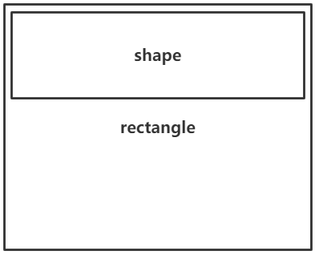
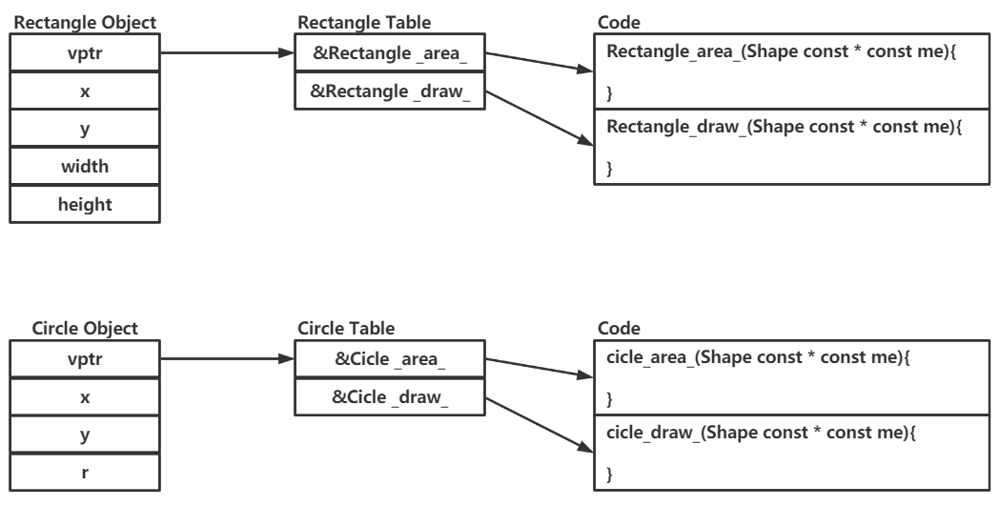

# C语言实现OOP

## 封装

C语言本身是没有封装这个概念的，C语言实现封装就是创造一个构造函数，一个set和一个get函数，从而来实现封装，代码如下：

```
--------------------------------------------------------------------------------------------------------
shape.h
//
// Created by Resery on 2020/10/6.
//

#ifndef C_OBJECT_SHAPE_H
#define C_OBJECT_SHAPE_H

#include <stdio.h>

typedef struct{
    unsigned int x;
    unsigned int y;
}Shape;

void shape_ctor(Shape *const me, unsigned int x, unsigned int y);
void shape_add(Shape *const me, unsigned int x, unsigned int y);
unsigned int shape_getx(Shape const *const me);
unsigned int shape_gety(Shape const *const me);
#endif //C_OBJECT_SHAPE_H
--------------------------------------------------------------------------------------------------------
shape.c
//
// Created by Resery on 2020/10/6.
//
#include "shape.h"

void shape_ctor(Shape *const me, unsigned int x, unsigned int y){
    me->x = x;
    me->y = y;
}

void shape_add(Shape *const me, unsigned int x, unsigned int y){
    me->x += x;
    me->y += y;
}

unsigned int shape_getx(Shape const *const me){
    return me->x;
}

unsigned int shape_gety(Shape const *const me){
    return me->y;
}
--------------------------------------------------------------------------------------------------------
main.c
#include <stdio.h>
#include "shape.h"

int main() {
    Shape s1,s2;

    shape_ctor(&s1,10,10);
    shape_ctor(&s2,20,20);

    printf("s1.x:%u\ts1.y:%u\n",s1.x,s1.y);
    printf("s2.x:%u\ts2.y:%u\n",s2.x,s2.y);

    shape_add(&s1,5,5);
    shape_add(&s2,5,5);

    printf("\nafter add\n\n");

    printf("s1.x:%u\ts1.y:%u\n",s1.x,s1.y);
    printf("s2.x:%u\ts2.y:%u\n",s2.x,s2.y);

    printf("\n");

    printf("s1.x:%u\n",shape_getx(&s1));
    printf("s1.y:%u\n",shape_gety(&s2));
    printf("s2.x:%u\n",shape_getx(&s1));
    printf("s2.y:%u\n",shape_gety(&s2));
    return 0;
}
--------------------------------------------------------------------------------------------------------
```

## 继承

继承就简单很多了，继承就直接在子类中包含父类就可以了，然后对应想要使用继承的内容通过定义在子类中的父类的成员去调用就可以了，代码如下：

```
--------------------------------------------------------------------------------------------------------
rectangle.h
//
// Created by Resery on 2020/10/6.
//

#ifndef C_OBJECT_RECTANGLE_H
#define C_OBJECT_RECTANGLE_H

#include "shape.h"

typedef struct {
    Shape parrent;

    unsigned int width;
    unsigned int height;
}Rectangle;

void rectangle_ctor(Rectangle *const Rectangle,
                    unsigned int x, unsigned int y,
                    unsigned int width, unsigned int height);

#endif //C_OBJECT_RECTANGLE_C
--------------------------------------------------------------------------------------------------------
rectangle.c
//
// Created by Resery on 2020/10/6.
//

#ifndef C_OBJECT_RECTANGLE_C
#define C_OBJECT_RECTANGLE_C

#include "rectangle.h"

void rectangle_ctor(Rectangle *const me,
        unsigned int x, unsigned int y,
        unsigned int width, unsigned int height){
    shape_ctor(&me->parrent,x,y);
    me->width = width;
    me->height = height;
}

#endif //C_OBJECT_RECTANGLE_C
--------------------------------------------------------------------------------------------------------
main.c
#include <stdio.h>
#include "shape.h"
#include "rectangle.h"

int main() {
    Shape s1,s2;
    Rectangle r1,r2;

    shape_ctor(&s1,10,10);
    shape_ctor(&s2,20,20);

    rectangle_ctor(&r1,10,10,20,20);
    rectangle_ctor(&r2,20,20,30,30);

    printf("s1.x:%u\ts1.y:%u\n",s1.x,s1.y);
    printf("s2.x:%u\ts2.y:%u\n",s2.x,s2.y);

    printf("r1.x:%u\tr1.y:%u\tr1.width:%u\tr1.weight:%u\n",r1.parrent.x,r1.parrent.y,r1.width,r1.height);
    printf("r2.x:%u\tr2.y:%u\tr2.width:%u\tr2.weight:%u\n",r2.parrent.x,r2.parrent.y,r2.width,r2.height);

    shape_add(&s1,5,5);
    shape_add(&s2,5,5);
    shape_add(&r1.parrent,5,5);
    shape_add(&r2.parrent,5,5);

    printf("\nafter add\n\n");

    printf("s1.x:%u\ts1.y:%u\n",s1.x,s1.y);
    printf("s2.x:%u\ts2.y:%u\n",s2.x,s2.y);
    printf("r1.x:%u\tr1.y:%u\n",r1.parrent.x,r1.parrent.y);
    printf("r2.x:%u\tr2.y:%u\n",r2.parrent.x,r2.parrent.y);

    printf("\n");

    printf("s1.x:%u\n",shape_getx(&s1));
    printf("s1.y:%u\n",shape_gety(&s2));
    printf("s2.x:%u\n",shape_getx(&s1));
    printf("s2.y:%u\n",shape_gety(&s2));
    printf("r1.x:%u\n",shape_getx(&r1.parrent));
    printf("r1.y:%u\n",shape_gety(&r1.parrent));
    printf("r1.width:%u\n",r1.width);
    printf("r1.height:%u\n",r1.height);
    printf("r2.x:%u\n",shape_getx(&r2.parrent));
    printf("r2.y:%u\n",shape_gety(&r2.parrent));
    printf("r2.width:%u\n",r2.width);
    printf("r2.height:%u\n",r2.height);

    return 0;
}
--------------------------------------------------------------------------------------------------------
```

对应继承的关系图如下所示：



## 多态

C语言想要实现多态就我目前知道的方法一共有两个，一个是像C++一样使用虚函数，一个是弄出来属性这个东西，属性为当前类锁所独有并且是封装的，其中qemu中的面向对象编程就是使用的第二种方法

这里我们选择使用虚函数的方法，C++中的虚函数使用简便，因为编译器在被背后为我们做了很多的工作，对应我们要是想在C语言中使用虚函数实现多态，我们就需要显式的设置出一个虚函数指针和一个虚函数表

虚函数表：这个类所有虚函数的函数指针的集合

虚函数指针：是一个指向虚表的指针，这个虚指针必须存在于每个对象实例中，会被所有子类继承

对应于我们上面的例子，比如说我们现再有的是一个矩形，其面积的计算方式就是长乘宽，其次如果说我们现再需要创建一个原型的类，对应的计算方式就不能是长乘宽了，就需要重新设置计算函数，把其重载为计算圆形面积的函数，全部代码如下：

shape.c和shape.h：

```
-------------------------------------------------------------------------------------------------------
shape.h
//
// Created by Resery on 2020/10/6.
//

#ifndef C_OBJECT_SHAPE_H
#define C_OBJECT_SHAPE_H

#include <stdio.h>

typedef struct{
    struct ShapeVtbl const *vptr;
    unsigned int x;
    unsigned int y;
}Shape;

struct ShapeVtbl {
    unsigned long (*fun_addr[20])();
    unsigned int (*area)(Shape const * const me);
    void (*draw)(Shape const * const me);
};

void shape_ctor(Shape *const me, unsigned int x, unsigned int y);
void shape_add(Shape *const me, unsigned int x, unsigned int y);
unsigned int shape_getx(Shape const *const me);
unsigned int shape_gety(Shape const *const me);

static inline unsigned int Shape_area(Shape const * const me)
{
    return (*me->vptr->fun_addr[0])(me);
}

static inline void Shape_draw(Shape const * const me)
{
    (*me->vptr->fun_addr[1])(me);
}

Shape const *largestShape(Shape const *shapes[], unsigned int nShapes);
void drawAllShapes(Shape const *shapes[], unsigned int nShapes);

#endif //C_OBJECT_SHAPE_H
-------------------------------------------------------------------------------------------------------
shape.c
//
// Created by Resery on 2020/10/6.
//
#include "shape.h"
#include <assert.h>

static unsigned int Shape_area_(Shape const * const me);
static void Shape_draw_(Shape const * const me);

void shape_ctor(Shape *const me, unsigned int x, unsigned int y){
    static struct ShapeVtbl const vtbl =
            {
                    &Shape_area_,
                    &Shape_draw_
            };
    me->vptr = &vtbl;
    me->x = x;
    me->y = y;
}

void shape_add(Shape *const me, unsigned int x, unsigned int y){
    me->x += x;
    me->y += y;
}

unsigned int shape_getx(Shape const *const me){
    return me->x;
}

unsigned int shape_gety(Shape const *const me){
    return me->y;
}

static unsigned int Shape_area_(Shape const * const me)
{
    assert(0);
    return 0U;
}

static void Shape_draw_(Shape const * const me)
{
    assert(0);
}


Shape const *largestShape(Shape const *shapes[], unsigned int nShapes)
{
    Shape const *s = (Shape *)0;
    unsigned int max = 0U;
    unsigned int i;
    for (i = 0U; i < nShapes; ++i)
    {
        unsigned int area = Shape_area(shapes[i]);
        if (area > max)
        {
            max = area;
            s = shapes[i];
        }
    }
    return s;
}


void drawAllShapes(Shape const *shapes[], unsigned int nShapes)
{
    unsigned int i;
    for (i = 0U; i < nShapes; ++i)
    {
        Shape_draw(shapes[i]);
    }
}
-------------------------------------------------------------------------------------------------------
```

rectangle.h和rectangle.c：

```
--------------------------------------------------------------------------------------------------------
rectangle.h
//
// Created by Resery on 2020/10/6.
//

#ifndef C_OBJECT_RECTANGLE_H
#define C_OBJECT_RECTANGLE_H

#include "shape.h"

typedef struct {
    Shape parrent;
    unsigned int width;
    unsigned int height;
}Rectangle;

void rectangle_ctor(Rectangle *const Rectangle,
                    unsigned int x, unsigned int y,
                    unsigned int width, unsigned int height);

#endif //C_OBJECT_RECTANGLE_C
--------------------------------------------------------------------------------------------------------
rectangle.c
//
// Created by Resery on 2020/10/6.
//

#ifndef C_OBJECT_RECTANGLE_C
#define C_OBJECT_RECTANGLE_C

#include "rectangle.h"

static unsigned int Rectangle_area_(Shape const * const me);
static void Rectangle_draw_(Shape const * const me);

void rectangle_ctor(Rectangle *const me,
        unsigned int x, unsigned int y,
        unsigned int width, unsigned int height){
    static struct ShapeVtbl const vtbl =
            {
                    &Rectangle_area_,
                    &Rectangle_draw_
            };
    shape_ctor(&me->parrent,x,y);
    me->parrent.vptr = &vtbl;
    me->width = width;
    me->height = height;
}

static unsigned int Rectangle_area_(Shape const * const me)
{
    Rectangle const * const me_ = (Rectangle const *)me; //显示的转换
    return (unsigned int)me_->width * (unsigned int)me_->height;
}

static void Rectangle_draw_(Shape const * const me)
{
    Rectangle const * const me_ = (Rectangle const *)me; //显示的转换
    printf("Rectangle_draw_(x=%d,y=%d,width=%d,height=%d)\n",
           shape_getx(me), shape_gety(me), me_->width, me_->height);
}
#endif //C_OBJECT_RECTANGLE_C
--------------------------------------------------------------------------------------------------------
```

circle.h和circle.c：

```
--------------------------------------------------------------------------------------------------------
circle.h
//
// Created by Resery on 2020/10/6.
//

#ifndef C_OBJECT_CIRCLE_H
#define C_OBJECT_CIRCLE_H

#include "shape.h"

typedef struct{
    Shape parrent;
    unsigned r;
}Circle;

void cicle_ctor(Circle *const me, unsigned int x, unsigned int y, unsigned int r);

#endif //C_OBJECT_CIRCLE_H
--------------------------------------------------------------------------------------------------------
circle.c
//
// Created by Resery on 2020/10/6.
//

#ifndef C_OBJECT_CIRCLE_C
#define C_OBJECT_CIRCLE_C

#include "circle.h"

static unsigned int cicle_area_(Shape const * const me);
static void cicle_draw_(Shape const * const me);

void cicle_ctor(Circle *const me, unsigned int x, unsigned int y, unsigned int r){
    static struct ShapeVtbl const vtbl =
            {
                    &cicle_area_,
                    &cicle_draw_
            };
    shape_ctor(&me->parrent,x,y);
    me->parrent.vptr = &vtbl;
    me->r = r;
}

static unsigned int cicle_area_(Shape const * const me)
{
    Circle const * const me_ = (Circle const *)me;
    return (unsigned int)me_->r * (unsigned int)me_->r * 3;
}

static void cicle_draw_(Shape const * const me)
{
    Circle const * const me_ = (Circle const *)me;
    printf("Rectangle_draw_(x=%d,y=%d,r=%d)\n",
           shape_getx(me), shape_gety(me), me_->r);
}

#endif //C_OBJECT_CIRCLE_C
--------------------------------------------------------------------------------------------------------
```

main.c：

```
#include <stdio.h>
#include "shape.h"
#include "rectangle.h"
#include "circle.h"

int main() {
    Shape s1,s2;
    Rectangle r1,r2;
    Circle c1,c2;

    Shape const *shapes[] =
    {
            &r1.parrent,
            &r2.parrent,
            &c1.parrent,
            &c2.parrent
    };
    Shape const *s;

    shape_ctor(&s1,10,10);
    shape_ctor(&s2,20,20);

    rectangle_ctor(&r1,10,10,20,20);
    rectangle_ctor(&r2,20,20,30,30);

    cicle_ctor(&c1,30,30,30);
    cicle_ctor(&c2,40,40,40);

    s = largestShape(shapes, sizeof(shapes)/sizeof(shapes[0]));
    printf("largetsShape s(x=%d,y=%d)\n", shape_getx(s), shape_gety(s));

    printf("s1.x:%u\ts1.y:%u\n",s1.x,s1.y);
    printf("s2.x:%u\ts2.y:%u\n",s2.x,s2.y);

    shape_add(&s1,5,5);
    shape_add(&s2,5,5);

    printf("\nafter add\n\n");

    printf("s1.x:%u\ts1.y:%u\n",s1.x,s1.y);
    printf("s2.x:%u\ts2.y:%u\n",s2.x,s2.y);

    printf("\nuse get func\n\n");

    printf("s1.x:%u\n",shape_getx(&s1));
    printf("s1.y:%u\n",shape_gety(&s2));
    printf("s2.x:%u\n",shape_getx(&s1));
    printf("s2.y:%u\n",shape_gety(&s2));

    printf("\n");

    drawAllShapes(shapes, sizeof(shapes)/sizeof(shapes[0]));

    return 0;
}

```

虚函数的调用机制如下图所示：

