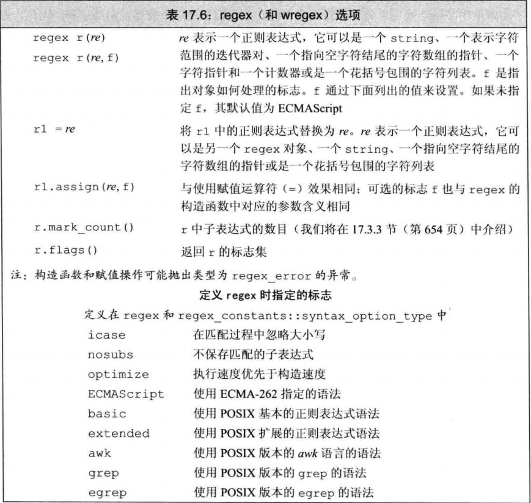
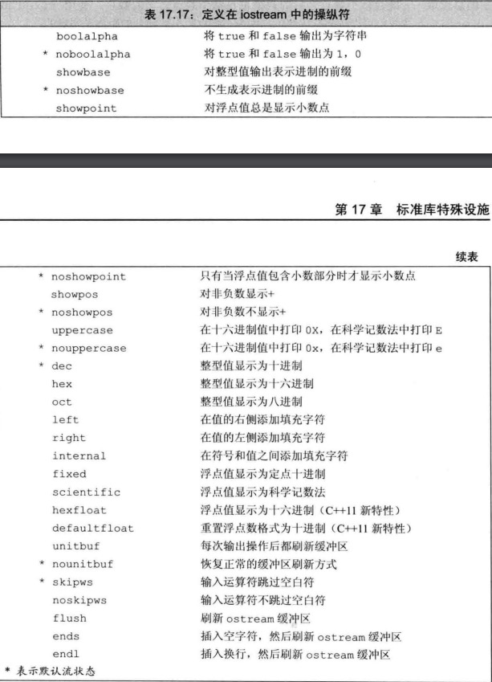
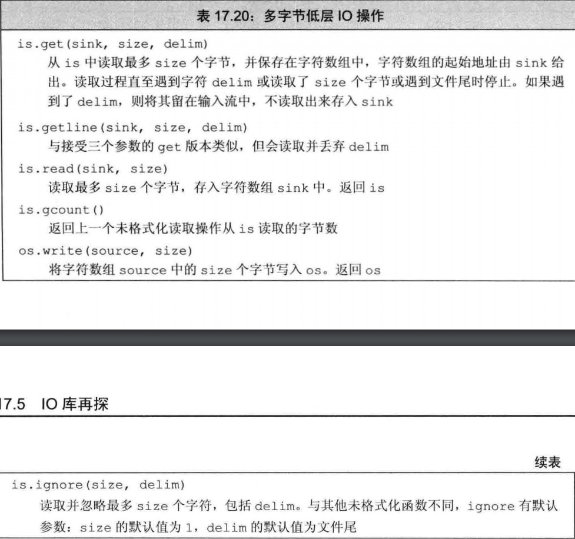
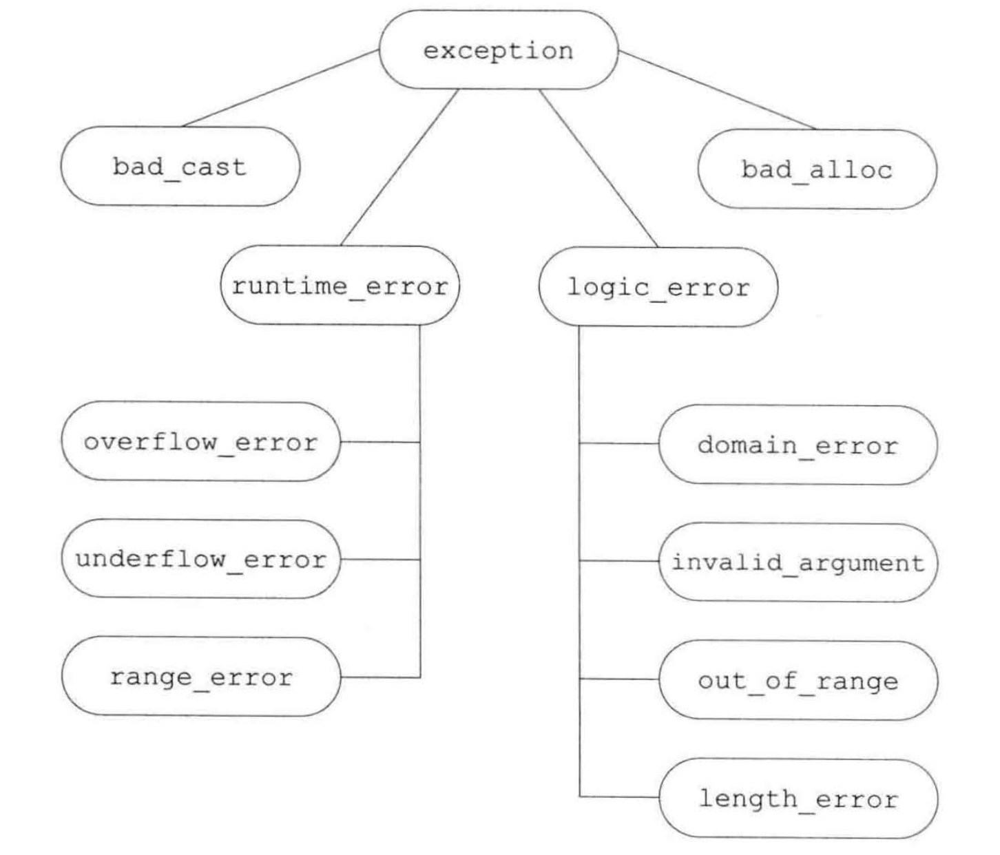

<!-- START doctoc generated TOC please keep comment here to allow auto update -->
<!-- DON'T EDIT THIS SECTION, INSTEAD RE-RUN doctoc TO UPDATE -->
**目录**  

- [C++ Prime Plus 笔记](#c-prime-plus-%E7%AC%94%E8%AE%B0)
  - [概述](#%E6%A6%82%E8%BF%B0)
  - [引用笔记](#%E5%BC%95%E7%94%A8%E7%AC%94%E8%AE%B0)
  - [模版](#%E6%A8%A1%E7%89%88)
    - [模版实参推断](#%E6%A8%A1%E7%89%88%E5%AE%9E%E5%8F%82%E6%8E%A8%E6%96%AD)
      - [类型转换与模版类型参数](#%E7%B1%BB%E5%9E%8B%E8%BD%AC%E6%8D%A2%E4%B8%8E%E6%A8%A1%E7%89%88%E7%B1%BB%E5%9E%8B%E5%8F%82%E6%95%B0)
      - [使用相同模版参数类型的函数形参](#%E4%BD%BF%E7%94%A8%E7%9B%B8%E5%90%8C%E6%A8%A1%E7%89%88%E5%8F%82%E6%95%B0%E7%B1%BB%E5%9E%8B%E7%9A%84%E5%87%BD%E6%95%B0%E5%BD%A2%E5%8F%82)
      - [正常类型转换应用于普通函数实参](#%E6%AD%A3%E5%B8%B8%E7%B1%BB%E5%9E%8B%E8%BD%AC%E6%8D%A2%E5%BA%94%E7%94%A8%E4%BA%8E%E6%99%AE%E9%80%9A%E5%87%BD%E6%95%B0%E5%AE%9E%E5%8F%82)
    - [函数模版显式实参](#%E5%87%BD%E6%95%B0%E6%A8%A1%E7%89%88%E6%98%BE%E5%BC%8F%E5%AE%9E%E5%8F%82)
      - [指定显示模版实参](#%E6%8C%87%E5%AE%9A%E6%98%BE%E7%A4%BA%E6%A8%A1%E7%89%88%E5%AE%9E%E5%8F%82)
      - [正常类型转换应用于显示指定的实参](#%E6%AD%A3%E5%B8%B8%E7%B1%BB%E5%9E%8B%E8%BD%AC%E6%8D%A2%E5%BA%94%E7%94%A8%E4%BA%8E%E6%98%BE%E7%A4%BA%E6%8C%87%E5%AE%9A%E7%9A%84%E5%AE%9E%E5%8F%82)
      - [尾置返回类型与类型转换](#%E5%B0%BE%E7%BD%AE%E8%BF%94%E5%9B%9E%E7%B1%BB%E5%9E%8B%E4%B8%8E%E7%B1%BB%E5%9E%8B%E8%BD%AC%E6%8D%A2)
      - [进行类型转换的标准库模版类](#%E8%BF%9B%E8%A1%8C%E7%B1%BB%E5%9E%8B%E8%BD%AC%E6%8D%A2%E7%9A%84%E6%A0%87%E5%87%86%E5%BA%93%E6%A8%A1%E7%89%88%E7%B1%BB)
      - [函数指针和实参推断](#%E5%87%BD%E6%95%B0%E6%8C%87%E9%92%88%E5%92%8C%E5%AE%9E%E5%8F%82%E6%8E%A8%E6%96%AD)
      - [模版实参推断和引用](#%E6%A8%A1%E7%89%88%E5%AE%9E%E5%8F%82%E6%8E%A8%E6%96%AD%E5%92%8C%E5%BC%95%E7%94%A8)
        - [从左值引用函数参数推断类型](#%E4%BB%8E%E5%B7%A6%E5%80%BC%E5%BC%95%E7%94%A8%E5%87%BD%E6%95%B0%E5%8F%82%E6%95%B0%E6%8E%A8%E6%96%AD%E7%B1%BB%E5%9E%8B)
        - [从右值引用函数推断类型](#%E4%BB%8E%E5%8F%B3%E5%80%BC%E5%BC%95%E7%94%A8%E5%87%BD%E6%95%B0%E6%8E%A8%E6%96%AD%E7%B1%BB%E5%9E%8B)
        - [引用折叠和右值引用参数](#%E5%BC%95%E7%94%A8%E6%8A%98%E5%8F%A0%E5%92%8C%E5%8F%B3%E5%80%BC%E5%BC%95%E7%94%A8%E5%8F%82%E6%95%B0)
        - [编写接受右值引用参数的模版函数](#%E7%BC%96%E5%86%99%E6%8E%A5%E5%8F%97%E5%8F%B3%E5%80%BC%E5%BC%95%E7%94%A8%E5%8F%82%E6%95%B0%E7%9A%84%E6%A8%A1%E7%89%88%E5%87%BD%E6%95%B0)
        - [理解 std::move](#%E7%90%86%E8%A7%A3-stdmove)
      - [转发](#%E8%BD%AC%E5%8F%91)
      - [重载与模版](#%E9%87%8D%E8%BD%BD%E4%B8%8E%E6%A8%A1%E7%89%88)
      - [可变参数模版](#%E5%8F%AF%E5%8F%98%E5%8F%82%E6%95%B0%E6%A8%A1%E7%89%88)
        - [sizeof... 运算符](#sizeof-%E8%BF%90%E7%AE%97%E7%AC%A6)
        - [编写可变参数函数模版](#%E7%BC%96%E5%86%99%E5%8F%AF%E5%8F%98%E5%8F%82%E6%95%B0%E5%87%BD%E6%95%B0%E6%A8%A1%E7%89%88)
      - [包扩展](#%E5%8C%85%E6%89%A9%E5%B1%95)
        - [转发参数包](#%E8%BD%AC%E5%8F%91%E5%8F%82%E6%95%B0%E5%8C%85)
      - [模版特例化](#%E6%A8%A1%E7%89%88%E7%89%B9%E4%BE%8B%E5%8C%96)
        - [模版偏特化](#%E6%A8%A1%E7%89%88%E5%81%8F%E7%89%B9%E5%8C%96)
  - [标准库特设设施](#%E6%A0%87%E5%87%86%E5%BA%93%E7%89%B9%E8%AE%BE%E8%AE%BE%E6%96%BD)
    - [tuple 类型](#tuple-%E7%B1%BB%E5%9E%8B)
    - [bitset 类型](#bitset-%E7%B1%BB%E5%9E%8B)
    - [正则表达式](#%E6%AD%A3%E5%88%99%E8%A1%A8%E8%BE%BE%E5%BC%8F)
    - [IO 库再探](#io-%E5%BA%93%E5%86%8D%E6%8E%A2)
      - [cout 格式化输出](#cout-%E6%A0%BC%E5%BC%8F%E5%8C%96%E8%BE%93%E5%87%BA)
  - [异常处理 命名空间 多重继承与虚继承](#%E5%BC%82%E5%B8%B8%E5%A4%84%E7%90%86-%E5%91%BD%E5%90%8D%E7%A9%BA%E9%97%B4-%E5%A4%9A%E9%87%8D%E7%BB%A7%E6%89%BF%E4%B8%8E%E8%99%9A%E7%BB%A7%E6%89%BF)
    - [异常](#%E5%BC%82%E5%B8%B8)
    - [命名空间](#%E5%91%BD%E5%90%8D%E7%A9%BA%E9%97%B4)
    - [多重继承与虚继承](#%E5%A4%9A%E9%87%8D%E7%BB%A7%E6%89%BF%E4%B8%8E%E8%99%9A%E7%BB%A7%E6%89%BF)
  - [特殊工具与技术](#%E7%89%B9%E6%AE%8A%E5%B7%A5%E5%85%B7%E4%B8%8E%E6%8A%80%E6%9C%AF)
    - [控制内存分配](#%E6%8E%A7%E5%88%B6%E5%86%85%E5%AD%98%E5%88%86%E9%85%8D)
    - [运行时类型识别](#%E8%BF%90%E8%A1%8C%E6%97%B6%E7%B1%BB%E5%9E%8B%E8%AF%86%E5%88%AB)
    - [枚举类型](#%E6%9E%9A%E4%B8%BE%E7%B1%BB%E5%9E%8B)
    - [类成员指针](#%E7%B1%BB%E6%88%90%E5%91%98%E6%8C%87%E9%92%88)
    - [嵌套类](#%E5%B5%8C%E5%A5%97%E7%B1%BB)
    - [union: 一种节省空间的类](#union-%E4%B8%80%E7%A7%8D%E8%8A%82%E7%9C%81%E7%A9%BA%E9%97%B4%E7%9A%84%E7%B1%BB)
    - [局部类](#%E5%B1%80%E9%83%A8%E7%B1%BB)
    - [固有的不可移植的特性](#%E5%9B%BA%E6%9C%89%E7%9A%84%E4%B8%8D%E5%8F%AF%E7%A7%BB%E6%A4%8D%E7%9A%84%E7%89%B9%E6%80%A7)
    - [位域](#%E4%BD%8D%E5%9F%9F)
    - [volatile](#volatile)
    - [链接指示： extern "C"](#%E9%93%BE%E6%8E%A5%E6%8C%87%E7%A4%BA-extern-c)

<!-- END doctoc generated TOC please keep comment here to allow auto update -->

# C++ Prime Plus 笔记

## 概述

此文档用来记录阅读 C++ Prime Plus 中遇到的一些重点，主要作为自己日后复习的笔记，笔记从模版开始记录，模版之前的内容会慢慢补充，在补充之前先使用另一人的系列文章来作为参考的笔记，个人感觉这一系列的文章内容质量还是可以的，很言简意骇。

## 引用笔记

第一章：https://cloud.tencent.com/developer/article/1670670

第二章：https://cloud.tencent.com/developer/article/1670671

第三章：https://cloud.tencent.com/developer/article/1670672

第四章：https://cloud.tencent.com/developer/article/1670673

第五章：https://cloud.tencent.com/developer/article/1670674

第六章：https://cloud.tencent.com/developer/article/1670676

第七章：https://cloud.tencent.com/developer/article/1670678

第一部分总结：https://cloud.tencent.com/developer/article/1670679

第八章：https://cloud.tencent.com/developer/article/1670680

第九章：https://cloud.tencent.com/developer/article/1670694

第十章：https://cloud.tencent.com/developer/article/1670695

第十一章：https://cloud.tencent.com/developer/article/1670696

第十二章：https://cloud.tencent.com/developer/article/1670697

第二部分总结：https://cloud.tencent.com/developer/article/1670698

第十三章：https://cloud.tencent.com/developer/article/1670700

第十四章：https://cloud.tencent.com/developer/article/1670701

第十五章：https://cloud.tencent.com/developer/article/1670702

第十六章：https://cloud.tencent.com/developer/article/1670705

第三部分总结：https://cloud.tencent.com/developer/article/1670706

第十七章：https://cloud.tencent.com/developer/article/1670707

第十八章：https://cloud.tencent.com/developer/article/1670708

第十九章：https://cloud.tencent.com/developer/article/1670709

第四部分总结：https://cloud.tencent.com/developer/article/1670710

## 模版

### 模版实参推断

#### 类型转换与模版类型参数

顶层 const 无论是在形参还是在实参中都会被忽略，顶层 const 就是指指针本身是不可改变的 (`int * const p`)

关于 const 的转换，虽然模版被声明为接受 const 类型的形参，但是它也可以接受非 const 类型的实参，只不过在使用时会将其转换成 const 类型

关于数组或函数指针转换，当模版的形参没有被声明为引用类型时，则可以对数组或函数类型的实参应用正常的指针转换。相反如果形参被声明为引用类型时，那么数组或函数类型的实参是不能进行正常的指针转换的

代码示例：

```CPP
template <typenmae T> T fobj(T, T);			// 实参会被拷贝出一份副本
template <typenmae T> T fref(const T &, const T &);	// 实参以引用的形式来进行传递

string s1("value");
const string s2("const value");

fobj(s1, s2);						// 调用 fobj(string, string); const 被忽略
fref(s1, s2);						// 调用 fref(const string &, const string &);
							// 将 s1 转换为 const 是允许的
int a[10], b[42];
fobj(a, b);						// 调用 f(int *, int *)
fref(a, b);						// 错误：数组类型不匹配
```

#### 使用相同模版参数类型的函数形参

这个转换规则的意思就是当我们声明一个模版接受几个同种引用类型的参数，那么传入这个函数的实参类型必须为相同的

举个例子

```CPP
long lng;
compare(lng, 1024);	// 错误：不能实例化 compare(long, int)
```

上面这段代码中，compare 被声明为接受两个引用类型的模版函数，传入实参时 compare 的第一个实参 lng 其类型为 long，第二个实参 1024 为 int，因为两个参数类型不同所以说这条语句时错误的

如果想要传入不同类型的引用实参，解决办法就是在声明模版时参数模版中的类型设置为不同种的类型即可，如下所示：

```CPP
template <typename A, typename B>
int flexibleCompare(const A& v1, const B& v2) {
	if (v1 < v2) return -1;
	if (v2 < v1) return 1;
	return 0;
}
```

#### 正常类型转换应用于普通函数实参

正常类型转换应用与普通函数实参的意思就是声明一个模版函数，其中参数部分一部分是通过模版来获取具体的参数类型，一部分是直接指明了参数的类型，如下所示：

```CPP
template <typename T> ostream & print(ostrean & os, const T & obj) {
	return os << obj;
}
```

### 函数模版显式实参

#### 指定显示模版实参

举个例子，当我们声明一个模版函数时声明了三个模版参数，其中第一个参数作为了函数的返回值，剩余的两个函数作为了函数的参数，也就是像下面这个样子：

```CPP
template <typename T1, typename T2, typenmae T3>
T1 sum(T2, T3);
```

当我们每次调用 sum 时必须显式的指明 T1 的类型， T1 的类型放在尖括号中，位于函数名之后，实参列表之前，如下所示

```CPP
auto val3 = sum<long long>(i, lng);
```

上例中 T1 的类型是显示指明的，T2 和 T3 的值是编译器通过 i 和 lng 推导出来的

对于指定显示模版实参还有一个特殊的例子，也就是让 T3 作为函数的返回值，然后让 T1， T2作为参数，此时在调用 sum 时需要将所有参数的类型都显示的指明，如下所示：

```CPP
template <typename T1, typename T2, typenmae T3>
T3 sum(T2, T1);

auto val2 = sum<long long>(i, lng);			// 错误的，不能推断出前几个模版参数
auto val3 = sum<long long, int, long>(i, lng);		// 正确的，显式指定了所有三个参数
```

#### 正常类型转换应用于显示指定的实参

在我们定义的普通函数中是允许正常的类型转换的，同样我们定义的模版函数也是可以进行正常的类型转换的，只不过想要支持类型转换的话需要显示指明模版函数中的类型而不能靠编译器的推导，如下所示：

```CPP
long lng;
compare(lng, 1024);		// 错误：模版参数不匹配
compare<long long>(lng, 1024);	// 正确：实例化 compare(long, long)
compare<int>(lng, 1024);	// 正确：实例化 compare(int, int)
```

#### 尾置返回类型与类型转换

尾置返回类型主要就是在我们不能确定返回值类型时来进行使用的，因为尾置返回出现在参数列表之后，所以它可以使用函数的参数

以下面的代码为例

```CPP
template <typename It>
??? &fcn(It beg, It end) {
	return *beg;
}

vector<int> vi = {1, 2, 3, 4, 5};
Blob<string> ca = { "hi", "bye" };
auto &i = fcn(vi.begin(), vi.end());	// 应该返回一个 int & 的引用
auto &s = fcn(ca.begin(), ca.end());	// 应该返回一个 string & 的引用
```

下面的代码就展示了如何使用尾置返回类型来解决上面的问题，代码如下：

```CPP
template <typenmae It>
auto & fcn(It beg, It end) -> decltype(*beg) {
	return * beg;
}
```

#### 进行类型转换的标准库模版类

使用标准库模版类的主要目的就是为了返回一个具体的值类型而不是返回一个引用了，上面我们使用尾置返回类型只可以返回引用而不可以返回值，这里使用的是 type_traits 中的 remove_reference 来获取元素类型，代码如下：

```CPP
template <typename It>
auto fcn2(It beg, It end) -> 
	typename remove_reference<decltype(*beg)>::type
{
	return * beg;
}
```

需要注意的是，因为 type 是一个类的成员，而该类依赖于一个模版参数。因此，我们必须在返回类型的声明中使用 typename 来告知编译器，type 表示一个类型

标准类型转换模版如下：


#### 函数指针和实参推断

模版函数也可以作为实参传给接受函数指针为参数的函数，只不过在传参的时候需要显示指明模版中的参数类型，并且我们还可以让声明一个函数指针，然后让函数指针指向一个模版函数的实例，如下所示

```CPP
template <typename T> int compare(const T &, const T &);

int (*pf1)(const int &, const int &) = compare;

void func(int(*)(const string &, const string &));
void func(int(*)(const int &, const int &));
func(compare);						// 错误，不知道具体是哪个 compare 实例
func(compare<int>);					// 正确，会以 compare<int> 实例来初始化 func
```

#### 模版实参推断和引用

##### 从左值引用函数参数推断类型

只接受一个左值作为参数，使用如下定义：

```CPP
template <typename> void f1(T&);

f1(i);		// 正确，i 是一个 int，模版参数类型 T 是 int
f1(ci);		// 正确，ci 是一个 const int， 模版参数类型 T 是 const int
fi(5);		// 错误，模版只接受左值作为参数，然后 5 属于右值
```

既可以接受左值，也可以接受右值作为参数，使用如下定义：

```CPP
template <typename> void f2(const T&)

f2(i);		// 正确，i 是一个 int，模版参数类型 T 是 int
f2(ci);		// 正确，ci 是一个 const int，模版参数类型 T 是 const int
f2(5);		// 正确，一个 const & 参数是可以绑定到一个右值上的，T 是 int
```

##### 从右值引用函数推断类型

当一个函数参数是一个右值引用（即，形如 T&&）时，正常绑定规则告诉我们可以传递给他一个右值。当我们这样做时，类型推断过程类似普通左值引用函数参数的推断过程。推断出当 T 的类型时该右值实参的类型，如下所示：

```CPP
template <typename T> void f3(T&&);
f3(42);					// 实参是一个 int 类型的右值；模版参数 T 是 int
```

##### 引用折叠和右值引用参数

如果一个函数参数是一个指向模版类型参数的右值引用（如，T&&），则它可以被绑定到一个左值

如果实参是一个左值，则推断出的模版实参类型将是一个左值引用，且函数参数将被实例化为一个（普通）左值引用参数（T&）

如下所示：

```CPP
template <typename T> void f3(T&&);

f3(5);		// 实参是一个右值；模版参数 T 是 int
f3(i);		// 实参是一个左值：模版参数 T 是 int &
f3(ci);		// 实参是一个左值：模版参数 T 是 const int &
```

##### 编写接受右值引用参数的模版函数

```CPP
template <typename T> void f(T&&);	// 绑定到非 const 右值
template <typename T> void f(const T&);	// 左值和 const 右值
```

上述代码中第一个版本将绑定到可修改的右值，第二个版本将绑定到左值或者 const 右值

##### 理解 std::move

理解 std::move 可以帮助我们复习前面关于类型转换方面的内容

标准库内 move 是这样定义的：

```CPP
template <typename T>
typename remove_reference<T>::type && move(T&& t) {
	return static_cast<typename remove_reference<T>::type &&>(t);
}
```

因为其接受一个右值引用类型的参数，再通过引用折叠可以让其接受任意类型的实参，比如说下面的调用皆属于合法的：

```CPP
string s1("hi"), s2;
s2 = std::move(string("bye!"));
s2 = std::move(s1);
```

第二行代码是怎样进行工作的：

1. 首先 string("bye!"); 会调用 string 的构造函数生成一个右值，此时就可以推导出 T 的类型为 string
2. 然后，remove_reference 用 string 进行实例化
3. remove_reference<string> 的 type 成员是 string
4. move 的返回类型为 string&&
5. move 的函数参数 t 的类型为 string&&

第三行代码是怎样进行工作的：

1. 首先可以推断出 T 的类型为 string& （也就是 string 的引用，而非普通 string）
2. 因此，remove_reference 用 string& 进行实例化
3. remove_reference<string &> 的 type 成员是 string
4. move 的返回类型依旧为 string&&
5. move 的函数参数 t 的类型为 string& &&，会折叠为 string&

#### 转发

转发是用模版来接受参数，然后将不同类型的参数以不同的顺序转发给另一个函数，但是在转发的过程中类型转换会存在一些问题

如下面的例子，我们将编写一个函数，他接受一个可调用表达式和两个额外实参。我们的函数将调用给定的可调用对象，将两个额外参数逆序传递给他

```CPP
templaet <typename F, typename T1, typename T2>
void flip1(F f, T1 t1, T2 t2) {
	f(t2, t1);
}
```

一般情况下上述例子都可以正常的工作，但是当我们转发的函数希望接受一个引用参数那么就会出现问题，如下所示：

```CPP
void f(int v1, int &v2) {
	cout << v1 << " " << ++v2 << endl;
}

f(42, i);		// f 改变了实参 i
flip1(f, j, 42);	// flip1 不会改变 j
```

这里是因为 flip1 接受一个普通类型的参数，而不是引用，所以会拷贝一个新的值然后在传递给 f，所以说当使用 flip1 传递 j 时会拷贝一个 j 的副本并将其传递给 f ，虽然此时仍然可以正常的传递，但是此时 f 接受到的引用为拷贝的副本，所以说我们在 f 中对 v2 的改变不会影响到 j

如果我们想要解决上面的问题，那么就需要修改一下 flip1 使其接受右值引用，使用右值引用是可以保持其对应实参的所有类型信息，并且通过引用折叠也可以保证实参的左值/右值属性，如下所示：

```CPP
template <typename F, typename T1, typenmae T2>
void flip2(F f, T1 &&t1, T2 &&t2) {
	f(t2, t1);
}
```

上面的代码虽然可以解决了转发函数接受一个左值引用参数的情况，但是当转发函数接受一个右值引用的参数时还是会出现问题

```CPP
void g(int && i, int & j) {
	cout << i << " " << j << endl;
}

flip2(g, i, 42);
```

在上述代码中 i 为一个左值，经过 flip2 保留了 i 的类型也就是说 t1 的类型为 int && 但是 t1 是作为第二个参数传递给了函数 g，但是 g 的第二个参数接受的是一个左值引用类型的参数，那么此时就会出现问题

为了解决这个问题，我们使用标准库中的 std::forward 来保持类型信息，如下所示:

```CPP
template <typename F, typename T1, typename T2>
void flip(F f, T1 &&t1, T2 &&t2) {
	f(std::forward<T2>(t2), std::forward<T1>(t1));
}
```

#### 重载与模版

模版重载与函数重载区别不太大，重载的模版之间除了接受的模版参数不同以外其余皆相同，如下所示:

```CPP
template <typename T> string func(const T & t) {
	...
}

template <typename T> string func(T * p) {
	...
}
```

同样我们可以混合使用模版重载与非模版重载，如下所示：

```CPP
string func(const string & s) {
	...
}

string s("hi");
cout << func(s) << endl;
```

但是当我们使用 func(s) 时会自动调用非模版函数。

注：对于一个调用，如果一个非函数模版与一个函数模版提供同样好的匹配，则选择非模版版本

在模版函数中我们仍可调用本身不同版本的模版函数，通常这样做的目的是为了处理不同类型的参数

注：在定义任何函数之前，记得声明所有重载的函数版本。这样就不必担心编译器由于未遇到你希望调用的函数而实例化一个并非你所需的版本

#### 可变参数模版

首先需要确定几个概念：
- 可变参数模版：一个接受可变数目参数的函数模版或模版类
- 参数包：可变数目的参数
- 模版参数包：表示零个或多个模版参数
- 函数参数包：表示零个或多个函数参数

示例如下：

```CPP
template <typename T, typename... Args>
void foo(const T &t, const Args& ... rest);

int i = 0; double d = 3.14; string s = "how now brown cow";
foo(i, s, 42, d);
foo(s, 42, "hi");
foo(d, s);
foo("hi");
```

上面的代码中，Args 是一个模版参数包，rest 是一个函数参数包，Args 表示零个或多个模版类型参数，rest 表示零个或多个函数参数，其中编译器会为 foo 实例化出四个不同的版本

```CPP
void foo(const int &, const string &, const int &, const double &);
void foo(const string &, const int &, const char[3] &);
void foo(const double &, const string &);
void foo(const char[3] &);
```

##### sizeof... 运算符

sizeof... 运算符用来计算出参数包中有多少个元素，使用示例如下：

```CPP
template <typename ... Args> void g(Args ... args) {
	cout << sizeof...(Args) << endl;
	cout << sizeof...(args) << endl;
}
```

##### 编写可变参数函数模版

之前我们可以使用 initializer_list 来顶一个接受可变数目实参的函数，但是有一个缺点就是变化的实参都必须为相同类型

但是使用可变参数函数模版时我们可以接受不同类型都多个参数，并且一般情况下可变参数函数通常是递归的。第一步调用处理包中的第一个实参，然后用剩余实参调用自身。如下面的示例所示：

```CPP
template <typename T>
ostream &print(ostream &os, const T &t) {
	return os << t;
}

template <typename T, typename... Args>
ostream &print(ostream &os, const T &t, const Args&... rest) {
	os << t << ", ";
	return print(os, rest...);
}

print(cout, i, s, 42);		// t = i   rest = s, 42
print(cout, s, 42);		// t = s   rest = 42
print(cout, 42);		// 因为没有多余的参数，所以这里会调用非可变参数版本的 print
```

#### 包扩展

包扩展的概念：扩展一个包就是将它分解为构成的元素，对每个元素应用模式，获得扩展后的列表。一般我们是通过在模式右边放一个省略号(...)来触发扩展操作

上面编写可变参数函数的模版中的示例代码就用到了包扩展，我们再来看一下上面的那段代码：

```CPP
template <typename T, typename... Args>
ostream &
print(ostream os, const T &t, const Args&... rest) {	// 扩展 Args
	os << t << ", ";
	return print(os, rest...);			// 扩展 rest
}
```

第一个扩展操作扩展模版参数包，为 print 生成函数参数列表。第二个扩展操作出现在对 print 的调用中

上面的例子中 print 只是将函数参数包扩展为其构成元素，但是 C++ 是允许我们做更多更复杂的操作，比如说分解出其构成的元素后，对每个元素调用一个函数，如下所示：

```CPP
template <typename... Args>
ostream &errorMsg(ostream &os, const Args&... rest) {
	return print(os, func(rest)...);
}

errorMsg(cerr, fcnName, code.num(), otherDate, "other", item);
```

将上面的调用 errorMsg 函数的那一行展开后就是这个样子的：

```CPP
print(cerr, func(fcnName), func(code.num()), func(otherDate),
		func("other"), func(item));
```

但是当我们这样定义 errorMsg 时会遇到编译失败，因为 func 并不能接受一个可变长度参数模版：

```CPP
template <typename... Args>
ostream &errorMsg(ostream &os, const Args&... rest) {
	return print(os, func(rest...));
}
```

##### 转发参数包

其中我们是可以转发参数包的，也是利用标准库中的 std::forward 来进行转发

#### 模版特例化

下面的例子中就是用到了模版特例化，模版特例化的目的就是为了能够不同的情况以做到接受不同的参数也可以正常的进行工作

```CPP
template <typename T> int compare(const T &, const T &);
template <size_t N, size_t M>

int compare(const char (&)[N], const char (&)[M]);

const char *p1 = "hi", *p2 = "mom";
compare(p1, p2);			// 调用第一个模版
compare("hi", "mom");			// 调用有两个非类型参数的模版
```

因为我们无法将一个指针转换为一个数组的引用，因此当参数是 p1 和 p2 时，第二个版本的 compare 是不可行的

##### 模版偏特化

例子如下：

```CPP
template <class T> struct remove_reference { typedef T type; };
template <class T> struct remove_reference<T&> { typedef T type; };
template <class T> struct remove_reference<T&&> { typedef T type; };

int i;
remove_reference<decltype(42)>::type a;			// 使用原始模版
remove_reference<decltype(i)>::type b;			// 使用第一个(T&)部分特例化版本
remove_reference<decltype(std::move(i))>::type c;	// 使用第二个(T&&)部分特例化版本
```

模版偏特化与全特化和重载的区别就是，模版接受的模版类型不变，函数的名字也不变，改变的只有参数的信息

而且我们也可以只特例化指定成员函数而不是特例化整个模版，如下所示：

```CPP
template <typename T> struct Foo {
	Foo(const T &t = T()) : mem(t) { }
	void Bar() { /* ... */ }
	T mem;
};

template <>			// 我们正在特例化一个模版
void Foo<int>::Bar() {		// 我们正在特例化 Foo<int> 的成员 Bar
	// 进行应用于 int 的特例化处理
}

Foo<string> fs;		// 实例化 Foo<string>::Foo()
fs.Bar();		// 实例化 Foo<string>::Bar()
Foo<int> fi;		// 实例化 Foo<int>::Foo()
fi.Bar();		// 使用我们特例化版本的 Foo<int>::Bar()
```

## 标准库特设设施

### tuple 类型

tuple 类型一旦声明后，则成员数目是固定的，并且 tuple 中的元素不必类型完全相同，而且成员数目不仅仅只可以包含两个，两个以上也是可以的

tuple 支持的操作

| tuple 支持的操作 |  |
| ---- | ---- |
| tuple<T1, T2, ..., Tn> t; | t 是一个 tuple，成员数目为n，第 i 个成员的类型为 Ti。所有成员都进行值初始化 |
| tuple<T1, T2, ..., Tn> t(v1, v2, ..., vn); | t 是一个 tuple，成员类型为 T1...Tn，每个成员对应的初始化值 vi 进初始化。此构造函数是 explicit 的 |
| make_tuple(v1, v2, ..., vn) | 返回一个给定初始值初始化的 tuple。tuple 的类型从初始值的类型判断 |
| t1 == t2, t1 != t2 | 当两个 tuple 具有相同数量的成员且成员对应相等时，两个 tuple 相等，反之亦然 |
| t1 relop t2 | tuple 的关系运算使用字序列，两个 tuple 必须具有相同数量的成员。使用 < 运算符比较 t1 的成员和 t2 中的对应成员 |
| get<i>(t) | 返回 t 的第 i 个数据成员的引用；如果 t 是一个左值，结果是一个左值引用；否则，结果是一个右值引用。tuple 的所有成员都是 public 的 |
| tuple_size<tupleType>::value | 一个类模版，可以通过一个 tuple 类型来初始化。它有一个名为 value 的 public constexpr static 数据成员，类型为 size_t ，表示给定 tuple 类型中成员的数量 |
| typle_element<i, tupleType>::type | 一个类模版，可以通过一个整形常量和一个 tuple 类型来初始化。他有一个名为 type 的 public 成员，表示给定 tuple 类型中指定成员的类型 |

定义和初始化 tuple，示例如下

```CPP
tuple<size_t, size_t, size_t> threeD;
tuple<string, vector<double>, int, list<int>>
	comeVal("constants", {3.14, 2.718}, 42, {0, 1, 2, 3, 4, 5});

tuple <size_t, size_t, size_t> threeD = {1, 2, 3};	// 错误
tuple <size_t, size_t, size_t> threeD{1, 2, 3};		// 正确

auto item = make_tuple("Test String", 3, 20);
```

访问 tuple 成员以及获取 tuple 类型变量相关信息的示例代码如下：

```CPP
tuple<size_t, size_t, size_t> item{10, 20, 30};

auto var0 = get<0>(item);
auto var1 = get<1>(item);
auto var2 = get<2>(item);
get<2>(item) *= 2;

typedef decltype(item) trans;				// trans 是 item 的类型
// 返回 trans 类型对象中成员的数量
size_t sz = tuple_size<trans>::value;
// cnt 的类型与 item 中第二个成员相同
tuple_element<1, trans>::type cnt = get<1>(item);	// cnt 是一个 int
```

tuple 与关系运算符示例代码如下

```CPP
tuple<string, string> duo("1", "2");
tuple<size_t, size_t> twoD(1, 2);
bool b = (duo == twoD);		// 错误，因为类型不匹配

tuple<size_t, size_t, size_t> threeD(1, 2, 3);
b = (twoD < threeD);		// 错误，因为成员数目不相同

tuple<size_t, size_t> origin(0, 0);
b = (origin < twoD);		// 正确 b 为 true
```

### bitset 类型

bitset 主要是为了方便进行位运算的，他存储的是二进制位的集合，也就是说他可以处理超过最长整形类型大小的二进制位

定义和初始化 bitest 的方法如下所示：

| 初始化 biteset 的方法 | |
| ---- | ---- |
| bitset<n> b; | b 有 n 位；每一位均为 0。此构造函数是一个 constexpr |
| bitset<n> b(u); | b 是 unsigned long long 类型的值 u 的低 n 位的拷贝。如果 n 大雨 unsigned long long 的大小，则 b 中超出 unsigned long long 的高位被置为 0。此构造函数是一个 constexpr |
| bitset<n> b(s, pos, m, zero, one); | b 是 string s 从位置 pos 开始 m 个字符的拷贝。s 只包含字符 zero 或 one；如果 s 包含任何其他字符，构造函数会抛出 invalied_argument 异常。字符在 b 中分别保存为 zero 和 one。pos 默认为 0，n 默认为 string::pos，zero 默认为‘0’，one 默认为 ‘1’ |
| bitset<n> b(cp, pos, m, zero, one); | 与上一个构造函数相同，但从 cp 指向的字符数组中拷贝字符。如果未提供 m，则 cp 必须指向一个 C 风格字符串。如果提供了 m，则从 cp 开始必须至少有 m 个 zero 或 one 字符 |

初始化示例代如下：

```CPP
bitset<13> bitvec1(0xbeef);	// 1111011101111
bitset<20> bitvec2(0xbeef);	// 00001011111011101111
bitset<128> bitvec3(~0ULL);	// 0~63 位为 1；63～128 位为 0

bitset<32> bitvec4("1100");	// 2、3 位为 1，剩余两位为 0；如果 string 包含的字符数比 bitset 少，则 bitset 的高位被置为 0
// 注： string 的下标编号习惯与 bitset 恰好相反： string 中下标最大的字符（最右字符）用来初始化 bitset 中的低位（下标为 0 的二进制位）。当你用一个 string 初始化一个 bitset 时，要记住这个差别

string str("1111111000000011001101");
bitset<32> bitvec5(str, 5, 4);			// 从 str[5] 开始的四个二进制位，1100 
bitset<32> bitvec6(str, str.size() - 4);	// 使用最后四个字符
```

| bitset 操作 |  |
| ---- | ---- |
| b.any() | b 中是否存在置位的二进制位 |
| b.all() | b 中所有位都置位了吗 |
| b.none() | b 中不存在置位的二进制位吗 |
| b.count() | b 中置位的位数 |
| b.size() | 一个 constexpr 函数，返回 b 中的位数 |
| b.test(pos) | 若 pos 位置的位是置位的，则返回 true，否则返回 false |
| b.set(pos, v), b.set() | 将位置 pos 处的位设置为 bool 值 v。v 默认为 true。如果未传递实参，则将 b 中所有位置位 |
| b.reset(), b.reset() | 将位置 pos 处的位抚慰或将 b 中所有位复位 |
| b.flip(pos), b.filp() | 改变位置 pos 处的位的状态或改变 b 中每一位的状态 |
| b[pos] | 访问 b 中位置 pos 处的位；如果 b 是 const 的，则当该位置位是 b[pos] 返回一个 bool 值 true，否则返回 false |
| b.to_ulong(), b.to_ullong() | 返回一个 unsigned long 或一个 unsigned long long 值，其位模式与 b 相同。如果 b 中位模式不能放入指定的结果类型，则抛出一个 overflow_error 异常 |
| b.to_string(zero, one) | 返回一个 string，表示 b 中的位模式。zero 和 one 的默认值分别为 0 和 1，用来表示 b 中的 0 和 1 |
| os << b | 将 b 中二进制位打印为字符 1 或 0，打印到流 os |
| is >> b | 从 is 读取字符存入 b。当下一个字符不是 1 或 0 时，或是已经读入 b.size() 个位时，读取过程停止 |

bitset 操作示例代码如下：

```CPP
bitset<32> bitvec(1U);
bool is_set = bitvec.any();		// true，因为最低位为 1
bool is_not_set = bitvec.none();	// false，因为最低位为 1，所以说存在置位的二进制位
bool all_set = bitvec.all();		// false，因为只有最低位为 1，所以说并不是所有的位都置为 1 了
size_t onBits = bitvec.count();		// 返回 1
size_t sz = bitvec.size();		// 返回 32
bitvec.flip();				// 翻转 bitvec 中所有为位
bitvec.reset();				// 将所有位复位
bitvec.set();				// 将所有位置位
bitvec.flip(0);				// 翻转第一位
bitvec.set(bitvec.size() - 1);		// 置位最后一位
bitvec.set(0, 0);			// 复位第一位
bitvec.reset(i);			// 复位第 i 位
bitvec.test(0);				// false，因为第一位是复位的
bitvec[0] = 0;				// 将第一位复位
bitvec[31] = bitvec[0];			// 将最后一位设置为与第一位一样
bitvec[0].flip();			// 翻转第一位
~bitvec[0];				// 翻转第一位
bool b = bitvec[0];			// 将 bitvec[0] 的值转换为 bool 类型

bitset<16>  bits;
cin >> bits;				// 从 cin 读取最多 16 个 0 或 1
```

### 正则表达式

| 正则表达式库组件 | |
| ---- | ---- |
| regex | 表示有一个正则表达式的类 |
| regex_match | 将一个字符序列与一个正则表达式匹配 |
| regex_search | 寻找第一个与正则表达式匹配的子序列 |
| regex_replace | 使用给定格式替换一个正则表达式 |
| sregex_iterator | 迭代器适配器，调用 regex_search来遍历一个 string 中所有匹配的子串 |
| smatch | 容器类，保存在 string 中搜索的结果 |
| ssub_match | string 中匹配的子表达式的结果 |

代码示例如下：

```CPP
// 查找不在字符 c 之后的字符串 ei
string pattern("[^c]ei");
// 我们需要包含 pattern 的整个单词
pattern = "[[:alpha:]]*" + pattern + "[[:alpha:]]*";
regex r(pattern);		// 构造用于查找模式的 regex
smatch results;			// 定义一个对象保存搜索结果
// 定义一个 string 保存与模式匹配和不匹配的文本
string test_str = "receipt freind theif receive";
// 用 r 在 test_str 中查找与 pattern 匹配的子串
if (regex_search(test_str, results, r))
	cout << results.str() << endl;
```

regex (和 wregex) 选项



### IO 库再探

#### cout 格式化输出

**格式化输出布尔值的格式**

```CPP
cout << "default bool values: " << true << " " << false
	<< "\nalhpa bool values: " << boolalpha
	<< true << " " << false << endl;

cout <<< noboolalpha << true << " " << false << endl;

output:

default bool values: 1 0
alhpa bool values: true false
1 0
```

**按不同进制进行输出**

```CPP
cout << "default: " << 20 << " " << 1024 << endl;
cout << "octal: " << oct << 20 << " " << 1024 << endl;
cout << "hex: " << hex << 20 << " " << 1024 << endl;
cout << "decimal: " << dec << 20 << " " << 1024 << endl;

output:

default: 20 1024
octal: 24 2000
hex: 14 400
decimal: 20 1024

// 上面的代码虽然是按不同进制进行了输出但是无法区分其格式，设置 showbase 来显示不同数据的格式
// 前导 0x 表示十六进制
// 前导 0 表示八进制
// 无前导字符串表示十进制
cout << showbase;
cout << "default: " << 20 << " " << 1024 << endl;
cout << "in octal: " << oct << 20 << " " << 1024 << endl;
cout << "in hex: " << hex << 20 << " " << 1024 << endl;
cout << "in decimal: " << dec << 20 << " " << 1024 << endl;
cout << noshowbase;

output:

default: 20 1024
in octal: 024 02000
in hex: 0x14 0x400
in decimal: 20 1024

// uppercase 操作符用来输出大写的 X 并将十六进制数字 a-f 以大写输出
cout << uppercase << showbase << hex
	<< "printed in hexdecimal: " << 20 << " " << 1024
	<< nouppercase << noshowbase << dec << endl;

output:

printed in hexadecimal: 0X14 0X400
```

**控制浮点数格式**

```CPP
// cout.precision() 返回当前精度值，cout.precision(x) 用来设置当前精度
cout << "Precision: " << cout.precision()
	<< ", Value: " << sqrt(2.0) << endl;

cout.precision(12);
cout << "Precision: " << cout.precision()
	<< ", Value: " << sqrt(2.0) << endl;

cout << setprecision(3);
cout << "Precision: " << cout.precision()
	<< ", Value: " << sqrt(2.0) << endl;

output:

Precision: 6, Value: 1.41421
Precision: 12, Value: 1.41421356237
Precision: 3, Value: 1.41
```

定义在 iostream 中的操纵符



**输出补白**

- setw : 指定下一个数字或字符串值的最小空间
- left : 表示左对齐输出
- right : 表示右对齐输出
- internal : 控制负数的符号的位置，它左对齐符号，右对齐值，用空格填满所有中间空间
- setfill : 允许指定一个字符代替默认的空格来补白输出

代码示例如下：

```CPP
int i = -16;
double d = 3.14159;

cout << "i: " << setw(12) << i << "next col" << "\n"
	<< "d: " << setw(12) << d << "next col" << "\n";

cout << left
	<< "i: " << setw(12) << i << "next col" << "\n"
	<< "d: " << setw(12) << d << "next col" << "\n"
	<< right;

cout << right
	<< "i: " << setw(12) << i << "next col" << "\n"
	<< "d: " << setw(12) << d << "next col" << "\n"

cout << internal
	<< "i: " << setw(12) << i << "next col" << "\n"
	<< "d: " << setw(12) << d << "next col" << "\n"

cout << setfill('#')
	<< "i: " << setw(12) << i << "next col" << "\n"
	<< "d: " << setw(12) << d << "next col" << "\n"
	<< setfill(' ');

output:

i:           -16next col
d:       3.14159next col
i: -16          next col
d: 3.14159      next col
i:           -16next col
d:       3.14159next col
i: -          16next col
d:       3.14159next col
i:  -#########16next col
d:  #####3.14159next col
```


| 定义在 iomanip 中的操纵符 | |
| ---- | ---- |
| setfill(ch) | 用 ch 填充空白 |
| setprecison(n) | 将浮点精度设置为 n |
| setw(w) | 读或写值的宽度为 w 个字符 |
| setbase(b) | 将整数输出为 b 进制 |

**控制输入格式**

操作符 noskipws 会零输入运算符读取空白符而不是跳过他它们，代码示例如下

```CPP
cin >> noskipws;
while (cin >> ch)
	cout << ch;

cin >> skipws;
```

| 单字节底层 IO 操作 | |
| ---- | ---- |
| is.get(ch) | 将 istream is 读取下一个字节存入字符 ch 中。返回 is |
| os.put(ch) | 将字符 ch 输出到 ostream os。返回 os |
| is.get() | | 将 is 的下一个字节作为 int 返回 |
| is.putback(ch) | 将字符 ch 放回 is。返回 is |
| is.unget() | 将 is 向后移动一个字节。返回 is |
| is.peek() | 将下一个字节作为 int 返回，但不从流中删除它 |

三种回腿字符的方法的区别：
- peek	返回输入流中下一个字符的副本，但不会将它从流中删除，peek 返回的值仍然留在流中
- unget	使得输入流向后移动，从而最后读取的值又回到流中。即使我们不知道最后从流中读取什么值，仍然可以调用 unget
- putback 是更特殊版本的 unget：他退回从流中读取的最后一个值，但他接受一个参数，此参数必须与最后读取的值相同

**注意：上面指出的方法的返回值为 int 类型而不是 char 类型**

**多字节操作**



get 和 getline 函数接受相同的参数，它们的行为类似但不相同。在两个函数中，sink 都是一个 char 数组，用来保存数据。两个函数都一直读取数据，直至下面条件之一发生：
- 已读取了 size - 1 个字符
- 遇到了文件尾
- 遇到了分隔符

两个函数的差别是处理分隔符的方式：get 将分隔符留作 istream 中的下一个字符，而 getline 则读取并丢弃分隔符。无论哪个函数都不会将分隔符保存在 sink 中。

| seek 和 tell 函数| |
| ---- | ---- |
| tellg(), tellp() | 返回一个输入流中（tellg）或输出流中（tellp）标记的当前位置 |
| seekg(pos), seekp(pos) | 在一个输入流或输出流中将标记重定位到给定的绝对地址。pos 通常是前一个 tellg 或 tellp 返回的值 |
| seekp(off, from), seekg(off, from) | 在一个输入流或输出流中将标记定位到 from 之前或之后 off 个字符，from可以是下列值之一 (beg，偏移量相对于流开始位置；cur，偏移量相对于流当前位置；end，偏移量相对于流结尾位置) |

## 异常处理 命名空间 多重继承与虚继承

### 异常

C++ 中通过**抛出**一条表达式来**引发**一个异常。被抛出的表达式的类型以及当前的调用链共同决定了哪段处理代码将被用来处理该异常

当执行一个 throw 时，跟在 throw 后面的语句将不再被执行。相反，程序的控制权从 throw 转移到与之匹配的 catch 模块。相反，程序的控制权从 throw 转移到与之匹配的 catch 模块。

控制权从一处转移到另一处，这有两个重要的含义：
- 沿着调用链的函数可能会提早退出
- 一旦程序开始执行异常处理代码，则沿着调用链创建的对象将被销毁

栈展开：栈展开过程沿着嵌套函数的调用连不断查找，直到找到了与异常匹配的 catch 子句为止：或者也可能一直没找到匹配的 catch，则退出主函数后查找过程终止

当找不到匹配的 catch 时，程序将调用标准库函数 terminate，terminate 负责终止程序的执行过程

一个异常如果没有被捕获，则它将终止当前的程序

栈展开的过程中是会将在 try 语句块中的分配的资源给释放掉的，如果是内置类型那么就不需要我们过多的关注，但是如果是类类型的话在释放其分配的资源时是会自动调用该类型的析构函数的，并且析构函数不应该抛出不能被它自身处理的异常。换句话说，如果析构函数需要执行某个可能抛出异常的操作，则该操作应该被放置在一个 try 语句块中，并且在析构函数内部得到处理

在栈展开中，运行类类型的局部对象的析构函数。因为这些析构函数是自动执行的，所以它们不应该抛出异常。一旦在栈展开的过程中析构函数抛出了异常，并且析构函数自身没能捕获到该异常，则程序将被终止。

异常对象是一种特殊的对象，编译器使用异常抛出表达式来对异常对象进行拷贝初始化。

当我们抛出一条表达式时，该表达式的静态编译时类型决定了异常对象的类型

catch 子句中的异常声明 看起来像是只包含一个形参的函数形参列表。像在形参列表中一样，如果 catch 无需访问抛出的表达式的话，则我们可以忽略捕获形参的名字

异常声明的静态类型将决定 catch 语句所能执行的操作。如果 catch 的参数是基类类型，则 catch 无法使用发生类特有的任何成员

通常情况下，如果 catch 接受的异常与某个继承体系有关，则最好将该 catch 的参数定义成引用类型

越是专门的 catch 越应该置于整个 catch 列表的前端

异常与 catch 异常声明的匹配规则
- 允许从非常量向常量的类型转换，也就是说，一条非常量对象的 throw 语句可以匹配一个接受常量引用的 catch 语句
- 允许从派生类向基类的类型转换
- 数组被转换成指向数组（元素）类型的指针，函数被转换成指向该函数类型的指针

除了上面写的规则外，包括标准算数类型转换和类类型转换在内，其他所有转换规则都不能匹配 catch 的过程中使用

如果在多个 catch 语句的类型之间存在着继承关系，则我们应该把继承链最底端的类放在前面，而将继承链最顶端的类放在后面

重新抛出示例代码如下：

```CPP
catch (my_error &eObj) {			// 引用类型
	eObj.status = errCodes::serverErr;	// 修改了异常对象
	throw;					// 异常对象的 status 成员是 serverErr
} catch (other_error eObj) {			// 非引用类型
	eObj.status = errCodes::badErr;		// 只修改了异常对象的局部副本
	throw;					// 异常对象的 status 成员没有改变
}
```

捕获所有异常的处理代码示例如下：

```CPP
void manip() {
	try {
		// 这里的操作将引发并抛出一个异常
	}
	catch (...) {
		// 处理异常的某些特殊操作
		throw
	}
}
```

catch(...) 既能单独出现，也能与其他几个 catch 语句一起出现，但是当 catch(...)  与其他几个 catch 语句一起出现时，则 catch(...) 必须在最后的位置。出现在捕获所有异常语句后面的 catch 语句将永远不会被匹配


**try 语句块与构造函数**

示例代码如下：

```CPP
template <typename T>
Blob<T>::Blob(std::initializer_list<T> il) try : 
	data(std::make_shared<std::vector<T>>(il)) {
		/* 空函数体 */
	} catch(const std::bad_alloc &e) { handle_out_of_memory(e); }
```

noexcept 说明符的示例代码如下，意思就是说 recoup 这个函数是不会抛出异常的

```CPP
void recoup(int) noexcept;
```

违反异常说明的示例代码：

```CPP
void f() noexecpt {		// 承诺不会抛出异常
	throw exception();	// 违反了异常说明
}
```

异常说明的实参：

```CPP
void recoup(int) noexcept(true);	// recoup 不会抛出异常
void alloc(int) noexcept(false);	// alloc 可能会抛出异常
```

noexcept 运算符

noexcept 说明符的实参常常与 noexcept 运算符(noexcept opreator)混合使用。noexcept 运算符是一个一元运算符，它的返回值是一个 bool 类型的右值常量表达式，用于表示给定的表达式是否会抛出异常

代码示例如下：

```CPP
noexcept(recoup(i))	// 如果 recoup 不抛出异常则结果为 true；否则结果为 false
noexcept(e)
// 当 e 调用的所有函数都做了不抛出说明且 e 本身不含有 throw 语句时，上述表达式为 true；否则 noexcept(e) 返回 false
void f() noexcept(noexcept(g()));	// f 和 g 的异常说明一致
```

注意：noexcept 有两层含义：当跟在函数参数列表后面时它是异常说明符；而当作为 noexcept 异常说明的 bool 实参出现时，他是一个运算符

**异常说明与指针、虚函数和拷贝**

代码示例如下：

```CPP
void (*pf1)(int) noexcept = recoup;	// recoup 和 pf1 都承诺不会抛出异常
void (*pf2)(int) = recoup;		// pf2 可能会抛出异常

*pf1 = alloc;				// 错误：alloc 可能抛出异常，但是 pf1 已经说明了其不会抛出异常
*pf2 = alloc;				// 正确：pf2 和 alloc 都可能抛出异常
```

如果一个虚函数承诺了不会抛出异常，那么后续派生出来的类的虚函数同样需要承诺不能抛出异常；反之亦然，如果虚函数允许抛出异常，则派生类的对应函数既可以允许抛出异常，也可以不允许抛出异常，示例代码如下：

```CPP
class Base {
public:
	virtual double f1(double) noexcept;	// 承诺不抛出异常
	virtual int f2() noexcept(false);	// 可能抛出异常
	virtual void f3();			// 可能抛出异常
};

class Derived : Base {
public:
	double f1(double);		// 错误，Base::f1 承诺不会抛出异常
	int f2() noexcept(false);	// 正确：与 Base::f2 的异常说明一致
	void f3() noexcept;		// 正确：与 Base::f3 的异常说明一致
}
```

标准 exception 类层次



### 命名空间

代码示例如下：

```CPP
namespace cplusplus_primer {
	class Sales_data { /* ... */ };
	Sales_data operator+(const Sales_data&, const Sales_data&);

	class Query {};
	class Query_Base {};
} // 命名空间结束后无需分号，这一点与块类似 
```

命名空间的一部分成员的作用是定义类，以及声明作为类接口的函数即对象，则这些成员应置于头文件中，这些头文件将被包含在使用了这些成员的文件中

命名空间成员的定义部分则置于另外的源文件中

定义多个类型不相关的命名空间应该使用单独的文件分别表示每个类型（或关联类型构成的集合）

全局命名空间的使用方法如下：

```CPP
::member_name
```

嵌套的命名空间示例代码如下：

```CPP
namespace cplusplus_primer {
	namespace QueryLib {
		class Query { /* ... */ };
		Query operator&(const Query&, const Query&);
		// ...
	}

	namespace Bookstore {
		class Quote { /* ... */ };
		Query Disc_quote : public Quote { /* ... */ };
		// ...
	}
}

cplusplus_primer::QueryLib::Query;
```

内联命名空间和普通命名空间不同，内联命名空间中的名字可以直接被外层命名空间直接使用。也就是说我们无需在内联命名空间的名字前添加表示该命名空间的前缀，通过外层命名空间就可以直接访问他

在标准 C++ 引入命名空间的概念之前，程序需要将名字声明为 static 的以使得其对整个文件有效。在文件中静态声明的做法是从 C 中继承来的，在 C 语言中，声明为 static 的全局实体在其所在的文件外不可见
在文件中进行静态声明的做法已经被 C++ 标准取消了，现在的做法是使用未命名的命名空间

命名空间的别名示例代码如下：

```CPP
namespace cplusplus_primer { /* ... */};
namespace primer = cplusplus_primer;

namespace Qlib = cplusplus_prime::QueryLib;
Qlib::Query q;
```

### 多重继承与虚继承

派生类构造函数初始化所有基类示例代码如下：

```CPP
Panda::Panda(std::string name, bool onExhibit)
	: Bear(name, onExhibit, "Panda"),
	  Endangered(Endangered::critical) {}

Panda::Panda()
	: Endangered(Endangered::critical) {}
```

派生类的构造函数初始值列表将实参分别传递给每个直接基类。其中基类的构造顺序与派生列表基类的出现顺序保持一致，而与派生类构造函数初始值列表中基类的顺序无关。

C++ 11 中允许派生类从一个或几个基类中继承构造函数。但是如果从多个基类中继承了相同的构造函数（即形参列表完全相同），则程序将产生错误，示例代码如下：

```CPP
struct Base1 {
	Base1() = default;
	Base1(const std::string &);
	Base1(std::shared_ptr<int>);
};

struct Base2 {
	Base2() = default;
	Base2(const std::string &);
	Base2(int);
};

struct D1 : public Base1, public Base2 {
	using Base1::Base1;
	using Base2::Base2;
};
```

解决上面问题的方法就是，如果一个类从他的多个基类中继承了相同的构造函数，则这个类必须为该构造函数定义它自己的版本，示例代码如下：

```CPP
struct D2 : public Base1, public Base2 {
	using Base1::Base1;
	using Base2::Base2;

	D2(const string &s) : Base1(s), Base2(s) {}
	D2() = default;
}
```

注意：**析构函数的调用顺序正好与构造函数相反**

**多重继承的派生类的拷贝与移动操作**

与只有一个基类的继承一样，多重继承的派生类如果定义了自己的拷贝/赋值构造函数和赋值运算符，则必须在完整的对象上执行拷贝、移动或赋值操作。只有当派生类使用的是合成版本的拷贝、移动或赋值成员时，才会自动对其基类部分执行这些操作。在合成的拷贝控制成员中，每个基类分别使用自己的对应成员阴式地完成构造、赋值或销毁等工作

**虚继承**

使用虚基类示例代码如下：

```CPP
class Raccoon : public virtual ZooAnimal { /* ... */ };
class Bear : virtual public ZooAnimal { /* ... */ };

class Panda : public Bear, public Raccoon, public Endangered {
};
```

虚基类成员的可见性

因为在每个共享的虚基类中只有唯一一个共享的子对象，所以该基类的成员可以被直接访问，并且不会产生二义性。此外，如果虚基类的成员只被一条派生路径覆盖，则我们仍然可以直接访问这个被覆盖的成员。但是如果成员被多余一个基类覆盖，则一般情况下派生类必须为该成员自定义一个新版本

虚继承的对象的构造方式

首先使用提供给最底层派生类构造函数的初始值初始化该对象的虚基类子部分，接下来按照直接基类在派生列表中出现的次序依次对其进行初始化，调用析构函数的顺序正好与调用构造函数的顺序相反

## 特殊工具与技术

### 控制内存分配

标准库中定义了 operator new 函数和 operator delete 函数的 8 个重载版本。其中前 4 个版本可能抛出 bad_alloc 异常，后 4 个版本不会抛出异常

```CPP
void *operator new(size_t);
void *operator new[](size_t);
void *operator delete(void *) noexecpt;
void *operator delete[](void *) noexecpt;

void *operator new(size_t, nothrow_t &) noexecpt;
void *operator new[](size_t, nothrow_t &) noexecpt;
void *operator delete(void *, nothrow_t &) noexecpt;
void *operator delete[](void *, nothrow_t &) noexecpt;
```

下面这个函数无论如何都不能被用户重载

```CPP
void *operator new(size_t, void *);
```

一条 new 表达式执行过程总是先调用 operator new 函数以获取内存空间，然后在得到的内存空间中构造对象。与之相反，一条 delete 表达式的执行过程总是先销毁对象，然后调用 operator delete 函数释放对象所占的空间

用户自定义 operator new 函数和 operator delete 函数的目的在于改变内存分配的方式，但是不管怎样，我们都不能改变 new 运算符和 delete 运算符的基本含义

operator new 函数和 operator delete 函数是不会调用 construct 构造函数的，但是我们与此同时想要初始化一些内容的话，就需要使用**定位 new 来达到这一效果**

定位 new 的使用方法如下，以及示例代码如下：

```CPP
new (place_address) type
new (place_address) type (initializers)
new (place_address) type [size]
new (place_address) type [size] { braced initializer list }

char buffer[10];
int * var = NULL;
var = new (buffer) int[10] { 1, 2, 3, 4, 5, 6, 7, 8, 9, 10};
std::cout << std::showbase << std::hex << var << " " << &buffer
	  << " " << *(var + 5) << std::endl << std::noshowbase;

output:

0x16f677098 0x16f677098 0x6
```

调用析构函数会销毁对象但是不会释放对象所占的内存

### 运行时类型识别

运行时类型识别（RTII）的功能由两个运算符实现：
- typeid 运算符，用于返回表达式的类型
- dynamic_cast 运算符，用于将基类的指针或引用安全地转换成派生类的指针或引用

dynamic_cast 的使用形式如下所示，其中 type 必须为类类型，并且通常情况下该类型应该含有虚函数：

```CPP
dynamic_cast<type *> (e)
dynamic_cast<type &> (e)
dynamic_cast<type &&> (e)
```

在上面所有的形式中，e 的类型必须符合以下三个条件中的任意一个：
1. e 的类型是目标 type 的公有派生类
2. e 的类型是目标 type 的公有基类
3. e 的类型就是目标 type 的类型

举个简单的例子，假定 Base 类至少含有一个虚函数，Derived 是 Base 的公有派生类。如果有一个指向 Base 的指针 bp，则我们可以在运行时将它转换成指向 Derived 的指针，具体代码如下：

```CPP
if (Derived * dp = dynamic_cast<Derived *>(bp)) {
	// 使用 dp 指向的 Derived 对象
} else {// bp 指向一个 Base 对象
	// 使用 bp 指向的 Base 对象
}
```

我们可以对空指针执行 dynamic_cast，结果是所需类型的空指针

在条件部分执行 dynamic_cast 操作可以确保类型转换和结果检查在同一条表达式中完成

引用类型的 dynamic_cast 示例代码如下：

```CPP
void f(const Base &b) {
	try {
		const Derived & d = dynamic_cast<const Derived &>(b);
		// 使用 b 中引用的 Derived 对象
	} catch (bad_cast) {
		// 处理类型转换失败的情况
	}
}
```

typeid 运算符可以作用于任意类型的表达式。和往常一样，顶层 const 会被忽略，如果表达式是一个引用，则 typeid 返回该引用所引对象的类型。不过当 typeid 作用于数组或函数时，并不会执行向指针的标准类型转换。也就是说，如果我们对数组 a 执行 typeid(a)，则所得到的结果为数组类型而非指针类型

typeid 示例代码如下，并且需要注意的是 typeid 应该作用于对象，因此我们应该使用 *bp 而不是 bp：

```CPP
Derived * dp = new Derived;
Base * bp = dp;

if (typeid(*dp) == typeid(*bp)) {
	// bp 和 dp 指向同一类型的对象
}
if (typeid(*bp) == typeid(Derived)) {
	// bp 实际指向 Derived 对象
}
```

**注：当 typeid 作用于指针时（而非指针所指的对象），返回的结果是该指针的静态编译时类型**

| type_info 的操作 |  |
| ---- | ---- |
| t1 == t2 | 如果 type_info 对象 t1 和 t2 表示同一种类型，返回 true；否则返回 false |
| t1 != t2 | 如果 type_info 对象 t1 和 t2 表示不同的类型，返回 true；否则返回 false |
| t.name() | 返回一个 C 风格的字符串，表示类型名字的可打印形式。类型名字的生成方式因系统而异 |
| t1.before(t2) | 返回一个 bool 值，表示 t1 是否位于 t2 之前。before 所采用的顺序关系是依赖于编译器的 |

type_info 类没有默认构造函数，而且它的拷贝和移动构造函数以及赋值运算符都被定义成删除的，因此，我们无法定义或拷贝 type_info 类型的对象，也不能为 type_info 类型的对象赋值。创建 type_info 对象的唯一途径是 typeid 运算符。

### 枚举类型

定义限定作用域枚举类型，示例代码如下：

```CPP
enum class open_modes {input, output, append};
```

定义非限定作用域枚举类型，示例代码如下：

```CPP
enum color {red, yellow, green};
enum {floatPrec = 6, doublePrec = 10, double_doublePrec = 10};
```

在限定作用域的枚举类型中，枚举成员的名字遵循常规的作用域准则，并且在枚举类型的作用域外是不可访问的。与之相反，非限定作用域的枚举类型中，枚举成员的作用域与枚举类型本身的作用域相同：

```CPP
enum color {red, yellow, green};		// 不限定作用域的枚举类型
enum stoplight {red, yellow, green};		// 错误：重复定义了枚举成员
enum class peppers {red, yellow, green};	// 正确：枚举成员被隐藏了
color eyes = green;				// 正确：不限定不作用的枚举类型的成员位于有效的作用域中
peppers p = green;				// 错误：peppers 的枚举成员不在有效的作用域中
						// color::green 在有效的作用域中，但是类型错误
color hair = color::red;			// 正确：允许显式地访问枚举成员
peppers p2 = peppers::red;			// 正确：使用 peppers 的 red
```

枚举成员是 const，因此在初始化枚举成员时提供的初始值必须是常量表达式

**和类一样，枚举也定义新的类型**

只要 enum 有名字，我们就能定义并初始化该类型的成员。要想初始化 enum 对象或者为 enum 对象赋值，必须使用该类型的一个枚举成员或者该类型的另一个对象：

```CPP
open_modes om = 2;	// 错误：2 不属于类型 open_modes
om = open_modes::input;	// 正确：input 是 open_modes 的一个成员
```

一个不限定作用域的枚举类型的对象或枚举成员自动地转换成整型。因此，我们可以在任何需要整型值的地方使用它们

```CPP
int i = color::red;	// 正确：不限定作用域的枚举类型的枚举成员隐式地转换成 int
int j = color::red;	// 错误：限定作用域的枚举类型不会进行隐式转换
```

指定 enum 的大小的示例代码如下，enum 在没有显式的指明类型时，则默认情况下限定作用域的 enum 成员类型是 int

```CPP
enum intValues : unsigned long long {
	charTyp = 255, shortTyp = 65535, intTyp = 65535,
	longTyp = 4294967295UL,
	long_long_Typ = 18446744073709551615ULL
};
```

我们可以将一个不限定作用域的枚举类型的对象或枚举成员传给整型形参。此时，enum 的值提升成 int 或更大的整型，实际提升的结果由枚举类型的潜在类型决定，示例代码如下：

```CPP
void newf(unsigned char);
void newf(int);
unsigned char uc = VIRTUAL;
newf(VIRTUAL);		// 调用 newf(int)
newf(uc);		// 调用 newf(unsigned cha)
```

### 类成员指针

为了解释成员指针的原理，我们使用下面的类来作为例子：

```CPP
class Screen {
public:
	typedef std::string::size_type pos;
	char get_cursor() const { return contents[cursor] };
	char get() const;
	char get(pos ht, pos wd) const;
private:
	std::string contents;
	pos cursor;
	pos height, width;
}
```

声明与定义一个类成员指针示例代码如下：

```CPP
// 一个指向 Screen 类的 const string 成员的指针
const string Screen::*pdata;
// 当我们初始化一个成员指针（或向他赋值）时，需要指定它所指的成员
pdata = &Screen::contents;
// 利用 C++ 11 新标准声明成员指针
auto pdata = &Screen::contents;
```

使用数据成员指针示例代码如下：

```CPP
Screen myScreen, *pScreen = &myScreen;

auto s = myScreen.*pdata;

s = pScreen->*pdata;
```

**返回数据成员指针的函数**，在下面的代码中我们为 Screen 添加了一个静态成员，令其返回指向 contents 成员的指针。这里我们还是可以用从右至左的读法来理解 data 的返回值，* 读成 point to，也就是这样的 point to Screen‘s const std::string，指向 Screen 类型的 const string 指针，其中 data() 返回一个指向 Screen 类的 contents 成员的指针，示例代码如下：

```CPP
class Screen {
public:
	// data 是一个静态成员，返回一个成员指针
	static const std::string Screen::*data() {
		return &Screen::contents;
	}
	// 其他成员与之前的版本一致
}

const string Screen::*pdata = Screen::data();

auto s = myScreen.*pdata;
```

声明一个成员函数指针的示例代码如下：

```CPP
auto pmf = &Screen::get_cursor;
```

当成员存在重载的问题，则我们必须显式地声明函数类型以明确指出我们想用的是哪个函数。例如，我们可以声明一个函数，令其指向含有两个形参的 get，和普通函数指针不同的是，在成员函数和指向该成员的指针之间不存在自动转换规则：

```CPP
char (Screen::*pmf2)(Screen::pos, Screen::pos) const;
pmf2 = &Screen::get;
```

出于优先级的考虑，上述声明中 Screen::* 两端的括号必不可少。如果没有这对括号的话，编译器会认为该声明是一个（无效的）函数声明，如下面这样：

```CPP
// 错误：非成员函数 p 不能使用 const 限定符
char Screen::*p(Screen::pos, Screen::pos) const;
```

**使用成员函数指针**

和使用指向数据成员的指针一样，我们使用 .* 或者 ->* 运算符作用于指向成员函数的指针，以调用类的成员函数：

```CPP
Screen myScreen, *pScreen = &myScreen;

char c1 = (pScreen->*pmf)();

char c2 = (muScreen.*pmf2)(0, 0);
```

在上述代码中之所以 (myScreen->*pmf)() 和 (pScreen.*pmf2)(0, 0) 的括号必不可少，原因是调用运算符的优先级要高于指针指向成员运算符的优先级

声明成员指针函数标的示例代码如下：

```CPP
class Screen {
public:
	Screen& home();
	Screen& forward();
	Screen& back();
	Screen& up();
	Screen& down();

public:
	using Action = Screen& (Screen::*)();
	enum Directions = { HOME, FORWARD, BACK, UP, DOWN };
	Screen& move(Directions);

private:
	static Action Menu[];	// 函数表
};

Screen& Screen::move(Directions cm) {
	return (this->*Menu[cm])();	// Menu[cm] 指向一个成员函数
}

Screen::Action Screen::Munu[] = {
	&Screen::home,
	&Screen::forward,
	&Screen::back,
	&Screen::up,
	&Screen::down,
};

Screen myScreen;
myScreen.move(Screen::HOME);
myScreen.move(Screen::DOWN);
```

### 嵌套类

嵌套类是一个独立的类，与外层类基本没有什么关系。特别是，外层类的对象和嵌套类的对象是相互独立的。在嵌套类的对象中不包含任何外层定义的成员；类似的，在外层类的对象中也不包含任何嵌套类定义的成员。

嵌套类的名字在外层类作用域中是可见的，在外层类作用域之外不可见。和其他嵌套的名字一样，嵌套类的名字不会和别的作用域中的同一个名字冲突

嵌套类中成员的种类与非嵌套类是一样的。和其他类类似，嵌套类也能使用访问限定符来控制外界对其成员的访问全县。外层类对嵌套类的成员没有特殊的访问权限，同样，嵌套类对外层类的成员也没有特殊的访问权限。

声明与定义一个嵌套类的示例代码如下：

```CPP
class TextQuery {
public:
	class QueryResult;	// 嵌套类稍后定义
};

class TextQuery::QueryResult {
	friend std::ostream& print(std::ostream&, const QueryResult&);
public:
	QueryResult(std::string,
		    std::shared_ptr<std::set<line_no>>,
		    std::shared_ptr<std::vector<std::string>>);
};
```

定义嵌套类的成员，下面的代码展示了如何在嵌套类外部定义嵌套类的构造函数

```CPP
TextQuery::QueryResult::QueryResult(string s,
					shared_ptr<set<line_no>> p,
					shared_ptr<vector<string>> f):
					sought(s), lines(p), file(f) {}
```

嵌套类的静态成员定义的示例代码如下：

```CPP
int TextQuery::QueryResult::static_mem = 1024;
```

**嵌套类和外层类是相互独立的**

尽管嵌套类定义在其外层类的作用域中，但是读者必谨记外层类的对象和嵌套类的对象没有任何关系。嵌套类的对象只包含嵌套类定义的成员：同样，外层类的对象只包含外层类定义的成员，在外层类对象中不会有任何嵌套类的成员

### union: 一种节省空间的类

union 是一种特殊的类。一个 union 可以有多个数据成员，但是在任意时刻只有一个数据成员可以有值。当我们给 union 的某个成员赋值之后，该 union 的其他成员就变成为定义的状态了。union 可以为期成员指定 public、protected 和 private 等保护标记。默认情况下，union 的成员都是公有的，这一点与 struct 相同。union 可以定义包括构造函数和析构函数在内的成员函数。但是由于 union 既不能继承自其他类，也不能作为基类使用，所以在 union 中不能含有虚函数。

定义与使用 union 的示例代码如下：

```CPP
union Token {
	char cval;
	int ival;
	double dval;
};

Token first_token = {'a'};
Token last_token;
Token *pt = new Token;

last_token.cval = 'z';
pt->ival = 42;
```

匿名 union 的定义与使用的示例代码如下：

```CPP
union {
	char cval;
	int ival;
	double dval;
};

cval = 'c';
ival = 42;
```

匿名 union 不能包含受保护的成员或私有成员，也不能定义成员函数。

当我们想将 union 的值改为类类型成员对应的值，或者将类类型成员的值改为一个其他值，则必须分别构造或析构该类类型的成员：当我们将 union 的值改为类类型成员的值时，必须运行该类型的构造函数；反之，我们将类类型成员的值改为一个其他值时，必须运行该类型的析构函数。

当 union 包含的是内置类型的成员时，编译器将按照成员的次序合成默认构造函数或拷贝控制成员。但是如果 union 含有类类型的成员，并且该类型自定义了默认构造函数或拷贝控制成员，则编译器将为 union 合成对应的版本并将其声明为删除的。

### 局部类

类可以定义在某个函数的内部，我们称这样的类为**局部类**。局部类定义的类型只在定义它的作用域内可见。

局部类的所有成员（包括函数在内）都必须完整定义在类的内部。因此，局部类的作用与嵌套类相比相差很远。

局部类不能使用函数作用域中的变量，局部类对其外层作用域中名字的访问权限收到很多限制，局部类只能访问外层作用域定义的类型名、静态变量以及枚举成员。并不能修改他们的值，只能访问。示例代码如下：

```CPP
int a, val;
void foo(int val) {
	static int si;
	enum Loc { a = 1024, b };

	struct Bar {
		Loc locVal;			// 正确：使用一个局部类型名
		int barVal;

		void fooBar(Loc l = a) {	// 正确：默认实参是 Loc::a
			barVal = val;		// 错误：val 是 foo 的局部变量
			barVal = ::val;		// 正确：使用一个全局对象
			barVal = si;		// 正确：使用一个静态局部对象
			locVal = b;		// 正确：使用一个枚举成员
		}
	};
	// ...
}
```

外层函数对局部类的私有成员没有访问权限。但是我们可以在局部类中将外部函数声明成友元，声明完成后外层函数就可以访问局部类的私有成员了

可以在局部类中再嵌套一个类。此时，嵌套类的定义可以出现在局部类之外。不过，嵌套必须定义在与局部类相同的作用域中。

### 固有的不可移植的特性

### 位域

类可以将其（非静态）数据成员定义成**位域**，在一个位域中含有一定数量的二进制位。当一个程序需要向其他程序或硬件设备传递二进制数据时，通常会用到位域。位域的声明形式是在成员名字之后紧跟一个冒号以及一个常量表达式，该表达式用于指定成员所占的二进制位数，示例代码如下：

```CPP
typedef unsigned int Bit;
class File {
	Bit mode: 2;
	Bit modified: 1;
	Bit prot_owner: 3;
	Bit prot_group: 3;
	Bit prot_world: 3;

public:
	enum modes { READ = 01, WRITE = 02, EXECUTE = 03 };
	File &open(modes);
	void close();
	void write();
	bool isRead() const;
	void setWrite();
}
```

**注：通常情况下最好将位域设为无符号类型，存储在带符号类型中的位域的行为将因具体情况而定**

### volatile

volatile 关键字总结起来就是他通知编译器告诉编译器不要更改或优化 volatile 所声明的变量或者函数

我们不能使用合成的拷贝/移动构造函数及赋值运算符初始化 volatile 对象或从 volatile 对象赋值。合成的成员接受的形参类型是（非 volatile）常量引用，显然我们不能把一个非 volatile 引用绑定到一个 volatile 对象上

### 链接指示： extern "C"

要想把 C++ 代码和其他语言（包括 C 语言）编写的代码放在一起使用，要求我们必须有权访问该语言的编译器，并且这个编译器与当前 C++ 编译器是兼容的。

声明一个非 C++ 函数示例代码如下：

```CPP
extern "C" size_t strlen(const char *);

extern "C" {
	int strcmp(const char *, const char *);
	char *strcat(char *, const char *);
}
```

声明一个指向 C 函数的指针示例代码如下：

```CPP
extern "C" void (*pf)(int);
```

导出 C++ 函数到其他语言，示例代码如下：

```CPP
extern "C" double calc(double dparm) { /* ... */ }
```

链接只是与重载函数的相互作用依赖于目标语言。如果目标语言支持重载函数，则为该语言实现链接指示的编译器很可能也支持重载这些 C++ 的函数。