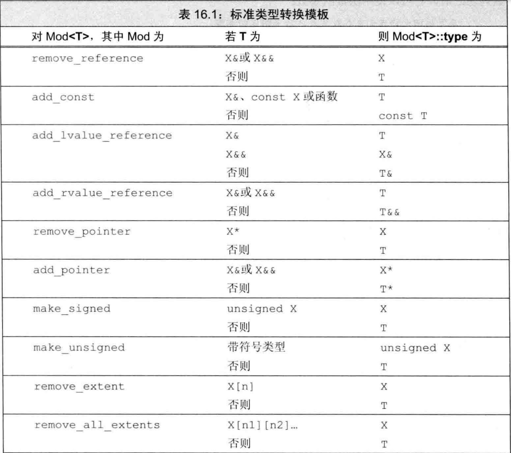

# C++ Prime Plus 笔记

## 概述

此文档用来记录阅读 C++ Prime Plus 中遇到的一些重点，主要作为自己日后复习的笔记，笔记从模版开始记录，之前的内容会慢慢补充

## 模版

### 模版实参推断

#### 类型转换与模版类型参数

顶层 const 无论是在形参还是在实参中都会被忽略，顶层 const 就是指指针本身是不可改变的 (`int * const p`)

关于 const 的转换，虽然模版被声明为接受 const 类型的形参，但是它也可以接受非 const 类型的实参，只不过在使用时会将其转换成 const 类型

关于数组或函数指针转换，当模版的形参没有被声明为引用类型时，则可以对数组或函数类型的实参应用正常的指针转换。相反如果形参被声明为引用类型时，那么数组或函数类型的实参是不能进行正常的指针转换的

代码示例：

```CPP
template <typenmae T> T fobj(T, T);			// 实参会被拷贝出一份副本
template <typenmae T> T fref(const T &, const T &);	// 实参以引用的形式来进行传递

string s1("value");
const string s2("const value");

fobj(s1, s2);						// 调用 fobj(string, string); const 被忽略
fref(s1, s2);						// 调用 fref(const string &, const string &);
							// 将 s1 转换为 const 是允许的
int a[10], b[42];
fobj(a, b);						// 调用 f(int *, int *)
fref(a, b);						// 错误：数组类型不匹配
```

#### 使用相同模版参数类型的函数形参

这个转换规则的意思就是当我们声明一个模版接受几个同种引用类型的参数，那么传入这个函数的实参类型必须为相同的

举个例子

```CPP
long lng;
compare(lng, 1024);	// 错误：不能实例化 compare(long, int)
```

上面这段代码中，compare 被声明为接受两个引用类型的模版函数，传入实参时 compare 的第一个实参 lng 其类型为 long，第二个实参 1024 为 int，因为两个参数类型不同所以说这条语句时错误的

如果想要传入不同类型的引用实参，解决办法就是在声明模版时参数模版中的类型设置为不同种的类型即可，如下所示：

```CPP
template <typename A, typename B>
int flexibleCompare(const A& v1, const B& v2) {
	if (v1 < v2) return -1;
	if (v2 < v1) return 1;
	return 0;
}
```

#### 正常类型转换应用于普通函数实参

正常类型转换应用与普通函数实参的意思就是声明一个模版函数，其中参数部分一部分是通过模版来获取具体的参数类型，一部分是直接指明了参数的类型，如下所示：

```CPP
template <typename T> ostream & print(ostrean & os, const T & obj) {
	return os << obj;
}
```

### 函数模版显式实参

#### 指定显示模版实参

举个例子，当我们声明一个模版函数时声明了三个模版参数，其中第一个参数作为了函数的返回值，剩余的两个函数作为了函数的参数，也就是像下面这个样子：

```CPP
template <typename T1, typename T2, typenmae T3>
T1 sum(T2, T3);
```

当我们每次调用 sum 时必须显式的指明 T1 的类型， T1 的类型放在尖括号中，位于函数名之后，实参列表之前，如下所示

```CPP
auto val3 = sum<long long>(i, lng);
```

上例中 T1 的类型是显示指明的，T2 和 T3 的值是编译器通过 i 和 lng 推导出来的

对于指定显示模版实参还有一个特殊的例子，也就是让 T3 作为函数的返回值，然后让 T1， T2作为参数，此时在调用 sum 时需要将所有参数的类型都显示的指明，如下所示：

```CPP
template <typename T1, typename T2, typenmae T3>
T3 sum(T2, T1);

auto val2 = sum<long long>(i, lng);			// 错误的，不能推断出前几个模版参数
auto val3 = sum<long long, int, long>(i, lng);		// 正确的，显式指定了所有三个参数
```

#### 正常类型转换应用于显示指定的实参

在我们定义的普通函数中是允许正常的类型转换的，同样我们定义的模版函数也是可以进行正常的类型转换的，只不过想要支持类型转换的话需要显示指明模版函数中的类型而不能靠编译器的推导，如下所示：

```CPP
long lng;
compare(lng, 1024);		// 错误：模版参数不匹配
compare<long long>(lng, 1024);	// 正确：实例化 compare(long, long)
compare<int>(lng, 1024);	// 正确：实例化 compare(int, int)
```

#### 尾置返回类型与类型转换

尾置返回类型主要就是在我们不能确定返回值类型时来进行使用的，因为尾置返回出现在参数列表之后，所以它可以使用函数的参数

以下面的代码为例

```CPP
template <typename It>
??? &fcn(It beg, It end) {
	return *beg;
}

vector<int> vi = {1, 2, 3, 4, 5};
Blob<string> ca = { "hi", "bye" };
auto &i = fcn(vi.begin(), vi.end());	// 应该返回一个 int & 的引用
auto &s = fcn(ca.begin(), ca.end());	// 应该返回一个 string & 的引用
```

下面的代码就展示了如何使用尾置返回类型来解决上面的问题，代码如下：

```CPP
template <typenmae It>
auto & fcn(It beg, It end) -> decltype(*beg) {
	return * beg;
}
```

#### 进行类型转换的标准库模版类

使用标准库模版类的主要目的就是为了返回一个具体的值类型而不是返回一个引用了，上面我们使用尾置返回类型只可以返回引用而不可以返回值，这里使用的是 type_traits 中的 remove_reference 来获取元素类型，代码如下：

```CPP
template <typename It>
auto fcn2(It beg, It end) -> 
	typename remove_reference<decltype(*beg)>::type
{
	return * beg;
}
```

需要注意的是，因为 type 是一个类的成员，而该类依赖于一个模版参数。因此，我们必须在返回类型的声明中使用 typename 来告知编译器，type 表示一个类型

标准类型转换模版如下：



#### 函数指针和实参推断

模版函数也可以作为实参传给接受函数指针为参数的函数，只不过在传参的时候需要显示指明模版中的参数类型，并且我们还可以让声明一个函数指针，然后让函数指针指向一个模版函数的实例，如下所示

```CPP
template <typename T> int compare(const T &, const T &);

int (*pf1)(const int &, const int &) = compare;

void func(int(*)(const string &, const string &));
void func(int(*)(const int &, const int &));
func(compare);						// 错误，不知道具体是哪个 compare 实例
func(compare<int>);					// 正确，会以 compare<int> 实例来初始化 func
```

#### 模版实参推断和引用

##### 从左值引用函数参数推断类型

只接受一个左值作为参数，使用如下定义：

```CPP
template <typename> void f1(T&);

f1(i);		// 正确，i 是一个 int，模版参数类型 T 是 int
f1(ci);		// 正确，ci 是一个 const int， 模版参数类型 T 是 const int
fi(5);		// 错误，模版只接受左值作为参数，然后 5 属于右值
```

既可以接受左值，也可以接受右值作为参数，使用如下定义：

```CPP
template <typename> void f2(const T&)

f2(i);		// 正确，i 是一个 int，模版参数类型 T 是 int
f2(ci);		// 正确，ci 是一个 const int，模版参数类型 T 是 const int
f2(5);		// 正确，一个 const & 参数是可以绑定到一个右值上的，T 是 int
```

##### 从右值引用函数推断类型

当一个函数参数是一个右值引用（即，形如 T&&）时，正常绑定规则告诉我们可以传递给他一个右值。当我们这样做时，类型推断过程类似普通左值引用函数参数的推断过程。推断出当 T 的类型时该右值实参的类型，如下所示：

```CPP
template <typename T> void f3(T&&);
f3(42);					// 实参是一个 int 类型的右值；模版参数 T 是 int
```

##### 引用折叠和右值引用参数

如果一个函数参数是一个指向模版类型参数的右值引用（如，T&&），则它可以被绑定到一个左值

如果实参是一个左值，则推断出的模版实参类型将是一个左值引用，且函数参数将被实例化为一个（普通）左值引用参数（T&）

如下所示：

```CPP
template <typename T> void f3(T&&);

f3(5);		// 实参是一个右值；模版参数 T 是 int
f3(i);		// 实参是一个左值：模版参数 T 是 int &
f3(ci);		// 实参是一个左值：模版参数 T 是 const int &
```

##### 编写接受右值引用参数的模版函数

```CPP
template <typename T> void f(T&&);	// 绑定到非 const 右值
template <typename T> void f(const T&);	// 左值和 const 右值
```

上述代码中第一个版本将绑定到可修改的右值，第二个版本将绑定到左值或者 const 右值

##### 理解 std::move

理解 std::move 可以帮助我们复习前面关于类型转换方面的内容

标准库内 move 是这样定义的：

```CPP
template <typename T>
typename remove_reference<T>::type && move(T&& t) {
	return static_cast<typename remove_reference<T>::type &&>(t);
}
```

因为其接受一个右值引用类型的参数，再通过引用折叠可以让其接受任意类型的实参，比如说下面的调用皆属于合法的：

```CPP
string s1("hi"), s2;
s2 = std::move(string("bye!"));
s2 = std::move(s1);
```

第二行代码是怎样进行工作的：

1. 首先 string("bye!"); 会调用 string 的构造函数生成一个右值，此时就可以推导出 T 的类型为 string
2. 然后，remove_reference 用 string 进行实例化
3. remove_reference<string> 的 type 成员是 string
4. move 的返回类型为 string&&
5. move 的函数参数 t 的类型为 string&&

第三行代码是怎样进行工作的：

1. 首先可以推断出 T 的类型为 string& （也就是 string 的引用，而非普通 string）
2. 因此，remove_reference 用 string& 进行实例化
3. remove_reference<string &> 的 type 成员是 string
4. move 的返回类型依旧为 string&&
5. move 的函数参数 t 的类型为 string& &&，会折叠为 string&

#### 转发

转发是用模版来接受参数，然后将不同类型的参数以不同的顺序转发给另一个函数，但是在转发的过程中类型转换会存在一些问题

如下面的例子，我们将编写一个函数，他接受一个可调用表达式和两个额外实参。我们的函数将调用给定的可调用对象，将两个额外参数逆序传递给他

```CPP
templaet <typename F, typename T1, typename T2>
void flip1(F f, T1 t1, T2 t2) {
	f(t2, t1);
}
```

一般情况下上述例子都可以正常的工作，但是当我们转发的函数希望接受一个引用参数那么就会出现问题，如下所示：

```CPP
void f(int v1, int &v2) {
	cout << v1 << " " << ++v2 << endl;
}

f(42, i);		// f 改变了实参 i
flip1(f, j, 42);	// flip1 不会改变 j
```

这里是因为 flip1 接受一个普通类型的参数，而不是引用，所以会拷贝一个新的值然后在传递给 f，所以说当使用 flip1 传递 j 时会拷贝一个 j 的副本并将其传递给 f ，虽然此时仍然可以正常的传递，但是此时 f 接受到的引用为拷贝的副本，所以说我们在 f 中对 v2 的改变不会影响到 j

如果我们想要解决上面的问题，那么就需要修改一下 flip1 使其接受右值引用，使用右值引用是可以保持其对应实参的所有类型信息，并且通过引用折叠也可以保证实参的左值/右值属性，如下所示：

```CPP
template <typename F, typename T1, typenmae T2>
void flip2(F f, T1 &&t1, T2 &&t2) {
	f(t2, t1);
}
```

上面的代码虽然可以解决了转发函数接受一个左值引用参数的情况，但是当转发函数接受一个右值引用的参数时还是会出现问题

```CPP
void g(int && i, int & j) {
	cout << i << " " << j << endl;
}

flip2(g, i, 42);
```

在上述代码中 i 为一个左值，经过 flip2 保留了 i 的类型也就是说 t1 的类型为 int && 但是 t1 是作为第二个参数传递给了函数 g，但是 g 的第二个参数接受的是一个左值引用类型的参数，那么此时就会出现问题

为了解决这个问题，我们使用标准库中的 std::forward 来保持类型信息，如下所示:

```CPP
template <typename F, typename T1, typename T2>
void flip(F f, T1 &&t1, T2 &&t2) {
	f(std::forward<T2>(t2), std::forward<T1>(t1));
}
```

#### 重载与模版

模版重载与函数重载区别不太大，重载的模版之间除了接受的模版参数不同以外其余皆相同，如下所示:

```CPP
template <typename T> string func(const T & t) {
	...
}

template <typename T> string func(T * p) {
	...
}
```

同样我们可以混合使用模版重载与非模版重载，如下所示：

```CPP
string func(const string & s) {
	...
}

string s("hi");
cout << func(s) << endl;
```

但是当我们使用 func(s) 时会自动调用非模版函数。

注：对于一个调用，如果一个非函数模版与一个函数模版提供同样好的匹配，则选择非模版版本

在模版函数中我们仍可调用本身不同版本的模版函数，通常这样做的目的是为了处理不同类型的参数

注：在定义任何函数之前，记得声明所有重载的函数版本。这样就不必担心编译器由于未遇到你希望调用的函数而实例化一个并非你所需的版本

#### 可变参数模版

首先需要确定几个概念：
- 可变参数模版：一个接受可变数目参数的函数模版或模版类
- 参数包：可变数目的参数
- 模版参数包：表示零个或多个模版参数
- 函数参数包：表示零个或多个函数参数

示例如下：

```CPP
template <typename T, typename... Args>
void foo(const T &t, const Args& ... rest);

int i = 0; double d = 3.14; string s = "how now brown cow";
foo(i, s, 42, d);
foo(s, 42, "hi");
foo(d, s);
foo("hi");
```

上面的代码中，Args 是一个模版参数包，rest 是一个函数参数包，Args 表示零个或多个模版类型参数，rest 表示零个或多个函数参数，其中编译器会为 foo 实例化出四个不同的版本

```CPP
void foo(const int &, const string &, const int &, const double &);
void foo(const string &, const int &, const char[3] &);
void foo(const double &, const string &);
void foo(const char[3] &);
```

##### sizeof... 运算符

sizeof... 运算符用来计算出参数包中有多少个元素，使用示例如下：

```CPP
template <typename ... Args> void g(Args ... args) {
	cout << sizeof...(Args) << endl;
	cout << sizeof...(args) << endl;
}
```

##### 编写可变参数函数模版

之前我们可以使用 initializer_list 来顶一个接受可变数目实参的函数，但是有一个缺点就是变化的实参都必须为相同类型

但是使用可变参数函数模版时我们可以接受不同类型都多个参数，并且一般情况下可变参数函数通常是递归的。第一步调用处理包中的第一个实参，然后用剩余实参调用自身。如下面的示例所示：

```CPP
template <typename T>
ostream &print(ostream &os, const T &t) {
	return os << t;
}

template <typename T, typename... Args>
ostream &print(ostream &os, const T &t, const Args&... rest) {
	os << t << ", ";
	return print(os, rest...);
}

print(cout, i, s, 42);		// t = i   rest = s, 42
print(cout, s, 42);		// t = s   rest = 42
print(cout, 42);		// 因为没有多余的参数，所以这里会调用非可变参数版本的 print
```

#### 包扩展

包扩展的概念：扩展一个包就是将它分解为构成的元素，对每个元素应用模式，获得扩展后的列表。一般我们是通过在模式右边放一个省略号(...)来触发扩展操作

上面编写可变参数函数的模版中的示例代码就用到了包扩展，我们再来看一下上面的那段代码：

```CPP
template <typename T, typename... Args>
ostream &
print(ostream os, const T &t, const Args&... rest) {	// 扩展 Args
	os << t << ", ";
	return print(os, rest...);			// 扩展 rest
}
```

第一个扩展操作扩展模版参数包，为 print 生成函数参数列表。第二个扩展操作出现在对 print 的调用中

上面的例子中 print 只是将函数参数包扩展为其构成元素，但是 C++ 是允许我们做更多更复杂的操作，比如说分解出其构成的元素后，对每个元素调用一个函数，如下所示：

```CPP
template <typename... Args>
ostream &errorMsg(ostream &os, const Args&... rest) {
	return print(os, func(rest)...);
}

errorMsg(cerr, fcnName, code.num(), otherDate, "other", item);
```

将上面的调用 errorMsg 函数的那一行展开后就是这个样子的：

```CPP
print(cerr, func(fcnName), func(code.num()), func(otherDate),
		func("other"), func(item));
```

但是当我们这样定义 errorMsg 时会遇到编译失败，因为 func 并不能接受一个可变长度参数模版：

```CPP
template <typename... Args>
ostream &errorMsg(ostream &os, const Args&... rest) {
	return print(os, func(rest...));
}
```

##### 转发参数包

其中我们是可以转发参数包的，也是利用标准库中的 std::forward 来进行转发

#### 模版特例化

下面的例子中就是用到了模版特例化，模版特例化的目的就是为了能够不同的情况以做到接受不同的参数也可以正常的进行工作

```CPP
template <typename T> int compare(const T &, const T &);
template <size_t N, size_t M>

int compare(const char (&)[N], const char (&)[M]);

const char *p1 = "hi", *p2 = "mom";
compare(p1, p2);			// 调用第一个模版
compare("hi", "mom");			// 调用有两个非类型参数的模版
```

因为我们无法将一个指针转换为一个数组的引用，因此当参数是 p1 和 p2 时，第二个版本的 compare 是不可行的

##### 模版偏特化

例子如下：

```CPP
template <class T> struct remove_reference { typedef T type; };
template <class T> struct remove_reference<T&> { typedef T type; };
template <class T> struct remove_reference<T&&> { typedef T type; };

int i;
remove_reference<decltype(42)>::type a;			// 使用原始模版
remove_reference<decltype(i)>::type b;			// 使用第一个(T&)部分特例化版本
remove_reference<decltype(std::move(i))>::type c;	// 使用第二个(T&&)部分特例化版本
```

模版偏特化与全特化和重载的区别就是，模版接受的模版类型不变，函数的名字也不变，改变的只有参数的信息

而且我们也可以只特例化指定成员函数而不是特例化整个模版，如下所示：

```CPP
template <typename T> struct Foo {
	Foo(const T &t = T()) : mem(t) { }
	void Bar() { /* ... */ }
	T mem;
};

template <>			// 我们正在特例化一个模版
void Foo<int>::Bar() {		// 我们正在特例化 Foo<int> 的成员 Bar
	// 进行应用于 int 的特例化处理
}

Foo<string> fs;		// 实例化 Foo<string>::Foo()
fs.Bar();		// 实例化 Foo<string>::Bar()
Foo<int> fi;		// 实例化 Foo<int>::Foo()
fi.Bar();		// 使用我们特例化版本的 Foo<int>::Bar()
```