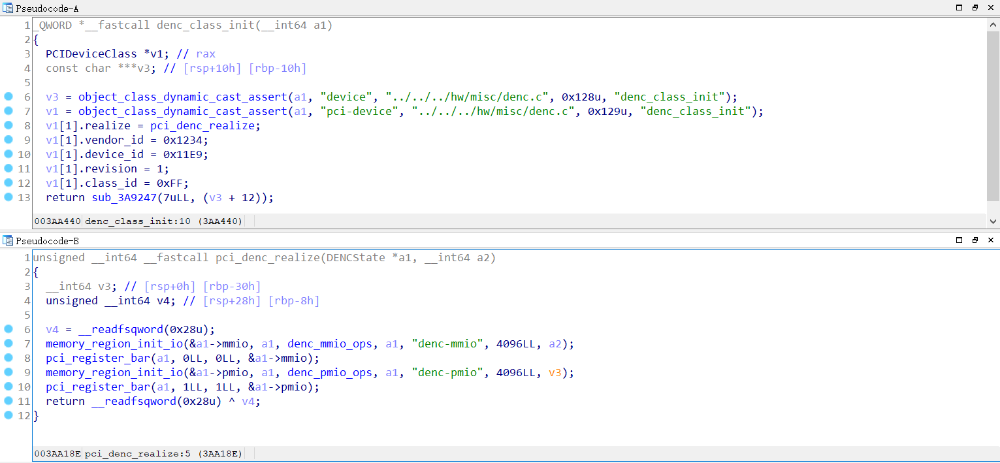
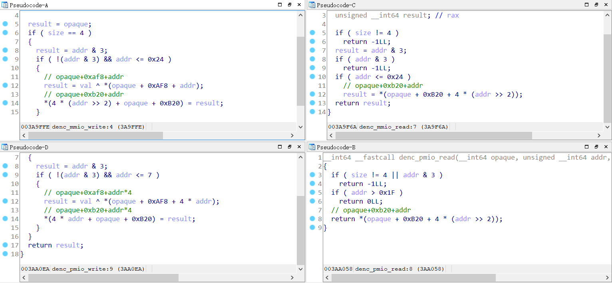

# GACTF babyqemu Writeup

首先看一下start.sh的内容，内容如下：

```
#!/bin/sh
./qemu-system-x86_64 \
    -kernel ./vmlinuz-4.8.0-52-generic  \
    -append "console=ttyS0 root=/dev/ram oops=panic panic=1 quiet"  \
    -initrd ./rootfs.cpio  \
    -m 2G -nographic \
    -L /pc-bios -smp 1 \
    -device denc 
```

显而易见的denc设备，所以我们直接去ida中寻找denc设备，结果却发现qemu被去了符号表，所以我们只能通过别的方法来寻找到关于denc设备的几个关键函数了，我用的方法就是寻找denc这个字符串，因为qemu中关键函数部分会在代码中使用到denc这个字符串，通过寻找引用这个字符串的函数，然后再根据函数内部的代码，来判断出这个函数具体为什么函数，pci_denc_realize和denc_class_init函数代码如下(代码经过我修改过)：



然后根据pci_denc_realize函数可以找到对应的mmio_read/write和pmio_read/write，对应代码如下：



对应我们可以使用lspci命令检测一下我们找到的denc_class_init函数是否正确，输入lspci -k -v命令可以得到如下输出：

```
# lspci -v -k
00:00.0 Class 0600: 8086:1237
00:01.3 Class 0680: 8086:7113
00:03.0 Class 0200: 8086:100e e1000
00:01.1 Class 0101: 8086:7010 ata_piix
00:02.0 Class 0300: 1234:1111
00:01.0 Class 0601: 8086:7000
00:04.0 Class 00ff: 1234:11e9
```

然后我们需要确定一下pmio使用的端口号，使用 /sys/devices/pci0000\:00/0000\:00\:04.0/resource命令来查看，可以得到如下输出，由此可以得到pmio的端口号为0xc000：

```
# cat /sys/devices/pci0000\:00/0000\:00\:04.0/resource
0x00000000febf1000 0x00000000febf1fff 0x0000000000040200
0x000000000000c000 0x000000000000cfff 0x0000000000040101
0x0000000000000000 0x0000000000000000 0x0000000000000000
0x0000000000000000 0x0000000000000000 0x0000000000000000
0x0000000000000000 0x0000000000000000 0x0000000000000000
0x0000000000000000 0x0000000000000000 0x0000000000000000
0x0000000000000000 0x0000000000000000 0x0000000000000000
0x0000000000000000 0x0000000000000000 0x0000000000000000
0x0000000000000000 0x0000000000000000 0x0000000000000000
0x0000000000000000 0x0000000000000000 0x0000000000000000
0x0000000000000000 0x0000000000000000 0x0000000000000000
0x0000000000000000 0x0000000000000000 0x0000000000000000
0x0000000000000000 0x0000000000000000 0x0000000000000000
```

然后根据mmio_read/write和pmio_read/write来找一下漏洞点，乍一看没有什么漏洞点，但是伪代码欺骗了我们，对应pmio_write的汇编代码中有如下语句：

```
.text:00000000003AA0F6                 cmp     [rbp+var_20], 7
.text:00000000003AA0FB                 ja      short loc_3AA13F

.text:00000000003AA13F ; ---------------------------------------------------------------------------
.text:00000000003AA13F
.text:00000000003AA13F loc_3AA13F:                             ; CODE XREF: denc_pmio_write+3E↑j
.text:00000000003AA13F                 nop
.text:00000000003AA140
.text:00000000003AA140 loc_3AA140:                             ; CODE XREF: denc_pmio_write+80↑j
.text:00000000003AA140                 call    $+5
.text:00000000003AA145                 add     [rsp+38h+var_38], 5
.text:00000000003AA149                 retn
.text:00000000003AA14A ; ---------------------------------------------------------------------------
.text:00000000003AA14A                 cmp     [rbp+var_20], 660h
.text:00000000003AA152                 jnz     short locret_3AA17C
.text:00000000003AA154                 mov     rax, [rbp+var_10]     ; addr
.text:00000000003AA158                 mov     rax, [rax+0B40h]      ; addr+0xb40
.text:00000000003AA15F                 mov     rdx, [rbp+var_10]     ; addr
.text:00000000003AA163                 lea     rcx, [rdx+0B20h]      ; addr+0xb20
.text:00000000003AA16A                 mov     edx, 0
.text:00000000003AA16F                 mov     esi, 0
.text:00000000003AA174                 mov     rdi, rcx              ; 参数 由addr+0xb20设置
.text:00000000003AA177                 call    rax                   ; 函数 由addr+0xb40设置
.text:00000000003AA179                 jmp     short locret_3AA17C
.text:00000000003AA17B ; ---------------------------------------------------------------------------
```

第一行的cmp对应伪代码中的addr <= 7，如果说大于7的话他会跳转到另一个地方执行另外的一些代码，而伪代码中没有关于这部分代码的反汇编代码，下面我们来分析一下这段代码，这段代码主要执行的功能就是把addr+0xb20处的内容当成参数，把addr+0xb40处的内容当成函数地址，然后调用addr+0xb40处的函数。**但是对应还有一些条件，首先就是addr需要大于7，然后对应的addr还需要等于660h。**

然后我们可以发现addr+0xb20和addr+0xb40处的内容都是可以通过mmio_write被我们控制的，所以利用方式就很简单了往addr+0xb40处写入system然后往addr+0xb20处写入想要执行的命令，不过在之前我们需要先泄露出一个地址，来方便我们找到程序基址和system的地址，在动调的时候我发现addr+0xb40地址处一开始(**咱们没做任何写入的操作的时候**)就有一个函数地址，可以利用这个函数寻找到程序基址和system的地址

还有一点需要注意的是mmio_write函数有一个异或操作，它会从addr+0xaf8这个地方取数据跟咱们输入的val进行异或，一开始我以为这个值是固定的不会变的，但是后来动调的时候发现，这个值是会变化的，所以我们每次运行exp的时候都需要算一下咱们需要用到的addr所对应的偏移都是多少，获取的操作很简单，就是修改addr的值然后传入的数据填0就行了，因为任何一个数异或0都等于其本身。

具体过程：

1. 通过mmio_read，泄露出原本addr+0xb40处存的函数地址
2. 通过泄露出的地址，计算出程序基址和system的地址
3. 计算出我们需要用到的addr对应需要异或的值为多少
4. 把system写入到addr+0x40
5. 把命令写入到addr+0x20
6. 使用pmio_write，然后地址为0xc660(端口+addr)，这时候就会执行到上面汇编代码的位置了，然后就会执行system("command")了

exp代码：[exp.c](exp.c)

执行exp之后的效果如下：


**注：由于题目原本的环境没有开启ssh，cpio解压的时候还会报错，于是我就换了一个文件系统，使用的是hitb的文件系统**