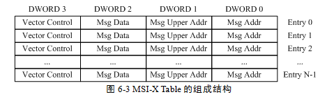
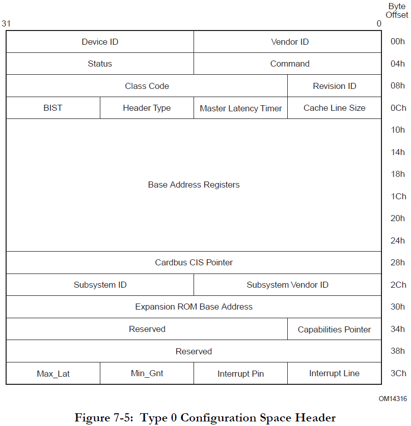
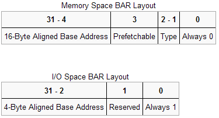

**注：本人也是这方面的初学者，文章有错误或不妥的地方，欢迎斧正，并且感谢zhz、Kirin和K/2三位师傅的指点**

**注：本人也是这方面的初学者，文章有错误或不妥的地方，欢迎斧正，并且感谢zhz、Kirin和K/2三位师傅的指点**

**注：本人也是这方面的初学者，文章有错误或不妥的地方，欢迎斧正，并且感谢zhz、Kirin和K/2三位师傅的指点**

# Kemu

## 前置知识

### nvme

nvme是硬盘的一个传输协议，据网上的资料所言，此协议可以提升SSD硬盘的读写速度，nvme的全称为Non-Volatile Memory Express，如果翻译过来就是**非易失性内存主机控制器接口规范**。(这里插一个题外话，硬盘有三大种类，原本我以为只有固态(SSD)和机械(HHD)这两种，其实还有一种混合硬盘(HDD)，混合硬盘包含闪存和传统的硬盘，闪存来储存经常使用的数据)

nvme物理层基于高速的pcie接口，所以对应的我们在qemu中看到的使用nvme协议的设备也属于pcie设备，其中pci协议里规定了pci设备的配置空间里有6个32位的bar寄存器，代表了pci设备上的一段内存空间(memory、io)，例如我们使用lspci -s命令查看的时候就可以看到对应设备在内存空间的起始地址和结束的地址，以及空间大小。

在linux中我们无法直接访问物理地址，需要映射到虚拟地址，在地址映射结束之后，我们访问dev->bar就可以直接操作nvme设备上的寄存器了。

假如nvme协议的版本大于等于1.2的话，需要调用nvme_map_cmb映射controller memory buffer。CMB的主要作用是把SQ/CQ存储的位置从host memory搬到device memory来提升性能，改善延时。

### msix

MSI-X是一种中断模式，其中pci有两种中断模式，一种是INT，另一种是MSI。假如不支持INT模式的话，就使能MSI模式。在PCIe总线中，PCIe设备必须支持MSI或者MSI-X中断请求机制，而可以不支持INTx中断消息。在PCIe总线中，MSI和MSI-X中断机制使用存储器写请求TLP向处理器提交中断请求。

MSI-X Table存放该设备使用的所有Message Address和Message Data字段，对应图示如下：



Pending Table表，该表用来存放与每一个中断向量对应的Pending位，对应图示如下：


MSI-X Table和Pending Table存放在PCIe设备的BAR空间中，意思也就是这个表是可以被读写的

### pci设备地址空间

PCI设备都有一个配置空间（PCI Configuration Space），其记录了关于此设备的详细信息。大小为256字节，其中头部64字节是PCI标准规定的，当然并非所有的项都必须填充，位置是固定了，没有用到可以填充0。前16个字节的格式是一定的，包含头部的类型、设备的总类、设备的性质以及制造商等，格式如下：



比较关键的是其6个BAR(Base Address Registers)，BAR记录了设备所需要的地址空间的类型，基址以及其他属性。BAR的格式如下：



设备可以申请两类地址空间，memory space和I/O space，它们用BAR的最后一位区别开来。

当BAR最后一位为0表示这是映射的I/O内存，为1是表示这是I/O端口，当是I/O内存的时候1-2位表示内存的类型，bit 2为1表示采用64位地址，为0表示采用32位地址。bit1为1表示区间大小超过1M，为0表示不超过1M。bit3表示是否支持可预取。

而相对于I/O内存，当最后一位为1时表示映射的I/O端口。I/O端口一般不支持预取，所以这里是29位的地址。

通过memory space访问设备I/O的方式称为memory mapped I/O，即MMIO，这种情况下，CPU直接使用普通访存指令即可访问设备I/O。

通过I/O space访问设备I/O的方式称为port I/O，或者port mapped I/O，这种情况下CPU需要使用专门的I/O指令如`IN/OUT`访问I/O端口。

关于MMIO和PMIO，维基百科的描述是：

```
Memory-mapped I/O (MMIO) and port-mapped I/O (PMIO) (which is also called
isolated I/O) are two complementary methods of performing input/output (I/O)
between the central processing unit (CPU) and peripheral devices in a computer.
An alternative approach is using dedicated I/O processors, commonly known as
channels on mainframe computers, which execute their own instructions.
```

在MMIO中，内存和I/O设备共享同一个地址空间。 MMIO是应用得最为广泛的一种I/O方法，它使用相同的地址总线来处理内存和I/O设备，I/O设备的内存和寄存器被映射到与之相关联的地址。当CPU访问某个内存地址时，它可能是物理内存，也可以是某个I/O设备的内存，用于访问内存的CPU指令也可来访问I/O设备。每个I/O设备监视CPU的地址总线，一旦CPU访问分配给它的地址，它就做出响应，将数据总线连接到需要访问的设备硬件寄存器。为了容纳I/O设备，CPU必须预留给I/O一个地址区域，该地址区域不能给物理内存使用。

在PMIO中，内存和I/O设备有各自的地址空间。 端口映射I/O通常使用一种特殊的CPU指令，专门执行I/O操作。在Intel的微处理器中，使用的指令是IN和OUT。这些指令可以读/写1,2,4个字节（例如：`outb`, `outw`, `outl`）到IO设备上。I/O设备有一个与内存不同的地址空间，为了实现地址空间的隔离，要么在CPU物理接口上增加一个I/O引脚，要么增加一条专用的I/O总线。由于I/O地址空间与内存地址空间是隔离的，所以有时将PMIO称为被隔离的IO(Isolated I/O)。

memory_region_init_io函数功能：初始化内存空间（`MemoryRegion`结构体），记录空间大小，注册相应的读写函数等；然后调用`pci_register_bar`来注册BAR等信息。需要指出的是无论是MMIO还是PMIO，其所对应的空间需要显示的指出（即静态声明或者是动态分配），因为`memory_region_init_io`只是记录空间大小而并不分配。

## 题目分析

固定的套路，首先看一下启动的命令，启动命令如下：

```
#!/bin/bash

pwd=`pwd`

./qemu-system-x86_64 \
	-initrd ${pwd}/rootfs.cpio -nographic -kernel ${pwd}/kernel-guest \
	-L ${pwd}/pc-bios -append "priority=low console=ttyS0 loglevel=3 kaslr" \
	-drive file=${pwd}/nvme.raw,format=raw,if=none,id=Dxx -device nvme,drive=Dxx,serial=1234 \
	-monitor /dev/null
```

可以看到只启动了一个nvme设备，所以就应该是从nvme设备下手，我一开始也是这样想的，但是逆了一会代码，发现这nvme_mmio_write函数900+行，就觉着有些不对劲了，然后查了一下发现nvme这个设备是qemu源码中就有的，而不是题目作者添加的设备，所以这道题就是作者对已有的nvme设备相关代码进行了修改，但是对应的修改了哪里我们目前还不清楚（**注：以前也有这种修改设备原有的代码的题，比如说19年强网杯final的ExecChrome**）

不过这种类型的题还是会跟设备有关的，并且和启动的设备关系最大，首先我们可以找到nvme_class_init函数，对应代码如下：

```
char **__fastcall nvme_class_init(__int64 a1)
{
  _QWORD *v1; // rbx
  __int64 v2; // rax
  char **result; // rax

  v1 = object_class_dynamic_cast_assert(a1, "device", "hw/block/nvme.c", 1363LL, "nvme_class_init");
  v2 = object_class_dynamic_cast_assert(a1, "pci-device", "hw/block/nvme.c", 1364LL, "nvme_class_init");
  *(v2 + 208) = 0x58458086;
  *(v2 + 212) = 2;
  *(v2 + 176) = pci_nvme_realize;
  *(v2 + 184) = pci_nvme_uninit;
  *(v2 + 214) = 0x108;
  v1[12] |= 4uLL;
  v1[14] = "Non-Volatile Memory Express";
  v1[15] = off_F326E0;
  result = &off_D749C0;
  v1[20] = &off_D749C0;
  return result;
}
```

其中可以看到0x58458086这个数字，前面的0x5845对应于DeviceID，后面的0x8086对应于VendorID，然后还有0x108这个数字，这个数对应于class即设备类型，然后使用lspci命令查看一下，输出结果如下：

```
/ # lspci
00:01.0 Class 0601: 8086:7000
00:04.0 Class 0108: 8086:5845
00:00.0 Class 0600: 8086:1237
00:01.3 Class 0680: 8086:7113
00:03.0 Class 0200: 8086:100e
00:01.1 Class 0101: 8086:7010
00:02.0 Class 0300: 1234:1111
```

可以看到对应确实存在这个设备然后我们查看resource文件来查看其相应的内存空间：

```
/ # cat /sys/devices/pci0000\:00/0000\:00\:04.0/resource
0x00000000febf0000 0x00000000febf1fff 0x0000000000140204
0x0000000000000000 0x0000000000000000 0x0000000000000000
0x0000000000000000 0x0000000000000000 0x0000000000000000
0x0000000000000000 0x0000000000000000 0x0000000000000000
0x00000000febf3000 0x00000000febf3fff 0x0000000000040200
0x0000000000000000 0x0000000000000000 0x0000000000000000
0x0000000000000000 0x0000000000000000 0x0000000000000000
0x0000000000000000 0x0000000000000000 0x0000000000000000
0x0000000000000000 0x0000000000000000 0x0000000000000000
0x0000000000000000 0x0000000000000000 0x0000000000000000
0x0000000000000000 0x0000000000000000 0x0000000000000000
0x0000000000000000 0x0000000000000000 0x0000000000000000
0x0000000000000000 0x0000000000000000 0x0000000000000000
```

对应我们可以看到有两个bar，两个bar的大小都为0x1000，所以我们对应的去看一下realize函数，对应代码如下(由于ida中的代码略长一些并且不容易观看，所以下面的代码是源码)：

```
static void nvme_realize(PCIDevice *pci_dev, Error **errp)
{
    NvmeCtrl *n = NVME(pci_dev);
    NvmeIdCtrl *id = &n->id_ctrl;

    int i;
    int64_t bs_size;
    uint8_t *pci_conf;

    if (!n->num_queues) {
        error_setg(errp, "num_queues can't be zero");
        return;
    }

    if (!n->conf.blk) {
        error_setg(errp, "drive property not set");
        return;
    }

    bs_size = blk_getlength(n->conf.blk);
    if (bs_size < 0) {
        error_setg(errp, "could not get backing file size");
        return;
    }

    if (!n->serial) {
        error_setg(errp, "serial property not set");
        return;
    }
    blkconf_blocksizes(&n->conf);
    if (!blkconf_apply_backend_options(&n->conf, blk_is_read_only(n->conf.blk),
                                       false, errp)) {
        return;
    }

    pci_conf = pci_dev->config;
    pci_conf[PCI_INTERRUPT_PIN] = 1;
    pci_config_set_prog_interface(pci_dev->config, 0x2);
    pci_config_set_class(pci_dev->config, PCI_CLASS_STORAGE_EXPRESS);
    pcie_endpoint_cap_init(pci_dev, 0x80);

    n->num_namespaces = 1;
    n->reg_size = pow2ceil(0x1004 + 2 * (n->num_queues + 1) * 4);
    n->ns_size = bs_size / (uint64_t)n->num_namespaces;

    n->namespaces = g_new0(NvmeNamespace, n->num_namespaces);
    n->sq = g_new0(NvmeSQueue *, n->num_queues);
    n->cq = g_new0(NvmeCQueue *, n->num_queues);

    memory_region_init_io(&n->iomem, OBJECT(n), &nvme_mmio_ops, n,
                          "nvme", n->reg_size);
    pci_register_bar(pci_dev, 0,
        PCI_BASE_ADDRESS_SPACE_MEMORY | PCI_BASE_ADDRESS_MEM_TYPE_64,
        &n->iomem);
    msix_init_exclusive_bar(pci_dev, n->num_queues, 4, NULL);

    id->vid = cpu_to_le16(pci_get_word(pci_conf + PCI_VENDOR_ID));
    id->ssvid = cpu_to_le16(pci_get_word(pci_conf + PCI_SUBSYSTEM_VENDOR_ID));
    strpadcpy((char *)id->mn, sizeof(id->mn), "QEMU NVMe Ctrl", ' ');
    strpadcpy((char *)id->fr, sizeof(id->fr), "1.0", ' ');
    strpadcpy((char *)id->sn, sizeof(id->sn), n->serial, ' ');
    id->rab = 6;
    id->ieee[0] = 0x00;
    id->ieee[1] = 0x02;
    id->ieee[2] = 0xb3;
    id->oacs = cpu_to_le16(0);
    id->frmw = 7 << 1;
    id->lpa = 1 << 0;
    id->sqes = (0x6 << 4) | 0x6;
    id->cqes = (0x4 << 4) | 0x4;
    id->nn = cpu_to_le32(n->num_namespaces);
    id->oncs = cpu_to_le16(NVME_ONCS_WRITE_ZEROS);
    id->psd[0].mp = cpu_to_le16(0x9c4);
    id->psd[0].enlat = cpu_to_le32(0x10);
    id->psd[0].exlat = cpu_to_le32(0x4);
    if (blk_enable_write_cache(n->conf.blk)) {
        id->vwc = 1;
    }

    n->bar.cap = 0;
    NVME_CAP_SET_MQES(n->bar.cap, 0x7ff);
    NVME_CAP_SET_CQR(n->bar.cap, 1);
    NVME_CAP_SET_AMS(n->bar.cap, 1);
    NVME_CAP_SET_TO(n->bar.cap, 0xf);
    NVME_CAP_SET_CSS(n->bar.cap, 1);
    NVME_CAP_SET_MPSMAX(n->bar.cap, 4);

    n->bar.vs = 0x00010200;
    n->bar.intmc = n->bar.intms = 0;

    if (n->cmb_size_mb) {

        NVME_CMBLOC_SET_BIR(n->bar.cmbloc, 2);
        NVME_CMBLOC_SET_OFST(n->bar.cmbloc, 0);

        NVME_CMBSZ_SET_SQS(n->bar.cmbsz, 1);
        NVME_CMBSZ_SET_CQS(n->bar.cmbsz, 0);
        NVME_CMBSZ_SET_LISTS(n->bar.cmbsz, 0);
        NVME_CMBSZ_SET_RDS(n->bar.cmbsz, 1);
        NVME_CMBSZ_SET_WDS(n->bar.cmbsz, 1);
        NVME_CMBSZ_SET_SZU(n->bar.cmbsz, 2); /* MBs */
        NVME_CMBSZ_SET_SZ(n->bar.cmbsz, n->cmb_size_mb);

        n->cmbloc = n->bar.cmbloc;
        n->cmbsz = n->bar.cmbsz;

        n->cmbuf = g_malloc0(NVME_CMBSZ_GETSIZE(n->bar.cmbsz));
        memory_region_init_io(&n->ctrl_mem, OBJECT(n), &nvme_cmb_ops, n,
                              "nvme-cmb", NVME_CMBSZ_GETSIZE(n->bar.cmbsz));
        pci_register_bar(pci_dev, NVME_CMBLOC_BIR(n->bar.cmbloc),
            PCI_BASE_ADDRESS_SPACE_MEMORY | PCI_BASE_ADDRESS_MEM_TYPE_64 |
            PCI_BASE_ADDRESS_MEM_PREFETCH, &n->ctrl_mem);

    }

    for (i = 0; i < n->num_namespaces; i++) {
        NvmeNamespace *ns = &n->namespaces[i];
        NvmeIdNs *id_ns = &ns->id_ns;
        id_ns->nsfeat = 0;
        id_ns->nlbaf = 0;
        id_ns->flbas = 0;
        id_ns->mc = 0;
        id_ns->dpc = 0;
        id_ns->dps = 0;
        id_ns->lbaf[0].ds = BDRV_SECTOR_BITS;
        id_ns->ncap  = id_ns->nuse = id_ns->nsze =
            cpu_to_le64(n->ns_size >>
                id_ns->lbaf[NVME_ID_NS_FLBAS_INDEX(ns->id_ns.flbas)].ds);
    }
}
```

可以看到50行和108行都调用了memory_region_init_io函数，所以一开始我就以为第二个bar就是nvme-cmb，但是后来动调的时候发现，程序不会走到91行这个分支，这个条件不满足直接跳出去了，那么第二个bar是从哪里来的呢

说一下我的思路，来自于**zhz师傅，Kirin师傅和K/2三位师傅**共同的指点，总结出来的：

现再我们可以确定第一个bar是nvme_mmio，只不确定第二个bar是从哪里来的，所以我决定在nvme_realize这个函数这里下断点，断点断下来之后，再在memory_region_init_io这里下断点，然后continue，第一次断下来，这里应该是对应mmio，第二次断下来，就应该是我们不确定的第二个bar调用的位置了，对应图示如下：

第一次断在realize函数这里


第二次断在memory_region_init_io函数这里


第三次也就是有一次断在了memory_region_init_io函数这里，对应的我们可以看到一个叫msix-table的字符串，然后我们在下面的堆栈调用顺序可以看到调用它的函数是在0x555555a4ee9d这个位置，对应的我们可以计算出偏移为0x1eab0d，在ida中memory_region_init_io函数的地址为0x310390，那么加上这个偏移后对应的地址就是0x4fae9d，然后我们去ida中寻找这个地址，然后查看一下它的伪代码


对应于地址的伪代码如下：

```
__int64 __fastcall sub_4FAD00(__int64 a1, unsigned __int16 a2, __int64 a3, unsigned __int8 a4, unsigned int a5, __int64 a6, __int64 a7, unsigned int a8, unsigned __int8 a9, __int64 a10)
{
  unsigned int v10; // er12
  int v11; // er13
  __int64 result; // rax
  __int64 v13; // rcx
  __int64 v14; // rcx
  unsigned __int8 v15; // [rsp+4h] [rbp-54h]
  __int64 v16; // [rsp+8h] [rbp-50h]
  __int64 v17; // [rsp+10h] [rbp-48h]

  v16 = a3;
  v15 = a4;
  v17 = a6;
  if ( byte_FBD258 )
  {
    if ( (a2 - 1) > 0x7FFu
      || (v10 = a5, v11 = 16 * a2, a4 == a7) && a8 <= a5 + v11 - 1 && a5 <= a8 + 511
      || au_re____assert_fail_111_1(a3) < (v11 + a5)
      || a8 + 512 > au_re____assert_fail_111_1(v17)
      || (a8 | v10) & 7 )
    {
      sub_6B3920(a10);
      result = 4294967274LL;
    }
    else
    {
      result = sub_4F7A70(a1, 17LL, a9, 12LL, a10);
      if ( result >= 0 )
      {
        v13 = *(a1 + 120);
        *(a1 + 1152) = result;
        *(a1 + 1148) |= 2u;
        v14 = result + v13;
        *(v14 + 2) = a2 - 1;
        *(a1 + 1156) = a2;
        *(a1 + 2568) = 1;
        *(v14 + 4) = v10 | v15;
        *(v14 + 8) = a8 | a7;
        *(*(a1 + 136) + result + 3LL) |= 0xC0u;
        *(a1 + 1160) = g_malloc0(v11);
        *(a1 + 1168) = g_malloc0(512LL);
        *(a1 + 2560) = g_malloc0(4LL * a2);
        sub_4FACA0(a1, a2);
        memory_region_init_io(a1 + 2080, a1, msix_table_mmio_ops, a1, "msix-table", v11);
        sub_3120D0(v16, v10, a1 + 2080);
        memory_region_init_io(a1 + 2320, a1, msix_pba_mmio_ops, a1, "msix-pba", 0x200LL);
        sub_3120D0(v17, a8, a1 + 2320);
        result = 0LL;
      }
    }
  }
  else
  {
    sub_6B3920(a10);
    result = 4294967201LL;
  }
  return result;
}
```

这样我们就定位到问题设备了，msix设备，然后我们来看一下对应的两个write函数和两个read函数，代码如下(加了注释版本的)：

msix_table_mmio_read和msix_table_mmio_write：

```
--------------------------------------------------------------------------------------------------------
__int64 __fastcall msix_table_mmio_read(__int64 opaque)
{
  int v1; // eax

  v1 = *(opaque + 0x620);
  if ( v1 == 2 )                                // 当 *(opaque + 0x620) 对应的值为2时
                                                // 返回 *(opaque + 0x624)的内容
    return *(opaque + 0x624);
  if ( v1 != 3 )                                // 当 *(opaque + 0x620) 对应的值不等于2也不等于3时
                                                // 返回 *(opaque + 0x624)是否等于1的布尔值
    return v1 == 1;
  // 当 *(opaque + 0x620) 对应的值等于3时
  // 会调用 *(opaque + 0x618) 指向的函数
  // 参数为 *(opaque + 0x498) *(opaque + 0x624) *(opaque + 0x518) *(opaque + 0x598)
  (*(opaque + 0x618))(opaque + 0x498, *(opaque + 0x624), opaque + 0x518, opaque + 0x598);
  return 0LL;
}
--------------------------------------------------------------------------------------------------------
void __fastcall msix_table_mmio_write(__int64 opaque, __int64 addr, char value, int size)
{
  int v4; // eax

  if ( size == 1 )
  {
    v4 = *(opaque + 0x620);
    switch ( v4 )
    {
      case 2:                                   // 当 *(opaque + 0x620) 对应的值为2时
                                                // 把 value 赋给 *(opaque + 0x624)
        *(opaque + 0x624) = value;
        break;
      case 3:                                   // 当 *(opaque + 0x618) 对应的值为3时
                                                // 把一个函数地址赋给 *(opaque + 0x618)
        *(opaque + 0x618) = sub_4FA470;
        break;
      case 1:                                   // 当*(opaque + 0x620) 对应的值为1时
                                                // 把 value 赋给 *(opaque + 0x620)
        *(opaque + 0x620) = value;
        break;
    }
  }
}
--------------------------------------------------------------------------------------------------------
```

msix_pba_mmio_read和msix_pba_mmio_write：

```
--------------------------------------------------------------------------------------------------------
__int64 __usercall msix_pba_mmio_read@<rax>(int size@<edx>, char a2@<bpl>, __int64 opaque@<rdi>, size_t addr@<rsi>)
{
  int size_; // er13
  size_t addr_; // r12
  void (__fastcall *v6)(__int64, __int64, size_t); // rax
  size_t v7; // rdx
  __int64 v8; // rsi
  __int64 result; // rax
  int v10; // eax

  size_ = size;
  addr_ = addr;
  v6 = *(opaque + 0xB60);
  if...
  if ( addr_ == 1 )                             // 当 addr = 1 则 *(opaque + 0x620) = 1
  {
    *(opaque + 0x620) = 1;
    return a2;
  }
  if ( addr_ == 2 )                             // 当 addr = 2 则 init *(opaque + 0x4a0) *(opaque + 0x520) *(opaque + 0x5a0)
  {
    *(opaque + 0x498) = 0LL;
    *(opaque + 0x510) = 0LL;
    memset(
      ((opaque + 0x4A0) & 0xFFFFFFFFFFFFFFF8LL),
      0,
      8LL * ((opaque - ((opaque + 0x4A0) & 0xFFFFFFF8) + 0x518) >> 3));
    *(opaque + 0x518) = 0LL;
    *(opaque + 0x590) = 0LL;
    memset(
      ((opaque + 0x520) & 0xFFFFFFFFFFFFFFF8LL),
      0,
      8LL * ((opaque - ((opaque + 0x520) & 0xFFFFFFF8) + 0x598) >> 3));
    *(opaque + 0x598) = 0LL;
    *(opaque + 0x610) = 0LL;
    memset(
      ((opaque + 0x5A0) & 0xFFFFFFFFFFFFFFF8LL),
      0,
      8LL * ((opaque - ((opaque + 0x5A0) & 0xFFFFFFF8) + 0x618) >> 3));
    return a2;
  }
  v10 = *(opaque + 0x620);
  if ( v10 == 1 )                               // 当 *(opaque + 0x620) = 1 
                                                // 检测 *(opaque + 0x498) + 0x10 是否大于addr
                                                // 如果大于就并且size等于1 则返回 *(opaque + addr + 0x488) 的值
  {
    if ( strlen((opaque + 0x498)) + 0x10 > addr_ )
      goto LABEL_12;
    result = 0LL;
  }
  else
  {
    if ( v10 != 2 )                             // 当 *(opaque + 0x620) = 3 
                                                // 检测 *(opaque + 0x598) + 0x110 是否大于addr
                                                // 如果大于就并且size等于1 则返回 *(opaque + addr + 0x488) 的值
    {
      if ( strlen((opaque + 0x598)) + 0x110 <= addr_ )
        return 0LL;
LABEL_12:
      if ( size_ == 1 )
        return *(opaque + addr_ + 0x488);
      return 0LL;
    }
    if ( strlen((opaque + 0x518)) + 0x90 > addr_ )// 当 *(opaque + 0x620) = 2
                                                // 检测 *(opaque + 0x518) + 0x10 是否大于addr
                                                // 如果大于就并且size等于1 则返回 *(opaque + addr + 0x488) 的值
      goto LABEL_12;
    result = 0LL;
  }
  return result;
}
--------------------------------------------------------------------------------------------------------
void __fastcall msix_pba_mmio_write(__int64 opaque, unsigned __int64 addr, char value, int size)
{
  int v4; // eax
  unsigned __int64 v5; // rsi

  if ( size == 1 )
  {
    v4 = *(opaque + 0x620);
    if ( v4 == 1 )                              // 当 *(opaque + 0x620) = 1 并且 addr <= 0x7f 时
                                                // 会把value的值赋给 *(opaque + addr + 0x498)
    {
      if ( addr <= 0x7F )
        *(opaque + addr + 0x498) = value;
    }
    else if ( v4 == 2 )                         // 当 *(opaque + 0x620) = 2 并且 addr - 0x80 <= 0x7f 时
                                                // 会把value的值赋给 *(opaque + addr - 0x80 + 0x518)
    {
      v5 = addr - 0x80;
      if ( v5 <= 0x7F )
        *(opaque + v5 + 0x518) = value;
    }
  }
}
--------------------------------------------------------------------------------------------------------
```

对应功能就已经了解了，关键点也可想而知就是\*(opaque + 0x618)这里存的函数地址，如果说可以修改这个函数地址，那么我们就可以控制程序执行流程，不过在这四个函数中并没有发现漏洞点，唯一有问题的地方就是那个msix_pba_mmio_read函数的strlen，但是没有对ouput赋值的语句所以说也无法利用，所以那就需要对sub_4FA470这个函数下手了，因为这个函数也会对\*(opaque + 0x618)等值进行修改，函数代码如下(加了注释的修改版本)：

```
--------------------------------------------------------------------------------------------------------
char __fastcall crypt_exe_func(char *key, int mode, char *input, __int64 output)
{
  char result; // al

  result = input;
  if ( mode == 1 )                              // 如果mode为1 调用crypt_en_func函数
    return crypt_en_func(key, input, output);
  if ( mode == 2 )                              // 如果mode为2 调用crypt_de_func
                                                // 因为crypt_en_func和crypt_en_func内容一样所以编译器把两个函数合成了一个
                                                // 所以这里显示的还是crypt_en_func
    result = crypt_en_func(key, input, output);
  return result;
}
--------------------------------------------------------------------------------------------------------
char __fastcall crypt_en_func(char *key, char *input, __int64 output)
{
  __int64 output_; // r13
  char *key_; // rbx
  int len_input; // eax
  int len_input_; // er14
  int v7; // er12
  int len_key_; // eax
  int v9; // er8
  int len_key; // ecx
  __int64 i_; // rdi

  output_ = output;
  key_ = key;
  len_input = strlen(input);
  len_input_ = len_input;
  v7 = len_input;
  len_key_ = strlen(key);
  if ( len_key_ && len_input_ )                 // 这里就是一个简单的异或处理,处理后的值直接赋进output里面
  {
    v9 = len_key_;
    len_key = 0;
    do
    {
      len_key_ = len_key;
      i_ = len_key++;
      LOBYTE(len_key_) = input[i_] ^ key_[len_key_ % v9];
      *(output_ + i_) = len_key_;
    }
    while ( v7 != len_key );
  }
  return len_key_;
}
--------------------------------------------------------------------------------------------------------
```

熟悉的漏洞模式，strlen，input，output，key，XD，当input，output，key都被填满的时候，strlen得到的结果就不一定是咱们理想的值了，咱们理想的值应该是key对应0x80，input对应0x80，output对应0x80，但是实际上在它们都被填满的时候，他们的值应该是key对应0x188，input对应0x108，output对应0x88，具体为什么会这样，原因在于strlen它是会被\0截断的，但是当他们被填满的时候，他们就是连续存储的，中间就没有\0的存在，所以strlen就会一直检测长度，检测到output后面出现0为止，所以我们可以通过这里进行越界读写

越界读：

利用加密函数填充满output，然后读0x80之后的内容就可以泄露出crypt_exe_func函数的地址，然后减去对应的偏移即可得到程序基址和system等函数的地址

越界写：

利用越界读我们已经得到了我们需要的信息，下面越界写就只有两个目的，一是修改output后面存储的函数地址为system的地址，二是构造参数(参数是可控的)

具体步骤：

1. 先设置 *(opaque + 0x618) 的值为加密函数的地址
2. 然后填冲满input，填充结束后调用加密函数
3. 然后越界读出来output后面的函数地址
4. 清空一下key，input，outbuf
5. 伪造数据，因为有一个异或，所以得伪造一下数据，我们先往output里面填充8字节，然后在input中构造好数据，并且key也需要构造好数据，然后填满input，这时我们就可以刚好往ouput里面写8个字节了
6. 把想要执行的命令写进key中
7. 然后调用加密函数，就可以任意代码执行了

**tips：结合前面的前置知识，我们可以知道msix中的table和pda是共用一个bar的，对应伪代码我们可以直接看到pba设置的size为0x200，那么要是相对pba进行读写，那么访问的地址就应该是mem+0x800，**

exp：[exp.c](pwn_file/exp.c)

exp执行之后的效果如下：


## 参考连接

https://zhuanlan.zhihu.com/p/63234450

https://blog.csdn.net/panzhenjie/article/details/51581063

https://example61560.wordpress.com/2016/06/30/pcipcie-%E6%80%BB%E7%BA%BF%E6%A6%82%E8%BF%B06/

https://ray-cp.github.io/archivers/qemu-pwn-basic-knowledge

https://github.com/Nu1LCTF/n1ctf-2020/tree/main/PWN/Kemu/Source

https://github.com/Kirin-say/CTF/blob/master/N1CTF%202020/Kemu.md