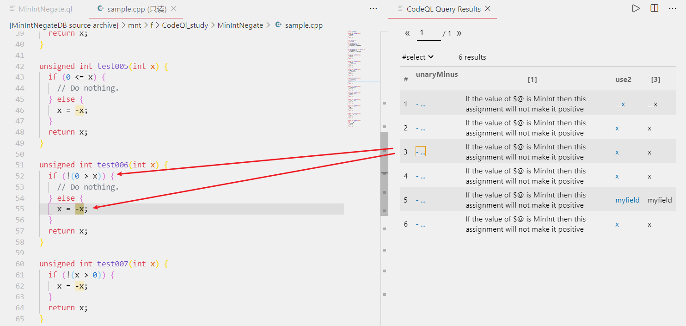
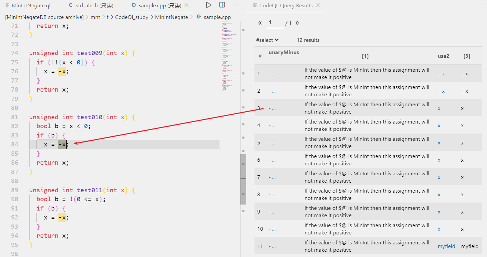
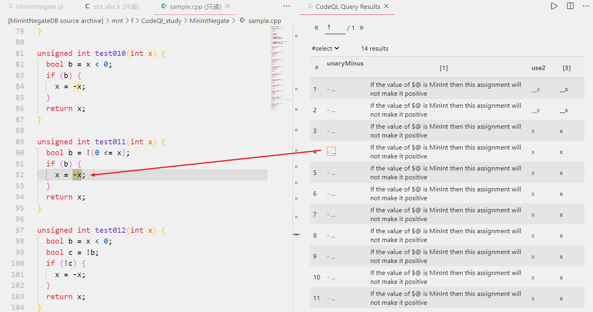
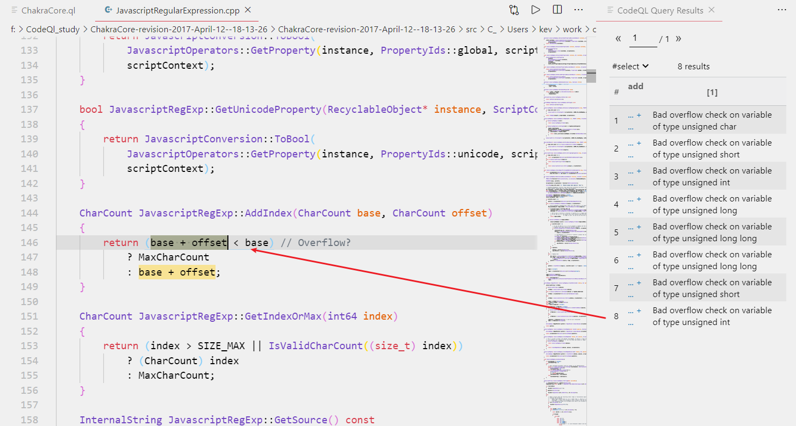
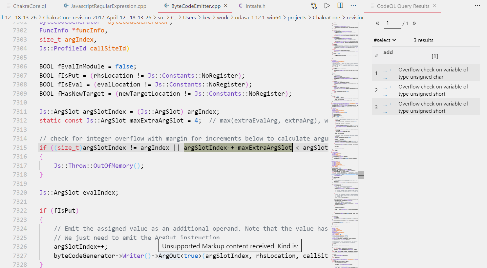
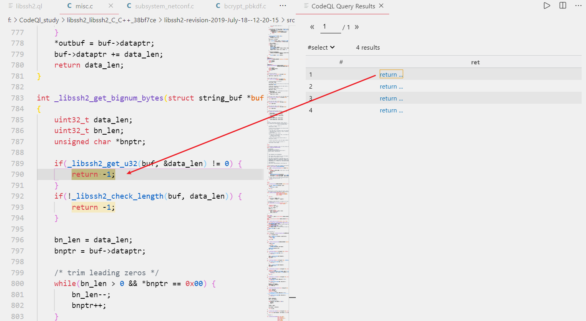
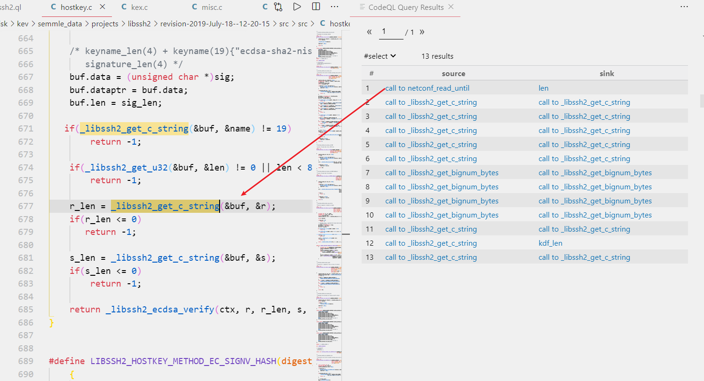
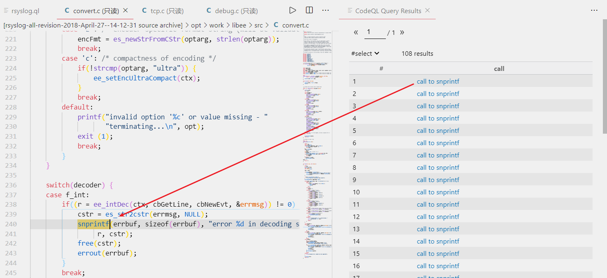
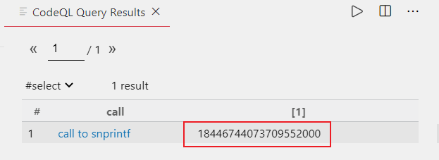

# 根据GitHub_Security_Lab上的例子学习CodeQL

## MinIntNegate

示例ql下载地址：https://github.com/github/securitylab/tree/main/CodeQL_Queries/cpp/MinIntNegate

数据库下载地址：https://github.com/github/securitylab/blob/main/CodeQL_Queries/cpp/MinIntNegate/test.cpp

### 漏洞原理：

这个例子里面包含了8个ql，对应每个ql应对不同的请款，但是具体都是应对一种漏洞，漏洞成因如下，在下面的代码中我们可以看到这里首先会检测x是不是小于0，如果小于零就把他给变成正数，但是如果说当x的值为0x80000000时，这时候改变x的符号不会真的改变x的正负，也就是说x的值还是为0x80000000，然而这里我们对应的返回值类型是无符号类型，那么返回的值就会是一个很大的正数

```
unsigned int test000(int x) {
  if (x < 0) {
    x = -x;
  }
  return x;
}
```

### 编写ql：

**第一种：**首先我们需要准确的描述我们需要的条件，越详细越好，我们首先根据例子里的ql来分析一下ql里面都限制了哪些条件，23行取表达式的左值并且左值需要是一个变量，24行取表达式的右值并且右值的值应该为0，25行这里是确保表达式中包含逻辑运算(对应操作的变量叫做基本块)，26行基本块需要只被一元操作符操作(基本块就是操作的变量)，27行确保基本块是被一元操作符操作的同时还需要是一个变量。至此我们可以看到这段ql把对应要检索的信息描述的已经很详细了，有5个限制条件，然后我们对应的也可以看一下他的查询结果，他查到4个结果(第一个结果是标准库中的)

```
/**
 * @name 00_MinIntNegate
 * @description Negating MIN_INT is an integer overflow
 * @kind problem
 * @id cpp/min-int-negate
 * @problem.severity warning
 */

import cpp
import semmle.code.cpp.controlflow.Guards

// Find this pattern:
//
// ```
// if (x < 0) {
//   x = -x;
// }
// ```
//
// If the value of `x` is `0x80000000` then this will not make the value of `x` positive.
from GuardCondition guard, BasicBlock block, UnaryMinusExpr unaryMinus, Variable v, Expr use
where
  guard.(LTExpr).getLeftOperand() = v.getAnAccess() and
  guard.(LTExpr).getRightOperand().getValue().toInt() = 0 and
  guard.controls(block, true) and
  block.contains(unaryMinus) and
  unaryMinus.getOperand() = v.getAnAccess()
select unaryMinus, "If the value of $@ is MinInt then this assignment will not make it positive", v,
  v.getName()
```


**第二种：**第一种查询到的结果并不是我们都想要的，因为漏洞需要是左右是同一个变量，而返回的结果中只有一个`s->myfield = -t->myfield`，并且对应第一种查到的结果包括结构体的成员的操作，如果说我们仅仅想查询关于本地的局部变量，不想查询需要经过结构体指引的局部变量，那么我们只需要把第一个ql中v的类型改成,LocalScopeVariable，这样就可以确保我们查询到的变量只为LocalScopeVariable类型，看一下查询到的结果，我们可以发现现再只能查询到2个结果了

```
/**
 * @name 01_MinIntNegate
 * @description Negating MIN_INT is an integer overflow
 * @kind problem
 * @id cpp/min-int-negate
 * @problem.severity warning
 */

import cpp
import semmle.code.cpp.controlflow.Guards

// The previous query had an incorrect result at test.cpp, line 20:
//
//   if (s->myfield < 0) {
//     s->myfield = -t->myfield;
//   }
//
// The problem is that the query used `Variable`, which includes fields.
// So here we restrict the query to use `LocalScopeVariable` instead.
from
  GuardCondition guard, BasicBlock block, UnaryMinusExpr unaryMinus, LocalScopeVariable v, Expr use
where
  guard.(LTExpr).getLeftOperand() = v.getAnAccess() and
  guard.(LTExpr).getRightOperand().getValue().toInt() = 0 and
  guard.controls(block, true) and
  block.contains(unaryMinus) and
  unaryMinus.getOperand() = v.getAnAccess()
select unaryMinus, "If the value of $@ is MinInt then this assignment will not make it positive", v,
  v.getName()
```


**第三种：**虽然经过了第二种ql的过滤，过滤掉了`s->myfield = -t->myfield`这种情况，但是同时他也把`s->myfield = -s->myfield`这种我们需要查询到的情况也过滤掉了，为了解决这个问题我们还需要对我们的ql进行优化，我们可以发现s->myfield它不属于局部变量，它属于一个全局变量，那这样的话我们也可以使用全局变量来查询，然后让表达式左右的变量是相等的即可，改进后的ql可以插到如下结果

```
/**
 * @name 02_MinIntNegate
 * @description Negating MIN_INT is an integer overflow
 * @kind problem
 * @id cpp/min-int-negate
 * @problem.severity warning
 */

import cpp
import semmle.code.cpp.controlflow.Guards
import semmle.code.cpp.valuenumbering.GlobalValueNumbering

// The previous query, 01_MinIntNegate, eliminated a bad result
// from 00_MinIntNegate, but it also lost a good result.
// The missing result is test.cpp, line 14:
//
//   if (s->myfield < 0) {
//     s->myfield = -s->myfield;
//   }
//
// The problem is that `s->myfield` is not a `LocalScopeVariable`.
// The solution is to use the GlobalValueNumbering library, which
// is a more general way to find expressions that compute the same
// value.
from GuardCondition guard, BasicBlock block, UnaryMinusExpr unaryMinus, Expr use1, Expr use2
where
  guard.(LTExpr).getLeftOperand() = use1 and
  guard.(LTExpr).getRightOperand().getValue().toInt() = 0 and
  guard.controls(block, true) and
  block.contains(unaryMinus) and
  unaryMinus.getOperand() = use2 and
  globalValueNumber(use1) = globalValueNumber(use2)
select unaryMinus, "If the value of $@ is MinInt then this assignment will not make it positive",
  use2, use2.toString()
```


**第四种：**现再我们可以查到左右值变量相同，然后右值是被一个一元操作符操作，但是我们还是可以发现我们第三种的ql只能查到x<0的情况，大于0的情况以及其它情况都查询不到，所以我们还需要进行一下改进，这里我们自定义一个谓词来实现这个操作，谓词中就是要包括大于和等于两种情况，然后根据传进去的变量来决定具体大于和小于比较的内容，改进后的ql如下，查询到的结果如下，可以看到我们现再也就可以查询到0>x这种情况了

```
/**
 * @name 03_MinIntNegate
 * @description Negating MIN_INT is an integer overflow
 * @kind problem
 * @id cpp/min-int-negate
 * @problem.severity warning
 */

import cpp
import semmle.code.cpp.controlflow.Guards
import semmle.code.cpp.valuenumbering.GlobalValueNumbering

// The previous query only worked for `x < 0` and not for the
// equivalent `0 > x`. It's easier to handle both if we refactor
// the logic into a separate predicate.

/** Holds if `cond` is a comparison of the form `lhs < rhs`. */
predicate lessThan(Expr cond, Expr lhs, Expr rhs) {
  cond.(LTExpr).getLeftOperand() = lhs and
  cond.(LTExpr).getRightOperand() = rhs
  or
  cond.(GTExpr).getLeftOperand() = rhs and
  cond.(GTExpr).getRightOperand() = lhs
}

from
  GuardCondition guard, BasicBlock block, UnaryMinusExpr unaryMinus, Expr use1, Expr use2, Expr zero
where
  lessThan(guard, use1, zero) and
  zero.getValue().toInt() = 0 and
  guard.controls(block, true) and
  block.contains(unaryMinus) and
  unaryMinus.getOperand() = use2 and
  globalValueNumber(use1) = globalValueNumber(use2)
select unaryMinus, "If the value of $@ is MinInt then this assignment will not make it positive",
  use2, use2.toString()
```



**第五种：**现再我们支持了大于和小于，那我们也可以把大于等于和小于等于加进来，只需要修改一下谓词里面的内容即可，改进后的ql查询结果如下，但是我们可以发现我们查询得到的结果和之前是一样的，初步判断我们的ql是有问题的，还需要改进

```
/**
 * @name 04_MinIntNegate
 * @description Negating MIN_INT is an integer overflow
 * @kind problem
 * @id cpp/min-int-negate
 * @problem.severity warning
 */

import cpp
import semmle.code.cpp.controlflow.Guards
import semmle.code.cpp.valuenumbering.GlobalValueNumbering

// Let's also add support for <= and >=.

/**
 * Holds if `cond` is a comparison of the form `lhs < rhs`.
 * `isStrict` is true for < and >, and false for <= and >=.
 */
predicate lessThan(Expr cond, Expr lhs, Expr rhs, boolean isStrict) {
  cond.(LTExpr).getLeftOperand() = lhs and
  cond.(LTExpr).getRightOperand() = rhs and
  isStrict = true
  or
  cond.(GTExpr).getLeftOperand() = rhs and
  cond.(GTExpr).getRightOperand() = lhs and
  isStrict = true
  or
  cond.(LEExpr).getLeftOperand() = lhs and
  cond.(LEExpr).getRightOperand() = rhs and
  isStrict = false
  or
  cond.(GEExpr).getLeftOperand() = rhs and
  cond.(GEExpr).getRightOperand() = lhs and
  isStrict = false
}

from
  GuardCondition guard, BasicBlock block, UnaryMinusExpr unaryMinus, Expr use1, Expr use2, Expr zero
where
  lessThan(guard, use1, zero, _) and
  zero.getValue().toInt() = 0 and
  guard.controls(block, true) and
  block.contains(unaryMinus) and
  unaryMinus.getOperand() = use2 and
  globalValueNumber(use1) = globalValueNumber(use2)
select unaryMinus, "If the value of $@ is MinInt then this assignment will not make it positive",
  use2, use2.toString()
```


**第六种：**这里会使用一个递归谓词，但是这个谓词是怎么工作，以及怎么停止的我搞了好久都没搞懂，后来去搜了下github，github上面有相关的issue，他这里面解释道，谓词其实是相当于类似于元组一样的东西，他判断递归什么时候停止，是通过判断这个元组的内容是否还在改变，如果在改变证明还需要进行，如果没有改变则停止进行，对应例子里面的ql，也就是当branch不再改变的时候就停止进行了 ，然后我们就可以根据branch的结果来做后续的操作。再回到这个ql上面来，光知道这些但是不会写也不行，下面我们分析一下这个递归谓词应该怎么写，不过我们也需要先知道为什么之前的ql是不能查询到更多的信息的，这里是因为在我们之前的ql中查询的是x<=0和x>=0这两种情况，而我们的示例数据库中是0<=x这样的情况，那么我们就需要递归调用一下，把左操作数和右操作数调换一下，然后再调用一遍查询的谓词，这样就可以查询到0<=x这种情况了，对应ql中还是会存在些疑问，我的疑问在于递归调用的第一句`branch = true and lessThan(cond, lhs, rhs, isStrict) `这里lessThan这个谓词对应没有返回值为什么要让他和true进行and一次，后来我想了一下，这里仅仅只是为了调用它，才这样写，然后这个谓词会修改isStrict的值，然后再次递归调用的时候，作为下次传的参数，然后递归调用的时候就可以找到0<=x这种情况了，然后还有就是这个谓词没有使用result来存返回值，而是使用参数才存返回值，后续再使用这个参数来做为判断依据，来做后续的操作。

github文章地址：https://github.com/github/securitylab/discussions/85

```
/**
 * @name 05_MinIntNegate
 * @description Negating MIN_INT is an integer overflow
 * @kind problem
 * @id cpp/min-int-negate
 * @problem.severity warning
 */

import cpp
import semmle.code.cpp.controlflow.Guards
import semmle.code.cpp.valuenumbering.GlobalValueNumbering

// The previous query added support for <= and >=, but failed to
// find any new results. That's because the comparison is 0 <= x,
// so the operands are the wrong way around. We can solve this by
// adding a recursive predicate which swaps them.

/**
 * Holds if `cond` is a comparison of the form `lhs < rhs`.
 * `isStrict` is true for < and >, and false for <= and >=.
 */
predicate lessThan(Expr cond, Expr lhs, Expr rhs, boolean isStrict) {
  cond.(LTExpr).getLeftOperand() = lhs and
  cond.(LTExpr).getRightOperand() = rhs and
  isStrict = true
  or
  cond.(GTExpr).getLeftOperand() = rhs and
  cond.(GTExpr).getRightOperand() = lhs and
  isStrict = true
  or
  cond.(LEExpr).getLeftOperand() = lhs and
  cond.(LEExpr).getRightOperand() = rhs and
  isStrict = false
  or
  cond.(GEExpr).getLeftOperand() = rhs and
  cond.(GEExpr).getRightOperand() = lhs and
  isStrict = false
}

/**
 * Holds if `cond` is a comparison of the form `lhs < rhs`.
 * `isStrict` is true for < and >, and false for <= and >=.
 * `branch` is true if the comparison is true and false if it is not.
 */
predicate lessThanWithNegate(Expr cond, Expr lhs, Expr rhs, boolean isStrict, boolean branch) {
  branch = true and lessThan(cond, lhs, rhs, isStrict)
  or
  // (x < y) == !(y <= x)
  lessThanWithNegate(cond, rhs, lhs, isStrict.booleanNot(), branch.booleanNot())
}

from
  GuardCondition guard, BasicBlock block, UnaryMinusExpr unaryMinus, Expr use1, Expr use2,
  Expr zero, boolean branch
where
  lessThanWithNegate(guard, use1, zero, _, branch) and
  zero.getValue().toInt() = 0 and
  guard.controls(block, branch) and
  block.contains(unaryMinus) and
  unaryMinus.getOperand() = use2 and
  globalValueNumber(use1) = globalValueNumber(use2)
select unaryMinus, "If the value of $@ is MinInt then this assignment will not make it positive",
  use2, use2.toString()
```


**第七种：**现再我们可以找到大于小于和大于等于小于等于了，但是还是会有一个问题，就是大于等于和小于等于这个表达式不在if语句里，而是在之前把这个表达式的结果存在了一个布尔变量里面，然后if语句里面判断的是布尔变量，这种情况，我们还是检测不到，那么我们现再就需要再进行改进，改进的方法就是使用数据流追踪加递归，我们使用数据流追踪，找到所有使用大于小于和大于等于小于等于的地方，然后对他进行追踪，如果说其是普通的表达式那么追踪的就是这个表达式，如果说其把表达式的结果赋给了一个变量那么追踪的就是这个变量，这样的话我们就可以找到我们想要的情况了

```
/**
 * @name 06_MinIntNegate
 * @description Negating MIN_INT is an integer overflow
 * @kind problem
 * @id cpp/min-int-negate
 * @problem.severity warning
 */

import cpp
import semmle.code.cpp.controlflow.Guards
import semmle.code.cpp.valuenumbering.GlobalValueNumbering
import semmle.code.cpp.dataflow.DataFlow

// Let's add local dataflow, so that we can also handle cases like this:
//
// ```
// bool b = x < 0;
// if (b) {
//   x = -x;
// }
// ```

/**
 * Holds if `cond` is a comparison of the form `lhs < rhs`.
 * `isStrict` is true for < and >, and false for <= and >=.
 */
predicate lessThan(Expr cond, Expr lhs, Expr rhs, boolean isStrict) {
  cond.(LTExpr).getLeftOperand() = lhs and
  cond.(LTExpr).getRightOperand() = rhs and
  isStrict = true
  or
  cond.(GTExpr).getLeftOperand() = rhs and
  cond.(GTExpr).getRightOperand() = lhs and
  isStrict = true
  or
  cond.(LEExpr).getLeftOperand() = lhs and
  cond.(LEExpr).getRightOperand() = rhs and
  isStrict = false
  or
  cond.(GEExpr).getLeftOperand() = rhs and
  cond.(GEExpr).getRightOperand() = lhs and
  isStrict = false
}

/**
 * Holds if `cond` is a comparison of the form `lhs < rhs`.
 * `isStrict` is true for < and >, and false for <= and >=.
 * `branch` is true if the comparison is true and false if it is not.
 */
predicate lessThanWithNegate(Expr cond, Expr lhs, Expr rhs, boolean isStrict, boolean branch) {
  branch = true and lessThan(cond, lhs, rhs, isStrict)
  or
  // (x < y) == !(y <= x)
  lessThanWithNegate(cond, rhs, lhs, isStrict.booleanNot(), branch.booleanNot())
  or
  // bool b = x < 0;
  // if (b) { ... }
  exists(Expr prev |
    DataFlow::localExprFlow(prev, cond) and
    lessThanWithNegate(prev, lhs, rhs, branch, isStrict)
  )
}

from
  GuardCondition guard, BasicBlock block, UnaryMinusExpr unaryMinus, Expr use1, Expr use2,
  Expr zero, boolean branch
where
  lessThanWithNegate(guard, use1, zero, _, branch) and
  zero.getValue().toInt() = 0 and
  guard.controls(block, branch) and
  block.contains(unaryMinus) and
  unaryMinus.getOperand() = use2 and
  globalValueNumber(use1) = globalValueNumber(use2)
select unaryMinus, "If the value of $@ is MinInt then this assignment will not make it positive",
  use2, use2.toString()
```



**第八种：**现再就只剩下最后两种情况了，在最后一种情况的基础上，又发生了一些改变例如这样`b = !(0 <= x)`，然而我们之前的数据流是只能追踪到`b = (0 <= x)`这种情况的，要是想要可以追踪到这种情况，那我们就需要先判断一下这个表达式是不是属于`!x`这种类型的，如果说是这种类型的，那么递归，然后递归传参的时候需要把!去掉，然后传x的内容，如果说x的内容符合之前的小于大于小于等于大于等于那么就可以找到`b = !(0 <= x)`这种情况了

```
/**
 * @name 07_MinIntNegate
 * @description Negating MIN_INT is an integer overflow
 * @kind problem
 * @id cpp/min-int-negate
 * @problem.severity warning
 */

import cpp
import semmle.code.cpp.controlflow.Guards
import semmle.code.cpp.valuenumbering.GlobalValueNumbering
import semmle.code.cpp.dataflow.DataFlow

// The guards library automatically handles negations like this for us:
//
// ```
// if (!(x < 0)) {
//   // Do nothing.
// } else {
//   x = -x;
// }
// ```
//
// But it does not handle cases where dataflow is involved. For example:
//
// ```
// bool b = !(0 <= x);
// if (b) {
//   x = -x;
// }
// ```
//
// It's easy to fix by adding one more recursive clause to `lessThanWithNegate`.

/**
 * Holds if `cond` is a comparison of the form `lhs < rhs`.
 * `isStrict` is true for < and >, and false for <= and >=.
 */
predicate lessThan(Expr cond, Expr lhs, Expr rhs, boolean isStrict) {
  cond.(LTExpr).getLeftOperand() = lhs and
  cond.(LTExpr).getRightOperand() = rhs and
  isStrict = true
  or
  cond.(GTExpr).getLeftOperand() = rhs and
  cond.(GTExpr).getRightOperand() = lhs and
  isStrict = true
  or
  cond.(LEExpr).getLeftOperand() = lhs and
  cond.(LEExpr).getRightOperand() = rhs and
  isStrict = false
  or
  cond.(GEExpr).getLeftOperand() = rhs and
  cond.(GEExpr).getRightOperand() = lhs and
  isStrict = false
}

/**
 * Holds if `cond` is a comparison of the form `lhs < rhs`.
 * `isStrict` is true for < and >, and false for <= and >=.
 * `branch` is true if the comparison is true and false if it is not.
 */
predicate lessThanWithNegate(Expr cond, Expr lhs, Expr rhs, boolean isStrict, boolean branch) {
  branch = true and lessThan(cond, lhs, rhs, isStrict)
  or
  // (x < y) == !(y <= x)
  lessThanWithNegate(cond, rhs, lhs, isStrict.booleanNot(), branch.booleanNot())
  or
  // (!(x < y) == branch)  ==  ((x < y) == !branch)
  lessThanWithNegate(cond.(NotExpr).getOperand(), lhs, rhs, isStrict, branch.booleanNot())
  or
  // bool b = x < 0;
  // if (b) { ... }
  exists(Expr prev |
    DataFlow::localExprFlow(prev, cond) and
    lessThanWithNegate(prev, lhs, rhs, branch, isStrict)
  )
}

from
  GuardCondition guard, BasicBlock block, UnaryMinusExpr unaryMinus, Expr use1, Expr use2,
  Expr zero, boolean branch
where
  lessThanWithNegate(guard, use1, zero, _, branch) and
  zero.getValue().toInt() = 0 and
  guard.controls(block, branch) and
  block.contains(unaryMinus) and
  unaryMinus.getOperand() = use2 and
  globalValueNumber(use1) = globalValueNumber(use2)
select unaryMinus, "If the value of $@ is MinInt then this assignment will not make it positive",
  use2, use2.toString()
```



## ChakraCore-bad-overflow-check

示例ql下载地址：https://github.com/github/securitylab/tree/main/CodeQL_Queries/cpp/ChakraCore-bad-overflow-check

数据库下载地址：https://downloads.lgtm.com/snapshots/cpp/microsoft/chakracore/ChakraCore-revision-2017-April-12--18-13-26.zip

### 漏洞原理：

这个漏洞也是和整数溢出有关系的，这个整数溢出是在错误使用类型转换的时候所导致的，如果说我们使用两个无符号的16位数进行相加操作，将相加后得到的结果和这两个16位数其中的一个做对比，如果把这两个操作合并到一块，像下面这样，这样会导致比较的时候自动将x+y的结果扩展到32位，并且这个比较会永远为false

```
bool checkOverflow(unsigned short x, unsigned short y) {
  // BAD: comparison is always false due to type promotion
  return (x + y < x);  
}
```

这里要是想出发漏洞那么我们就需要加上一个类型转换的语句，像下面这样，这样比较的时候就不会x+y的结果就不会扩展到32位，而还是会以16位来进行比较，这个时候如果x+y的值大于了16位的上限那么就可以溢出了，也就是说return可以返回true了

```
bool checkOverflow(unsigned short x, unsigned short y) {
  return ((unsigned short)(x + y) < x);  // GOOD: explicit cast
}
```

### 编写ql：

**tips：**这里我们查询的是第一种没有使用unsigned short显式类型转换的那一种情况

**第一步：**首先我们需要看一下这个漏洞的限制条件，首先得是有加法和小于的比较，那么我们就先过滤出符合这两个条件的地方，在下面定义的谓词中，我们使用getAnOperand来获取操作符左右两侧的内容，并且我们使用RelationalOperation这个类型就已经限制了必须为包含比较，然后左右两侧一侧需要为变量，一侧需要为加法的表达式，然后加法操作符的左右两侧也需要是变量，对应ql如下

```
import cpp

/** Matches `var < var + ???`. */
predicate overflowCheck(LocalScopeVariable var, AddExpr add, RelationalOperation compare) {
  compare.getAnOperand() = var.getAnAccess() and
  compare.getAnOperand() = add and
  add.getAnOperand() = var.getAnAccess()
}

from LocalScopeVariable var, AddExpr add
where overflowCheck(var, add, _)
select add, "Overflow check on variable of type " + var.getUnderlyingType()
```



**第二步：**下面我们就需要进一步的添加限制条件了，首先就是关于操作数的位数，位数应该是需要小于16位的，所以改进后的ql如下

```
import cpp

/** Matches `var < var + ???`. */
predicate overflowCheck(LocalScopeVariable var, AddExpr add, RelationalOperation compare) {
  compare.getAnOperand() = var.getAnAccess() and
  compare.getAnOperand() = add and
  add.getAnOperand() = var.getAnAccess()
}

from LocalScopeVariable var, AddExpr add
where overflowCheck(var, add, _)
  and var.getType().getSize() < 4
  and not add.getConversion+().getType().getSize() < 4
select add, "Bad overflow check on variable of type " + var.getUnderlyingType()
```



**第三步：**还剩下最后一个限制条件了，这里我们只需要限制它不使用显示类型转换即可或者使用了显示类型转换但是转换后的位数是大于等于32的也可以，把这个限制条件加上之后就可以找到我们想要的地方了，改进后的ql如下

```
import cpp

/** Matches `var < var + ???`. */
predicate overflowCheck(LocalScopeVariable var, AddExpr add, RelationalOperation compare) {
  compare.getAnOperand() = var.getAnAccess() and
  compare.getAnOperand() = add and
  add.getAnOperand() = var.getAnAccess()
}

from LocalScopeVariable var, AddExpr add
where overflowCheck(var, add, _)
  and var.getType().getSize() < 4
  and not add.getConversion+().getType().getSize() < 4
select add, "Bad overflow check on variable of type " + var.getUnderlyingType()
```


最后我们还可以把ql改成这样，也可以得到相同的结果：

```
import cpp

predicate isSmall(Expr e) {
  e.getType().getSize() < 4
}

from AddExpr a, Variable v, RelationalOperation cmp
where a.getAnOperand() = v.getAnAccess()
  and cmp.getAnOperand() = a
  and cmp.getAnOperand() = v.getAnAccess()
  and forall(Expr op | op = a.getAnOperand() | isSmall(op))
  and not isSmall(a.getExplicitlyConverted())
select cmp, "Bad overflow check"
```

## **libssh2_eating_error_codes**

示例ql下载地址：https://github.com/github/securitylab/tree/main/CodeQL_Queries/cpp/libssh2_eating_error_codes

数据库下载地址：https://downloads.lgtm.com/snapshots/cpp/libssh2/libssh2_libssh2_C_C++_38bf7ce.zip

### 漏洞原理：

**漏洞描述的两篇文章链接如下：**

https://github.com/Semmle/SecurityExploits/tree/446048470633bf0f8da9570d008d056dbaa28ea9/libssh2/out_of_bounds_read_kex_CVE-2019-13115

https://blog.semmle.com/libssh2-integer-overflow/

这是漏洞相关代码，这里_libssh2_check_length函数主要的目的是用来检测len是不是合法的，但是这里使用了显式的类型转换int，这就造成了一个可以利用的点，就是当`buf->len-len`的值为逻辑上的负数时，再经过int类型转换后就会变成一个很大的值，从而使得检查返回1即正确，刚才说的逻辑上的负数的意思就是，我们以人类的思维去运算的时候(正常的现实情况下)得到的结果应该是一个负数，但是计算机算的时候却是正数(因为这里`buf->len-len`两个都为无符号数，所以在没有类型转换之前，计算得到的结果都是为正的)。回到漏洞这里来，如果说我们让len的值大于等于`buf->len+0x80000000`，那么

```
int _libssh2_check_length(struct string_buf *buf, size_t len)
{
    return ((int)(buf->dataptr - buf->data) <= (int)(buf->len - len)) ? 1 : 0;
}
```

同样我们也可以写一个简单的poc，来验证一下，如下图所示，可以看到输出的值为一个很大的正数


但是这个漏洞再文章作者发现之前就被修复了，不过它利用这个模式寻找到了新的漏洞，之前的思想也就是通过返回值使check为true，即越过检测，同样我们可以发现一个新的漏洞模式，新的模式就是当一个函数的返回值为-1，然后会有一个无符号类型的变量存储这个返回值，之后还会有一个check，是直接检测这个无符号类型的变量，并且检测的条件是这个变量是小于等于0的。到这里漏洞显而易见，就是无符号类型的-1会变成一个很大的数，也就意味着小于等于0的检测可以绕过

### 编写ql：

**第一步：**搞明白了漏洞的原理，我们就可以开始写ql了，第一步就是我们应该找到所有return的地方，对应ql如下

```
/**
 * @name 00_error_codes
 */

import cpp

// Look for return statements that return a negative integer constant.
// For example:
//
//   return -1;
//
// The negative return value might be an error code.
from ReturnStmt ret
where ret.getExpr().getValue().toInt() < 0
select ret
```


**第二步：**只找到return的地方是不够的，我们的需求是return的值应该是-1，然后继续改进ql

```
/**
 * @name 01_error_codes_call
 */

import cpp

// Extend the previous query to also find calls to functions that sometimes
// return a negative integer constant.
from FunctionCall call, ReturnStmt ret
where
  ret.getExpr().getValue().toInt() < 0 and
  call.getTarget() = ret.getEnclosingFunction()
select ret, call
```


**第三步：**下面就是对应这个函数的返回值应该是需要被转换成无符号类型的，只有转换成了无符号类型才有可能过了检测

```
/**
 * @name 02_eating_error_codes
 */

import cpp

// Look for calls that are cast to unsigned, which means that the error
// code might be accidentally ignored.
from FunctionCall call, ReturnStmt ret
where
  ret.getExpr().getValue().toInt() < 0 and
  call.getTarget() = ret.getEnclosingFunction() and
  call.getFullyConverted().getType().getUnderlyingType().(IntegralType).isUnsigned()
select call, ret
```



**第四步：**上一步中只是检测这个函数调用中存在无符号类型转换这种情况的，但是我们对应是需要把返回值赋给一个变量的，就需要改进ql

```
/**
 * @name 03_eating_error_codes_localflow
 */

import cpp
import semmle.code.cpp.dataflow.DataFlow

// The previous query only handled cases where the result of the function
// call is immediately cast to unsigned. So it will fail to detect examples
// like this, where the cast doesn't happen immediately:
//
//   int r = f();
//   unsigned int x = r;
//
// In this query, we add local dataflow so that we can also handle such
// cases.
from FunctionCall call, ReturnStmt ret, DataFlow::Node source, DataFlow::Node sink
where
  ret.getExpr().getValue().toInt() < 0 and
  call.getTarget() = ret.getEnclosingFunction() and
  source.asExpr() = call and
  DataFlow::localFlow(source, sink) and
  sink.asExpr().getFullyConverted().getType().getUnderlyingType().(IntegralType).isUnsigned()
select source, sink
```


**第五步：**在刚才的上一步里，我们可以看到查询结果有好多，不过我们应该追踪一下源头流向的地方，流向的地方应该确保他是可以接受负数的，因为只有可以接受负数那它才可以确保可以绕过检测

```
/**
 * @name 04_eating_error_codes_localflow_rangeanalysis
 */

import cpp
import semmle.code.cpp.dataflow.DataFlow
import semmle.code.cpp.rangeanalysis.SimpleRangeAnalysis

// The previous query produced some weird results. The problem is that it
// treats any expression with an unsigned type as a potential sink. What we
// really want is to find where the cast from signed to unsigned happens,
// because that's where the integer overflow occurs. So we want the sink to
// be a potentially negative expression that gets cast to unsigned.
//
// Note that by using range analysis, we can avoid producing false positive
// results for examples like this:
//
//   int r = f();
//   if (r < 0) return -1;
//   unsigned int x = r;
from FunctionCall call, ReturnStmt ret, DataFlow::Node source, DataFlow::Node sink
where
  ret.getExpr().getValue().toInt() < 0 and
  call.getTarget() = ret.getEnclosingFunction() and
  source.asExpr() = call and
  DataFlow::localFlow(source, sink) and
  sink.asExpr().getFullyConverted().getType().getUnderlyingType().(IntegralType).isUnsigned() and
  lowerBound(sink.asExpr()) < 0
select source, sink
```



## rsyslog_CVE-2018-1000140

示例ql下载地址：https://github.com/github/securitylab/tree/main/CodeQL_Queries/cpp/rsyslog_CVE-2018-1000140

数据库下载地址：https://downloads.lgtm.com/snapshots/cpp/rsyslog/rsyslog/rsyslog-all-revision-2018-April-27--14-12-31.zip

### 漏洞原理：

漏洞主要是因为对snprintf的参数使用不当导致的，snprintf函数原型如下：

```
int snprintf(char *str, size_t size, const char *format, ...);
```

如果说我们使用的格式化字符串为"%s"，然后在后面的参数中传了一个很长的字符串进去(大于size)，那么多余的部分虽然会被截止掉，但是snprintf的返回值并不是size而是参数中字符串的长度。所以当我们这样使用snprintf的时候就有可能会造成溢出：

```
#include <stdio.h>

#define BUF_SIZE (32)
int main(int argc, char *argv[])
{
        char buffer[BUF_SIZE];
        size_t pos = 0;
        int i;
        for (i = 0; i < argc; i++)
        {
                pos += snprintf(buffer + pos, BUF_SIZE - pos, "%s", argv[i]);
                        // BUF_SIZE - pos may overflow
        }
}
```

可以看到pos加几次是由我们传进去的参数个数来决定的，如果说我们第一次传的字符串长度是33，那么下一次计算BUF_SIZE-pos的时候就会得到-1这个值，对应第二个参数的类型size_t是无符号类型，那么-1就会被当作无符号数的0xfffffffff，那么我二个参数就可以越界写很多的内容了

### 编写ql：

**第一步：**根据github上给的示例和这个漏洞成因，我们第一步的工作显而易见就是要找到，调用snprintf函数的地方，对应的ql如下：

```
import cpp

/*
 * Find all calls to `snprintf`.
 *
 * Note: you could do this first step with grep. However,
 * grep is less good because it doesn't know about macros.
 * For example, curl does this:
 *
 *   https://github.com/curl/curl/blob/87501e57f1c166cb250111af54e0470ab8b2099c/lib/curl_printf.h#L42
 */
from FunctionCall call
where call.getTarget().getName() = "snprintf"
select call
```

这个ql可以得到如下图这样的结果：



**第二步：**我们现再得到了调用snprintf函数的地方，下面就需要再进行过滤了，对应看一下漏洞成因，我们需要确保有对应的变量来存储snprintf的返回值，因为只有变量存储了这个返回值并且又使用了这个返回值才能造成漏洞的产生，所以我们需要改进ql成下面这样：

```
import cpp

/*
 * Only code that uses the result of snprintf might be vulnerable.
 * So restrict the results to those where snprintf is not used
 * in a "void context".
 */
from FunctionCall call
where call.getTarget().getName() = "snprintf"
and not call instanceof ExprInVoidContext
select call
```

这个ql可以得到如下图这样的结果：


**第三步：**我们还需要继续进行过滤，因为我们需要格式化字符串为%s，并且只能包含%s，这里我们就是用正则表达式来改进ql，改进后的ql如下所示：

```
import cpp

/*
 * Only calls to `snprintf` with `%s` in the format specifier
 * are likely to be vulnerable. This is because other format
 * specifiers, like `%d` can only change the length of the output
 * string by a few character, but `%s` can change it a lot.
 * A `%s` specifier is also much more likely to enable an attacker
 * to overwrite the stack or heap with working shellcode.
 */
from FunctionCall call
where call.getTarget().getName() = "snprintf"
and not call instanceof ExprInVoidContext
and call.getArgument(2).getValue().regexpMatch("(?s).*%s.*")
select call
```

这个ql可以得到如下图这样的结果：


**第四步：**现再我们已经可以过滤出调用带有返回值并且使用的格式化字符串为%s的snprintf函数了，只差触发漏洞的最后一步了，那就是这个返回值又一次作为了snprintf的第二个参数，所以我们根据这个条件过滤一下就可以了，这里利用到了codeql强大的数据流追踪功能，改进后的ql如下所示：

```
from FunctionCall call, DataFlow::Node source, DataFlow::Node sink
where call.getTarget().getName() = "snprintf"
and call.getArgument(2).getValue().regexpMatch("(?s).*%s.*")
and TaintTracking::localTaint(source, sink)
and source.asExpr() = call
and sink.asExpr() = call.getArgument(1)
select call
```

这个ql可以得到如下图这样的结果：


至此我们就已经可以发现这个漏洞了，可以从图中看到这里会有一个snprintf的返回值又被用作了snprintf的第二个参数，这里就形成了漏洞

**第五步：**这一步就是为了进一步的美化一下我们查询到的结果，这个ql可以帮我们预测我们可以越界的大小，改进后的ql如下：

```
import cpp
import semmle.code.cpp.rangeanalysis.SimpleRangeAnalysis
import semmle.code.cpp.dataflow.TaintTracking

/*
 * Use `SimpleRangeAnalysis` to find an upper bound for the size
 * argument. Here, we have just added the upperbound to the output,
 * but we could also use it to rule out code that does proper bounds
 * checking.
 *
 * Note: it can also be interesting to add the upperbound to the
 * query earlier in the sequence of queries, so that you can see
 * that it infers quite tight bounds for some of the calls.
 */
from FunctionCall call, DataFlow::Node source, DataFlow::Node sink
where call.getTarget().getName() = "snprintf"
and call.getArgument(2).getValue().regexpMatch("(?s).*%s.*")
and TaintTracking::localTaint(source, sink)
and source.asExpr() = call
and sink.asExpr() = call.getArgument(1)
select call, upperBound(call.getArgument(1).getFullyConverted())
```

这个ql可以得到如下图这样的结果：



**自己更改后的ql：**为了锻炼自己写ql的能力，所以自己重新写了一份，使用类的ql，如下所示：

```
/**
 * @kind path-problem
 */

import cpp
import semmle.code.cpp.rangeanalysis.SimpleRangeAnalysis
import semmle.code.cpp.dataflow.TaintTracking
import DataFlow::PathGraph

class SnprintfCall extends FunctionCall {
    SnprintfCall() {
        this.getTarget().getName() = "snprintf" and
        this.getArgument(2).getValue().regexpMatch("(?s).*%s.*")
    }
}

class SnprintfConfig extends TaintTracking::Configuration {
    SnprintfConfig() {this = "the return value of snprintf"}

    override predicate isSource(DataFlow::Node source){
        exists(SnprintfCall c | 
            source.asExpr() = c    
        )
    }

    override predicate isSink(DataFlow::Node sink){
        exists(SnprintfCall c | 
            sink.asExpr() = c.getArgument(1)
        )
    }
}

from DataFlow::PathNode source,DataFlow::PathNode sink, SnprintfConfig config
where config.hasFlowPath(source,sink)
select sink,source,sink,"the return value of snprintf"
```

查询的结果如下，并且可以很方便的找出返回值具体被用在了哪里：


