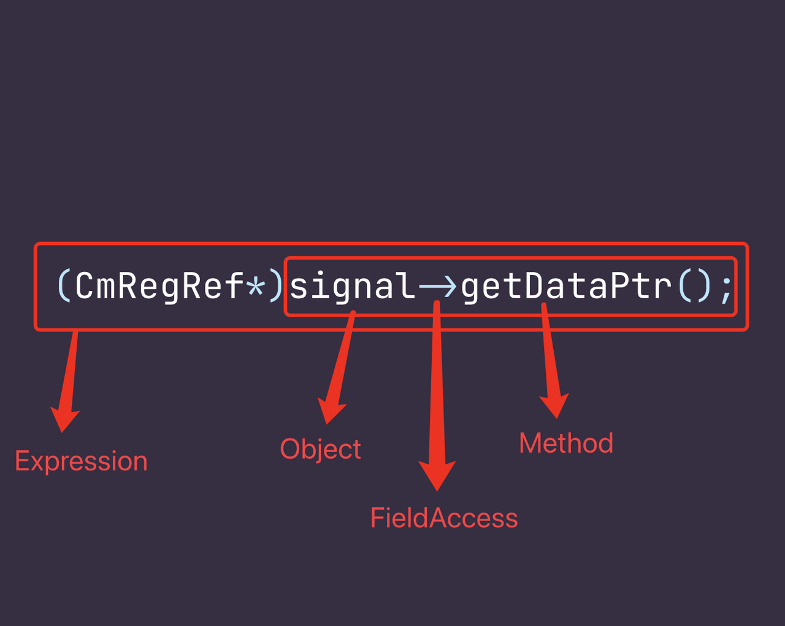
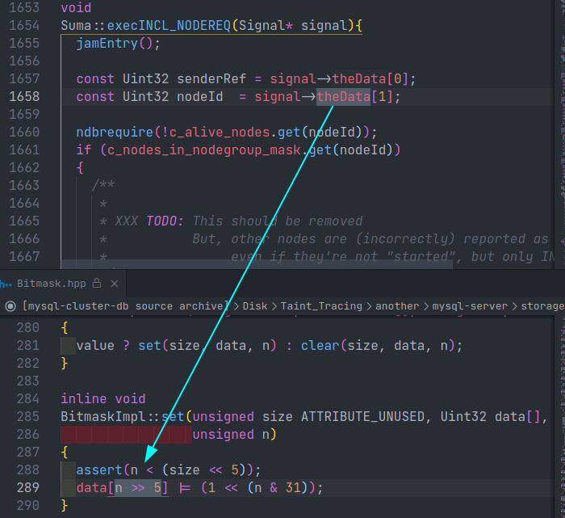

# Codeql 101

## TL;DR

在目前各种软件的漏洞报告中未对用户可控数据进行验证的漏洞中并不占少数，这类漏洞在研究者对项目不熟悉的时候很难挖掘到，在排除怀疑点时也会很吃力。Codeql 就可以很好的辅助分析对应的值是否为可控以及该值之前流经的路径，所以这篇文章会分析一下其他人使用 codeql 进行污点追踪的过程，然后实践写一个 ql 来进行污点追踪。

## Codeql

此段主要介绍一下 codeql 中 Dataflow 和 TaintTracking 库相关的内容。

使用下面的语句来导入 Dataflow 和 TaintTracking 库：

```sql
import semmle.code.cpp.dataflow.DataFlow
import semmle.code.cpp.dataflow.TaintTracking
```

需要通过重载 DataFlow 子类 DataFlow::Configuration 的 predicates 来自定义一个数据流。示例代码如下：

```sql
class RequestDataFlowConfiguration extends DataFlow::Configuration { 
    RequestDataFlowConfiguration() { this = "RequestDataFlowConfiguration" } 

    override predicate isSource(DataFlow::Node source) { 
        …
    }
 
    override predicate isSink(DataFlow::Node sink) { 
        …
    }

    override predicate isAdditionalFlowStep(DataFlow::Node node1, DataFlow::Node node2) { 
        …
    }

    override predicate isBarrier(DataFlow::Node node) { 
        …
    }
}
from DataFlow::Node source, DataFlow::Node sink 
where any(RequestDataFlowConfiguration c).hasFlow(source, sink) 
select 
    "Data flow from $@ to $@", 
    source, sink
```

类中的 predicates 含义如下：

- isSource：数据流的源头。
- isSink：数据流的终点。
- isAdditionalFlowSetp：数据也可从 node1 流向 node2 ，一般用来添加条件来过滤或者检测更多的数据流节点。
- isBarrier：数据流不能经过的节点。

污点追踪与数据流追踪类似，示例代码如下：

```sql
class RequestTaintTrackingConfiguration extends TaintTracking::Configuration { 
    RequestTaintTrackingConfiguration() { this = "RequestTaintTrackingConfiguration" } 

    override predicate isSource(DataFlow::Node source) { 
        …
    }
 
    override predicate isSink(DataFlow::Node sink) { 
        …
    }

    override predicate isAdditionalFlowStep(DataFlow::Node node1, DataFlow::Node node2) { 
        …
    }

    override predicate isSanitizer(DataFlow::Node node) { 
        …
    }
}
from DataFlow::PathNode source, DataFlow::PathNode sink 
where any(RequestTaintTrackingConfiguration c).hasFlow(source, sink) 
select 
    "Taint trace from $@ to $@", 
    source, sink
```

污点追踪有一个 predicate 是和数据流追踪不一样的，不过功能类似，数据流中的名字为 isBarrier 污点分析中的名字为 isSanitizer 。

- isSanitizer：被污染数据不能经过的节点。

## Vulnerability hunting with Semmle QL, part 1

### Target

这一小节我们分别要检测两种不同类型的漏洞，两种类型分别为错误整数溢出检查和不安全的使用 SafeInt 。

### Incorrect integer overflow checks

以下代码经常被用于检查无符号整数是否溢出：

```C
if (x + y < x) {
    // handle integer overflow
}
```

但是当 x 和 y 的类型为 unsigned short 时，上面的检测就会被绕过。x + y 虽然都是 16 位，但是在实际运行时编译器会自动将 x + y 的类型扩充成 32 位的 int 类型后再进行计算，也就导致计算后的结果和预期的溢出情况有出入。

接下来具体的解释一下如何写这个 ql 。首先我们要尽可能的详细描述一下要查询的语句，按从左往右的顺序来看这行代码，首先是一个 if ，然后判断条件是一个表达式，表达式左侧是一个加法表达式，表达式中间使用关系连接符，表达式右侧使用了表达式左侧加法表达式中的一个变量。

描述完成之后，就是将描述转换成 ql 。首先根据描述来确定我们都需要在 ql 中使用哪些变量，我们可以提取出加法表达式，关键链接符和变量这几个关键的信息。确定了变量之后我们就可以写出下面的 ql :

```sql
from AddExpr ae, Variable v, RelationalOperation ro
```

首先我们将关系表达式左侧为一个加法表达式以及右侧为左侧加法表达式中的一个变量转换成 ql ：

```sql
ae.getAnOperand() = v.getAnAccess() // 变量 v 是加法表达式 ae 中的一个操作数
and ro.getAnOperand() = v.getAnAccess() // 变量 v 是关系表达式 ro 中的一个操作数
and ro.getAnOperand() = ae // 加法表达式 ae 是关系表达式 ro 中的一个操作数
```

整个表达式基本就算是描述完了，之后需要描述的就是溢出的情况。首先我们需要确保 x + y 是 short 类型的，对应的 ql 如下所示：

```sql
// 循环遍历加法表达式 ae 的每一个操作数，确保每一个操作数的 size 是小于 4 的（类型为 short）
forall(Expr op| op = ae.getAnOperand() | op.getType().getSize() < 4)
```

现在我们将上面的 ql 组合起来就可以进行检测了，但是我们查询到的代码会有误报的情况，诸如 `(unsigned short)x + y < x` 这种代码，我们会检测到但是因为代码使用了显式类型转换也就避免了 short 转换成 int 这类的漏洞，所以我们需要将这种情况过滤掉。

```sql
// 过滤整形转换使加法表达式的结果小于 32 位的情况
not ae.getExplicitlyConverted().getType().getSize() < 4
```

完整 ql 如下：

```sql
import cpp

from AddExpr a, Variable v, RelationalOperation r
where ae.getAnOperand() = v.getAnAccess()
    and ro.getAnOperand() = v.getAnAccess()
    and ro.getAnOperand() = ae
    and forall(Expr op | op = ae.getAnOperand() | op.getType().getSize() < 4)
    and not ae.getExplicitlyConverted().getType().getSize() < 4
select ro, "Useless overflow check due to integral promotion"
```

### Unsafe use of SafeInt

C++ 有一个模板 SafeInt ，它可以检测整数是否溢出。但是不当的使用会导致检测失效，下面的代码分别对应检测有效与失效的场景：

```C++
valid:

int x, y, z;
z = SafeInt<int>x + y;

invalid:

int x, y, z;
z = SafeInt<int>(x + y);
```

上面的代码 valid 部分 x 和 y 都会被转换成 SafeInt<int> 类型，也就可以检测到整数溢出的情况；但是 invalid 部分 x 和 y 是在计算之后再转换成 SafeInt<int> 类型，但是 x + y 在计算之后就可能已经溢出了，也就是说 SafeInt<int> 转换的可能是一个已经溢出后的数，所以并不会检测到溢出的情况。

既然确定了漏洞成因，我们接下来就需要写一个 ql 来查询这种模式的漏洞。

和上面一样我们首先需要尽可能详细的描述漏洞代码。首先整体是使用 SafeInt 模板类型初始化一个对象，初始化参数为一个运算表达式。前面的描述就已经足够了，下面就是将描述转换成 ql 。

首先是使用 SafeInt 模板类型初始化一个对象，这里我们创建一个类专门来匹配这种语法，因为我们无法确定传给模板的类型具体是什么类型，所以我们就只能通过类型名字来进行匹配。对应的 ql 如下所示：

```sql
class SafeInt extends Type {
    SafeInt() {
        this.getUnspecifiedType().getName().matches("SafeInt<%")
    }
}
```

之后就是初始化参数为一个运算表达式，这里和上面的那个漏洞模式不一样，上一个漏洞模式中 `x + y < x` 是专门用于检测无符号整数加法是否溢出，所以我们只匹配了加法表达式。但是这里 `SafeInt<xxx>()` 括号中间的表达式无论使用何种运算都有可能导致溢出，所以这里我们需要匹配多种表达式。不过除法和求余并不会造成溢出，这种情况我们也需要过滤。还需要考虑自增和自减等情况。确定运算表达式之后，就是需要确定这个表达式是否被显式的使用 `SafeInt<xxx>` 进行了类型换转。其余更细节的内容就先不进行讨论了，ql 的注释中解释了其他的情况，对应的 ql 如下所示：

```sql
class PotentialOverflow extends Expr {
    PotentialOverflow() {
        (this instanceof BinaryArithmeticOperation    // match   x+y x-y x*y
            and not this instanceof DivExpr            // but not x/y
            and not this instanceof RemExpr)           //      or x%y

        or (this instanceof UnaryArithmeticOperation  // match   x++ x-- ++x --x -x
            and not this instanceof UnaryPlusExpr)  // but not +x
 
        // recursive definitions to capture potential overflow in
        // operands of the operations excluded above
        or this.(BinaryArithmeticOperation).getAnOperand() instanceof PotentialOverflow
        or this.(UnaryPlusExpr).getOperand() instanceof PotentialOverflow
    }
}

from PotentialOverflow po, SafeInt si
where po.getParent().(Call).getTarget().(Constructor).getDeclaringType() = si
```

完整的 ql 如下所示：

```sql
import cpp

class SafeInt extends Type {
    SafeInt() {
        this.getUnspecifiedType().getName().matches("SafeInt<%")
    }
}

class PotentialOverflow extends Expr {
    PotentialOverflow() {
        (this instanceof BinaryArithmeticOperation    // match   x+y x-y x*y
            and not this instanceof DivExpr            // but not x/y
            and not this instanceof RemExpr)           //      or x%y

        or (this instanceof UnaryArithmeticOperation  // match   x++ x-- ++x --x -x
            and not this instanceof UnaryPlusExpr)  // but not +x
 
        // recursive definitions to capture potential overflow in
        // operands of the operations excluded above
        or this.(BinaryArithmeticOperation).getAnOperand() instanceof PotentialOverflow
        or this.(UnaryPlusExpr).getOperand() instanceof PotentialOverflow
    }
}

from PotentialOverflow po, SafeInt si
where po.getParent().(Call).getTarget().(Constructor).getDeclaringType() = si
select
    po,
    po + " may overflow before being converted to " + si
```

## Vulnerability hunting with Semmle QL, part 2

### 定义攻击面

下面的示例代码中，有一个消息分类表，每种类型的消息都对应有一个处理函数表，函数处理表中又进行了更细的类型划分，每种类型有一个对应的处理函数。

```C++
MessageCategoryTable g_MessageCategoryTable[] =
{
    { CMD_CATEGORY_BASE,  g_CommandHandlers_Base },
    { CMD_CATEGORY_APP0,  g_CommandHandlers_App0 },
    …
    { NULL,               NULL                   }
};
CommandHandlerTable g_CommandHandlers_Base [] =
{
    { CMD_GET_COMPONENT_VER,  sizeof(ComponentVerReq),  GetComponentVer,  … },
    { CMD_GET_GLOBAL_CONFIG,  -1,                       GetGlobalConfig,  … },    
    …
    { NULL,                   NULL,                     NULL,             … }
};
```

每个消息处理函数的格式都和下方的相同，包括其内部的逻辑也基本都相似，对应的漏洞就消息处理函数的输入参数 pRequest 是用户可控的，代码中会使用 pRequest 获取一个 index ，这个 index 后面会作为数组的下标，该下标用户可控，即可造成 OOBW 。

```C++
typedef unsigned char UINT8;
int ExampleMessageHandler(UINT8 *pRequest, int RequestLength, UINT8 *pResponse);

int ExampleMessageHandler(UINT8 *pRequest, int RequestLength, UINT8 *pResponse)
{
    ExampleMessageRequest* pMsgReq = (ExampleMessageRequest *)pRequest;
    …

    someFunction(pMsgReq->aaa.bbb)

    …
}

int ExampleMessageHandler(UINT8 *pRequest(1:source), int RequestLength, UINT8 *pResponse)
{
    ExampleMessageRequest* pMsgReq <-- (1) = (ExampleMessageRequest *) pRequest <-- (2);
    int index1 <-- (6) = pMsgReq <-- (4)->index1 <-- (5);
    pTable1[index1 <-- (7:sink)].field1 = pMsgReq->value1;
}
```

### DataFlow Analysis

了解了漏洞成因，下面就是写 ql 来匹配这种类型的漏洞。首先我们只想关注不同消息类型的处理函数，其余的函数我们并不会给予过多的关注。所以我们首先需要写对应的 ql 来匹配到每一个消息处理函数。

还是需要尽可能详细的描述每一行代码，首先观察 g_MessageCategoryTable 消息类型表，因为我们想要找到所有的消息处理函数首先就是需要确定所有的消息类型，然后再去寻找对应的处理函数表，g_MessageCategoryTable 是一个数组变量，并且数组被定义时就已经被初始化了，数组中每一个元素中又包含一个元素数量为 2 的集合。集合中第一个元素为消息类型，第二个元素为对应的消息处理函数表。我们主要就是获取第二个元素，对应的我们需要实现一个类专门来匹配这种代码。对应的 ql 内容如下，更细节的部分请看 ql 的注释：

```sql
class CommandHandlerTable extends Variable {
    CommandHandlerTable() { 
        exists(Variable v | v.hasName("g_MessageCategoryTable") // g_MessageCaqtegoryTable 是一个数组变量
            // v.getInitializer 对应数组变量初始化
            // .getExpr() 用来初始化时喂给 g_MessageCategoryTable 的表达式
            // .getAchild 获取表达式中的任意一个元素 { CMD_CATEGORY_BASE,  g_CommandHandlers_Base }
            // .getChild(1) 获取元素中的第二个子元素 g_CommandHandlers_Base
            and this.getAnAccess() = v.getInitializer().getExpr().getAChild().getChild(1)
        ) 
    } 
}
```

接下来就是根据上面定义的类来获取对应的消息处理函数表。还是需要观察消息处理函数表，以 g_CommandHandlers_Base 为例，同样 g_CommandHandlers_Base 也是一个数组变量，并且其也有初始化操作，可以说跟 g_MessageCategoryTable 没有特别多的区别，只不过每个元素的子元素数量为 3 而不是 2 。对应的 ql 内容如下，更细节的部分请看 ql 的注释：

```sql
class MessageHandlerFunction extends Function {
    Expr tableEntry;

    MessageHandlerFunction() {
        // 获取消息处理函数表的名字
        exists(CommandHandlerTable tabel |
            tableEntry = table.getInitialize().getExpr().getAChild()
        )
        // table.getChild(2) 获取每个元素的第三个子元素
        // .(FunctionAccess) 用来匹配下面这种的代码，也就是类似与上面的代码
        //                   中使用函数地址作为某个元素的初始化值
        //     int myFunctionTarget(int);
        // 
        //     void myFunction() {
        //        int (*myFunctionPointer)(int) = &myFunctionTarget;
        //     }
        // .getTarget() 获取函数本身

        and this = tableEntry.getChild(2).(FunctionAccess).getTarget()
    }

    int getExpectedRequestLength() {
        result = tableEntry.getChild(1).getValue().toInt()
    }
}
```

现在获取到了所有的消息处理函数，接下来就需要关注每一个处理函数的内容。这里我们主要获取每一个函数的前两个参数就可以了。

```sql
class MessageHandlerFunction extends Function {
    Expr tableEntry;
    …

    Parameter getRequestDataPointer() {
        // 获取第一个参数
        result = this.getParameter(0)
    }

    Parameter getRequestLength() {
        // 获取第二个参数
        result = this.getParameter(1)
    }
}
```

完整的 ql 如下所示：

```sql
import cpp

class CommandHandlerTable extends Variable {
    CommandHandlerTable() { 
        exists(Variable v | v.hasName("g_MessageCategoryTable")
            and this.getAnAccess() = v.getInitializer().getExpr().getAChild().getChild(1)
        ) 
    } 
} 

class MessageHandlerFunction extends Function { 
    Expr tableEntry; 

    MessageHandlerFunction() { 
        exists(CommandHandlerTable table |
            tableEntry = table.getInitializer().getExpr().getAChild()
        )
        and this = tableEntry.getChild(2).(FunctionAccess).getTarget()
    }

    int getExpectedRequestLength() { 
        result = tableEntry.getChild(1).getValue().toInt() 
    } 

    Parameter getRequestDataPointer() {
        result = this.getParameter(0)
    }

    Parameter getRequestLength() {
        result = this.getParameter(1)
    }
}

from MessageHandlerFunction mhf
select
    mhf,
    mhf.getADeclarationEntry().getCyclomaticComplexity() as cc
order by cc desc
```


与上一小节不同的是，这一小节我们使用了数据流分析来匹配这种使用用户可控数据但没有添加额外的检查的代码。首先定义 isSource ，首先 pRequest 参数是第一个入口点，我们也就将其作为 source ，pRequest 也很好描述，一个函数的参数，更详细的描述就是要把函数描述的更消息，一个消息处理函数的参数，消息处理函数上面我们已经定义过了，并且在其内部我们也实现了一个获取其第一个参数的 perdicate ，我们就可以直接调用该 perdicate 并将其设置为 Surce 就可以了。然后定义 isSink，根据示例我们也可以知道 Sink 其实就是数组的下标，并无什么特殊的部分，直接描述即可。对应的 ql 如下所示：

```sql
override predicate isSource(DataFlow::Node source) {
    any(MessageHandlerFunction mhf).getRequestDataPointer() = source.asParameter()
}

override predicate isSink(DataFlow::Node sink) { 
    exists(ArrayExpr ae | ae.getArrayOffset() = sink.asExpr())  
}
```

定义玩 isSource 和 isSink 我们就可以进行数据流分析了，但是此时的数据流追踪会漏掉很多种情况，比如说 a->b.c 这种情况，从 a 流到 b 又流到 c ，但是 codeql 是没有办法匹配到这种情况的，我们需要重载 DataFlow 的 isAdditionalFlowStep 来把这种情况补充上。这里我们需要把 a->b.c 详细的描述一下，首先整体是一个表达式，表达式中有一个 object ，object 访问了他的一个 field ，field 又访问了其本身的一个 field 。描述完了写对应的 ql 就可以了，对应的 ql 如下所示，更细节的部分会写在 ql 的注释中： 

```sql
override predicate isAdditionalFlowStep(DataFlow::Node node1, DataFlow::Node node2) {
    // any terminal field access on request packet
    //   e.g. in expression a->b.c the data flows from a to c
    exists(Expr e, FieldAccess fa |  
        // node1.asExpr() = e and node2.asExpr() = fa 整体是一个表达式
        // fa.getQualifier*() = e getQualifier 用来获取限定符，* 就是递归调用，即一层
        //                        一层一层往上找，直到找到限定符为 e 的节点
        // not (fa.getParent() instanceof FieldAccess)
        // 确保 e 是最顶层的限定符即 a 。
        node1.asExpr() = e and node2.asExpr() = fa |  
        fa.getQualifier*() = e and not (fa.getParent() instanceof FieldAccess)
    )
}
```

添加 a->b.c 之后我们还需要过滤一些情况，就像下面的代码我们依旧可以匹配到但是由于他对 index 加了检测就导致这里变的安全了起来，所以我们也需要过滤掉这种情况。

```C++
int ExampleMessageHandler(UINT8 *pRequest <-- (1:source), int RequestLength, UINT8 *pResponse)
{
    ExampleMessageRequest* pMsgReq <-- (3) = (ExampleMessageRequest *) pRequest <-- (2);
    int index2 <-- (6) = pMsgReq <-- (4)->index2 <-- (5);
    if (index2 >= 0 && index2 < PTABLE_SIZE)
    {
        pTable2[index2].field1 = pMsgReq->value2;
    }
}
```

这里我们需要描述一下 if (index2 >= 0 && index2 < PTABLE_SIZE) 这条语句，首先这是一个条件判断，而且 node 会作为判断条件。紧接着 node 也会在 if 判断成功的代码中被使用， 同时我们也需要排除类似与 if (index2) 、if  ( xxx + yyy && index2) 这样的情况。

```sql
override predicate isBarrier(DataFlow::Node node) { 
    exists(ConditionalStmt condstmt |  
        // 确保 node 会作为整个判断条件的一部分
        node.asExpr().(VariableAccess).getTarget().getAnAccess()
                                          = condstmt.getControllingExpr().getAChild*()
        // 排除 node 不在 if 代码块中的情况
        and condstmt.getASuccessor+() = node.asExpr()
        // 排除 if (node) if (xxx + yyy && index2) 这样的情况
        and not (node.asExpr() = cs.getControllingExpr().getAChild*())
    ) 
}
```

## MINDSHARE: WHEN MYSQL CLUSTER ENCOUNTERS TAINT ANALYSIS

这篇文章的作者使用 codeql 和 clang 进行污点追踪挖到了 37 个不同的漏洞，不过文章中关于使用 clang 进行污点追踪的部分本文不会详细介绍，主要还是为了将关注点放在 codeql 上。

### Target Analysis

下面的代码即为漏洞代码，首先 (1) 处会获取一个指针，该指针为用户可控指针；(2) 处会使用指针获取一个值；(3) 处将 (2) 获取到的值传给一个函数；(4) 处会使用传过来的值做索引，由于该值用户可控即可造成一次 OOBW 。

```C++
inline const Uint32*  
Signal::getDataPtr() const {  
  return &theData[0]; 
} 
 
void Qmgr::execCM_REGREF(Signal* signal) 
{ 
  CmRegRef* ref = (CmRegRef*)signal->getDataPtr();   <-- (1) 
  UintR TaddNodeno = ref->nodeId;                    <-- (2) 
  UintR TrefuseReason = ref->errorCode; 
  Uint32 candidate = ref->presidentCandidate; 
... 
  c_start.m_starting_nodes.set(TaddNodeno);          <-- (3) 
... 
} 
 
inline void 
BitmaskImpl::set(unsigned size ATTRIBUTE_UNUSED, Uint32 data[], unsigned n) 
{ 
... 
  data[n >> 5] |= (1 << (n & 31));                   <-- (4) 
}
```

### Write ql

知道了漏洞模式之后，我们就需要写 ql 来匹配漏洞模式。在我之前使用 ql 进行污点追踪时总是会卡在这一步，因为不知道如何去写，通过看了几篇文章之后，总结了一下别人在写的时候是如何进行思考的。首先我们需要尽可能的详细描述代码语句，尽管代码语句仅仅只有一行，那么如何详细描述代码语句就又成了问题，我个人使用的方法就是从整体再到局部的去描述代码语句。看了前面这句话之后还是会有种云里雾里的管觉，没关系，下面通过示例来介绍如何从整体到局部的去描述语句。

就以 (1) 处的代码为例 `(CmRegRef*)signal->getDataPtr();` ，首先代码整体是一个表达式，然后再具体看每个元素，signal 是一个 object ，getDataPtr 是一个 method ，object 和 method 中间用 fieldaccess 连接。把这些元素结合起来就是一个表达式，表达式中访问了对象的一个字段，这个字段的名字为 "getDataPtr"，下面是对应的 ql 和 解析图：

```sql
override predicate isSource(DataFlow::Node node) {
    exists (FieldAccess va |
        node.asExpr() = va and
        va.getTarget().getName() = "theData"
    )
}
```



现在我们已经重载完了 isSource 接下来就是 isSink ，我们主要检测的就是哪里使用这个用户可控的数据作为了数组的 index 或者 memcpy 等函数的第三个参数。isSink 部分的 ql 如下：

```sql
override predicate isSink(DataFlow::Node node) {
    exists (ArrayExpr ae |
        node.asExpr() = ae.getArrayOffset()
    )
    or
    exists (FunctionCall call |
        call.getTarget().getName() = "memcpy" or
        call.getTarget().getName() = "memset" or
        call.getTarget().getName() = "memmove"
    )
    and node.asExpr = call.getArgument(2)
}
```

重载了 isSource 和 isSink 之后就可以进行污点追踪了，但是这时候进行污点追踪可能会得到非常多的结果，人工去过滤他们也是个很重的体力活，所以我们还需要改进 ql 来过滤我们不想要的情况，以及增加我们想检测的情况。

我们首先重载 isSanitizer predicate ，我们过滤两种情况，第一种是 node 流入了 ptrCheckGuard 宏内，至于为什么过滤这种宏笔者也不清楚，因为笔者没有具体分析这个漏洞的细节，第二种就是过滤掉对 node 进行了 check 的地方。

```sql
override predicate isSanitizer(DataFlow::Node node) {
    exists(MacroInvocation mi |
        mi.getMacroName().matches("%ptrCheckGuard%")
        and mi.getExpr() = node.asExpr()
    )
    or
    exists( IfStmt aif, RelationalOperation rop |
        node.asExpr().(VariableAccess).getTarget().getAnAccess() = aif.getControllingExpr().getAChild*()
        and aif.getASuccessor+() = node.asExpr()
        and not ( node.asExpr() = aif.getControllingExpr().getAChild*() )
        and rop = aif.getControllingExpr().getAChild*() 
    )
}
```

接着重载 isAdditionalFlowSetp predicate ，这里添加一种情况 a->b.c 即 a 流入 c 这种情况，`fa.getQualifier` 有三种返回值，针对 ptr->a 返回 ptr 针对 (\*ptr).a 返回 (\*ptr)，针对智能指针 smart_ptr->a 返回 operator-> 调用。下面的 ql 同时过滤了 a->b->c.d 这种情况。

```sql
override predicate isAdditionalTaintStep(DataFlow::Node node1, DataFlow::Node node2) {
    exists(Expr e, FieldAccess fa |
        node1.asExpr() = e and node2.asExpr() = fa |
        fa.getQualifier*() = e and not (fa.getParent() instanceof FieldAccess)
    )
}
```

最后查询到的结果如下（只列举出了包含漏洞的代码）：



## Conclusion

个人感觉微软的文章很好，非常适合用来入门 codeql ，前两个例子都是根据微软的文章来写的。目前对如何写 codeql 有了一个初步的认识，接下来就是实践，后面准备用 codeql 测一下之前怀疑的一个漏洞点。Talk is cheap show me your code. 

## Acknowledgments and References

https://msrc-blog.microsoft.com/2018/08/16/vulnerability-hunting-with-semmle-ql-part-1/

https://msrc-blog.microsoft.com/2019/03/19/vulnerability-hunting-with-semmle-ql-part-2/

https://www.zerodayinitiative.com/blog/2022/2/10/mindshare-when-mysql-cluster-encounters-taint-analysis

https://github.com/thezdi/PoC/blob/master/MySQL/example.ql

https://eternalsakura13.com/2022/02/08/codeql_flow_analyze/