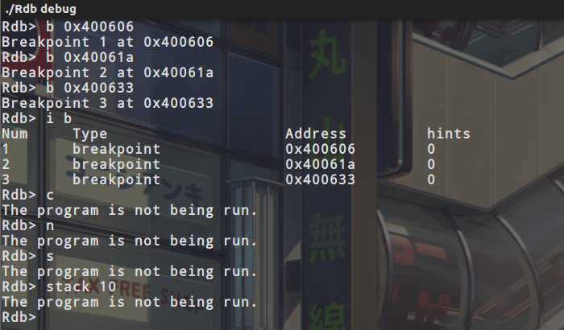
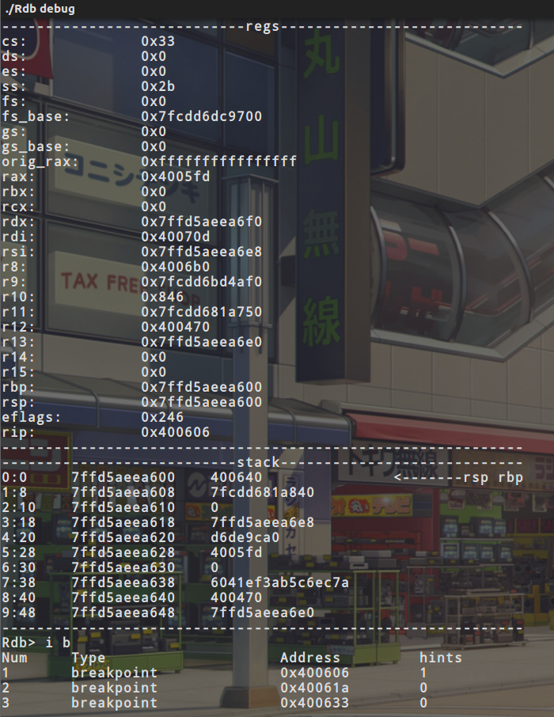
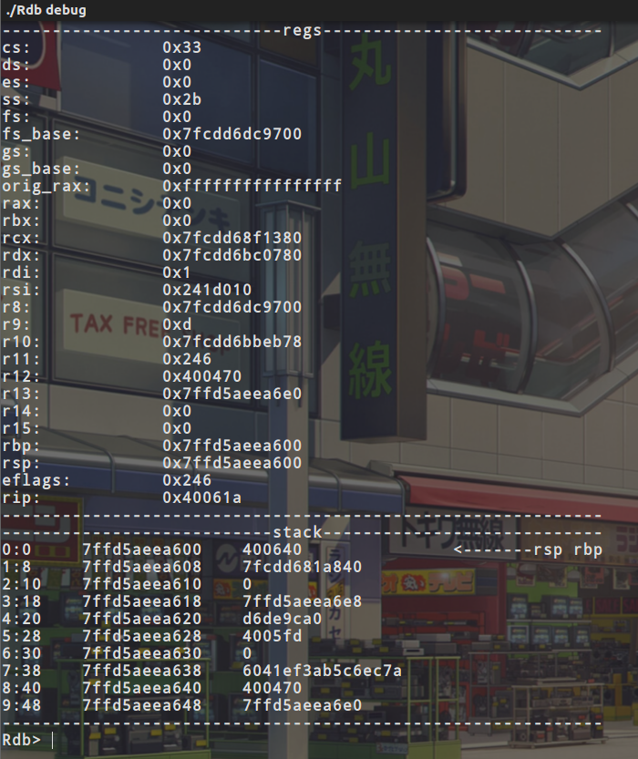
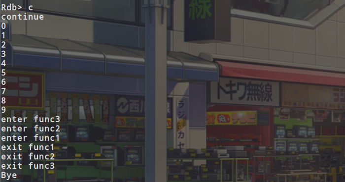
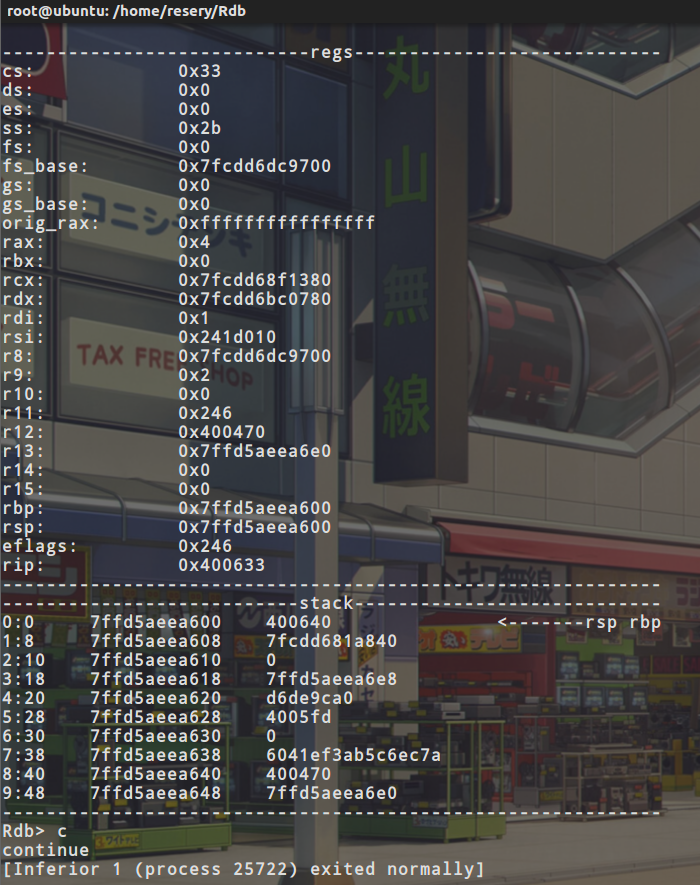

# Rdb 类似于Gdb的微型调试器

**重点、重点、重点** ：**我的这个调试器只实现了r、c、b、还有输出寄存器、输出栈的内容的功能，而且b只能使用地址来下断点，而且b不会判断你输入的地址是否为有效地址，这些功能以后会慢慢完善，还有能用面向对象就用面向对象(血的教训)**

下断点的原理：

在x86上这是通过将需要下断的地址上的指令设置为`int 3`来实现的。x86上有一个中断向量表（interrupt vector table），操作系统通过中断向量表能够为许多事件注册处理函数，比如缺页中断（page faults），保护错误（protection faults），无效操作码（invalid opcodes）等。它有点像注册错误的回调函数，但是在硬件层面实现的。当处理器执行到`int 3`指令是，控制权就被传递给了断点中断处理程序（breakpoint interrupt handler），就Linux来说，是给进程发送`SIGTRAP`信号。所以说只需要把需要下断的地址上的指令设置为int3就可以了，然后用waitpid，等待子进程发出`SIGTRAP`信号就可以了

从断点恢复执行：

如果说直接在断点处让子进程继续执行是没有效果的，因为当前对应的指令还是int3，所以需要把当前指令修改回原来的内容，然后单步运行一次，让他执行完原本的指令，然后就可以进行后面的内容了

没有使用s和c和源码级下断点的原因：

如果想要单步调试的话，现在的我们熟知的调试器都做到了可以翻译指令的功能，也就是把对应的2进制直接翻译成汇编代码，然后它还会预先判断这条指令执行完的后几种分支的可能，从而可以使你单步调试的时候达到你预想的结果，这里调试器做了很多的工作，对应于我们的微型调试器，我想到的办法是对当前rip后面的20字节的指令全部下断点，然后让子进程继续执行，这时候如果到了下条指令的位置，就会断下来，但是随之也有一个问题，这种方法必须保证程序不能调用任何函数，包括系统函数，自己写的函数，因为如果有函数的话，他就会直接跳进那个函数，但是随之父进程就获取不到子进程的内容了，所以我没有成功的实现s和n这两个功能

对应源码级下断点，在elf中有一个.debug_info节，这个节中包含一种叫DWARF格式的调试信息，可以在这个调试信息中得到对应函数的地址，对应有两个库，一个叫libefin一个叫libdwarf，这两个库我没有配置成功，所以说这个源码级调试也没有实现，如果说这两个库可以使用的话，那么源码级n和s还是可以实现的，不过指令级的n和s还是比较困难

调试器功能截图：












调试器代码：

```
/*
* @Author: resery
* @Date:   2020-10-02 15:55:31
* @Last Modified by:   resery
* @Last Modified time: 2020-10-04 20:27:48
*/
#include <iostream>
#include <sys/ptrace.h>
#include <sys/prctl.h>
#include <unistd.h>
#include <sys/wait.h>
#include <sys/syscall.h>
#include <sys/user.h>
#include <elf.h>
#include <string>
#include <stdio.h>
#include <cstdio>
#include <fcntl.h>
#include <malloc.h>
#include <string.h>
#include <fstream>
#include <cstdint>
#include <math.h>

using namespace std;

int bk_count = 0;

struct bk_list{
	intptr_t addr;
	unsigned int number;
	unsigned int hint;
	uint8_t saved;
	uint64_t data_int3;
}bk[20],bk_n;

void iregs(user_regs_struct regs){
    cout << "----------------------------regs----------------------------" <<endl;
    cout << hex << "cs:\t\t" <<  "0x" << regs.cs <<endl;
    cout << hex << "ds:\t\t" <<  "0x" << regs.ds <<endl;
    cout << hex << "es:\t\t" <<  "0x" << regs.es <<endl;
    cout << hex << "ss:\t\t" <<  "0x" << regs.ss <<endl;
    cout << hex << "fs:\t\t" <<  "0x" << regs.fs <<endl;
    cout << hex << "fs_base:\t" <<  "0x" << regs.fs_base <<endl;
    cout << hex << "gs:\t\t" <<  "0x" << regs.gs <<endl;
    cout << hex << "gs_base:\t" <<  "0x" << regs.gs_base <<endl;
    cout << hex << "orig_rax:\t" <<  "0x" << regs.orig_rax <<endl;
    cout << hex << "rax:\t\t" <<  "0x" << regs.rax <<endl;
    cout << hex << "rbx:\t\t" <<  "0x" << regs.rbx <<endl;
    cout << hex << "rcx:\t\t" <<  "0x" << regs.rcx <<endl;
    cout << hex << "rdx:\t\t" <<  "0x" << regs.rdx <<endl;
    cout << hex << "rdi:\t\t" <<  "0x" << regs.rdi <<endl;
    cout << hex << "rsi:\t\t" <<  "0x" << regs.rsi <<endl;
    cout << hex << "r8:\t\t" <<  "0x" << regs.r8 <<endl;
    cout << hex << "r9:\t\t" <<  "0x" << regs.r9 <<endl;
    cout << hex << "r10:\t\t" <<  "0x" << regs.r10 <<endl;
    cout << hex << "r11:\t\t" <<  "0x" << regs.r11 <<endl;
    cout << hex << "r12:\t\t" <<  "0x" << regs.r12 <<endl;
    cout << hex << "r13:\t\t" <<  "0x" << regs.r13 <<endl;
    cout << hex << "r14:\t\t" <<  "0x" << regs.r14 <<endl;
    cout << hex << "r15:\t\t" <<  "0x" << regs.r15 <<endl;
    cout << hex << "rbp:\t\t" <<  "0x" << regs.rbp <<endl;
    cout << hex << "rsp:\t\t" <<  "0x" << regs.rsp <<endl;
    cout << hex << "eflags:\t\t" <<  "0x" << regs.eflags <<endl;
    cout << hex << "rip:\t\t" <<  "0x" << regs.rip <<endl;
    cout << "------------------------------------------------------------" <<endl;
}

void istack(pid_t pid,user_regs_struct regs,unsigned int number){
	uint64_t data;
	cout << "---------------------------stack----------------------------" <<endl;
	for(int i=0;i<number;i++){
		data = ptrace(PTRACE_PEEKDATA, pid, regs.rsp + i*8, nullptr);
		if(regs.rsp + i*8 == regs.rbp && regs.rsp + i*8 == regs.rsp){
			cout << hex << i << ":" << i*8 << "\t" << regs.rsp + i*8 <<  "\t" << data << "\t\t     "<< "<-------rsp rbp" <<endl;
		}
		else if(regs.rsp + i*8 == regs.rbp && regs.rsp + i*8 != regs.rsp){
			cout << hex <<  i << ":" << i*8 << "\t" << regs.rsp + i*8 <<  "\t" << data << "\t\t         "<< "<-------rbp" <<endl;
		}
		else if(regs.rsp + i*8 != regs.rbp && regs.rsp + i*8 == regs.rsp){
			cout << hex <<  i << ":" << i*8 << "\t" << regs.rsp + i*8 <<  "\t" << data << "\t\t         "<< "<-------rsp" <<endl;
		}
		else{
			cout << hex <<  i << ":" << i*8 << "\t" << regs.rsp + i*8 <<  "\t" << data <<endl;
		}
	}
	cout << "------------------------------------------------------------" <<endl;
}

void breakpoint(pid_t pid,intptr_t addr,uint8_t & saved,uint64_t & data_int3){
    uint64_t data = ptrace(PTRACE_PEEKDATA, pid, addr, nullptr);
    saved = static_cast<uint8_t>(data & 0xFF);
    data_int3 = (data & ~0xFF) | 0xCC;
    ptrace(PTRACE_POKETEXT, pid, addr, data_int3);
}

void r_breakpoint(pid_t pid,intptr_t addr,uint8_t & saved,uint64_t & data_int3,uint64_t data){
	saved = static_cast<uint8_t>(data & 0xFF);
	data_int3 = (data & ~0xFF) | 0xCC;
	ptrace(PTRACE_POKEDATA, pid, addr, data_int3);
}

void unbreakpoint(pid_t pid,intptr_t addr,uint8_t & saved,uint64_t & data_int3){
	uint64_t data = (data_int3 & ~0xFF) | saved;
	ptrace(PTRACE_POKEDATA, pid, addr, data);
}

bool check_cc(pid_t pid,unsigned long addr){
	uint64_t data = ptrace(PTRACE_PEEKDATA, pid, addr, nullptr);

	data = static_cast<uint8_t>(data & 0xFF);

	if(data == 0xcc){
		return true;
	}
	else{
		return false;
	}
}

int main(int argc, const char *argv[]){
    int status;
    int fd;
    unsigned long addr;
    struct user_regs_struct regs,r_regs,n_regs;
    string command;

    int again_flag = 0;

    if(argc < 2){
        cout << "check arguments" <<endl;
        return 0;
    }
child:
    pid_t pid = fork();
    //child
    if(pid == 0){
        prctl(PR_SET_PDEATHSIG, SIGKILL);
        if(ptrace(PTRACE_TRACEME, 0LL, 0LL, 0LL)){
            perror("ptrace");
            exit(1);
        }
		execv(argv[1], 0);
        cout << "exec faild" << endl;
        exit(0);
    }

	int flag=0;
	int run_flag = 0;

    while ((waitpid(pid,&status, __WALL)) > 0){	
    	int rip_buffer = 0;
    	bk_n.addr = 0;
    	uint64_t n_temp;
        uint64_t n_data;

    	siginfo_t  s_info;
    	ptrace(PTRACE_GETSIGINFO, pid, nullptr, &s_info);

    	if(WIFEXITED(status)){
        	cout << "[Inferior 1 (process " << dec << pid << ") exited normally]" << endl;
       		return 0;
        }

		system("clear");


        if(s_info.si_signo == SIGTRAP) {
        	int i;
        	siginfo_t  info;
        	
        	if(flag){
        		if (ptrace(PTRACE_GETREGS, pid, 0, &regs))
            	{
            	    perror("ptrace getregs");
            	    kill(pid, 9);
            	    return 0;
            	}
            	regs.rip = regs.rip-1;
            	ptrace(PTRACE_SETREGS, pid, 0, &regs);
            	iregs(regs);
            	istack(pid,regs,10);
            	uint64_t data = ptrace(PTRACE_PEEKDATA, pid, regs.rip, nullptr);
				uint64_t temp = data;
				data = static_cast<uint8_t>(data & 0xFF);

				if(data == 0xcc){
					siginfo_t inf;
                	for(i=0;i < bk_count;i++){
        				if(regs.rip == bk[i].addr){
        					bk[i].hint++;
        					unbreakpoint(pid,bk[i].addr,bk[i].saved,bk[i].data_int3);
        				}
        			}
        			if(ptrace(PTRACE_SINGLESTEP, pid, 0, 0)){
        				perror("step");
        			}
            		sleep(0);
        			for(int j=0;j < bk_count;j++){
        				if(regs.rip == bk[j].addr){
        					r_breakpoint(pid,bk[j].addr,bk[j].saved,bk[j].data_int3,temp); 
        				}
        			}
				}
        	}
        	flag++;
loop:
           
            addr = 0;
            int number = 0;
            cout << "Rdb> ";
            getline(cin,command);
            switch(command[0]){
                case 'b':
                	if(command[1] != ' '){
                		cout << "check options!" <<endl;
                		exit(0);
                	}
                	else if(command[2] == '0' && command[3] == 'x'){
                		for(int i=4;i<command.length();i++){                			
                			int temp = 1;
                			for(int j=command.length()-i-1;j>0;j--){
                				temp *= 16;
                			}
                			if(command[i] <= '9' && command[i] >= '0'){
                				addr += (int)(command[i] - '0') * temp;
                			}
                			else{
                				addr += (int)(command[i] + 10 - 'a') * temp;
                			}
                			
                		}
                		++bk_count;
                		bk[bk_count-1].number = bk_count;
                		bk[bk_count-1].addr = addr;
                	}
                	
                	cout << "Breakpoint "<< bk_count << " at ";
                	cout << hex << "0x" << bk[bk_count-1].addr <<endl;
                    breakpoint(pid,bk[bk_count-1].addr,bk[bk_count-1].saved,bk[bk_count-1].data_int3);
                    goto loop;
                case 'n':
                	if(!run_flag){
                		cout << "The program is not being run." << endl;
                		goto loop;
                	}
                	else{
                		cout << "not support" <<endl;
                		goto loop;
                	}
                case 's':
                	if(!run_flag){
                		cout << "The program is not being run." << endl;
                		goto loop;
                	}
                	if(command[1] == 't' && command[2] == 'a' && command[3] == 'c' && command[4] == 'k' && command[5] == ' '){
                		for(int i=6;i<command.length();i++){
                			number += (int)(command[i]-'0') * pow(10,command.length()-i-1);
                		}
                		istack(pid,regs,number);
                		goto loop;
                	}
                	else{
                		cout << "not support" <<endl;
                		goto loop;
                	}
                    break;
                case 'r':
                    cout << "run" <<endl;
                    if(!run_flag){
                    	run_flag = 1;
                    	if(again_flag){
                    		for(int i=0;i<bk_count;i++){
                    			breakpoint(pid, bk[i].addr, bk[i].saved, bk[i].data_int3);
                    		}
                    	}
                    	ptrace(PTRACE_CONT, pid, 0, 0);
                    }
                    else{
                    	run_flag = 0;
                    	again_flag = 1;
                    	kill(pid,9);
                    	goto child;
                    }
                    break;
                case 'i':
                	if(command[1] != ' '){
                		cout << "check options!" <<endl;
                		exit(0);
                	}
                	else if(command[2] == 'r'){
                		if (ptrace(PTRACE_GETREGS, pid, 0, &regs))
                    	{
                    	    perror("ptrace getregs");
                    	    kill(pid, 9);
                    	    return 0;
                    	}
                    	iregs(regs);
                    	if(((status >> 16) & 0xffff) == PTRACE_EVENT_EXIT)
                    	{
                    	    printf("Child finished\n");
                    	}
                	}
                	else if(command[2] == 'b'){
                		cout << "Num\t" <<"Type\t\t\t" << "Address\t\t" << "hints"<<endl;
                		for(int i=0;i< bk_count;i++){
                			cout << bk[i].number << "\t" << "breakpoint\t\t" << hex << "0x" << bk[i].addr << "\t" << dec << bk[i].hint <<endl;
                		}
                	}
                	else{
                		cout << "invalid command!" <<endl;
                	}
                	goto loop;
                case 'c':
                	if(!run_flag){
                		cout << "The program is not being run." << endl;
                		goto loop;
                	}
                	else{
                		cout << "continue" << endl;
                	}
                    break;
                default:
                	cout << "Invalid options" <<endl;
                	goto loop;
            }
        }
        else{
        	if (ptrace(PTRACE_GETREGS, pid, 0, &regs))
            {
                perror("ptrace getregs");
                kill(pid, 9);
                return 0;
            }
            iregs(regs);
            if(((status >> 16) & 0xffff) == PTRACE_EVENT_EXIT)
            {
                printf("Child finished\n");
            }
            for(int i=0;i<bk_count;i++){
            	if(bk[i].addr == regs.rip - 1){
            		bk[i].hint++;
            	}
            }
        	cout << "wait signal:" << s_info.si_signo << endl;
        	exit(0);
        }
        ptrace(PTRACE_CONT, pid, 0, 0);

    }

}
```

