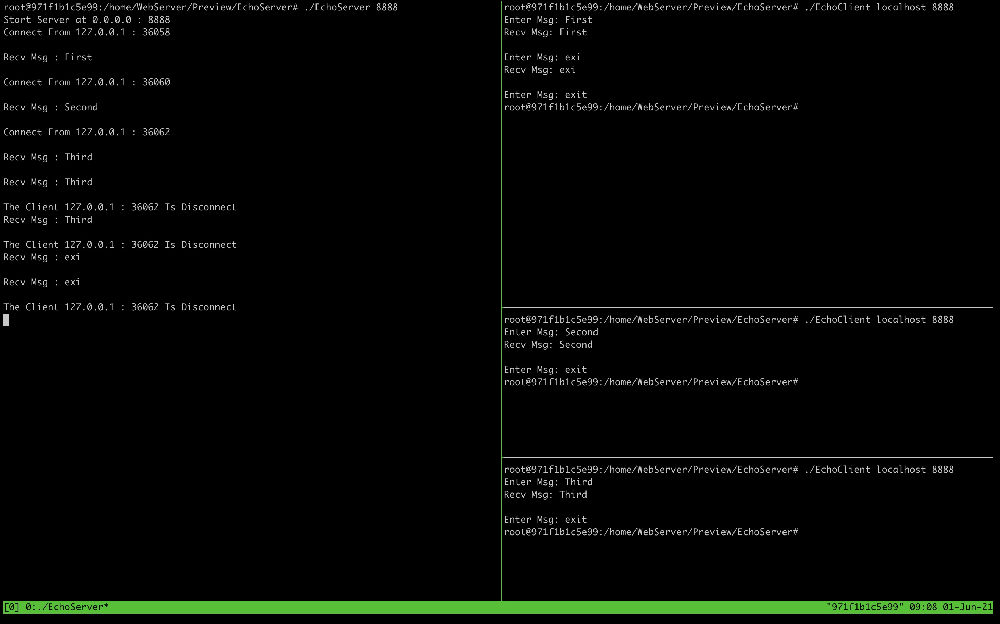
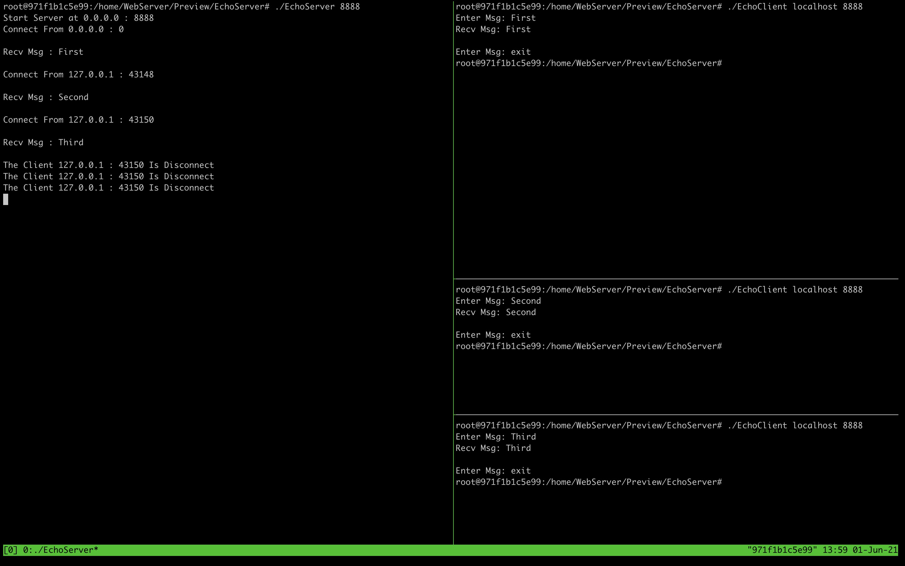
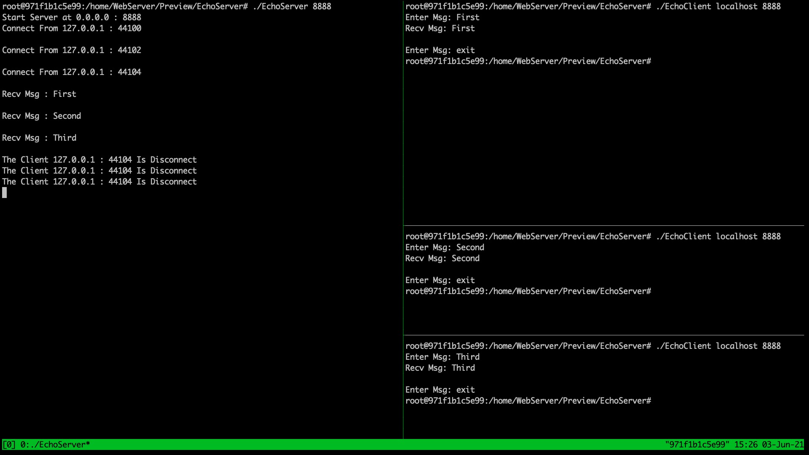

# Note

IO 多路复用，就是可以让一个进程同时检测多个文件描述符，当检测当描述符出现准备就绪的描述符，即可使用此描述符进行读写等操作，如果说没有出现这样的描述符，那么就阻塞程序

同步阻塞（BIO）

服务端采用单线程 : 当 accept 一个请求之后，使用 recv 或者 send 接受或者发送数据，如果调用 recv 或者 send 时阻塞了程序，那么在阻塞时是无法 accept 其他请求，只能等待阻塞解除之后才可以继续接受其他请求

服务端采用多线程 : 启用多线程之后是可以同时处理多个 accept 请求，但是会为每一个 accept 请求建立一个线程，当请求变多时就会创建很多个线程造成资源的浪费

同步非阻塞（NIO）

服务端 accept 一个请求之后，把其加入到一个集合中，集合存储所有外部的连接，然后遍历集合调用非阻塞的 recv 来读取数据，这样有一个缺点就是集合中并不是所有的连接都在发生实际的读写，所以说会做很多无用功

## Select

select 它仅仅会检测到有 IO 事件发生，但是无法知道具体是哪个 IO 流产生这个事件，如果我们想知道的话就只能对所有的 IO 流进行轮询，同时处理的流越多，无差别轮询时间就越长

select 函数原型： (以下内容来源于 man 手册)

```C
int
select(int nfds, fd_set * restrict readfds, fd_set * restrict writefds, fd_set * restrict errorfds, struct timeval * restrict timeout);
```

- nfds: nfds 的值应为描述符集合中数值最大的描述符加1
- readfds: readfs 主要检测其中的描述符是否准备好被读
- writefds: writefs 主要检测其中的描述符是否准备好被写
- errorfds: errorfds 主要检测其中的描述符是不是出发了异常
- timeout: timeout 主要用来设置超时时间如果过了超时时间，readfds，writefds，errorfds都没有对应检测的时间发生那么就会直接返回零

其中还有几个操作描述符集合的函数

```C
FD_SET(fd, &fdset);                 // 将 fd 添加到 fdset 集合

FD_CLR(fd, &fdset);                 // 将 fd 从 fdset 集合中删除

FD_ISSET(fd, &fdset);               // 检测 fd 是否在 fdset 集合中，并且为就绪状态

FD_COPY(&fdset_orig, &fdest_copy);  // 把 fdset_orig 集合中的文件描述符复制给 fdset_copy 集合

FD_ZERO(&fdset);                    // 清空 fdset 集合
```

总结一下，要是使用 select 来实现 IO 多路复用的话，基本的思路应该是这样的，以实际的 EchoServer 为例子

1. 首先声明四个变量，一个用来存储监听到的文件描述符（ListenFd），一个用来存储要监听读的集合（ReadFds），一个用来存储超时时间的结构体（Tmv），一个用来存储已连接的文件描述符（ConnFd，这里用 std::set 来进行存储）
2. 创建变量之后对齐进行初始化，ListenFd 的值应该为 listen 函数的返回值，ReadFds 先使用 FD_ZERO 来清零然后使用 FD_SET 将 ListenFd 添加到 ReadFds 中，Tmv 直接初始化为 0 即可，ConnFd 的值是 accept 函数的返回值
3. 将 ConnFd 集合中的已连接描述符全部添加到 ReadFds 集合中
4. 调用 select 函数来获取 ReadFds 集合中所有处于就绪状态的文件描述符
5. 遍历 ConnFd 集合中的文件描述符检测是否都处于就绪状态，如果处于就绪状态那么就调用 recv 和 send 进行非阻塞的读写，如果为处于就绪状态则继续遍历 ConnFd
6. 结束上面的遍历之后检测 ListenFd 是否处于 ReadFds 集合内，如果处于 ReadFds 集合内则说明其处于就绪状态也就是可以通过 accept 函数接受一个请求
7. 重复上述操作

对应的代码文件存储在了 MultiPlexing 文件里，利用上述思路实现的 EchoServer 大致可以实现如下效果：



select 的缺点:

- 单个进程所打开的FD是有限制的，通过 FD_SETSIZE 设置，默认1024

- 每次调用 select，都需要把 fd 集合从用户态拷贝到内核态，这个开销在 fd 很多时会很大

- 需要维护一个用来存放大量 fd 的数据结构，这样会使得用户空间和内核空间在传递该结构时复制开销大

- 对 socket 扫描时是线性扫描，采用轮询的方法，效率较低（高并发）

## Poll

poll 与 select 没有什么太大的区别，唯一的区别就是 poll 没有 FD_SETSIZE 的限制

poll 函数原型:

```C
int
poll(struct pollfd fds[], nfds_t nfds, int timeout);
```

- fds: fds 为一个结构体数组，结构体内部存储一个文件描述符，一个需要监听的事件，和一个可能或者已经遇到了的事件
- nfds: nfds 指定了 fds 数组的大小
- timeout: timeout 与 select 一样也是超时时间，大于 0 则会在设置的超时时间内检测是否有对应的时间产生，等于 0 将会直接返回并且不会阻塞，如果值为 -1 那么会开启阻塞

使用 poll 来实现 IO 多路复用，基本思路应该是这样的，同样也是使用 EchoServer 为例:

1. 首先声明 4 个变量，一个用来存储监听套接字文件描述符（ListenFd），一个用来存储要监听的文件描述符（Fds），一个用来存储 Fds 大小的变量（MaxNfds），一个用来存储超时时间的变量（TimeOut）
2. ListenFd 的值是 listen 函数的返回值，Fds 数组的第一个元素应该将 ListenFd 添加进去以便接受多个 accept 连接请求并且将 event 成员变量设置为 POLLRDNORM，MaxNfds 的值最开始应为 0，Timeout 的值也设为 0
3. 调用 poll 函数检测 Fds 数组中所有发生 POLLRDNORM 事件的描述符，首先检测数组第一个元素也就是 ListenFd 是否发生了 POLLRDNORM 事件，如果发生了则代表有客户端请求连接，那么就调用 accept 函数接受这个请求，如果没有的话就遍历 数组剩余的文件描述符，检测其是否发生了 POLLRDNORM 事件，如果发生了则进行对应的 recv 和 send 操作
4. 重复上述操作

对应的代码文件存储在了 MultiPlexing 文件里，利用上述思路实现的 EchoServer 大致可以实现如下效果:



poll 的缺点和 select 一样，但是 poll 没有监听文件描述符数量的限制

## Epoll

epoll 与 poll 的功能类似，监控多个文件描述符发生的 IO 事件。epoll 支持两种模式一种模式为 edge-triggred （ET）、另一种模式为 level-triggered（LT）并且最多可以检测 66356 个文件描述符

与 epoll 相关的三个函数的函数原型：

```C
int epoll_create(int size)
int epoll_ctl(int epfd, int op, int fd, struct epoll_event * event)
int epoll_wait(int epfd, struct epoll_event * event, int maxevents, int timeout)
```

epoll_create 创建一个 epoll 对象，这个函数会返回创建的 epoll 对象对应的一个文件描述符

epoll_ctl 用来添加、修改或者删除 epoll 对象中 interest 列表中的元素
- epfd: 这个参数的值应为 epoll_create 的返回值
- op: 这个参数的值应为 EPOLL_CTL_ADD, EPOLL_CTL_MOD, EPOLL_CTL_DEL中的一个，分别对应添加，修改和删除
- fd: 这个参数指明要监管的文件描述符
- event: 这个参数会存储与要监管的文件描述符相关的信息，以及要监管什么类型的事件，列出常用的三个 EPOLLIN, EPOLLOUT, EPOLLET, 分别就是读，写事件和开启 ET 模式
  - event 对应的数据结构如下，其中 epoll_data 中会存储与这个事件与对应描述符的信息，ptr 指针指向的内容是由用户自定义的，fd 的值为这个事件对应监管的文件描述符，events 为要监管的事件
    ```C
    typedef union epoll_data {
        void         *ptr;
        int          fd;
        unit32_t     u32;
        uint64_t     u64;
    } epoll_data_t;

    struct epoll_event {
        uint32_t     events;
        epoll_data_t data;
    }
    ```
  - LT（电平触发）：类似 select，LT 会去遍历在 epoll 事件表中每个文件描述符，来观察是否有我们感兴趣的事件发生，如果有（触发了该文件描述符上的回调函数），epoll_wait 就会以非阻塞的方式返回。若该 epoll 事件没有被处理完（没有返回 EWOULDBLOCK ），该事件还会被后续的 epoll_wait 再次触发。
  - ET（边缘触发）：ET 在发现有我们感兴趣的事件发生后，立即返回，并且 sleep 这一事件的 epoll_wait，不管该事件有没有结束。

epoll_wait 用来获取所有处于准备就绪状态的文件描述符
- epfd: 这个参数的值应为 epoll_create 的返回值
- events: 这个参数应该指向一个空的 epoll_event 结构因为这个函数会将准备就绪的文件描述符相关的信息存储在前面空的 epoll_event 中
- maxevents: 这个参数必须大于 0
- timeout: 设置一个超时时间

总结一下 epoll 的工作流程

1. epoll 首先通过 epoll_create 创建出一个 epoll 对象
2. epoll 对象会有一个叫做 interest list 的链表，该链表用来存储要监管的文件描述符，所以之后我们就是添加要监管的文件描述符和对应要监管的事件添加到 interest list 链表中
3. 之后当有文件描述符准备就绪时，就会将其添加到 epoll 对象的 ready list 链表中，然后通知有事件发生了，如果采用 LT 模式（默认就是 LT 模式）的话那么就会一直通知有事件发生直到该事件被处理，如果采用 ET 模式其不会一直通知有事件发生而是会在每次有事件又处于就绪状态时再通知一遍

**tips: epoll 对象中的 interest list 是利用红黑树这种数据结构来存储的，ready list 是利用链表来进行存储的，因为是利用这两种结构来存储的，所以说 epoll 的时间复杂度能达到 O(1)**

使用 epoll 来实现 IO 多路复用的大致思路应该是这样的，同样还是以 echoserver 为例：

1. 首先声明我们需要使用到的变量，最初我们应该声明 3 个变量，一个用来存储操纵 epoll 对象的文件描述符（EpollFd），一个用来存储要监管的时间的 epoll_event 数据结构（Event），一个用来存储就绪的文件描述符的 epoll_event 数组（Events）
2. 首先调用 epoll_create 来创建一个 epoll 对象
3. 之后为了可以实现多个客户端连接，我们应该先为 ListenFd 创建一个 epoll_event 结构来存储与之相关的信息，然后将 ListenFd 作为第一个需要监管的文件描述符放进 epoll 对象的 interest list 链表中
4. 调用 epoll_wait 检测是否有文件描述符处于就绪状态，首先检测是不是 ListenFd 对应的事件处于就绪状态，如果处于了就绪状态那么就需要 accept 一个连接请求，接着遍历其余处于就绪状态的文件描述符进行对应的读写
5. 重复上述循环

对应的代码文件存储在了 Multiplexing 文件里，利用上述思路实现的 EchoServer 大致可以实现如下效果:

