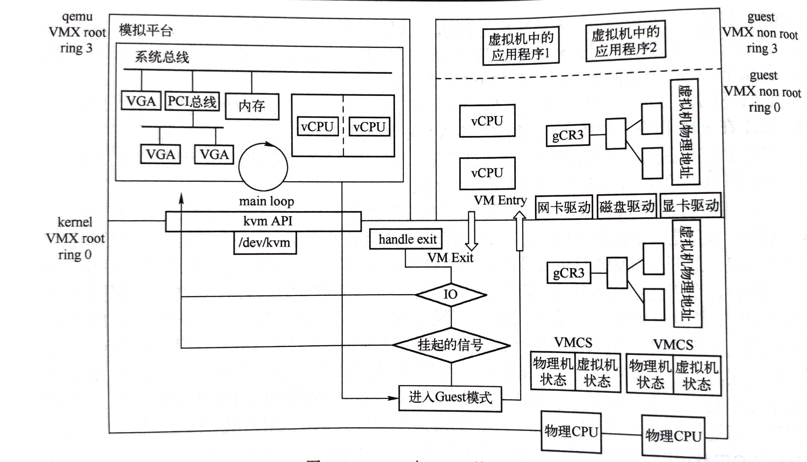
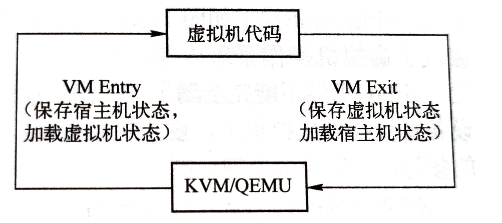
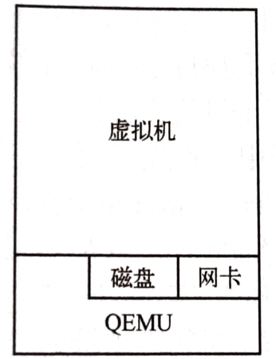
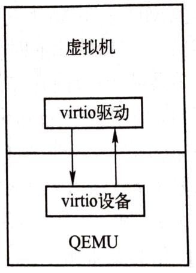
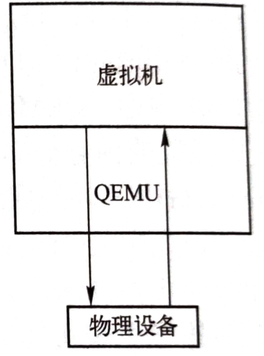
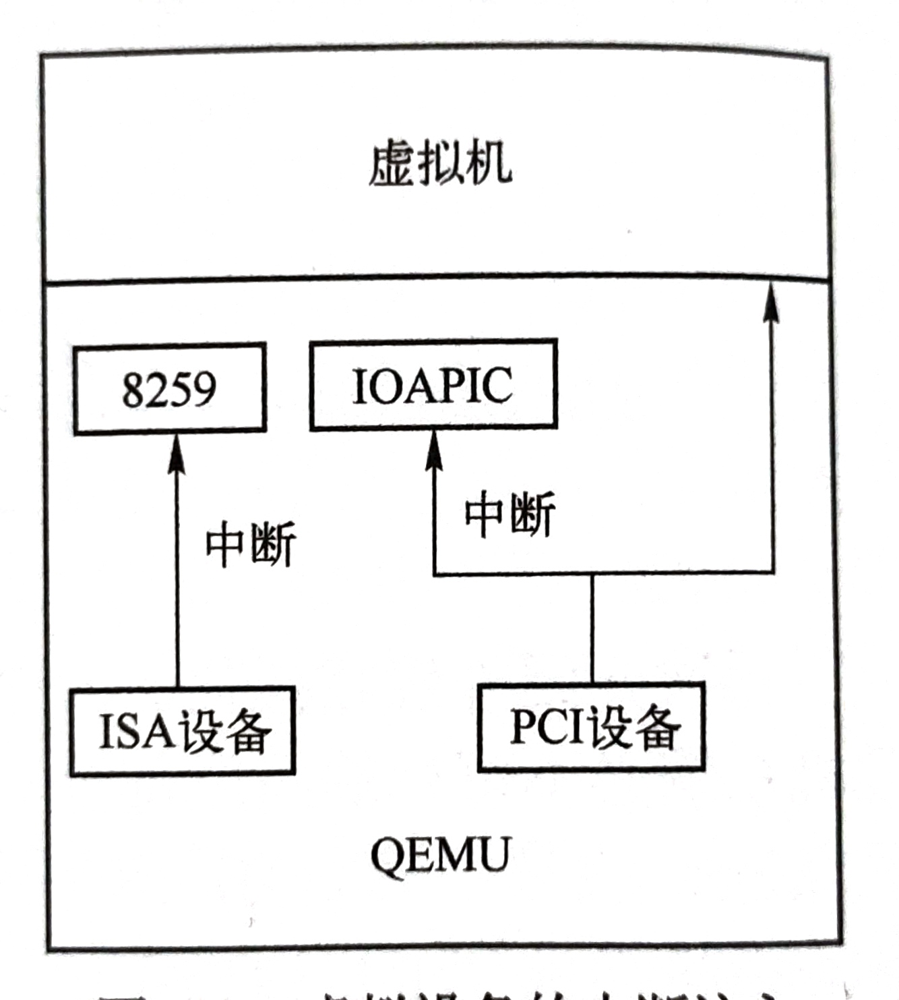

# QEMU KVM Note Ⅰ

## QEMU与KVM架构



qemu和kvm架构整体上分为3部分，对应着上图的三个部分(左上、右上和下)，3部分分别是VMX root的应用层，VMX no-root和VMX root的内核层（分别对应着左上、右上和下）

**VMX root**  ：暂时理解为宿主机模式，CPU在运行包括QEMU在内的普通进程和宿主机的操作系统内核时，CPU处在该模式。

**VMX no-root**  ：暂时理解为虚拟机模式，CPU在运行虚拟机中的用户程序和操作系统代码的时候处于VMX no-root模式

**注：VMX root 和 VMX no-root 都包含ring0 到 ring3 四个特权级别**

**QEMU的主要任务（图中左上部分）**

1. 创建模拟芯片组
2. 创建CPU线程来表示虚拟机的CPI执行流
3. 在QEMU的虚拟地址空间中分配空间作为虚拟机的物理地址
4. 根据用户在命令行指定的设备为虚拟机创建对应的虚拟设备
5. 在主线程中监听多种事件，这些事件包括虚拟机对设备的I/O访问、用户对虚拟机管理界面、虚拟设备对应的宿主机上的一些I/O事件等（比如虚拟机网络数据的接收）等

> 对应图中的系统总线、PCI总线、VGA的概念如下：
>
> 系统总线：单独的电脑总线，是连接电脑系统的主要组件。这个技术的开发是用来降低成本和促进模块化。系统总线结合数据总线的功能来搭载信息，地址总线来决定将信息送往何处，控制总线来决定如何动作。
>
> VGA：VGA采集卡是能直接采集VGA信号，把输入的VGA视频信号实时采集压缩，并能立即在一台显示器上同时显示另外一台甚至多台设备的VGA数据的设备。VGA高清采集卡工作原理是由RGB模拟信号经过A/D采样后转换为数字信号，通过FPGA写入SDRAM作为缓存，再经FPGA从SDRAM中将采集压缩的数据读出通过PCI总线传输到上位机，由上位机对数据进行传输等处理。 对VGA信号实时进行采集支持声音的同步录制，显示画面可以任意拉伸或全屏，录制后格式为avi，保证适应各类播放器播放，录制后期可以进行非线编，删除或添加相关内容，显示画面颜色和清晰度可调，录制帧率和码率可调。
>
> PCI 总线主要被分成三部分：
>
> 1. **PCI 设备**。符合 PCI 总线标准的设备就被称为 PCI 设备，PCI 总线架构中可以包含多个 PCI 设备。图中的 Audio、LAN 都是一个 PCI 设备。PCI 设备同时也分为主设备和目标设备两种，主设备是一次访问操作的发起者，而目标设备则是被访问者。
> 2. **PCI 总线**。PCI 总线在系统中可以有多条，类似于树状结构进行扩展，每条 PCI 总线都可以连接多个 PCI 设备/桥。上图中有两条 PCI 总线。
> 3. **PCI 桥**。当一条 PCI 总线的承载量不够时，可以用新的 PCI 总线进行扩展，而 PCI 桥则是连接 PCI 总线之间的纽带。

**虚拟机的运行：（图中右上部分）**

1. 虚拟机的CPU：虚拟机的一个CPU对应宿主机的一个线程，通过QEMU和KVM的相互合作，这些线程会直接被宿主机的操作系统正常调度，直接执行虚拟机中的代码
2. 虚拟机的内存：虚拟机的物理内存对应于QEMU中的虚拟内存，虚拟机的虚拟地址转换为宿主机的物理地址需要先将虚拟机的虚拟地址转换为虚拟机的物理地址，然后再将虚拟机的物理地址通过KVM的页表完成虚拟机物理地址到宿主机物理地址的转换
3. 虚拟机的设备：虚拟机中的设备是通过QEMU呈现给它的，操作系统在启动时进行设备枚举，加载对应的驱动
4. 虚拟机与宿主机的交互：虚拟机操作系统通过I/O端口(Port IO、PIO)或者MMIO(Memory Mapped I/O)进行交互，KVM会截获这个请求，大多数时候KVM会将请求分发到用户空间的QEMU进程中，有QEMU处理这些I/O请求

**KVM驱动：（图中下半部分）**

KVM通过"/dev/kvm"设备导出了一系列的接口，QEMU等用户态程序可以通过这些接口来控制虚拟机的各个方面，比如CPU个数、内存布局、运行等。另一方面，KVM需要截获虚拟机产生的虚拟机退出(VM Exit)事件并进行处理

**CPU虚拟化：**

前面说过了虚拟机中的一个CPU对应宿主机的一个线程。QEMU会先创建一个CPU线程，然后初始化通用寄存器和特殊寄存器(CPU寄存器)的值，然后调用KVM接口运行虚拟机。**在虚拟机运行的过程中，KVM会捕获虚拟机中的敏感指令，当虚拟机中的代码时敏感指令或者说满足了一定的退出条件时，CPU会从VMX non-root 模式退出到KVM，这叫做VM Exit。**退出之后先回陷入到KVM中进行处理，如果KVM处理不了就转去让QEMU处理，当KVM或者QEMU处理好了**VM Exit**事件后，又可以将CPU置于VMX non-root模式运行虚拟机代码，这叫做**VM Entry**。虚拟机会不停的进行**VM Exit**和**VM Entry**，CPU会加载对应的宿主机状态或者虚拟机状态，并且使用一个VMCS结构来保存虚拟机**VM Exit**和**VM Entry**的状态，如下图所示



**内存虚拟化：**

前面KVM驱动那里说了，QEMU通过KVM来设置虚拟机的内存布局。其中QEMU会在初始化的时候通过mmap系统调用分配虚拟内存空间作为虚拟机的物理内存，QEMU在不断更新内存布局的过程中会持续调用KVM接口通知内核KVM模块虚拟机的内存分布。

虚拟机虚拟地址转换为宿主机物理地址的过程如下(梅开二度，前面也提到过)：

1. 虚拟机虚拟地址(Guest Virtual Address，GVA )转换为虚拟机物理地址(Guest Physical Address，GPA )
2. 虚拟机物理地址转换为宿主机虚拟地址(Host Virtual Address，HVA )
3. 宿主机虚拟地址转换为宿主机物理地址(Host Physical Address，HPA )

在CPU没有支持EPT(Extended Page Table，扩展页表)的时候，虚拟机通过影子页表实现从虚拟机虚拟地址到宿主机物理地址的转换，是一种软件实现。

关于影子页表，它的具体细节就是会在初始化写入cr3寄存器的时候，把宿主机针对虚拟机生成的一张页表放进cr3寄存器中，然后把原本想要写入cr3寄存器的值保存起来，当虚拟机读cr3寄存器值的时候，就会把之前保存的cr3的值返回给虚拟机。这样做的目的是，在虚拟机内核态中虽然有一张页表，但是虚拟机在访问内存的时候，MMU不会走这张页表，MMU走的是以填入到cr3寄存器上的真实的值为基地址(这个值是vmm写的宿主机的物理地址)的影子页表，经过影子页表找到真实的物理地址，影子页表时刻与客户端的页表保持同步。

通过EPT表寻址的过程如下图所示：


**设备虚拟化：**

**纯软件模拟设备** ：虚拟机内核不用做任何修改，每一次对设备的寄存器读写都会陷入到KVM，进而到QEMU，QEMU再对这些请求进行处理并模拟硬件行为，如下图所示：



**virtio设备方案** ：virtio设备模拟如下图所示，virtio设备将QEMU变成了半虚拟化方案，因为它修改了虚拟机操作系统的内核。这里先十分简要的说一下virtio后面会再详细的进行分析



**设备直通方案** ：将物理硬件设备直接挂到虚拟机上，虚拟机直接与物理设备交互，尽可能在I/O路径上减少QEMU/KVM的参与，直通设备原理如下图所示，与设备直通经常一起使用的硬件虚拟化支持技术SRIOV，SIROV能够将单个的物理硬件高效地虚拟出多个也许你硬件。通过SIROV虚拟出来的硬件直通到虚拟机中，虚拟机能够非常高效的使用这些设备



**中断虚拟化：**

操作系统通过写设备的I/O端口或者MIMO地址来与设备交互，设备通过发送中断来通知虚拟操作系统事件，下图显示了模拟设备向虚拟机注入中断的状态。QEMU在初始化主板芯片的时候初始化中断控制器。QEMU支持单CPU的Intel8259中断控制器以及SMP的I/O APIC(I/O Advanced Programmable Interrupt Controller)中断控制器。



## KVM API 使用实例

第一个例子是一个超级精简版的内核，功能就是向I/O端口写入数据

```
test.S
start:
mov $0x48,%al
outb %al,$0xfl
mov $0x65,%al
outb %al,$0xfl
mov $0x6c,%al
outb %al,$0xfl
mov $0x6f,%al
outb %al,$0xfl
mov $0x6a,%al
outb %al,$0xfl
mov $0x0a,%al
outb %al,$0xfl

hlt
```

第二个例子是精简版的QEMU，P4CTF里面的KVM题做完这部分就很容易理解了

```
int main(){
	struct kvm_sregssregs;
	int ret;
	int kvmfd = open("/dev/kvm",O_RDWR);			//获取系统中KVM子系统的文件描述符kvmfd
	ioctl(kvmfd,KVM_GET_API_VERSION,NULL);			//获取KVM版本号
	int vmfd = ioctl(kvmfd,KVM_CREATE_VM,0);		//创建一个虚拟机
	unsigned char *ram = mmap(NULL,0x1000,PROT_READ|PROT_WRITE,MAP_SHARED|MAP_ANONYMUS,-1,0);			//为虚拟机分配内存
	int kfd = open("test.bin",O_RDONLY);			//打开第一个例子的程序
	read(kfd,ram,4096);				//把程序的读入到虚拟机中，这样等会虚拟机运行的时候就会先开始执行这个打开的程序了
	struct kvm_userspace_memory_region mem = {
		.slot = 0,
		.guest_phys_addr = 0,
		.memory_size = 0x1000,
		.userspace_addr = (unsigned long)ram,
	};								//设置虚拟机内存布局
	ret = ioctl(vmfd,KVM_SET_USER_MEMORY_REGION,&mem);				//分配虚拟机内存
	int vcpufd = ioctl(vmfd,KVM_CREATE_VCPU,0);				//创建虚拟CPU
	int mmap_size = ioctl(kvmfd,KVM_GET_VCPU,0);			//获取虚拟CPU对应的kvm_run结构的大小
	struct kvm_run *run = mmap(NULL,mmap_size,PROT_READ|PROT_WRITE,MAP_SHARED,vcpufd,0);				//给虚拟CPU分配内存空间
	ret = ioctl(vcpufd,KVM_GET_SREGS,&sregs);				//获取特殊寄存器
	sregs.cs.base = 0;										
	sregs.cs.selector = 0;
	ret = ioctl(vcpufd,KVM_SET_SREGS,&sregs);				//设置特殊寄存器的值
	struct kvm_regs regs = {
		.rip = 0;
	};
	ret = ioctl(vcpufd,KVM_SET_REGS,&regs);					//设置通用寄存器的值
	while(1){
		ret = ioctl(vcpufd,KVM_RUN,NULL);					//开始运行虚拟机
		if(ret == -1){
			printf("exit unknown\n");
			return -1;
		}
		switch(run->exit_reason){							//检测虚拟机退出的原因
			case "KVM_EXIT_HLT":
				puts("KVM_EXIT_HLT");
				return 0;
			case "KVM_EXIT_IO":
				putchar(*(((char *)run) + run->io.data_offset));
				break;
			case "KVM_EXIT_FAIL_ENTRY":
				puts("entry error");
				return -1;
			default:
				puts("other error");
				printf("exit_reason： %d\n",run->exit_reason);
			return -1;
		}
	}
}
```


