# QEMU KVM Note Ⅱ

## QEMU事件循环机制

### glib事件循环机制

> 前置知识：
>
> glib、glibc、libc三者的区别（stackoveflow上面给定简要版本答案如下）：
>
> `glibc` is a core C runtime library. It provides things like `printf(3)` and `fopen(3)`.
>
> glibc是一个C语言库。它提供了向printf和fopen之类的东西
>
> `glib` is an object-based event loop and utility library written in C.
>
> glib是用C写来的基于对象的事件循环和实用程序库
>
> libc实际上是一个泛指。凡是符合实现了 C 标准规定的内容，都是一种 libc ，glibc 是 GNU 组织对 libc 的一种实现。它是 unix/linux 的根基之一。
>
> 五种I/O模型：
>
> Linux下主要有以下五种I/O模型( 参考资料：https://juejin.im/post/6844903782094995470 )：
>
> 1. 阻塞I/O（blocking IO）
> 2. 非阻塞I/O (nonblocking I/O)
> 3. I/O 复用 (I/O multiplexing)
> 4. 信号驱动I/O (signal driven I/O (SIGIO))
> 5. 异步I/O (asynchronous I/O)
>
> 阻塞I/O（blocking IO）：进程会一直阻塞，直到数据拷贝完成 应用程序调用一个IO函数，导致应用程序阻塞，等待数据准备好。数据准备好后，从内核拷贝到用户空间，IO函数返回成功指示。阻塞IO模型图如下所示：
>
> 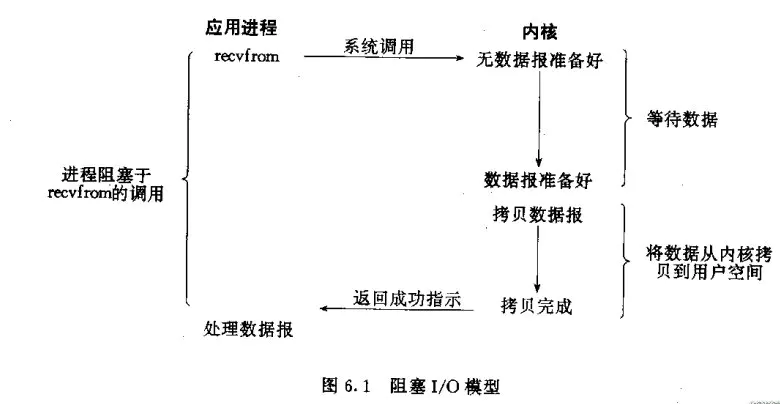
>
> 非阻塞I/O (nonblocking I/O)：通过进程反复调用IO函数，在数据拷贝过程中，进程是阻塞的。模型图如下所示:
>
> 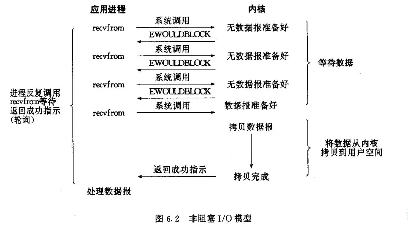
>
> I/O 复用 (I/O multiplexing)：主要是select和epoll。一个线程可以对多个IO端口进行监听，当socket有读写事件时分发到具体的线程进行处理。模型如下所示：
>
> 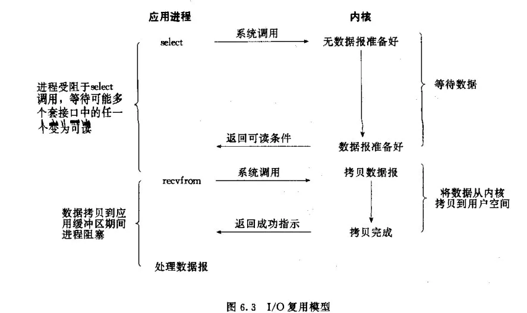
>
> 信号驱动I/O (signal driven I/O (SIGIO))：首先我们允许Socket进行信号驱动IO,并安装一个信号处理函数，进程继续运行并不阻塞。当数据准备好时，进程会收到一个SIGIO信号，可以在信号处理函数中调用I/O操作函数处理数据。过程如下图所示：
>
> 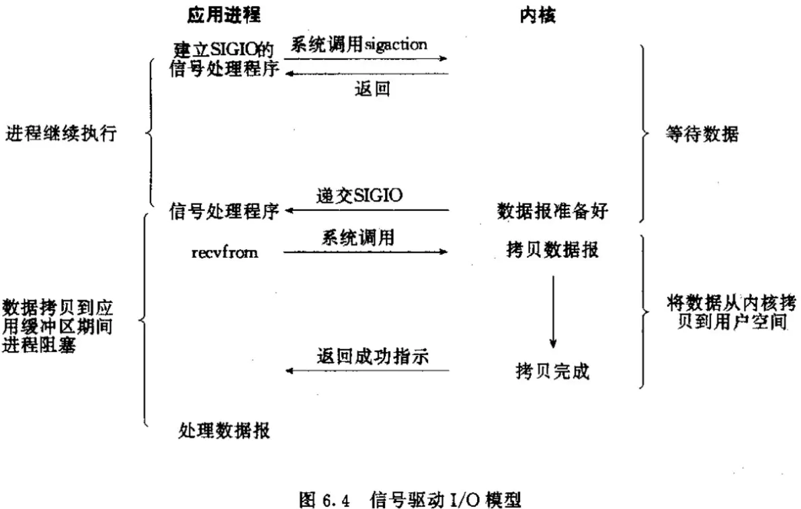
>
> 异步I/O (asynchronous I/O)：相对于同步IO，异步IO不是顺序执行。用户进程进行aio_read系统调用之后，无论内核数据是否准备好，都会直接返回给用户进程，然后用户态进程可以去做别的事情。等到socket数据准备好了，内核直接复制数据给进程，然后从内核向进程发送通知。IO两个阶段，进程都是非阻塞的。异步过程如下图所示：
>
> 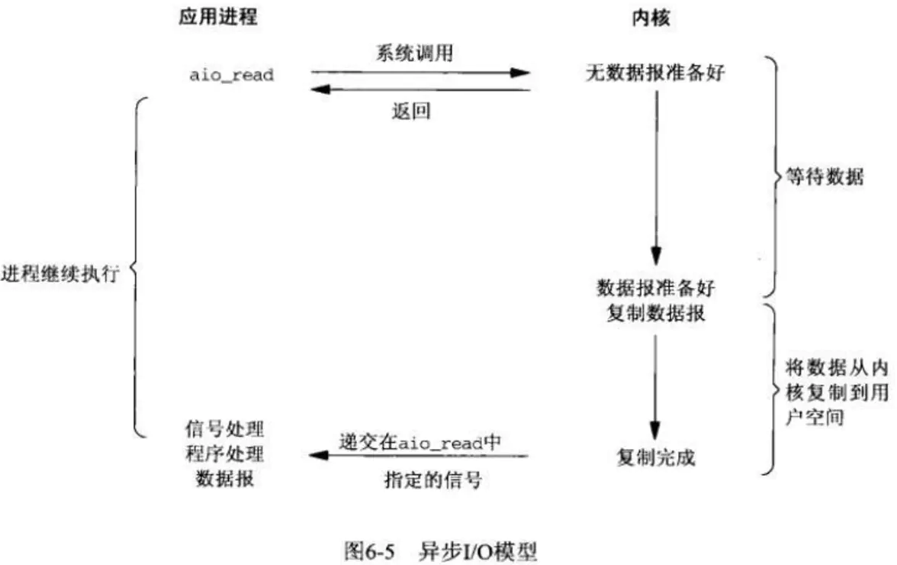
>
> ### 五种IO模型比较
>
> **阻塞IO和非阻塞IO的区别**
>  调用阻塞IO后进程会一直等待对应的进程完成，而非阻塞IO不会等待对应的进程完成，在kernel还在准备数据的情况下直接返回。 **同步IO和异步IO的区别**
>  首先看一下POSIX中对这两个IO的定义：
>
> ```
> A synchronous I/O operation causes the requesting process to be blocked until that I/O operation completes;
> An asynchronous I/O operation does not cause the requesting process to be blocked;
> 复制代码
> ```
>
> **两者的区别就在于synchronous IO做”IO operation”的时候会将process阻塞。**按照这个定义，之前所述的blocking IO，non-blocking IO，IO multiplexing都属于synchronous IO。注意到non-blocking IO会一直轮询(polling)，这个过程是没有阻塞的，但是recvfrom阶段blocking IO,non-blocking IO和IO multiplexing都是阻塞的。 而asynchronous IO则不一样，当进程发起IO 操作之后，就直接返回再也不理睬了，直到kernel发送一个信号，告诉进程说IO完成。在这整个过程中，进程完全没有被block。
>
> 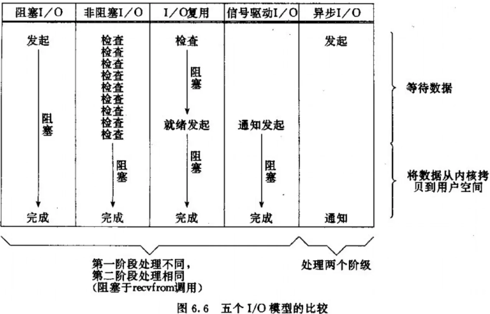
>
> IO复用之select、poll、epoll简介
>
> epoll是linux所特有，而select是POSIX所规定，一般操作系统均有实现。
>
> select本质是通过设置或检查存放fd标志位的数据结构来进行下一步处理。缺点是：
>
> 1. 单个进程可监视的fd数量被限制，即能监听端口的大小有限。一般来说和系统内存有关，具体数目可以cat /proc/sys/fs/file-max察看。32位默认是1024个，64位默认为2048个
> 2. 对socket进行扫描时是线性扫描，即采用轮询方法，效率低。当套接字比较多的时候，每次select()都要遍历FD_SETSIZE个socket来完成调度，不管socket是否活跃都遍历一遍。会浪费很多CPU时间。如果能给套接字注册某个回调函数，当他们活跃时，自动完成相关操作，就避免了轮询，这正是epoll与kqueue做的
> 3. 需要维护一个用来存放大量fd的数据结构，会使得用户空间和内核空间在传递该结构时复制开销大
>
> poll本质和select相同，将用户传入的数据拷贝到内核空间，然后查询每个fd对应的设备状态，如果设备就绪则在设备等待队列中加入一项并继续遍历，如果遍历所有fd后没有发现就绪设备，则挂起当前进程，直到设备就绪或主动超时，被唤醒后又要再次遍历fd。它没有最大连接数的限制，原因是它是基于链表来存储的，但缺点是：
>
> 1. 大量的fd的数组被整体复制到用户态和内核空间之间，不管有无意义。
> 2. poll还有一个特点“水平触发”，如果报告了fd后，没有被处理，那么下次poll时再次报告该ffd。
>
> epoll支持水平触发和边缘触发，最大特点在于边缘触发，只告诉哪些fd刚刚变为就绪态，并且只通知一次。还有一特点是，epoll使用“事件”的就绪通知方式，通过epoll_ctl注册fd，一旦该fd就绪，内核就会采用类似callback的回调机制来激活该fd，epoll_wait便可以收到通知。epoll的优点：
>
> 1. 没有最大并发连接的限制。
> 2. 效率提升，只有活跃可用的FD才会调用callback函数。
> 3. 内存拷贝，利用mmap()文件映射内存加速与内核空间的消息传递。
>
> select、poll、epoll区别总结：
>
> |        |    支持一个进程打开连接数     |                  IO效率                  |                   消息传递方式                   |
> | :----: | :---------------------------: | :--------------------------------------: | :----------------------------------------------: |
> | select |  32位机器1024个，64位2048个   |                 IO效率低                 | 内核需要将消息传递到用户空间，都需要内核拷贝动作 |
> |  poll  |   无限制，原因基于链表存储    |                 IO效率低                 | 内核需要将消息传递到用户空间，都需要内核拷贝动作 |
> | epoll  | 有上限，但很大，2G内存20W左右 | 只有活跃的socket才调用callback，IO效率高 |       通过内核与用户空间共享一块内存来实现       |

glib使用GMainLoop结构体来表示一个事件循环，每一个GMainLoop都对应有一个主上下文GMainContext。事件源使用GSource表示，每个GSource可以关联多个文件描述符，每个GSource会关联到一个GMainContext，一个GMainContext可以关联多个GSource，可以简单的用下图表示：


**注：上面的图片只是大致可以表示成如此，但是不代表说GMainContext中只包含GSource，同样GMainLoop中部只包含GMainContext**

glib能够定义新的事件源类型并且通过定义一组回调函数来讲新的事件源添加到glib的事件循环框架中，新的事件源通过两种方式跟主上下文交互。第一种方式是GSourceFuncs中的prepare函数可以设置一个超时时间，以此来决定主时间循环中轮询的超时时间；第二种方式是通过g_source_add_poll函数来添加fd

glib主上下文的一次循环包括prepare、query、check、dispatch四个过程，分别对应glib的g_main_context_prepare、g_main_context_query、g_main_context_check、g_main_context_dispatch四个函数

1. prepare：通过g_main_context_prepare来调用时间对应的prepare回调函数，做一些准备工作，如果事件已经准备好进行监听了，返回true
2. query：通过g_main_context_query可以获得实际需要调用poll的文件fd
3. check：当query之后获得了需要进行监听的fd，那么会调用poll对fd进行监听，当poll返回的时候，就会调用g_main_context_check将poll的结果传递给主循环，如果fd事件能够被分派就会返回true
4. dispatch：通过g_main_context_dispatch可以调用事件源对应事件的处理函数

下面是对应的流程图(一个是书上画的流程图，一个是我自己画的流程图)：

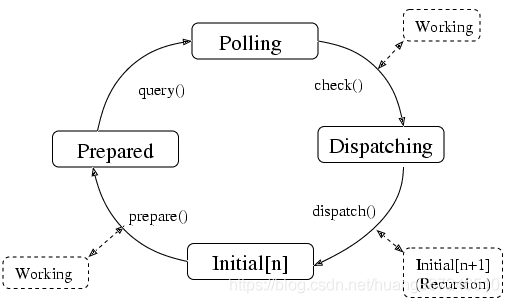

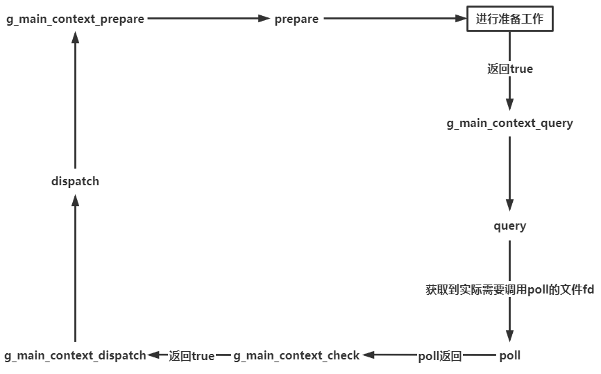

**例子1：**

```
#include <glib.h>
/*
函数打印标准输入中读到内容的长度
*/
gboolean io_watch(GIOChannel *channel,
                  GIOCondition condition,
                  gpointer data)
{
    gsize len = 0;
    gchar *buffer = NULL;

    g_io_channel_read_line(channel, &buffer, &len, NULL, NULL);

    if(len > 0)
        g_print("%d\n", len);

    g_free(buffer);

    return TRUE;
}

int main(int argc, char* argv[])
{
    GMainLoop *loop = g_main_loop_new(NULL, FALSE);	// 获取一个上下文的事件循环实例，context为NULL则获取默认的上下文循环
    GIOChannel* channel = g_io_channel_unix_new(1);	// 将标准输入描述符转化成GIOChannel，方便操作

    if(channel) {
        g_io_add_watch(channel, G_IO_IN, io_watch, NULL);	
        // 将针对channel事件源的回调注册到默认上下文，告诉Glib自己对channel的输入（G_IO_IN）感兴趣
        // 当输入准备好之后，调用自己注册的回调io_watch，并传入参数NULL。
        g_io_channel_unref(channel);
    }

    g_main_loop_run(loop);	// 执行默认上下文的事件循环
    g_main_context_unref(g_main_loop_get_context(loop));
    g_main_loop_unref(loop);

    return 0;
}
```

输出结果：

```
hello world
12
Glib event loop
21
```

**例子2：**

```
#include <glib.h>                                       
                                                                                                                                                                                                               
typedef struct _MySource MySource;
/* 自定义事件源，继承自Glib的GSource类型*/
struct _MySource
{
    GSource _source;	// 基类
    GIOChannel *channel;
    GPollFD fd;
};
/*事件源回调函数，读出iochannel中的内容，打印其长度*/
static gboolean watch(GIOChannel *channel)
{
    gsize len = 0;
    gchar *buffer = NULL;

    g_io_channel_read_line(channel, &buffer, &len, NULL, NULL);
    if(len > 0)
    	g_print("%d\n", len);
    g_free(buffer);

    return TRUE;
}
/*
状态机prepare回调函数，timeout等于-1告诉poll如果IO没有准备好，一直等待，即阻塞IO
返回FALSE指示需要poll来检查事件源是否准备好，如果是TRUE表示跳过poll
*/
static gboolean prepare(GSource *source, gint *timeout)
{
    *timeout = -1;
    return FALSE;
}
/*
状态机check回调函数，检查自己感兴趣的fd状态（events）是否准备好
用户通过设置events标志设置感兴趣的fd状态（包括文件可读，可写，异常等）
revents是poll的返回值，由内核设置，表明fd哪些状态是准备好的
函数功能：
当感兴趣的状态和poll返回的状态不相同，表示fd没有准备好，返回FALSE，Glib不发起调度
反之返回TRUE，Glib发起调度
*/
static gboolean check(GSource *source)
{
    MySource *mysource = (MySource *)source;

    if(mysource->fd.revents != mysource->fd.events)
    	return FALSE;

    return TRUE;
}
/*
状态机dispatch回调函数，prepare和check其中只要由一个返回TRUE，Glib就会直接调用此接口
函数逻辑是执行用户注册的回调函数
*/
static gboolean dispatch(GSource *source, GSourceFunc callback, gpointer user_data)
{
    MySource *mysource = (MySource *)source;

    if(callback)
      callback(mysource->channel);

    return TRUE;
}
/*
当事件源不再被引用时，这个接口被回调
*/
static void finalize(GSource *source)
{
    MySource *mysource = (MySource *)source;

    if(mysource->channel)
      g_io_channel_unref(mysource->channel);
}

int main(int argc, char* argv[])
{
    GError *error = NULL;
    GMainLoop *loop = g_main_loop_new(NULL, FALSE);	// 从默认上下文获取事件循环实例
    GSourceFuncs funcs = {prepare, check, dispatch, finalize};	// 声明用户定义的状态机回调
    /*
	Glib允许用户自己定义事件源，但需要把Glib的事件源作为"基类"，具体实现是把GSource
	作为自定义事件源的第一个成员，在创建事件源时传入状态机回调函数和自定义事件源的结构体大小
	*/
    GSource *source = g_source_new(&funcs, sizeof(MySource));
    MySource *mysource = (MySource *)source;
	/*
	创建一个文件类型的GIOChannel，GIOChannel就是Glib对文件描述符的封装，实现其平台可移植性
	GIOChannel在所有Unix平台上都可移植，在Windows平台上部分可移植
	GIOChannel的fd类型可以是文件，pipe和socket
	*/
    if (!(mysource->channel = g_io_channel_new_file("test", "r", &error))) {
        if (error != NULL)
            g_print("Unable to get test file channel: %s\n", error->message);

        return -1;
    }
	/*获取GIOChannel的fd，放到GPollFD的fd域中*/
    mysource->fd.fd = g_io_channel_unix_get_fd(mysource->channel);
    /*设置感兴趣的文件状态，这里时文件可读状态*/
    mysource->fd.events = G_IO_IN;
    /*
    传给poll的文件描述符结构体
	struct GPollFD {
  		gint		fd;			// 文件描述符
  		gushort 	events;		// 感兴趣的文件状态
  		gushort 	revents;	// 返回值，由内核设置
	};
	*/
    g_source_add_poll(source, &mysource->fd);	// 将文件描述符添加到事件源中
    g_source_set_callback(source, (GSourceFunc)watch, NULL, NULL);	// 设置事件源的回调函数
    /* 
    设置事件源优先级，如果多个事件源在同一个上下文，这个事件源都准备好了，优先级高的事件源会被Glib优先调度
    */
    g_source_set_priority(source, G_PRIORITY_DEFAULT_IDLE);	
    g_source_attach(source, NULL);	//将事件源添加到Glib的上下文，此处上下文为NULL，表示默认的上下文
    g_source_unref(source);

    g_main_loop_run(loop);	// Glib开始执行默认上下文的事件循环

    g_main_context_unref(g_main_loop_get_context(loop));
    g_main_loop_unref(loop);

    return 0;
}
```

输出结果：

```
12					|echo "hello world" > test
21					|echo "glib event main loop" >> test
```

### QEMU中的事件循环机制

通过如下命令启动虚拟机：

```
qemu-system-x86_64 -m 1024 -smp 4 -hda /home/test/test.img --enable-vkm -vnc :0
```

此命令下启动的QEMU程序，其主循环事件总共包含了下图所示的5个事件源

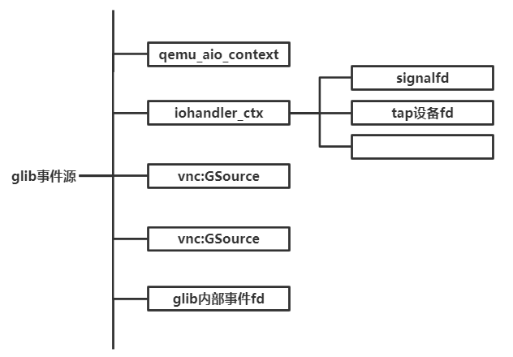

qemu_aio_context：自定义源事件，主要用于QEMU中块设备相关的异步I/O请求通知

iohander_ctx：自定义源事件，用于处理QEMU中各类事件通知

VNC事件源：glib标准事件源

glib内部事件fd：glib内部库自己使用的加入到事件循环的fd，而不是QEMU通过调用g_source_attach添加的事件源

glib框架在执行iohandler_ctx的分发函数时，会遍历其上所有的fd，如果某个fd上的数据准备好了，就会调用相应的回调函数

主循环调用函数的顺序：

```
main->main_loop->main_loop_wait->os_host_main_lopp_wait->glib_pollfds_fill->qemu_poll_ns->glib_pollfds_poll
```

如下图所示：


**main_loop函数：**

```
static void main_loop(void)
{
    bool nonblocking;
    int last_io = 0;
#ifdef CONFIG_PROFILER
    int64_t ti;
#endif
    do {
        nonblocking = !kvm_enabled() && !xen_enabled() && last_io > 0;
#ifdef CONFIG_PROFILER
        ti = profile_getclock();
#endif
        last_io = main_loop_wait(nonblocking);
#ifdef CONFIG_PROFILER
        dev_time += profile_getclock() - ti;
#endif
    } while (!main_loop_should_exit());
}
```

这部分的CONFIG_PROFILER这个分支还没太搞清楚，不过main_loop主要就是调用main_loop_wait，然后再main_loop_should_exit函数返回值为真的时候跳出循环

**main_loop_wait函数：**

```
int main_loop_wait(int nonblocking)
{
    int ret;
    uint32_t timeout = UINT32_MAX;
    int64_t timeout_ns;

    if (nonblocking) {
        timeout = 0;
    }

    /* poll any events */
    g_array_set_size(gpollfds, 0); /* reset for new iteration */
    /* XXX: separate device handlers from system ones */
#ifdef CONFIG_SLIRP
    slirp_pollfds_fill(gpollfds, &timeout);
#endif

    if (timeout == UINT32_MAX) {
        timeout_ns = -1;
    } else {
        timeout_ns = (uint64_t)timeout * (int64_t)(SCALE_MS);
    }

    timeout_ns = qemu_soonest_timeout(timeout_ns,
                                      timerlistgroup_deadline_ns(
                                          &main_loop_tlg));

    ret = os_host_main_loop_wait(timeout_ns);
#ifdef CONFIG_SLIRP
    slirp_pollfds_poll(gpollfds, (ret < 0));
#endif

    /* CPU thread can infinitely wait for event after
       missing the warp */
    qemu_start_warp_timer();
    qemu_clock_run_all_timers();

    return ret;
}
```

函数首先初始化存储所有fd的gpollfds数组，然后使用qemu_soonest_timeout从定时器列表中获取一个timeout，表示监听事件的时候最多让主循环阻塞的时间，使得QEMU能够及时处理系统中的定时器到期事件，然后就调用os_host_main_lopp_wait函数

**os_host_main_lopp_wait函数：**

```
static int os_host_main_loop_wait(int64_t timeout)
{
    int ret;
    static int spin_counter;

    glib_pollfds_fill(&timeout);

    /* If the I/O thread is very busy or we are incorrectly busy waiting in
     * the I/O thread, this can lead to starvation of the BQL such that the
     * VCPU threads never run.  To make sure we can detect the later case,
     * print a message to the screen.  If we run into this condition, create
     * a fake timeout in order to give the VCPU threads a chance to run.
     */
    if (!timeout && (spin_counter > MAX_MAIN_LOOP_SPIN)) {
        static bool notified;

        if (!notified && !qtest_enabled() && !qtest_driver()) {
            fprintf(stderr,
                    "main-loop: WARNING: I/O thread spun for %d iterations\n",
                    MAX_MAIN_LOOP_SPIN);
            notified = true;
        }

        timeout = SCALE_MS;
    }

    if (timeout) {
        spin_counter = 0;
        qemu_mutex_unlock_iothread();
    } else {
        spin_counter++;
    }

    ret = qemu_poll_ns((GPollFD *)gpollfds->data, gpollfds->len, timeout);

    if (timeout) {
        qemu_mutex_lock_iothread();
    }

    glib_pollfds_poll();
    return ret;
}
```

这里直接就包含了图中的三个函数，调用顺序也和图中一致，glib_pollfds_fill->qemu_poll_ns->glib_pollfds_poll，这里还涉及了一个qemu_mutex_unlock_iothread，需要后面的只是才可以解释

**glib_pollfds_fill函数：**

```
static void glib_pollfds_fill(int64_t *cur_timeout)
{
    GMainContext *context = g_main_context_default();
    int timeout = 0;
    int64_t timeout_ns;
    int n;

    g_main_context_prepare(context, &max_priority);		//为主循环的监听做准备

    glib_pollfds_idx = gpollfds->len;			//所有fd保存在全局变量gpollfds数组中
    											//idx的值初始化为gpollfds数组的长度
    n = glib_n_poll_fds;						//需要监听的fd的数量保存在glib_n_poll_fds中
    do {
        GPollFD *pfds;							//这其实是一个pollfd的结构体
        										//其中包含成员变量fd(文件描述符)、events(等待的事件)、revents(实际发生了的事件)
        glib_n_poll_fds = n;
        g_array_set_size(gpollfds, glib_pollfds_idx + glib_n_poll_fds);		//设置gpollfds的大小
        																	//大小为gpollfds数组原本的大小加上需要监听的fd的数量
        pfds = &g_array_index(gpollfds, GPollFD, glib_pollfds_idx);			//pdfs暂时存储要监听的fd
        n = g_main_context_query(context, max_priority, &timeout, pfds,		//返回数组中需要监听的fd的数目

        																	//并且还会返回一个fd时间最小的timeout,该值用来与传过来
        																	//的cur_timeout进行比较,这个最小值是存在timeout里面的
        																	//比较的函数在下面(qemu_soonest_timeout)
                                 glib_n_poll_fds);
    } while (n != glib_n_poll_fds);

    if (timeout < 0) {
        timeout_ns = -1;
    } else {
        timeout_ns = (int64_t)timeout * (int64_t)SCALE_MS;
    }

    *cur_timeout = qemu_soonest_timeout(timeout_ns, *cur_timeout);
}
```

这个函数是获取所有需要监听的fd，然后存储来context里面，并且还会返回一个最小的超时事件存储在timeout中

**qemu_poll_ns函数：**

```
int qemu_poll_ns(GPollFD *fds, guint nfds, int64_t timeout)
{
#ifdef CONFIG_PPOLL
    if (timeout < 0) {
        return ppoll((struct pollfd *)fds, nfds, NULL, NULL);
    } else {
        struct timespec ts;
        int64_t tvsec = timeout / 1000000000LL;
        /* Avoid possibly overflowing and specifying a negative number of
         * seconds, which would turn a very long timeout into a busy-wait.
         */
        if (tvsec > (int64_t)INT32_MAX) {			//思考:这里会不会产生溢出
        											//起初看到这种位数不一样的地方就感觉会发生溢出
        											//但是想了想应该没有办法产生溢出,因为这里INT32_MAX
        											//被转换成了int64_t
            tvsec = INT32_MAX;
        }
        ts.tv_sec = tvsec;
        ts.tv_nsec = timeout % 1000000000LL;
        return ppoll((struct pollfd *)fds, nfds, &ts, NULL);
    }
#else
    return g_poll(fds, nfds, qemu_timeout_ns_to_ms(timeout));
#endif
}
```

调用这个函数会阻塞主线程，当该函数返回之后，要么表示有文件，要么表示有文件fd上发生了事件，要么表示一个超时，不管怎么样，这都将进入第三步glib_pollfds_poll进行事件的分发处理

**glib_pollfds_poll函数：**

```
static void glib_pollfds_poll(void)
{
    GMainContext *context = g_main_context_default();
    GPollFD *pfds = &g_array_index(gpollfds, GPollFD, glib_pollfds_idx);		//这里都是对应的全局变量

    if (g_main_context_check(context, max_priority, pfds, glib_n_poll_fds)) {	//开始检测事件
        g_main_context_dispatch(context);										//进行事件的分发
    }
}
```

调用glib框架的g_main_context_check来检测事件，调用g_main_context_dispatch来进行事件的分发

这整个main_loop函数分析完可以完全对应上glib事件循环机制

1. 先进性初始化工作，初始化工作结束之后会调用main_loop
2. glib_pollfds_fill函数调用g_main_context_prepare
3. glib_pollfds_fill函数调用g_main_context_query
4. glib_pollfds_poll函数g_main_context_check
5. glib_pollfds_poll函数g_main_context_dispatch

下面是使用虚拟机的VNC连接为例分析相应的函数调用过程，VNC子模块在初始化的过程中会在vnc_display_open中调用qio_channel_add_watch，设置其监听的回调函数为vnc_listen_io，该过程最终会创建一个回调函数集合为qio_channel_fd_source_funcs的事件源，其中的dispatch函数为qio_channel_fd_source_dispatch，该函数会调用vnc_listen_io函数

```
GSourceFuncs qio_channel_fd_source_funcs = {
    qio_channel_fd_source_prepare,
    qio_channel_fd_source_check,
    qio_channel_fd_source_dispatch,
    qio_channel_fd_source_finalize
};
```

下面这条指令对应于使用gdb调试qemu

```
gdb --args qemu-system-x86_64 -m 1024 -smp 4 -hda centos.img --enable-kvm -vnc :0
```

进入到gdb之后直接在vnc_listen_io处下断点，下完断点之后直接run，run完之后需要使用vnc的客户端去连接虚拟机，vnc客户端下载地址：https://www.realvnc.com/download/file/viewer.files/VNC-Viewer-6.20.529-Linux-x64.deb，然后直接vnc连接本地，然后gdb中就会断下来了

因为用了pwngdb所以直接就显示函数堆栈，如下图所示：

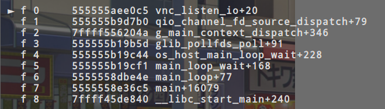

从图中可以看到调用顺序为

```
main->main_loop->main_loop_wait->os_host_main_lopp_wait->glib_pollfds_poll->g_main_context_dispatch->qio_channel_fd_source_distpatch->vnc_listen_io
```

可以看到main_loop循环调用了g_main_context_dispatch之后，调用的处理函数是qio_channel_fd_source_distpatch，然后处理函数又一步调用了vnc_listen_io函数

### QEMU自定义事件源

 AioContext，QEMU自定义的一个新的事件源，有两种类型的AioContext，第一类用来监听各种各样的事件，比如iohandler_ctx，第二类是用来处理块设备的异步I/O请求，比如QEMU默认的qemu_aio_context或者模块自己创建的AioContext

AioContext结构(详细版，但是由于目前知识不够还不能够全部知道这些都是用来做什么的)：

```
struct AioContext {
	//glib中的Gsource,每一个自定义的事件源第一个成员都是GSource结构的成员
    GSource source;

    /* Protects all fields from multi-threaded access */
	//在多线程下保护所有对AioContext中成员的访问
    QemuRecMutex lock;

    /* The list of registered AIO handlers */
	//所有加入到AioContext事件源的文件fd的事件处理函数都挂在这个链表上
    QLIST_HEAD(, AioHandler) aio_handlers;

    /* This is a simple lock used to protect the aio_handlers list.
     * Specifically, it's used to ensure that no callbacks are removed while
     * we're walking and dispatching callbacks.
     */
    int walking_handlers;

    /* Used to avoid unnecessary event_notifier_set calls in aio_notify;
     * accessed with atomic primitives.  If this field is 0, everything
     * (file descriptors, bottom halves, timers) will be re-evaluated
     * before the next blocking poll(), thus the event_notifier_set call
     * can be skipped.  If it is non-zero, you may need to wake up a
     * concurrent aio_poll or the glib main event loop, making
     * event_notifier_set necessary.
     *
     * Bit 0 is reserved for GSource usage of the AioContext, and is 1
     * between a call to aio_ctx_prepare and the next call to aio_ctx_check.
     * Bits 1-31 simply count the number of active calls to aio_poll
     * that are in the prepare or poll phase.
     *
     * The GSource and aio_poll must use a different mechanism because
     * there is no certainty that a call to GSource's prepare callback
     * (via g_main_context_prepare) is indeed followed by check and
     * dispatch.  It's not clear whether this would be a bug, but let's
     * play safe and allow it---it will just cause extra calls to
     * event_notifier_set until the next call to dispatch.
     *
     * Instead, the aio_poll calls include both the prepare and the
     * dispatch phase, hence a simple counter is enough for them.
     */
    uint32_t notify_me;

    /* lock to protect between bh's adders and deleter */
    QemuMutex bh_lock;

    /* Anchor of the list of Bottom Halves belonging to the context */
    struct QEMUBH *first_bh;

    /* A simple lock used to protect the first_bh list, and ensure that
     * no callbacks are removed while we're walking and dispatching callbacks.
     */
    int walking_bh;

    /* Used by aio_notify.
     *
     * "notified" is used to avoid expensive event_notifier_test_and_clear
     * calls.  When it is clear, the EventNotifier is clear, or one thread
     * is going to clear "notified" before processing more events.  False
     * positives are possible, i.e. "notified" could be set even though the
     * EventNotifier is clear.
     *
     * Note that event_notifier_set *cannot* be optimized the same way.  For
     * more information on the problem that would result, see "#ifdef BUG2"
     * in the docs/aio_notify_accept.promela formal model.
     */
    bool notified;
    EventNotifier notifier;

    /* Thread pool for performing work and receiving completion callbacks */
    struct ThreadPool *thread_pool;

#ifdef CONFIG_LINUX_AIO
    /* State for native Linux AIO.  Uses aio_context_acquire/release for
     * locking.
     */
    struct LinuxAioState *linux_aio;
#endif

    /* TimerLists for calling timers - one per clock type */
	//管理挂到该事件源的定时器
    QEMUTimerListGroup tlg;

    int external_disable_cnt;

    /* epoll(7) state used when built with CONFIG_EPOLL */
    int epollfd;
    bool epoll_enabled;
    bool epoll_available;
};
```

书上的介绍：

source：glib中的GSource，每一个自定义的事件源第一个成员都是GSource结构的成员

lock：在多线程下保护所有对AioContext中成员的访问

aio_handlers：所有加入到AioContext事件源的文件fd的事件处理函数都挂在这个链表上

notify_me和notified：都与aio_notify相关，主要用于在块设备层的I/O同步时处理QEMU下半部

first_bh：QEMU下半部链表，用来连接挂到该事件源的下半部，QEMU的BH默认挂在qemu_aio_context下

notifier：事件通知对象，类型为EventNotifier，在块设备进行同步且需要调用BH的时候需要用到该成员

tlg：管理挂到该事件源的定时器

创建AioContext函数的aio_context_new

```
AioContext *aio_context_new(Error **errp)
{
    int ret;
    AioContext *ctx;

    ctx = (AioContext *) g_source_new(&aio_source_funcs, sizeof(AioContext));
	/*
	初始化AioContext事件源的回调函数集合,aio_source_func结构如下：
	static GSourceFuncs aio_source_funcs = {
    	aio_ctx_prepare,
    	aio_ctx_check,
    	aio_ctx_dispatch,
    	aio_ctx_finalize
	};
	*/
    aio_context_setup(ctx);			//检测是否使用epoll

    ret = event_notifier_init(&ctx->notifier, false);		//初始化AioContext事件源的notifier成员变量
    if (ret < 0) {
        error_setg_errno(errp, -ret, "Failed to initialize event notifier");
        goto fail;
    }
    g_source_set_can_recurse(&ctx->source, true);			//检测AioContext事件源是否可以递归调用
    aio_set_event_notifier(ctx, &ctx->notifier,
                           false,
                           (EventNotifierHandler *)
                           event_notifier_dummy_cb);
#ifdef CONFIG_LINUX_AIO
    ctx->linux_aio = NULL;
#endif
    ctx->thread_pool = NULL;
    qemu_mutex_init(&ctx->bh_lock);
    qemu_rec_mutex_init(&ctx->lock);
    timerlistgroup_init(&ctx->tlg, aio_timerlist_notify, ctx);

    return ctx;
fail:
    g_source_destroy(&ctx->source);
    return NULL;
}
```

相关内容我做了注释，主要步骤如下

1. 初始化AioContext事件源的回调函数集合
2. 检测是否使用了epoll
3. 初始化AioContext事件源的notifier成员变量
4. 检测AioContext事件源是否可以递归调用
5. 调用aio_set_event_notifier

aio_set_event_notifier函数：该函数直接调用aio_set_fd_handle函数

aio_set_fd_handler函数：

```
void aio_set_fd_handler(AioContext *ctx,		//表示fd需要添加到哪个AioContext事件源
                        int fd,					//表示添加的fd是需要在主循环中进行监听的
                        bool is_external,		//用于块设备层,对于事件监听的fd都设置为false
                        IOHandler *io_read,		//对应fd的回调函数
                        IOHandler *io_write,	//对应fd的回调函数
                        void *opaque)			//作为回调函数的参数
{
    AioHandler *node;
    bool is_new = false;
    bool deleted = false;

    node = find_aio_handler(ctx, fd);		//在ctx的aio_handlers链表中寻找事件fd对应的事件处理函数

    /* Are we deleting the fd handler? */
    if (!io_read && !io_write) {			//看了一眼传进来的参数,io_write传进来的是空指针
    										//所以当io_read传进来的是空指针时才会触发这个if
        if (node == NULL) {					//先判断上面获取没获取到事件fd对应的事件处理函数
        									//如果没获取到就退出,获取到了则continue
            return;
        }

        g_source_remove_poll(&ctx->source, &node->pfd);		//取消阻塞

        /* If the lock is held, just mark the node as deleted */
        if (ctx->walking_handlers) {				//如果说锁没有解除,标记这个node的deleted为1
            node->deleted = 1;
            node->pfd.revents = 0;
        } else {
            /* Otherwise, delete it for real.  We can't just mark it as
             * deleted because deleted nodes are only cleaned up after
             * releasing the walking_handlers lock.
             */
            QLIST_REMOVE(node, node);				//真正的删除这个node,我们不能仅设置deleted为1
            										//因为这个node只有在释放walking_handlers锁之后才会被清除
            deleted = true;
        }
    } else {						//io_read不是空,所以说其指定了一个回调函数
        if (node == NULL) {			//没有获取fd对应的处理函数
            /* Alloc and insert if it's not already there */
            node = g_new0(AioHandler, 1);				//给node分配空间
            node->pfd.fd = fd;							//把事件fd加到node的pfd数组里面
            QLIST_INSERT_HEAD(&ctx->aio_handlers, node, node);		//把node添加到aio_handlers链表中

            g_source_add_poll(&ctx->source, &node->pfd);			//把fd插入到事件源监听fd列表中
            is_new = true;											//标记这个node为新链接到的aio_handlers
        }
        /* Update handler with latest information */
        node->io_read = io_read;							//更新node的io_read
        node->io_write = io_write;							//更新node的io_write
        node->opaque = opaque;								//设置回调函数的参数
        node->is_external = is_external;					//更新node的is_external

		/*根据io_read和io_write的有无设置要监听的事件*/
        node->pfd.events = (io_read ? G_IO_IN | G_IO_HUP | G_IO_ERR : 0);
        node->pfd.events |= (io_write ? G_IO_OUT | G_IO_ERR : 0);
    }

    aio_epoll_update(ctx, node, is_new);
    aio_notify(ctx);          
    if (deleted) {
        g_free(node);
    }
}
```

代码中我加了注释，函数主要的功能为添加或者删除事件源中的一个fd。如果作用时添加，则会设置fd对应的读写函数，函数调用结束之后，新的fd事件源就加入到了事件源的aio_handlers链表上了，如下图所示

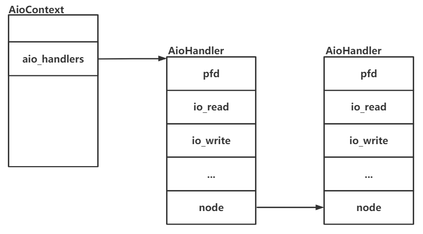

glib中自定义的事件源需要实现glib下过程中调用的几个回调函数，QEMU中为AioContext事件源定义了名为aio_source_funcs的GSourceFuncs结构

```
static GSourceFuncs aio_source_funcs = {
    aio_ctx_prepare,
    aio_ctx_check,
    aio_ctx_dispatch,
    aio_ctx_finalize
};
```

这几个函数时自定义事件源需要实现的，这里介绍一下最重要的事件分派函数aio_ctx_dispatch，对应代码如下，其会调用aio_dispatch要完成3件事；第一是BH的处理，第二是处理文件fd列表中有事件的fd，第三是调用定时器到期的函数，代码如下

```
bool aio_dispatch(AioContext *ctx)
{
    AioHandler *node;
    bool progress = false;

    /*
     * If there are callbacks left that have been queued, we need to call them.
     * Do not call select in this case, because it is possible that the caller
     * does not need a complete flush (as is the case for aio_poll loops).
     */
    if (aio_bh_poll(ctx)) {
        progress = true;
    }

    /*
     * We have to walk very carefully in case aio_set_fd_handler is
     * called while we're walking.
     */
    node = QLIST_FIRST(&ctx->aio_handlers);			//取处理函数链表中第一个
    while (node) {									//循环遍历
        AioHandler *tmp;
        int revents;

        ctx->walking_handlers++;					//加锁,保护当前的处理函数
        											//walking_handlers主要的作用是用来确保当前的处理函数不被删除

		/*
		struct GPollFD {
		#if defined (G_OS_WIN32) && GLIB_SIZEOF_VOID_P == 8
		#endif
		#else
  			gint		fd;					//文件描述符
		#endif
  			gushort 	events;				//需要接收的事件
  			gushort 	revents;			//接收到的事件
		};
		*/
		revents = node->pfd.revents & node->pfd.events;			//取已经发生的事件
        node->pfd.revents = 0;									//设置revents为0

        if (!node->deleted &&
            (revents & (G_IO_IN | G_IO_HUP | G_IO_ERR)) &&		//检测可读事件是否发生
            aio_node_check(ctx, node->is_external) &&			//检测ctx的external_disable_cnt和node的is_external是否都为0
            node->io_read) {									//检测io_read是否为空
            node->io_read(node->opaque);						//调用io_read,参数为opaque

            /* aio_notify() does not count as progress */
            if (node->opaque != &ctx->notifier) {				//这行代码是做什么的还没搞懂
                progress = true;
            }
        }
        if (!node->deleted &&
            (revents & (G_IO_OUT | G_IO_ERR)) &&				//检测可写事件是否发生
            aio_node_check(ctx, node->is_external) &&			//检测ctx的external_disable_cnt和node的is_external是否都为0
            node->io_write) {									//检测io_write是否为空
            node->io_write(node->opaque);						//调用io_write,参数为opaque
            progress = true;
        }

        tmp = node;
        node = QLIST_NEXT(node, node);						//指向下一个node

        ctx->walking_handlers--;							//解锁

        if (!ctx->walking_handlers && tmp->deleted) {		//检测当前的node的deleted是不是为1,如果说是的话就会删除这个节点释放内存
            QLIST_REMOVE(tmp, node);
            g_free(tmp);
        }
    }

    /* Run our timers */
    progress |= timerlistgroup_run_timers(&ctx->tlg);		//调用计时器到期函数

    return progress;
}
```

### QEMU事件处理过程

以signalfd的处理为例介绍QEMU事件处理的过程

QEMU启动命令如下：

```
gdb --agrs qemu-system-x86_64 -m 1024 -hda centos.img --enable-kvm -vnc :0
```

然后再另一个终端使用下面的命令：

```
kill -s SIGALRM (QEMU-PID)
```

然后gdb就会被断下来，并且调用顺序如下：

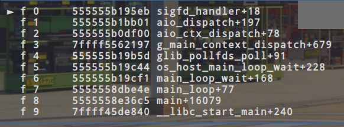

可以直观的看到，分发函数调用了sigfd_handler函数，这里先分析一下signal事件源的初始化vl.c中的main函数会用qemu_init_main_loop进行AioContext事件源的初始化，函数代码如下：

```
int qemu_init_main_loop(Error **errp)
{
    int ret;
    GSource *src;
    Error *local_error = NULL;

    init_clocks();

    ret = qemu_signal_init();
    if (ret) {
        return ret;
    }

    qemu_aio_context = aio_context_new(&local_error);
    if (!qemu_aio_context) {
        error_propagate(errp, local_error);
        return -EMFILE;
    }
    qemu_notify_bh = qemu_bh_new(notify_event_cb, NULL);
    gpollfds = g_array_new(FALSE, FALSE, sizeof(GPollFD));
    src = aio_get_g_source(qemu_aio_context);
    g_source_set_name(src, "aio-context");
    g_source_attach(src, NULL);
    g_source_unref(src);
    src = iohandler_get_g_source();
    g_source_set_name(src, "io-handler");
    g_source_attach(src, NULL);
    g_source_unref(src);
    return 0;
}
```

首先init_clocks是一个初始化函数具体初始化了什么还没深究，其中涉及了一个QEMUClock数据结构

然后调用了qemu_signal_init函数，函数代码如下：

```
static int qemu_signal_init(void)
{
    int sigfd;
    sigset_t set;

    /*
     * SIG_IPI must be blocked in the main thread and must not be caught
     * by sigwait() in the signal thread. Otherwise, the cpu thread will
     * not catch it reliably.
     */
    sigemptyset(&set);
    sigaddset(&set, SIG_IPI);
    sigaddset(&set, SIGIO);
    sigaddset(&set, SIGALRM);
    sigaddset(&set, SIGBUS);
    /* SIGINT cannot be handled via signalfd, so that ^C can be used
     * to interrupt QEMU when it is being run under gdb.  SIGHUP and
     * SIGTERM are also handled asynchronously, even though it is not
     * strictly necessary, because they use the same handler as SIGINT.
     */
    pthread_sigmask(SIG_BLOCK, &set, NULL);

    sigdelset(&set, SIG_IPI);
    sigfd = qemu_signalfd(&set);
    if (sigfd == -1) {
        fprintf(stderr, "failed to create signalfd\n");
        return -errno;
    }

    fcntl_setfl(sigfd, O_NONBLOCK);

    qemu_set_fd_handler(sigfd, sigfd_handler, NULL, (void *)(intptr_t)sigfd);

    return 0;
}
```

首先初始化一个set，然后往set里面添加值，这些值最后是想加在一起的，或者也可以说是这个set是按位计算的，对应SIG_IP应该是第14位（从0开始），然后SIGIO是第63位（从0开始），剩下的就一次类推就可以了，运行到pthread_sigmask这里的时候，set的值如下下图所示

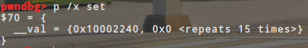

pthread_sigmask是用来屏蔽信号的，这里的操作就是把刚刚sigaddset添加到set里面的信号全都屏蔽掉，然后调用qemu_signalfd会返回signalfd对应的值，然后调用了qemu_set_fd_handler函数，这个函数很眼熟了，上面碰见过了，不过这里和上面调用的qemu_set_fd_handler函数不是同一个，上面的qemu_set_fd_handler函数是在aio-posix.c文件下的，这里的qemu_set_fd_handler函数是在iohandler.c文件下的，这里的qemu_set_fd_handler函数传入的参数也不一样，这里只传4个参数(fd，fd_read，fd_write，opaque)，并且会先调用iohandler_init，代码如下：

```
void qemu_set_fd_handler(int fd,
                         IOHandler *fd_read,
                         IOHandler *fd_write,
                         void *opaque)
{
    iohandler_init();
    aio_set_fd_handler(iohandler_ctx, fd, false,
                       fd_read, fd_write, opaque);
}

static void iohandler_init(void)
{
    if (!iohandler_ctx) {
        iohandler_ctx = aio_context_new(&error_abort);
    }
}
```

可以看到iohandler_init函数使用aio_context_new创建了一个新的事件源，并且iohandler_ctx是全局的，然后就是和上面函数一样调用aio_set_fd_handler这个函数了，下面这个是aio_context_new创建的(AioHandler *) node

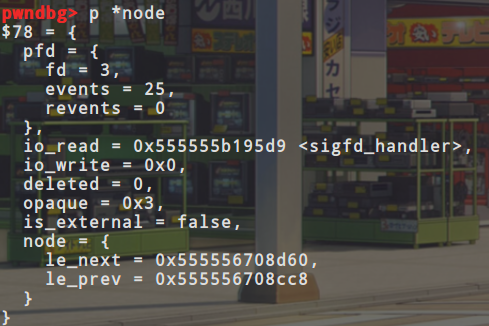

signal_init就结束了，现在回到qemu_init_main_loop函数，函数之后又会使用aio_context_new创建一个全局的qemu_aio_context事件源，然后也初始化了一个gpollfds数组，在之后分别使用g_source_attach把qemu_aio_context事件源和iohandler_ctx事件源加入道glib的主循环中去，下面两个图分别是对应的qemu_aio_context和iohandler_ctx

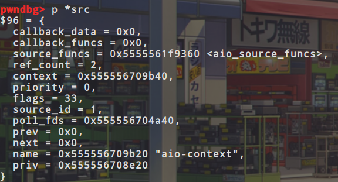

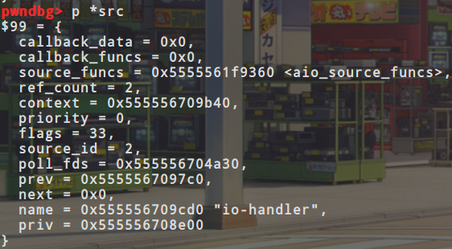

有了事件源之后，之前的main_loop的那个do_while循环开始检测，当我们对虚拟机发送一个SIGALARM信号的时候，signalfd就会有可读信号，然后主循环调用分发函数，也就是调用了signal_handler，这也就对应着这一小节开头的那张图了

### QEMU主循环监听的fd解析

使用下面的命令启动QEMU：

```
gdb --agrs qemu-syetem-x86_64 --enable-kvm -m 1024 -hda centos.img -vnc :0
```

然后在mian-loop.c:200下断点，然后r运行，之后直接查看gpollfds(存储需要监听的所有fd)，可以看到如下图一样的效果：

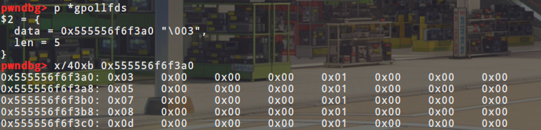

可以看到现在监听着5个fd，分别是3，5，7，8和d，现在研究一下这5个fd都是从哪里来的

在g_source_add_poll下断点可以看到，然后查看qemu进程下对应的fd情况，可以看到有一个signalfd和eventfd，然后再对应看gdb的堆栈溯源，可以看到先是调用的qemu_signal_init然后是iohandler_init，那么就可以确定**fd3对应qemu_signal_init创建的signalfd对应dfd**，**fd5对应iohandler_init创建iohandler_ctx时调用的**，

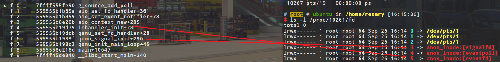

c继续运行，可以看到程序再aio_context_new这里停下来了，那么说明**fd7对应的是qemu_aio_context对应的fd**

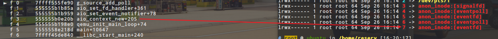

c继续运行，**可以看到fd13对应都是vnc创建的fd**

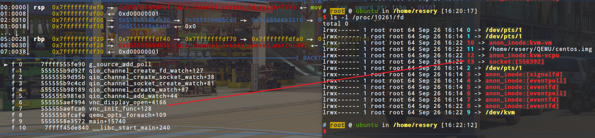

这个时候发现没有fd8对应的信息，这时候我们也可以在QEMU进程的fd情况中可以看到fd8对应的是一个eventfd，所以说我们在eventfd下断点，然后每次被断住之后直接使用finish命令完成当前函数的执行，然后查看rax寄存器的值，当rax的值为8的时候，得到下图，可以看到**fd8对应的是glib库自己创建使用的**

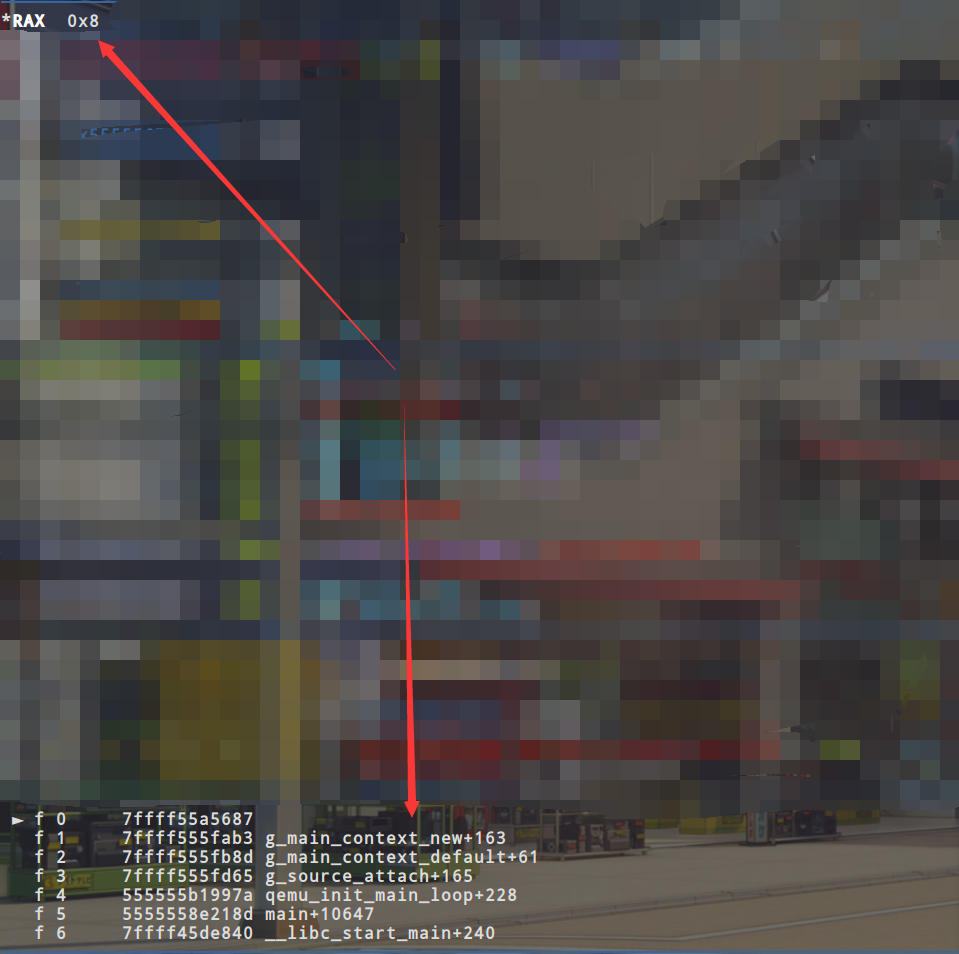

**注：给QEMU不同的参数，其监听的fd会变化，并且有可能是因为环境的问题，我与书中使用相同的命令但是和书中监听的fd的数量不同，并且fd对应的来源也都不一样**


