# QEMU KVM Note Ⅲ

## QOM

QOM的全称QEMU Object Model,顾名思义，这是对Qemu中对象的一个抽象层。通过QOM可以对qemu中的各种资源进行抽象、管理。比如设备模拟中的设备创建，配置，销毁。QOM还用于各种backend的抽象，MemoryRegion，Machine等的抽象，毫不夸张的说，QOM遍布于qemu代码。

QOM的整个运作包括3个部分，即类型的注册、类型的初始化以及对象的初始化，3个部分涉及的函数如下图所示：

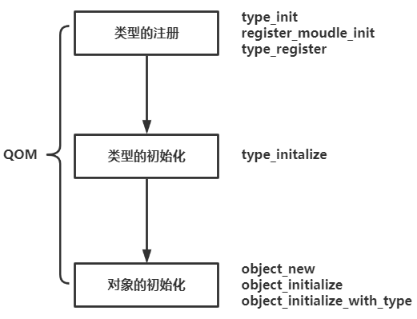

### 类型的注册

类型的注册是通过type_init完成的,type_init本身是一个宏，这个宏，这个宏会调用另一个函数module_init，这里我们以edu设备举例，edu本身不是一个实际的设备，而是教学用的设备，edu对应的类型注册结构体和type_init代码如下：

```
static void pci_edu_register_types(void)
{
    static const TypeInfo edu_info = {
        .name          = "edu",
        .parent        = TYPE_PCI_DEVICE,
        .instance_size = sizeof(EduState),
        .instance_init = edu_instance_init,
        .class_init    = edu_class_init,
    };

    type_register_static(&edu_info);
}
type_init(pci_edu_register_types)

#define type_init(function) module_init(function, MODULE_INIT_QOM)
```

然后就是调用module_init函数了，但是该函数有两个版本的define，一个版本适用于普通设备，一个版本适用于DSO设备，然后对应的function和type，function对应类型的初始化函数，type的值为MODULE_INIT_QOM。然后这里的constructor是编译器属性，编译器会把带有这个属性的函数do_qemu_init_ ## function放到特殊的段中，带有这个属性的函数还会早于main函数执行

```
#ifdef BUILD_DSO
......
#define module_init(function, type)                                         \
static void __attribute__((constructor)) do_qemu_init_ ## function(void)    \
{                                                                           \
    register_dso_module_init(function, type);                               \
}
#else
/* This should not be used directly.  Use block_init etc. instead.  */
#define module_init(function, type)                                         \
static void __attribute__((constructor)) do_qemu_init_ ## function(void)    \
{                                                                           \
    register_module_init(function, type);                                   \
}
```

可以看到module_init函数对应会调用register_module_init函数，register_module_init函数还会调用find_type和init_lists函数，相关函数具体内容如下(带注释版本)：

```
--------------------------------------------------------------------------------------------------------
oid register_module_init(void (*fn)(void), module_init_type type)
{
    ModuleEntry *e;
    ModuleTypeList *l;

    e = g_malloc0(sizeof(*e));		//给ModuleEntry结构体分配内存
    e->init = fn;					//这里fn指向的是类型初始化函数,所以这里就是让init指向类型初始化函数
    e->type = type;					//这里是把类型的type赋给ModuleEntry结构体中的type
	
    l = find_type(type);			//find_type会返回type在init_type_list列表中的位置
    								//MODULE_INIT_QAPI的值为2

    QTAILQ_INSERT_TAIL(l, e, node);		//把ModuleEntry *e插入到init_type_list列表中
}
--------------------------------------------------------------------------------------------------------
static ModuleTypeList *find_type(module_init_type type)
{
    init_lists();			//初始化init_type_list和dso_init_list列表

    return &init_type_list[type];
}
--------------------------------------------------------------------------------------------------------
static void init_lists(void)
{
    static int inited;
    int i;

    if (inited) {
        return;
    }

    for (i = 0; i < MODULE_INIT_MAX; i++) {		//MODULE_INIT_MAX值为5
        QTAILQ_INIT(&init_type_list[i]);		//在init_type_list中把当前的位置插入进去,最后形成这样的效果
    }

	/*
	pwndbg> p init_type_list
	$11 = {{
		tqh_first = 0x0, 
		tqh_last = 0x555556671460 <init_type_list>
	  }, {
		tqh_first = 0x0, 
		tqh_last = 0x555556671470 <init_type_list+16>
	  }, {
		tqh_first = 0x0, 
		tqh_last = 0x555556671480 <init_type_list+32>
	  }, {
		tqh_first = 0x0, 
		tqh_last = 0x555556671490 <init_type_list+48>
	  }, {
		tqh_first = 0x0, 
		tqh_last = 0x5555566714a0 <init_type_list+64>
	  }}
	*/
	
    QTAILQ_INIT(&dso_init_list);			//在dso_init_last中把当前位置插入进去,最后形成这样的效果
    /*
	pwndbg> p dso_init_list
	$18 = {
	  tqh_first = 0x0, 
	  tqh_last = 0x5555566714b0 <dso_init_list>
	}
    */

    inited = 1;								//设置flag位,代表这个类型已经被注册过了
}
--------------------------------------------------------------------------------------------------------
```

在调用register_module_init之前：

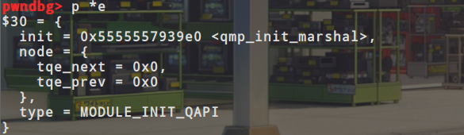

调用register_module_init之后：

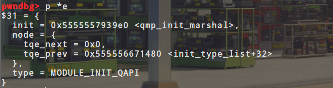

可以看到register_module_init函数的主要功能就是把创建出来的ModuleEntry结构体，插入到init_type_list列	表中，如下图所示：


一个init_type_list数组中会存储对应一类的module，如下图所示：

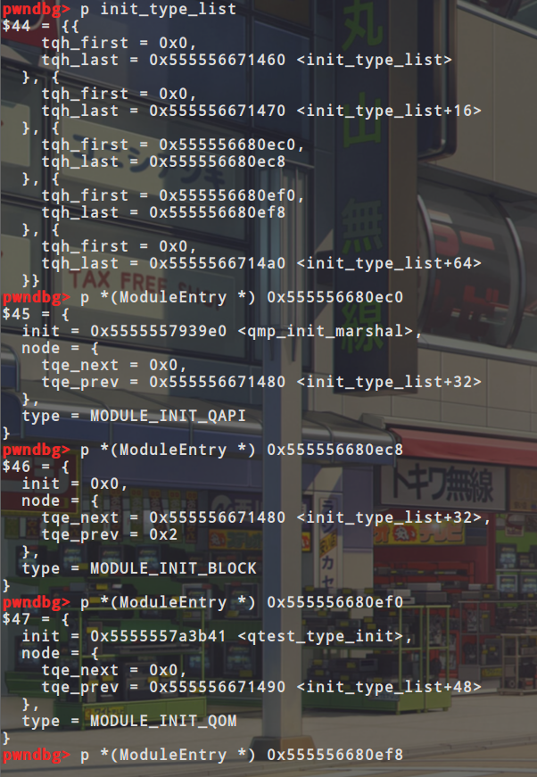

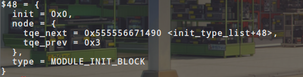

所以对应的我们也可以画出这样的一个关系图，如下所示：

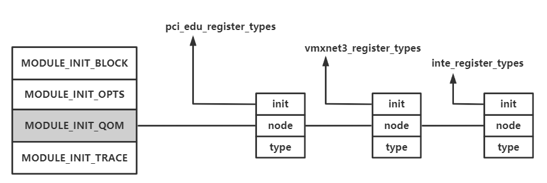

对函数进行溯源可以看到上面这些函数都是在main函数之前运行的，如图所示：

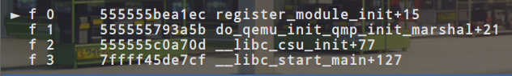

综上可知，QEMU使用的各个类型在main函数执行之前就统一注册到了init_type_list[MODULE_INIT_QOM]这个链表中，并且在main函数中，前面就调用了函数moudule_call_init函数参数为MODULE_INIT_QOM，这个函数执行了init_type_list[MODULE_INIT_QOM]链表上每一个ModuleEntry的init函数，具体代码如下：

```
void module_call_init(module_init_type type)
{
    ModuleTypeList *l;
    ModuleEntry *e;

    l = find_type(type);			//find_type会返回type在init_type_list列表中的位置

    QTAILQ_FOREACH(e, l, node) {
        e->init();					//调用对应类型的初始化函数
    }
}
```

以edu设备为例，该类型的init函数是pci_edu_register_types，该函数唯一的工作是构造了一个typeinfo类型的edu_info结构体，并且将其作为参数调用type_register_static，type_register_static调用type_register_static，函数代码如下：

```
static void pci_edu_register_types(void)
{
    static const TypeInfo edu_info = {				//类型信息
        .name          = "edu",						//类型的名字
        .parent        = TYPE_PCI_DEVICE,			//父类的名字
        .instance_size = sizeof(EduState),			//类型对应的实例大小
        .instance_init = edu_instance_init,			//实例的初始化函数
        .class_init    = edu_class_init,			//类初始化函数
    };

    type_register_static(&edu_info);
}
```

之后调用的type_register_static函数没有别的功能就是调用了另一个函数type_register，同样的type_register函数也是调用另一个函数type_register_internal不过type_register函数多了一步检测有没有父类，这几个函数的代码如下：

```
TypeImpl *type_register_static(const TypeInfo *info)
{
    return type_register(info);
}
--------------------------------------------------------------------------------------------------------
TypeImpl *type_register(const TypeInfo *info)
{
    assert(info->parent);
    return type_register_internal(info);
}
--------------------------------------------------------------------------------------------------------
static TypeImpl *type_register_internal(const TypeInfo *info)
{
    TypeImpl *ti;
    ti = type_new(info);

    type_table_add(ti);
    return ti;
}
--------------------------------------------------------------------------------------------------------
```

可以看到type_register_internal函数也是调用了另两个函数type_new函数和type_table_add函数，可以看到type_new函数就是创建一个TypeImpl结构体，TypeImpl结构体和type_new对应代码如下:

```
static TypeImpl *type_new(const TypeInfo *info)
{
    TypeImpl *ti = g_malloc0(sizeof(*ti));				//给TypeImpl结构体分配空间
    int i;

    g_assert(info->name != NULL);

    if (type_table_lookup(info->name) != NULL) {										//检测是否是已经初始化过这个类了
        fprintf(stderr, "Registering `%s' which already exists\n", info->name);
        abort();
    }

	/*下面的这些操作就是在把info中有的信息全都复制到ti中*/
    ti->name = g_strdup(info->name);
    ti->parent = g_strdup(info->parent);

    ti->class_size = info->class_size;
    ti->instance_size = info->instance_size;

    ti->class_init = info->class_init;
    ti->class_base_init = info->class_base_init;
    ti->class_finalize = info->class_finalize;
    ti->class_data = info->class_data;

    ti->instance_init = info->instance_init;
    ti->instance_post_init = info->instance_post_init;
    ti->instance_finalize = info->instance_finalize;

    ti->abstract = info->abstract;

    for (i = 0; info->interfaces && info->interfaces[i].type; i++) {
        ti->interfaces[i].typename = g_strdup(info->interfaces[i].type);
    }
    ti->num_interfaces = i;

    return ti;
}

struct TypeImpl
{
    const char *name;												//类型名字

    size_t class_size;												//所属类的大小

    size_t instance_size;											//所属实例的大小

    void (*class_init)(ObjectClass *klass, void *data);				//类相关的初始化函数
    void (*class_base_init)(ObjectClass *klass, void *data);		//类相关的初始化函数
    void (*class_finalize)(ObjectClass *klass, void *data);			//类的销毁函数

    void *class_data;

    void (*instance_init)(Object *obj);								//所属实例相关的初始化函数
    void (*instance_post_init)(Object *obj);						//所属实例相关的初始化函数
    void (*instance_finalize)(Object *obj);							//所属实例的销毁函数
	
    bool abstract;													//表示类是否是抽象的		

    const char *parent;												//父类的名字
    TypeImpl *parent_type;											//父类的类型,这个成员的类型是TypeImpl

    ObjectClass *class;												//指向ObjectClass的指针,包含这个类的基本信息

    int num_interfaces;												//类型的接口信息
    InterfaceImpl interfaces[MAX_INTERFACES];						//类型的接口信息
};
```

对应edu类经过type_new初始化后对应的内容如下所示：

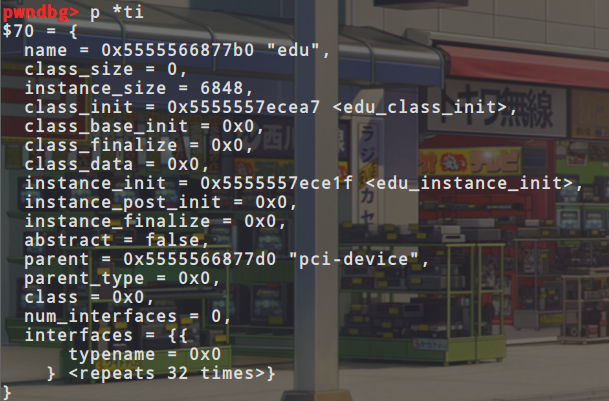

然后就是type_table_add函数，其中还调用了一个type_table_get函数，两个函数对应代码如下：

```
--------------------------------------------------------------------------------------------------------
static void type_table_add(TypeImpl *ti)
{
    assert(!enumerating_types);
    g_hash_table_insert(type_table_get(), (void *)ti->name, ti);
}
--------------------------------------------------------------------------------------------------------
static GHashTable *type_table_get(void)
{
    static GHashTable *type_table;

    if (type_table == NULL) {
        type_table = g_hash_table_new(g_str_hash, g_str_equal);
    }

    return type_table;
}
--------------------------------------------------------------------------------------------------------
```

函数主要的功能就是把刚才type_new初始化出来的TypeImpl结构体插入到一个hash表中，对应哈希表中的key是TypeImpl结构的名字，value是TypeImpl结构本身的值

### 类型的初始化

类的初始化是通过type_initialize函数完成的，函数的参数为ti(TypeImpl 结构体)，函数代码如下(添加了注释的版本)：

```
static void type_initialize(TypeImpl *ti)
{
    TypeImpl *parent;

    if (ti->class) {
        return;
    }

    ti->class_size = type_class_get_size(ti);				//返回所属类的大小,如果所属类大小为0,就返回其父类的所属类大小,如果说所属类也没有父类,那么就返回ObjectClass的大小
    ti->instance_size = type_object_get_size(ti);			//返回所属实例的大小，如果所属实例大小为0,就返回其父类的所属实例大小,如果说所属类也没有父类,那么就返回0
    ti->class = g_malloc0(ti->class_size);					//通过class_size给class分配空间

    parent = type_get_parent(ti);							//获得其父类
    if (parent) {
        type_initialize(parent);							//递归调用type_initialize初始化其父类,如果父类还有父类那么就再递归调用type_initialize初始化其父类
        GSList *e;
        int i;

        g_assert_cmpint(parent->class_size, <=, ti->class_size);
        memcpy(ti->class, parent->class, parent->class_size);			//把父类的class复制给ti的class,其中class是ObjectClass结构体
		/*
		ObjectClass结构体包含下面几个成员
		type					类型
		interfaces				接口
		object_cast_cache		类似于一个缓存的东西
		class_cast_cache		类似于一个缓存的东西
		unparent				
		properties				指向一个哈希表
		*/
		ti->class->interfaces = NULL;
        ti->class->properties = g_hash_table_new_full(
            g_str_hash, g_str_equal, g_free, object_property_free);

        for (e = parent->class->interfaces; e; e = e->next) {						//初始化父类所属实例
            InterfaceClass *iface = e->data;
            ObjectClass *klass = OBJECT_CLASS(iface);

            type_initialize_interface(ti, iface->interface_type, klass->type);
        }

        for (i = 0; i < ti->num_interfaces; i++) {									//初始化所属实例
            TypeImpl *t = type_get_by_name(ti->interfaces[i].typename);
            for (e = ti->class->interfaces; e; e = e->next) {
                TypeImpl *target_type = OBJECT_CLASS(e->data)->type;

                if (type_is_ancestor(target_type, t)) {
                    break;
                }
            }

            if (e) {
                continue;
            }

            type_initialize_interface(ti, t, t);
        }
    } else {
        ti->class->properties = g_hash_table_new_full(
            g_str_hash, g_str_equal, g_free, object_property_free);
    }

    ti->class->type = ti;

    while (parent) {												//调用父类的class_base_init函数
        if (parent->class_base_init) {
            parent->class_base_init(ti->class, ti->class_data);
        }
        parent = type_get_parent(parent);
    }

    if (ti->class_init) {											//调用自己的class_init函数
        ti->class_init(ti->class, ti->class_data);
    }
}
```

所以对应可以看到type_initialize函数主要就做了三件事，第一件事设置相关的filed，比如class_size和instance_size，使用ti->class_size分配一个ObjectClass，第二件事是初始化所有父类类型，不仅包括实际的类型，也包括接口这类抽象类型，第三件事是一次调用父类的class_base_init以及自己的class_init

**实际上type_initialize函数可以在很多地方调用，不过，只有在第一次调用的时候会进行初始化，之后的调用都会由于ti->class不为空则直接返回**

### 类型的层次结构

这里我们还是以edu为例来介绍类型的层次结构，在edu设备的类型信息edu_info结构中有一个parent成员，parent指定了edu_info的夫类型名称

```
static void pci_edu_register_types(void)
{
    static const TypeInfo edu_info = {
        .name          = "edu",
        .parent        = TYPE_PCI_DEVICE,
        .instance_size = sizeof(EduState),
        .instance_init = edu_instance_init,
        .class_init    = edu_class_init,
    };

    type_register_static(&edu_info);
}
```

可以看到edu_info中指定了其父类型的的名称，edu设备的父类型为TYPE_PCI_DEVICE，对应TYPE_PCI_DEVICE的定义在/hw/pci/pci.c中

```
static const TypeInfo pci_device_type_info = {
    .name = TYPE_PCI_DEVICE,
    .parent = TYPE_DEVICE,
    .instance_size = sizeof(PCIDevice),
    .abstract = true,
    .class_size = sizeof(PCIDeviceClass),
    .class_init = pci_device_class_init,
};
```

可以看到TYPE_PCI_DEVICE它的父类型为TYPE_DEVICE，对应TYPE_DEVICE的定义在/hw/core/qdev.c中

```
static const TypeInfo device_type_info = {
    .name = TYPE_DEVICE,
    .parent = TYPE_OBJECT,
    .instance_size = sizeof(DeviceState),
    .instance_init = device_initfn,
    .instance_post_init = device_post_init,
    .instance_finalize = device_finalize,
    .class_base_init = device_class_base_init,
    .class_init = device_class_init,
    .abstract = true,
    .class_size = sizeof(DeviceClass),
};
```

可以看到TYPE_DEVICE也有父类，其父类型为TYPE_OBJECT，对应TYPE_OBJECT的定义在/qom/object.c中

```
static TypeInfo object_info = {
    .name = TYPE_OBJECT,
    .instance_size = sizeof(Object),
    .instance_init = object_instance_init,
    .abstract = true,
};
```

这回发现TYPE_OBJECT已经没有父类型了，所以我们可以得到edu类型的层次关系为

```
TYPE_PCI_DEVICE → TYPE_DEVICE → TYPE_OBJECT
```

从数据结构方面谈一谈类型的层次结构。在类型的初始化函数type_initialize中会调用ti->class=g_malloc0(ti->class_size)语句来分配类型的class结构，这个结构实际上代表了类型的信息。从前面的分析可以看到ti->class_size为TypeImpl中的值，如果类型本身没有定义就会使用父类型的class_size进行初始化。edu设备中的类型本身没有定义，所以它的class_size为TYPE_PCU_DEVICE中的值，即sizeof(PCIDeviceClass)，PCIDeviceClass的代码如下：

```
typedef struct PCIDeviceClass {
    DeviceClass parent_class;

    void (*realize)(PCIDevice *dev, Error **errp);
    int (*init)(PCIDevice *dev);/* TODO convert to realize() and remove */
    PCIUnregisterFunc *exit;
    PCIConfigReadFunc *config_read;
    PCIConfigWriteFunc *config_write;

    uint16_t vendor_id;
    uint16_t device_id;
    uint8_t revision;
    uint16_t class_id;
    uint16_t subsystem_vendor_id;       /* only for header type = 0 */
    uint16_t subsystem_id;              /* only for header type = 0 */

    /*
     * pci-to-pci bridge or normal device.
     * This doesn't mean pci host switch.
     * When card bus bridge is supported, this would be enhanced.
     */
    int is_bridge;

    /* pcie stuff */
    int is_express;   /* is this device pci express? */

    /* rom bar */
    const char *romfile;
} PCIDeviceClass;
```

可以看到第二行有一个`DeviceClass parent_class;`，这里我感觉就是实现了面向对象中的继承思想，也就代表说PCIDeviceClass是DeviceClass的子类，对应着DeviceClass的代码定义如下：

```
typedef struct DeviceClass {
    ObjectClass parent_class;

    DECLARE_BITMAP(categories, DEVICE_CATEGORY_MAX);
    const char *fw_name;
    const char *desc;
    Property *props;

    bool cannot_instantiate_with_device_add_yet;
    bool cannot_destroy_with_object_finalize_yet;

    bool hotpluggable;

    /* callbacks */
    void (*reset)(DeviceState *dev);
    DeviceRealize realize;
    DeviceUnrealize unrealize;

    /* device state */
    const struct VMStateDescription *vmsd;

    /* Private to qdev / bus.  */
    qdev_initfn init; /* TODO remove, once users are converted to realize */
    qdev_event exit; /* TODO remove, once users are converted to unrealize */
    const char *bus_type;
} DeviceClass;
```

同样也是第二行可以看到`ObjectClass parent_class;`，和上面一样这也就代表说ObjectClass是DeviceClass的父类，对应ObjectClass的定义如下：

```
struct ObjectClass
{
    /*< private >*/
    Type type;
    GSList *interfaces;

    const char *object_cast_cache[OBJECT_CLASS_CAST_CACHE];
    const char *class_cast_cache[OBJECT_CLASS_CAST_CACHE];

    ObjectUnparent *unparent;

    GHashTable *properties;
};
```

对应的关系图如下所示


对应的父类型的成员变量是在什么时候初始化的呢?在type_initialize中会调用以下代码来对夫类型所占的这部分空间进行初始化

```
memcpy(ti->class,parent->class,parent->class_size);
```

回顾type_initialize函数，它最后会调用`ti->class_init(ti->class,ti->class_data);`，第一个参数为ti->class，对edu而言就是刚刚分配的PCIDeviceClass，但是这个class_init回调的参数指定的类型是ObjectClass，所以需要完成ObjectClass到PCIDeviceClass的转换，对应代码如下：

```
static void edu_class_init(ObjectClass *class, void *data)
{
    PCIDeviceClass *k = PCI_DEVICE_CLASS(class);

    k->realize = pci_edu_realize;
    k->exit = pci_edu_uninit;
    k->vendor_id = PCI_VENDOR_ID_QEMU;
    k->device_id = 0x11e8;
    k->revision = 0x10;
    k->class_id = PCI_CLASS_OTHERS;
}
```

其中类型的转换是由PCI_DEVICE_CLASS完成的，这个宏会调用OBJECT_CLASS_CHECK函数，OBJECT_CLASS_CHECK函数又会调用object_class_dynamic_cast_assert函数，object_class_dynamic_cast_assert函数还会调用object_class_dynamic_cast函数(`object_class_dynamic_cast(class, typename);`)，这个函数的第一个参数为class也就是需要转换的ObjectClass，第二个参数为typename也就是要转换到哪一个类型，对应函数代码如下(添加了注释的版本)：

```
ObjectClass *object_class_dynamic_cast(ObjectClass *class,
                                       const char *typename)
{
    ObjectClass *ret = NULL;
    TypeImpl *target_type;
    TypeImpl *type;

    if (!class) {					//检测class是不是为空
        return NULL;
    }

    /* A simple fast path that can trigger a lot for leaf classes.  */
    type = class->type;
    if (type->name == typename) {									//检测需要转换的类型和要转换的类型是不是一样的,一样则返回
        return class;
    }

    target_type = type_get_by_name(typename);						//获取要转换的类型
    if (!target_type) {												//没获取到直接返回
        /* target class type unknown, so fail the cast */
        return NULL;
    }

    if (type->class->interfaces &&									//首先会检测父类有没有对应的实例
																	//以edu为例对应的参数就是"edu"和TYPE_PCI_DEVICE
    																//这里type_is_ancestor是来检测后者是不是前者的祖先
            type_is_ancestor(target_type, type_interface)) {
        int found = 0;
        GSList *i;

        for (i = class->interfaces; i; i = i->next) {					//遍历父类的实例
            ObjectClass *target_class = i->data;

            if (type_is_ancestor(target_class->type, target_type)) {	//在父类的实例中寻找是否有目标实例如果有的话found++
            															//返回的时候也就会直接返回目标类型,来实现转换
            															//不过这个转换貌似是强制类型转换,这个函数主要的功能好像在于检测是否可以转换
                ret = target_class;
                found++;
            }
         }

        /* The match was ambiguous, don't allow a cast */
        if (found > 1) {
            ret = NULL;
        }
    } else if (type_is_ancestor(type, target_type)) {					//如果说type和target_type相等就返回class
        ret = class;
    }

    return ret;
}

```

在该函数中依次得到edu的父类型，然后判断是否与TYPE_PCI_DEVICE相等，由edu设备的TypeInfo可知其夫类型为TYPE_PCI_DEVICE，所以这个type_is_ancestor会成功，能够进行ObjectClass到PCIDeviceClass的转化。这样就可以直接通过(PCIDeviceClass *)ObjectClass完成ObjectClass到PCIDeviceClass的强制转换

### 对象的构造与初始化

本节使用的调试命令：

```
gdb --args qemu-system-x86_64 -m 1G -smp 4 -hda centos.img --enable-kvm -nographic -device edu
```

前面的内容的复习：

类型注册：每个类型都会指定一个TypeInfo注册到系统中，然后在初始化的时候会把TypeInfo转变成TypeImple放到一个哈希表中

类型初始化：对TypeImple中的成员进行初始化，然后调用这些类的class_init函数

以edu设备的对象构造与初始化为例来探究对象是怎么构造与初始化的：

首先可以在main函数中看到这样一句代码：

```
if (qemu_opts_foreach(qemu_find_opts("device"),
                      device_init_func, NULL, NULL)) {			//创建设备对象
    exit(1);
}
```

然后对应的他会调用device_init_func函数进行创建对象工作，代码如下，并且device_init_func书主要调用qdev_device_add函数来创建对象：

```
static int device_init_func(void *opaque, QemuOpts *opts, Error **errp)
{
    Error *err = NULL;
    DeviceState *dev;

    dev = qdev_device_add(opts, &err);
    if (!dev) {
        error_report_err(err);
        return -1;
    }
    object_unref(OBJECT(dev));
    return 0;
}
```

qdev_device_add中主要是调用object_new函数来创建对应的对象，qdev_device_add中关键的代码如下：

```
DeviceState *qdev_device_add(QemuOpts *opts, Error **errp)
{
	......
	
    dev = DEVICE(object_new(driver));						//创建driver对应的对象

    ......
    
    return dev;
}
```

object_new函数对应会调用type_get_by_name函数和object_new_with_type函数，前者是用来获取类信息，后者是用来根据类信息来创建对象，object_new_with_type函数中主要起作用的是object_initialize_with_type函数，object_initialize_with_type函数中主要是调用object_init_with_type函数和object_post_init_with_type函数，前者用来调用调用所有父类和自己的instance_init函数，后者用来调用所有父类和自己的instance_post_init函数,完成对所有对象的初始化之后的工作，对应代码如下：

```
--------------------------------------------------------------------------------------------------------
Object *object_new(const char *typename)
{
    TypeImpl *ti = type_get_by_name(typename);			//获取对应的类

    return object_new_with_type(ti);
}
--------------------------------------------------------------------------------------------------------
Object *object_new_with_type(Type type)
{
    Object *obj;

    g_assert(type != NULL);
    type_initialize(type);											//初始化这个类,如果已经初始化过了,就直接return了

    obj = g_malloc(type->instance_size);							//给这个对象分配instance_size大小
    object_initialize_with_type(obj, type->instance_size, type);	//type对应TypeImpl
    obj->free = g_free;

    return obj;
}
--------------------------------------------------------------------------------------------------------
void object_initialize_with_type(void *data, size_t size, TypeImpl *type)
{
	//object_initialize_with_type(obj, type->instance_size, type);
	Object *obj = data;

    g_assert(type != NULL);
    type_initialize(type);											//这里应该是会直接return

    g_assert_cmpint(type->instance_size, >=, sizeof(Object));		//检测size是否合法
    g_assert(type->abstract == false);
    g_assert_cmpint(size, >=, type->instance_size);

    memset(obj, 0, type->instance_size);
    obj->class = type->class;										//把类型和对象联系在一起
    object_ref(obj);
    obj->properties = g_hash_table_new_full(g_str_hash, g_str_equal,
                                            NULL, object_property_free);
    object_init_with_type(obj, type);								//调用所有父类和自己的instance_init函数
    object_post_init_with_type(obj, type);							//调用所有父类和自己的instance_post_init函数,完成对所有对象的初始化之后的工作
}
--------------------------------------------------------------------------------------------------------
static void object_init_with_type(Object *obj, TypeImpl *ti)
{
    if (type_has_parent(ti)) {										//检测是否有父类,有父类则递归调用此函数
        object_init_with_type(obj, type_get_parent(ti));
    }

    if (ti->instance_init) {										//调用自己的instance_init函数来初始化自己
        ti->instance_init(obj);
    }
}
--------------------------------------------------------------------------------------------------------
static void object_post_init_with_type(Object *obj, TypeImpl *ti)
{
    if (ti->instance_post_init) {									//调用自己的instance_post_init函数,完成初始化之后的工作
        ti->instance_post_init(obj);
    }

    if (type_has_parent(ti)) {										//调用父类的instance_post_init函数,完成父类初始化之后的工作
        object_post_init_with_type(obj, type_get_parent(ti));
    }
}
--------------------------------------------------------------------------------------------------------
```

然后以edu的TypeInfo为例进行介绍：

```
static const TypeInfo edu_info = {
    .name          = "edu",
    .parent        = TYPE_PCI_DEVICE,
    .instance_size = sizeof(EduState),
    .instance_init = edu_instance_init,
    .class_init    = edu_class_init,
};
```

可以看到edu的对象大小为sizeof(EduState)，由此可以判断edu类型的对象是一个EduState结构体，每一个对象都会有一个XXXState与之对应，记录了该对象的相关信息

在之前的那个object_initialize_with_type函数可以看见它调用的参数的类型都是Object类型，但是它依然可以调用父类的初始化函数，这是因为这里也存在一个层次关系（继承关系），对应EduState结构如下：

```
typedef struct {
    PCIDevice pdev;
	......
} EduState;
```

可以看到第二行的PCIDevice，这就说明EduState继承了PCIDevice类，对应PCIDevice类的定义如下：

```
struct PCIDevice {
    DeviceState qdev;
	......
};
```

同样也是第二行DeviceState，也就说明PCIDevice继承了DeviceState类，对应DeviceState类的定义如下：

```
struct DeviceState {
    Object parent_obj;
	......
};
```

可以看到这里第二行的Object，也就说明DeviceState继承了Object类，这里层层继承下来所以说object_initialize_with_type函数调用的参数可以是Object类型的，这里可以看出object是根据需要创建的，只有在命令行指定了设备或者是热插一个设备之后才会有object创建。类型和对象之间是通过Objecy的class域联系在一起的。这是在object_initialize_with_type函数中通过obj->class=type->class实现的

总结一下构造对象的主要步骤

1. 先对类型进行构造，通过TypeInfo构造一个TypeImpl的哈希表
2. 对类型的初始化，主要就是初始化类的一些成员变量，并且还会调用对应类的初始化函数
3. 类对象的构造，这是构造具体的对象实例，只有在命令行指定了对应的设备时，才会创建对象

以edu设备为例，当我们执行完上面的几个步骤之后，我们知识构造出了对象，并且调用了对象的初始化函数，但是EduState里面的数据内容并没有填充，这个时候的edu设备状态并不是可用的，对设备而言还需要设置它的realized属性为true才行。对应的设置语句是在qdev_device_add函数的后面，代码如下：

```
object_property_set_bool(OBJECT(dev), true, "realized", &err);
```

这句话讲dev设置为true，这里涉及了QOM类和对象的另一个方面，即属性

### 属性

**域和属性的概念与区别：**

**字段（Field）是一种表示与对象或类关联的变量的成员，字段声明用于引入一个或多个给定类型的字段。字段是类内部用的，private类型的变量(字段)，通常字段写法都是加个"_"符号，然后声明只读属性，字段用来储存数据。**

**属性（Property）是另一种类型的类成员，定义属性的目的是在于便于一些私有字段的访问。类提供给外部调用时用的可以设置或读取一个值，属性则是对字段的封装，将字段和访问自己字段的方法组合在一起，提供灵活的机制来读取、编写或计算私有字段的值。属性有自己的名称，并且包含get 访问器和set 访问器。也就是更好的实现了封装。**

QOM中类属性存在于ObjectClass的properties域中，这个域是在类初始化函数type_initialize中构造的。对象属性存放在Object的properties域中，这个域是在object_initialize_with_type中构造的。两者皆为一个哈希表，存放属性名字到ObjectProperty的映射

属性由ObjectProperty表示

```
typedef struct ObjectProperty
{
    gchar *name;							//名字
    gchar *type;							//属性的类型
    gchar *description;						//get、set、resolve、release是4个对属性进行操作的函数
    ObjectPropertyAccessor *get;
    ObjectPropertyAccessor *set;
    ObjectPropertyResolve *resolve;
    ObjectPropertyRelease *release;
    void *opaque;							//指向一个具体的属性
} ObjectProperty;
```

每一个具体的属性都会有一个结构体来描述它。比如下面的LinkProperty表示link类型的属性，StringProperty表示字符串的属性，BoolProperty表示bool类型的属性

```
typedef struct {
    Object **child;
    void (*check)(Object *, const char *, Object *, Error **);
    ObjectPropertyLinkFlags flags;
} LinkProperty;

typedef struct StringProperty
{
    char *(*get)(Object *, Error **);
    void (*set)(Object *, const char *, Error **);
} StringProperty;

typedef struct BoolProperty
{
    bool (*get)(Object *, Error **);
    void (*set)(Object *, bool, Error **);
} BoolProperty;
```

几个结构体的关系

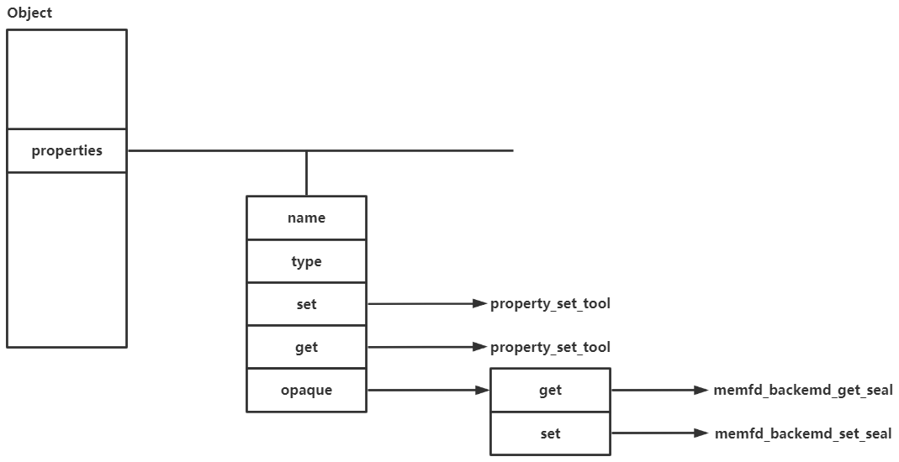

属性的添加分为类属性的添加和对象属性的添加，对象属性的添加是通过object_property_add接口完成的，对应代码如下(添加了注释的版本)：

```
ObjectProperty *
object_property_add(Object *obj, const char *name, const char *type,		//obj对应的对象,name对应要设置的属性名字,type对应要设置的属性类型
                    ObjectPropertyAccessor *get,							//get对应属性要设置的get函数
                    ObjectPropertyAccessor *set,							//set对应属性要设置的set函数
                    ObjectPropertyRelease *release,							//release对应属性要设置的releasse函数
                    void *opaque, Error **errp)								//opaque对应具体的属性
{
    ObjectProperty *prop;													//要设置的属性
    size_t name_len = strlen(name);											//属性名字长度

    if (name_len >= 3 && !memcmp(name + name_len - 3, "[*]", 4)) {			//检测开头是否包含通配符
        int i;
        ObjectProperty *ret;
        char *name_no_array = g_strdup(name);

        name_no_array[name_len - 3] = '\0';									//把通配符换成\0截断
        for (i = 0; ; ++i) {
            char *full_name = g_strdup_printf("%s[%d]", name_no_array, i);	//按照格式化字符串的格式把name复制到full_name中

            ret = object_property_add(obj, full_name, type, get, set,		//递归调用,来添加对象属性
                                      release, opaque, NULL);
            g_free(full_name);												//后面做的都是回收的工作
            if (ret) {
                break;
            }
        }
        g_free(name_no_array);
        return ret;
    }

	/*
	这里对应着属性名字不包含通配符的情况
	*/
	
    if (object_property_find(obj, name, NULL) != NULL) {					//在现在obj的properties链表上找是否有已经要设置的属性了
        error_setg(errp, "attempt to add duplicate property '%s'"
                   " to object (type '%s')", name,
                   object_get_typename(obj));
        return NULL;
    }

    prop = g_malloc0(sizeof(*prop));										//给要设置的属性分配内存

    prop->name = g_strdup(name);											//把对应的内容赋值到对应的位置
    prop->type = g_strdup(type);

    prop->get = get;
    prop->set = set;
    prop->release = release;
    prop->opaque = opaque;

    g_hash_table_insert(obj->properties, prop->name, prop);					//把添加完的属性链接到obj的properties链表上
    return prop;
}
```

这里无论是包含或者不包含通配符的情况都会调用object_property_find这个函数，函数主要功能就是在Object上的properties链表中找是否已经设置过这个属性了，对应代码如下：

```
--------------------------------------------------------------------------------------------------------
ObjectProperty *object_property_find(Object *obj, const char *name,
                                     Error **errp)
{
    ObjectProperty *prop;
    ObjectClass *klass = object_get_class(obj);					//获取父类

    prop = object_class_property_find(klass, name, NULL);		//在自己的对象object的所属的类和所有父类中找是否有要设置的属性
    if (prop) {
        return prop;
    }

    prop = g_hash_table_lookup(obj->properties, name);			//在自己的对象object的properties域中查找
    if (prop) {
        return prop;
    }

    error_setg(errp, "Property '.%s' not found", name);
    return NULL;
}
--------------------------------------------------------------------------------------------------------
ObjectProperty *object_class_property_find(ObjectClass *klass, const char *name,
                                           Error **errp)
{
    ObjectProperty *prop;
    ObjectClass *parent_klass;
	
    parent_klass = object_class_get_parent(klass);						//检测是否包含父类,有父类则递归检测父类
    if (parent_klass) {
        prop = object_class_property_find(parent_klass, name, NULL);
        if (prop) {
            return prop;
        }
    }

    prop = g_hash_table_lookup(klass->properties, name);				//没有父类了,或者说当前类或属性的父类已经遍历完了
    if (!prop) {
        error_setg(errp, "Property '.%s' not found", name);
    }
    return prop;
}
--------------------------------------------------------------------------------------------------------
```

属性的设置是通过object_property_set来完成的，其只是简单地调用ObjectProperty的set函数

```
void object_property_set(Object *obj, Visitor *v, const char *name,
                         Error **errp)
{
    ObjectProperty *prop = object_property_find(obj, name, errp);
    if (prop == NULL) {
        return;
    }

    if (!prop->set) {
        error_setg(errp, QERR_PERMISSION_DENIED);
    } else {
        prop->set(obj, v, name, prop->opaque, errp);
    }
}
```

每一种属性类型都有自己的set函数，其名称为object_set_XXX_property，其中的XXX表示属性类型，如bool、str、link等。以bool为例，其set函数就是直接调用了对应属性的set函数，代码如下：

```
static void property_set_bool(Object *obj, Visitor *v, const char *name,
                              void *opaque, Error **errp)
{
    BoolProperty *prop = opaque;
    bool value;
    Error *local_err = NULL;

    visit_type_bool(v, name, &value, &local_err);
    if (local_err) {
        error_propagate(errp, local_err);
        return;
    }

    prop->set(obj, value, errp);
}
```

再回到edu设备，qdev_device_add函数的后面，会调用以下代码：

```
object_property_set_bool(OBJECT(dev),true,"realized",&err);
```

可以看到这里会检测是否设置了realized属性，在构造edu设备的时候并没有任何设置realized属性的语句，那么这是在哪里实现的呢？这里是因为设备的对象初始化的时候会上溯所有的父类型，并调用他们的instance_init函数。可以看到device_type_info的instance_init函数device_initfn，在这个函数的后面，他给所有设备都添加了几个属性

```
static void device_initfn(Object *obj)
{
    DeviceState *dev = DEVICE(obj);
    ObjectClass *class;
    Property *prop;

    if (qdev_hotplug) {
        dev->hotplugged = 1;
        qdev_hot_added = true;
    }

    dev->instance_id_alias = -1;
    dev->realized = false;

    object_property_add_bool(obj, "realized",
                             device_get_realized, device_set_realized, NULL);
    object_property_add_bool(obj, "hotpluggable",
                             device_get_hotpluggable, NULL, NULL);
    object_property_add_bool(obj, "hotplugged",
                             device_get_hotplugged, device_set_hotplugged,
                             &error_abort);

    class = object_get_class(OBJECT(dev));
    do {
        for (prop = DEVICE_CLASS(class)->props; prop && prop->name; prop++) {
            qdev_property_add_legacy(dev, prop, &error_abort);
            qdev_property_add_static(dev, prop, &error_abort);
        }
        class = object_class_get_parent(class);
    } while (class != object_class_by_name(TYPE_DEVICE));

    object_property_add_link(OBJECT(dev), "parent_bus", TYPE_BUS,
                             (Object **)&dev->parent_bus, NULL, 0,
                             &error_abort);
    QLIST_INIT(&dev->gpios);
}
```

其中realized属性的set和get函数设置成了device_get_realized和device_set_realized，其调用了DeviceClass的realize函数

```
if (dc->realize) {
    dc->realize(dev, &local_err);
}
```

对于PCI设备而言其类型初始化函数为pci_device_class_init，该函数中设置了DeviceClass的realize为pci_dev_realize，宁且pci_dev_realize函数是调用了PCIDeviceClass的realize函数。

```
static void pci_device_class_init(ObjectClass *klass, void *data)
{
    DeviceClass *k = DEVICE_CLASS(klass);
    PCIDeviceClass *pc = PCI_DEVICE_CLASS(klass);

    k->realize = pci_qdev_realize;
    k->unrealize = pci_qdev_unrealize;
    k->bus_type = TYPE_PCI_BUS;
    k->props = pci_props;
    pc->realize = pci_default_realize;
}
```

所以对应的调用链用图表示就是下面这个样子的：

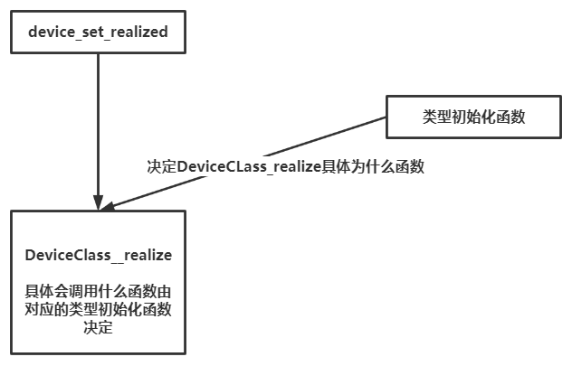

child属性表示对象之间的从属关系，父对象的child属性指向子对象，link属性表示一种链接关系，表示一种设备引用了另一种设备，具体代码不再举例

下面以PCMachineState对象添加PC_MACHINE_ACPI_DEVICE_PROP为例，大部分是图示，介绍一下属性添加与设置的相关内容

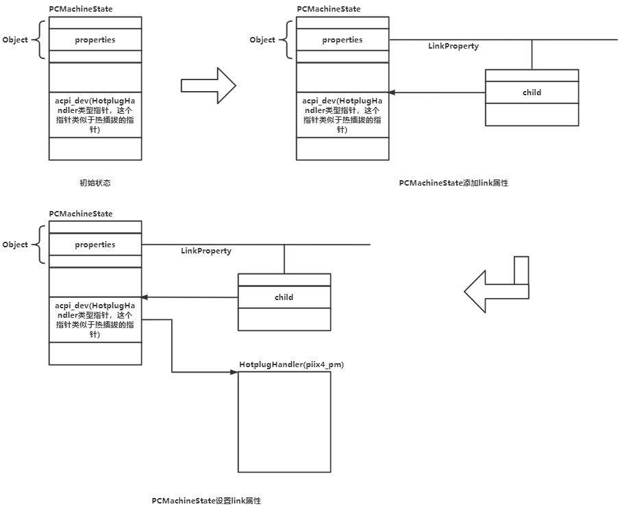

### hmp与qmp

这里主要就是两张图了，hmp和qmp都是宿主机与虚拟机进行交互的一种协议，hmp是基于字符串的协议，qmp是基于服务器客户端架构的，对应的原理图如下：

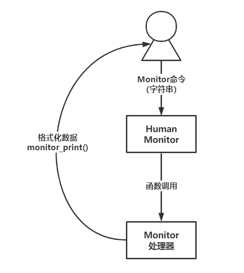

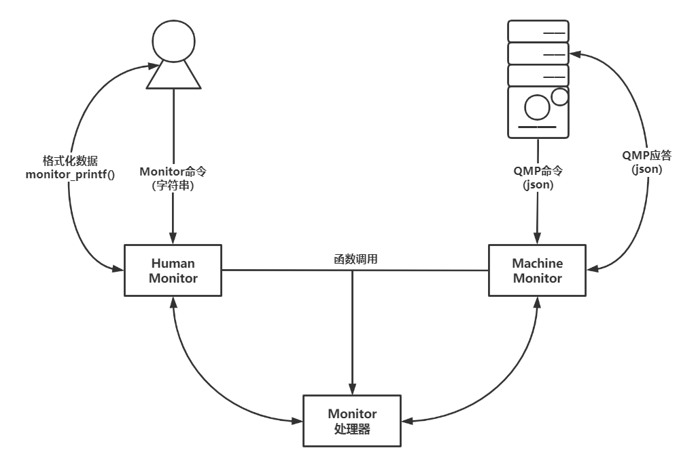