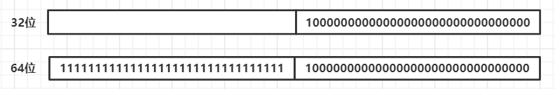
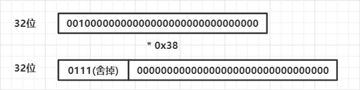
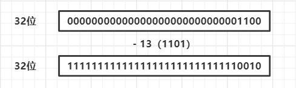

# CVE-2018-7471

**long在32位和64位大小不一致**

漏洞主要成因是因为long在32位系统和64位系统上的位数是不同的，32位系统long就是32位，64位系统long就是64位，而当32位涉及到的long变量是负数的时候，在从32位转换到64位的过程中会进行扩展，即64位的高32位全部补1。用图表示就是下面这样：



自己也可以使用代码来尝试实现，可以使用retfq来实现32位到64位模式的转换

某公司工业组态软件存在整数溢出漏洞，该漏洞是由于stgopenstorage读取失败，返回的错误代码超出int在32位系统中的范围，攻击者可利用该漏洞执行任意代码。

ActiveX组件Touchvewocx.ocx接口函数SetProjectPath（string*）调用OpenStorage( )读取失败时，异常返回长整型（32位系统32位int，64位系统，64位int），函数给返回值分配dword型变量，在32位系统中刚好满足，64位系统中直接截断，造成异常

# CVE-2017-15056

**无符号数相加导致回绕**

这个漏洞可以导致拒绝服务而不能达到远程代码执行的目的，触发漏洞的主要主要代码在下面图片的位置


可以看到图中绿色的部分，有两个if判断，分别是`(unsighed long)e_phoff + e_phnum * sizeof(Elf32_Shdr)`和`(unsighed long)e_shoff + e_shnum * sizeof(Elf32_Shdr)`

e_phoff ：程序头表的文件偏移（以字节为单位）。如果文件没有程序头表，则此成员值为零。

e_phnum ：程序头表中的项数。生成的 `e_phentsize` 和 `e_phnum` 指定了表的大小（以字节为单位）。如果文件没有程序头表，则 e_phnum 值为零。

e_shoff：节头表的文件偏移（以字节为单位）。如果文件没有节头表，则此成员值为零。

e_shnum：节头表中的项数。生成的 `e_shentsize` 和 `e_shnum` 指定了节头表的大小（以字节为单位）。如果文件没有节头表，则 e_shnum值为零。

其中使用32位upx的情况下，我们可以构造一个恶意的ELF文件，然后使`(unsighed long)e_shoff + e_shnum * sizeof(Elf32_Shdr)`它的值小于file_size

也就是e_shoff让他足够大然后加上e_shnum * sizeof(Elf32_Shdr)之后就可以导致大的无符号数相加超过可表示的范围，就又变的特别小，用图表示就是这样的：


# CVE-2018-6323

**无符号乘法导致回绕**

这个漏洞和上一个差不多，也是无符号整数运用不当产生的漏洞，不过这次是无符号乘法产生的漏洞，触发漏洞的主要代码如下：

```
// binutils/objdump.c
  /* Read in the program headers.  */
  if (i_ehdrp->e_phnum == 0)
    elf_tdata (abfd)->phdr = NULL;
  else
    {
      Elf_Internal_Phdr *i_phdr;
      unsigned int i;
#ifndef BFD64
      if (i_ehdrp->e_phnum > ((bfd_size_type) -1) / sizeof (*i_phdr))
    goto got_wrong_format_error;
#endif
      amt = i_ehdrp->e_phnum * sizeof (*i_phdr);  // <-- 整型溢出点
      elf_tdata (abfd)->phdr = (Elf_Internal_Phdr *) bfd_alloc (abfd, amt);
      if (elf_tdata (abfd)->phdr == NULL)
    goto got_no_match;
      if (bfd_seek (abfd, (file_ptr) i_ehdrp->e_phoff, SEEK_SET) != 0)
    goto got_no_match;
      i_phdr = elf_tdata (abfd)->phdr;
      for (i = 0; i < i_ehdrp->e_phnum; i++, i_phdr++)
    {
      Elf_External_Phdr x_phdr;
      if (bfd_bread (&x_phdr, sizeof x_phdr, abfd) != sizeof x_phdr)
        goto got_no_match;
      elf_swap_phdr_in (abfd, &x_phdr, i_phdr);
    }
    }
```

可以看到最开始是有一个判断，判断e_phnum是不是大于0的，如果说大于0才能进行下面的触发漏洞的哪个分支，不过因为我们伪造的e_phnum是大于0的所以就可以进入到下面的分支，然后在执行`i_ehdrp->e_phnum * sizeof (*i_phdr)`这条语句之前eax的值为0x20000000然后sizeof (*i_phdr)的值为0x38，相乘之后等于0x700000000，因为是无符号整数只有32位，所以最高位会被舍弃掉，从而amt就等于0，这样后面申请的块大小为0导致分配没成功，但是后面有对分配的块的free操作，因为没分配成功，所以free会出错就会导致崩溃，从而达到拒绝服务的功能

用图表示就是这样的：



# CVE-2019-17498

**无符号整数相减导致下溢**

该漏洞是一个越界读漏洞，可能会导致DoS或远程信息泄露。当libssh2被用于连接恶意SSH服务器时该漏洞就会被出发。当SSH服务器发送disconnect消息时，就会发生溢出。也就是说该漏洞是在认证完成之前的连接阶段的早期被触发的。

该漏洞是源位置是[packet.c:480](https://www.buaq.net/go-13931.html#L480)：

```
if(message_len < datalen-13) {
```

这个很明显就可以导致下溢，只要datalen的值是小于13的就可以使datalen-13的值是一个很大的数，用图表示就是这样的：



# **CVE-2018-11812**

**整数上溢**

管理员调用铸币函数给某个地址增加token时，利用溢出漏洞可以突破该函数只能增加token的限制，实际减少该地址的token数量，从而实现对任一账户余额的任意篡改（增加或减少）。在我们的检测中，有多达18个合约存在类似安全问题。


攻击者通过构造一个极大的mintedAmount，使得balanceOf[target] + mintedAmount发生整数溢出，计算结果变为一个极小值，用图表示就是这样的：


# CVE-2018-8778

**无符号数转换为有符号数导致由整数变成负数**

该漏洞位于String#unpack方法内部。此方法str根据提供的字符串格式进行解码，返回提取的每个值的数组（您可以在[RubyDoc](https://ruby-doc.org/core-2.5.0/String.html#method-i-unpack)上阅读更多关于它的信息）。格式字符串由一系列单字符指令（数字，“*”，“_”或“！”）组成，并可由@指定数据的位置。这就是问题所在。

String#unpack实际上是在C语言的Ruby核心源代码中定义的。正如我们在修复提交中所看到的，表示为字符串（C语言中的 char *）的偏移量必须转换为整数值。为此，Ruby使用一个调用宏STRTOUL，然后调用ruby_strtoul（在ruby.h中定义）。该名称似乎告诉了我们这将输出一个无符号的长整数。

```
unsigned long ruby_strtoul(const char *str, char **endptr, int base);
```

直到这里，没有问题，字符串“18446744073709551416”被正确解码为长整数18446744073709551416。然而，这个值被存储在len中时被声明为一个有符号long整数。这样做将无符号数转换为有符号数。所以导致18446744073709551416变成-200，用图表示就是这样的：


**注：大部分漏洞都是无/有符号整数上溢，下溢，回绕的漏洞，关于浮点数的漏洞不太多**