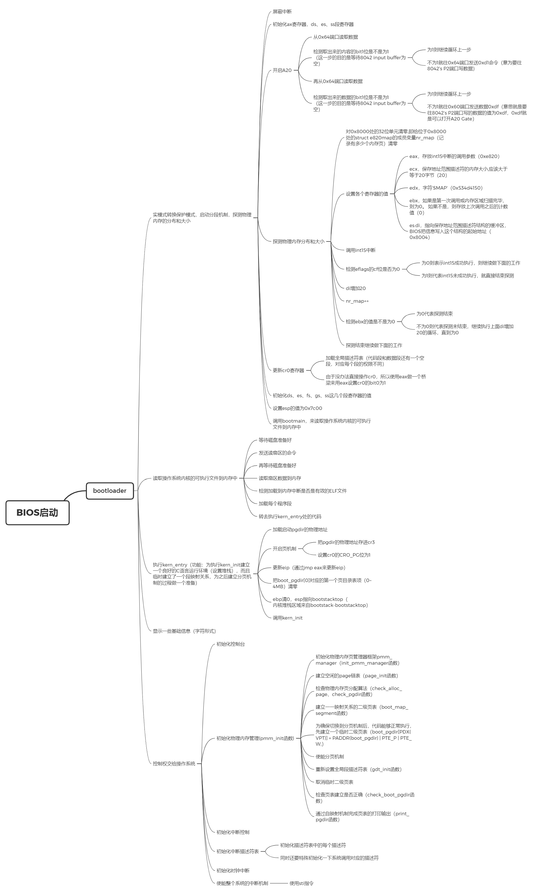

## Lab 0

介绍实验环境，调试命令和一些基础知识，其中有一些坑点，直接使用实验楼的环境比较好，不过以前搭过pwn环境的稍稍修改一下就可以了

## Lab 1

主要讲了系统是怎么被加载到内存并运行的，最后面两个扩展的练习，第一个还好一些，第二个就有一些问题了，需要仔细研究，lab1思维导图如下：

grade截图：

## Lab 2

主要讲了段页式内存地址的转换机制，页表的建立和使用方法，物理内存的管理方法，还有first fit机制，lab2思维导图如下：

grade截图：

## Lab 3

包含虚拟内存管理，page fault异常处理方法，页替换算法

grade截图：

## Lab 4

涉及的就是创建内核线程与内核线程之间的切换对应的数据结构，利用到之前的中断知识多一点

grade截图：

## Lab 5

涉及从内核态切换到用户态的方法，ELF可执行文件的格式，用户进程的创建和管理，简单的进程调度，系统调用的实现

grade截图：

## Lab 6

涉及面向对象编程思想，Round-Robin调度算法，Stride调度算法，多级反馈队列调度算法，调度算法框架的实现，ucore中对调度算法的具体封装方式，ucore中具体的调度算法的实现

grade截图：
