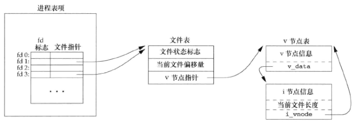
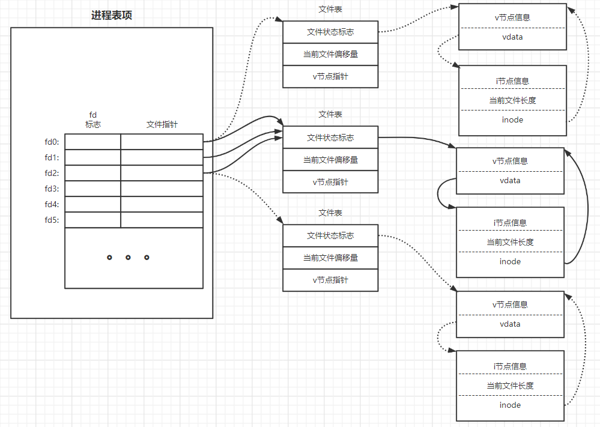

# Unix Note Ⅱ

## 文件I/O

### 文件描述符

文件描述符是非负整数

幻数：0，1，2对应与标准输入，标准输出，标准错误，符号表示就是STDIN_FILENO、STDOUT_FILENO和STDERR_FILENO

文件描述符的变化范围是0~OPEN_MAX-1,OPEN_MAX的值在不同系统上是不确定的，我在自己的ubuntu16.04上尝试了一下没有这个OPEN_MAX的定义，所以也没办法验证进程最多可以打开多少个文件

### 函数open和openat

```
#include <fnctl.h>

int open(const char *path, int oflag,... /* mode_t mode */);

inr openat(int fd, const char *path, int oflag,... /* mode_t mode */);
```

这两个函数后都会返回对应的文件描述符，如果说没有成功open的话就会返回一个-1，下面就做一些测试，来更好的描述oflag参数

O_RDONLY、O_WRONLY、O_RDWR：

```
#include <stdio.h>
#include <fcntl.h>

int main() {
    int fd;
    fd = open("Resery",O_RDONLY);
    printf("%d\n",fd);
    fd = open("Resery",O_WRONLY);
    printf("%d\n",fd);
    fd = open("Resery",O_RDWR);
    printf("%d\n",fd);
    return 0;
    
    printf("%d\t%d\t%d\t%d",O_RDONLY,O_WRONLY,O_RDWR,O_RDONLY|O_WRONLY);

}

output:
3
4
5
0	1	2	1
```

O_EXEC：只执行打开，（我在测试的时候发现它并没有被定义）

O_SEARCH：只搜索打开（应用于目录），O_SEARCH常量的目的在于在目录打开时验证他的搜索权限。对目录的文件描述符的后续操作就不需要再次检查对该了目录的搜索权限。linux中没有支持O_SEARCH

**上面的5个常量中必须指定一个且只能指定一个**

O_APPEND：每次写时都追加到文件的尾端

```
#include "apue.h"
#include <fcntl.h>

int main(int argc,char *argv[]) {
    int fd;
    char end[3] = "end";

    fd = open("Resery",O_RDWR|O_APPEND);
    write(fd,end,3);
	return 0;    
}
```


O_CLOEXEC：把FD_CLOEXEC常量设置为文件描述符标志

O_CREAT：若此文件不存在则创建它。使用此选项时，open函数需同时说明第三个参数mode

(openat函数需说明第4个参数mode)，用mode指定该新文件的访问权限位

O_DIRECTORY：如果path引用的不是目录，则出错

O_EXCL：如果同时指定了O_CREAT，而文件已经存在，则出错。用此可以测试一个文件是否存在，如果不存在，则创建此文件，这使测试和创建两者称为一个原子操作

O_NOCTTY：如果path引用的是终端设备，则不将该设备分配作为此进程的控制终端

O_NOFOLLOW：如果path引用的是一个符号连接，则出错

O_NONBLOCK：如果path引用的是一个FIFO，一个块特殊文件或一个字符特殊文件，则此选项为文件的本次打开操作和后续的I/O操作设置非阻塞方式

O_SYNC：使每次write等待物理I/O操作完成，包括由该write操作引起的文件属性跟小滚所需的I/O

O_TRUNC：如果此文件存在，而且为只写或读-写成功打开，则将其长度截断为0

O_TTY_INIT：如果打开一个还未打开的终端设备，设置非标准termios参数值，使其符合Single UNIX Specification

O_DSYNC：使每次write要等待物理I/O操作完成，但是如果该写操作并不影响读取刚写入的数据，则不需等待文件属性被更新

O_RSYNC：使一个以文件描述符作为参数进行的read操作等待，直至所有对文件统一部份挂起的写操作都完成

open和openat函数返回到文件描述符一定是最小的未用描述符数值，比如说打开了5个文件，对应最大的文件描述符应该是8，下次再打开文件描述符会从9开始，9就是最小的未用描述符数值，如果说你打开了5个文件但是之前你使用dup2把描述符8分配了，那么第5次open，给的描述符就应该是9

> 绝对路径和相对路径
>
> 绝对路径是一定是由根目录 / 开始写起。比如说/etc/passwd，这就是一个绝对路径
>
> 相对路径不是从根目录 / 开始写起，而是从当前所在的工作目录开始写起

fd参数可以区分open和openat函数，有3种可能性

1. path指定的是绝对路径名，这种情况下，fd参数被忽略，openat函数就相当于open函数
2. path指定的是相对路径名，fd指出了相对路径名再文件系统中的开始地址。fd参数是通过打开相对路径名所在的目录来获取
3. path参数制定了相对路径名，fd参数具有特殊值AT_FDCWD。这种情况下，路径名在当前工作目录中获取，openat函数在操作上与open函数类似

### 函数creat

```
#include <fcntl.h>

inr create(const char *pathm mode_t mode);
```

### 函数close

```
#include <unistd.h>

int close(int fd);
```

### 函数lseek

```
#include <unistd.h>

off_t lseek(int fd, off_t offset, int whence);
```

- whence是SEEK_SET，则将该文件的偏移量设置为距文件开始处offset个字节
- whence是SEEK_CUR，则将该文件的偏移量设置为当前值加offset，offset可为正或负
- whence是SEEK_END，则将该文件的偏移量设置为文件长度加offset，offset可正可负

空洞，文件偏移量可以大于文件的当前长度。假如现在的文件偏移量是大于文件的当前长度的话，然后你又执行了写，他就会在现在这个偏移量的位置开始写，中间没有写过的字节都被读为0，并且中间这些没有写过的部分是不会占用磁盘的。

用下面的程序创建具有空洞的文件

```
#include "apue.h"
#include <fcntl.h>

char buf1[] = "abcdefghij";
char buf2[] = "ABCDEFGHIJ";

int main(void){
	int fd;
	
	if((fd = creat("file.hole",FILE_MODE)) < 0)
		err_sys("create error");
		
	if(wirte(fd,buf1,10) != 10){
		err_sys("buf1 write error");
	}
	
	if(lseek(fd, 0x4000, SEEK_SET) == -1){
		err_sys("buf2 write error");
	}
	
	exit(0);
}
```

下面两个是对比图，但是我测试的时候发现如果说设置的偏移是0x1000的话占用的磁盘块的数量是一样的，具体什么原因还没有搞清楚


### 函数read和write

```
#include <unistd.h>

ssize_t read(int fd, void *buf, size_t nbytes);

ssize_t write(int fd, const void *buf, size_t nbytes);
```

### I/O的效率

主要就是说了预读和cahe

### 文件共享

和文件系统内容差不多，看图理解就行


### 原子操作

举例就是有两个线程A和B，A现在要对一块内存进行写操作，B也要对这块内存进行写操作，但是顺序上是A然后是B，由于线程切换，可能会导致A写进行了一半，切换线程改成B开始写了等B写完了，又切换回A然后A再写，这样就会导致写的内容并不是我们想要的东西。

对应的原子操作就是在A写的时候我不允许线程切换，一直等到线程A结束B才可以写，在写的过程中不会被打断

**函数pread和pwrite**

```
#include <unistd.h>

ssize_t pread(int fd, void *buf, size_t nbytes, off_t offset);

ssize_t pwrite(int fd, const void *buf, size_t nbytes, off_t offset);
```

pread和pwrite都是先调用lseek然后再调用read或者write并且调用pread和pwrite的时候是无法被中断的

### 函数dup和dup2

```
#include <unistd.h>

int dup(int fd);
int dup2(int fd, int fd2);
```

dup返回的新文件描述符一定是当前可用文件描述符中的最小数值

dup2可以用fd2参数指定新描述符的值，如果fd2已经打开，则先将其关闭。如果fd等于fd2，则dup2返回fd2，而不关闭它。否则，fd2的FD_CLOEXEC文件描述符标志就被清除，这样fd2在进程调用exec时时打开状态

这两个函数返回的新文件描述符和参数fd共享一个文件表项，如下图所示



dup2是原子操作

### 函数sync、fsync和fdatasync

```
#include <unistd.h>

int fsync(int fd);

int fdatasync(int fd);

void synv(void);
```

- sync：将所有修改过的块缓冲区排入写队列，然后就返回，并不等待实际写磁盘操作结束
- fsync：对由文件描述符fd指定的一个文件起作用，并且等待写磁盘操作结束才返回
- fdatasync：类似于fsync，但它只影响文件的数据部分。而除数据外，fsync还会同步更新文件的熟属性

### 函数fcntl

```
#include <fcntl.h>

int fcntl(int fd,int cmd, ..../* int arg */);
```

fcntl可以改变已经打开文件的属性

fcntl有以下5种功能

1. 复制一个已有的描述符(cmd = F_DUPFD 或 F_DUPFD_CLOEXEC)
2. 获取/设置文件描述符标志(cmd = F_GETFD 或 F_SETFD)
3. 获取/设置文件状态标志(cmd = F_GETFL 或 F_SETFL)
4. 获取/设置异步I/O所有权(cmd = F_GETOWN 或 F_SETOWN)
5. 获取/设置记录锁(cmd = F_GETLK、F_SETLK 或 F_SETLKW)

F_DUPFD：复制文件描述符fd，新文件描述符作为函数值返回。它是尚末打开各描述符中大于或等于第3个参数值（取为整型值）中各值的最小值。 新描述符与fd共亨同一文件表项。但是，新描述符存它自己的一套文件描述符标志，其FD_CLOEXEC文件描述符标志被清除（这表示该描述符在exec时仍保持有效，我们将在第8章对此进行讨论）。

F_DUPFD_CLOEXEC：与上面的功能一样，不过使用此命令会设置FD_CLOEXEC文件描述符标志的值

F_GETFD ：获取fd文件描述符对应的文件的文件描述符标志

F_SETFD：设置fd文件描述符对应的文件的文件描述符标志

F_GETFL ：获取fd文件描述符对应的文件的文件状态标志，这里书上说O_RDONLY、O_WRONLY、O_RDWR、O_EXEC、O_SEARCH它们5个并不各占1位，也就是说对应的值是0、1、2、3、4，对应的二进制就是000、001、010、011、100，由于3的二进制包含了2和1，4的二进制包含了0，所以想要获取具体的文件标志状态时，需要使用O_ACCMODE（等于3）取得访问方式位，然后将结果与这5个值中的每一个相比较

F_SETFL：设置fd文件描述符对应的文件的文件状态标志，可以更改的几个标志是：O_APPEND、O_NONBLOCK、O_SYNC、O_DSYNC、O_RSYNC、O_FSYNC和O_ASYNC

F_GETOWN：获取当前接受SIGIO和SIGURG信号的进程ID或进程组ID

F_SETOWN：设置接受SIGIO和SIGURG信号的进程ID或进程组ID，正的arg指定一个进程ID，负的arg表示等于arg绝对值的一个进程组ID

示例程序

```
#include "apue.h"
#include <fcntl.h>

int main(int argc,char *argv[]) {
    int val;
    
    if(argc !=2){
        printf("usage: a.out <descriptor#>");
    }
    if((val = fcntl(atoi(argv[1]),F_GETFL,0))<0){
        printf("fcntl error for fd %d\t",atoi(argv[1]));
    }

    switch (val % O_ACCMODE){
        case O_RDONLY:
            printf("read only");
            break;
        case O_WRONLY:
            printf("write only");
            break;
        case O_RDWR:
            printf("read write");
            break;
        default:
            printf("unknown access mode");
    }

    if(val & O_APPEND){
        printf(", append");
    }
    if(val & O_NONBLOCK){
        printf(", nonblocking");
    }
    if(val & O_SYNC){
        printf(", synchronous writes");
    }
#if !defined(_POSIX_C_SOURCE) && defined(O_FSYNC) && (O_FSYNC!=O_SYNC)
    if(val & O_FSYNC)
        printf(", synchronous writes");
#endif
    printf("\n");
    return 0;
}
```

### 函数ioctl

```
#include <unistd.h>

#include <sys/ioctl.h>

int ioctl(int fd, int request, ...);
```

**ioctl**是设备驱动程序中对设备的I/O通道进行管理的函数。所谓对I/O通道进行管理，就是对设备的一些特性进行控制，例如串口的**传输波特率**、马达的转速等等。

**fd**是用户程序打开设备时使用**open函数返回的文件标示符**

**cmd**是用户程序对设备的**控制命令**

### /dev/fd

比较新的系统都提供名为/dev/fd的目录，其目录项是名为0、1、2等的文件。打开文件/dev/fd/n等效于复制描述符n(假定描述符n是打开的)。
在函数中调用：

```
fd=open("/dev/fd/0",mode);1
```

大多数系统忽略所指定的mode，而另外一些则要求mode是所涉及的文件(在这里则是标准输入)原先打开时所使用的mode的子集。因为上面的打开等效于：

```
fd=dup(0);1
```

**描述符0和fd共享同一文件表项**。例如，若描述符0被只读打开，那么我们也只对fd进行读操作。即使系统忽略打开方式，并且下列调用成功：

```
fd=open("/dev/fd/0",O_RDWR);1
```

我们仍然不能对fd进行写操作。
我们也可以用/dev/fd作为路径名参数调用creat，或调用open，并同时指定O_CREAT。这就允许调用creat的程序，如果路径名参数是/dev/fd/1等仍能工作。

某些系统提供路径名**/dev/stdin,/dev/stdout和/dev/stderr**。这些等效于/dev/fd/0,/dev/fd/1和/dev/fd/2。
/dev/fd文件主要由shell使用，这允许程序以对待其他路径名一样的方式使用路径名参数来处理标准输入和标准输出。例如，cat(1)程序将命令行中的一个单独的 - 特别解释为一个输入文件名，该文件指的是标准输入。如：

```
filter file2|cat file1 - file3|lpr1
```

首先cat读file1，接着读其标准输入(也就是filterfile2命令的输出)，然后读file3，如若支持/dev/fd，则可以删除cat对-的特殊处理，于是我们就可键入下列命令行：

```
filter file2|cat file1 /dev/fd/0 file3|lpr1
```

在命令行中用-作为一个参数特指标准输入或标准输出已由很多程序采用。但是这会带来一些问题，例如若用-指定第一个文件，那么它看来就像开始了另一个命令行的选择项。**/dev/fd则提高了文件名参数的一致性，也更加清晰。**

## 习题

1. 当读/写磁盘文件时，本章中描述的函数确实是不带缓冲机制的嘛?请说明原因

   是带缓冲机制的，所谓的不带缓冲的IO实际上指的是直接调用系统调用，而带缓冲的IO是使用函数库调用，带缓冲和不带缓冲IO是都会使用高速缓存的，高速缓存就相当于一个缓冲机制

2. 编写一个与dup2功能相同的函数，要求不调用fcntl函数，并且要有正确的错误处理

   ```
   #include "apue.h"
   #include <fcntl.h>
   
   int fun_dup2(int fd, int fd2){
       char fd_open[4] = "open";
       int flag = fd;
   
       if(fd == fd2){
           printf("fd equal fd2, rerturn fd2\n");
           return fd2;
       }
       if(write(fd2,fd_open,4) != -1){
           printf("The file has been opened, now close it\n");
           close(fd2);
       }
       else{
           while(fd != fd2){
               if(fd != flag){
                   close(fd);
               }
               fd++;
               dup(fd);
           }
           printf("copy successed\n");
           return fd2;
       }
   }
   
   int main(int argc,char *argv[]) {
       int fd_1,fd_2,fd_3;
       fd_1 = open("Resery",O_RDWR);
       printf("fd_1\t%d\n",fd_1);
       fd_2 = open("Resery",O_RDWR);
       printf("fd_2\t%d\n",fd_2);
       fd_3 = open("Resery",O_RDWR);
       printf("fd_3\t%d\n",fd_3);
   
       int fd2;
   
       //opened so close
       fd2 = fun_dup2(fd_1,5);
       printf("fd2\t\t%d\n",fd2);
       //fd equal fd2
       fd2 = fun_dup2(fd_1,3);
       printf("fd2\t\t%d\n",fd2);
       //success
       fd2 = fun_dup2(fd_1,9);
       printf("fd2\t\t%d\n",fd2);
   }
   
   output:
   
   fd_1	3
   fd_2	4
   fd_3	5
   The file has been opened, now close it
   fd2		0
   fd equal fd2, rerturn fd2
   fd2		3
   copy successed
   fd2		9
   ```

   **文件描述符标志，是体现进程的文件描述符的状态，fork进程时，文件描述符被复制；目前只有一种文件描述符：FD_CLOEXEC**
   **文件状态标志，  是体现进程打开文件的一些标志，fork时不会复制file 结构，而是两个进程文件描述符指向同一个file(当FD的exec标志为0时)**

3. 假设一个进程执行下面3个函数调用

   ```
   fd1 = open(path, oflags);
   fd2 = dup(fd1);
   fd3 = open(path, oflags);
   ```

   

   F_SETFD会影响fd1和fd2，F_SETFL，会影响fd1、fd2和fd3

4. 许多程序都包含下面一段代码：

   ```
   dup2(fd,0);
   dup2(fd,1);
   dup2(fd,2);
   if(fd>2)
   	close(fd);
   ```

   为了说明if语句的必要性，假设fd是1，画出每次调用dup2时3个描述符项及相应的文件表项的变化情况。然后再画出fd为3的情况

   fd是1的情况

   

   fd是3的情况

   

5. 在Bourne shell、Bourne-again shell和 Korn shell中，digit1 > & digit2 表示要将描述符digit1重定向至描述符digit2的同一文件。请说明下面两条命令的区别

   ```
   ./a.out > outfile 2>&1
   ./a.out 2>&1 > outfile
   ```

   第一条命令先把标准输重定向至outfile，然后再把标准错误重定向至标准输出，现在也就是1和2指向的是相同的文件

   第二条命令是先把标准错误重定向至标准输出，然后再把标准输出重定向至outfile，现在1和2指的就不是相同的文件了

6. 如果使用追加标志打开一个文件以便读、写，能否仍用lseek在任意位置开始读？能否用lseek更新文件中任一部分的数据？请编写一段程序验证

   ```
   #include "apue.h"
   #include <fcntl.h>
   
   int main(int argc,char *argv[]) {
       int fd;
       fd = open("Resery", O_RDWR | O_APPEND);
   
       char buf[32];
   
       lseek(fd,4,SEEK_SET);
   
       read(fd,buf,5);
       write(1,buf,5);
   
       write(fd,"Resery",6);
   
       printf("\n");
   
       lseek(fd,0,SEEK_SET);
       read(fd,buf,17);
       write(1,buf,17);
   }
   ```

   可以在任一位置开始读，并且也可以用lseek更新文件的数据，但是更新只会从尾部更新